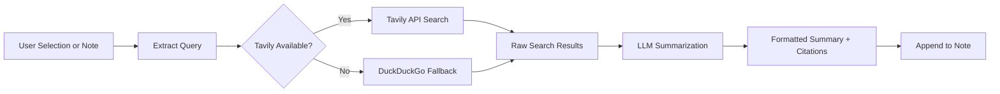

import TLDR from '@site/src/components/TLDR';

# Penelitian & Pencarian Web

<TLDR>
**Notemd mencari di web dan menyisipkan hasil yang diringkas LLM langsung ke dalam catatan Anda.** Tavily API merupakan backend pencarian utama; DuckDuckGo berfungsi sebagai alternatif tanpa konfigurasi. Hasilnya diringkas dengan kutipan sumber dan ditambahkan di bawah judul `## Research`. Dukung penelitian pada satu catatan, penelitian pada folder secara batch, serta pemilihan model per tugas untuk langkah ringkasan.

Ini merupakan bagian dari [Obsidian Panduan Manajemen Pengetahuan AI](/docs/pillar-ai-knowledge).
</TLDR>

## Gambaran Umum

Penelitian merupakan salah satu integrasi paling kuat dari Notemd: integrasi ini menghubungkan proses membaca, mencari, dan menulis. Alih-alih beralih ke browser untuk mencari istilah yang tidak dikenal, Anda cukup menyorotnya dan membiarkan Notemd melakukan pencarian, merangkum, serta menambahkan temuan — semuanya di dalam vault Anda.

Proses ini sepenuhnya dapat dikonfigurasi. Anda dapat memilih penyedia pencarian, LLM yang akan menulis ringkasan, serta apakah hasilnya ditambahkan ke catatan aktif atau ditulis ke file terpisah. Mode batch memungkinkan Anda meneliti setiap catatan di sebuah folder hanya dengan satu klik.

## Cara Kerjanya

### Pipeline Cari-Lalu-Ringkas



1. **Ekstraksi kueri** -- Notemd mengambil istilah pencarian dari pilihan Anda atau judul catatan.
2. **Pencarian web** -- Tavily dicoba terlebih dahulu. Jika kunci API tidak dikonfigurasi, DuckDuckGo akan digunakan secara otomatis (tidak memerlukan kunci).
3. **Ringkasan LLM** -- Hasil pencarian mentah dikirim ke LLM yang telah dikonfigurasi, yang kemudian menghasilkan ringkasan singkat dengan kutipan sumber di dalamnya.
4. **Menambahkan** -- Ringkasan yang sudah diformat ditambahkan di bawah judul `## Research` dalam catatan aktif.

### Tavily vs. DuckDuckGo

| Aspek | Tavily | DuckDuckGo |
|--------|--------|------------|
| Kunci API | Diperlukan (ada versi gratis) | Tidak diperlukan |
| Kualitas hasil | Lebih tinggi (dirancang khusus untuk AI) | Cukup untuk pertanyaan umum |
| Batas kecepatan pengiriman | Tingkat gratis yang melimpah | Tergantung pada pembatasan kecepatan |
| Konfigurasi | `tavilyApiKey` di pengaturan | Tanpa konfigurasi -- beralih otomatis |

### Penelitian Folder Batch

Klik kanan folder dan pilih **"Notemd: Folder penelitian"**. Setiap file `.md` di folder tersebut diproses secara berurutan (atau secara paralel hingga tingkat konkuren yang dikonfigurasi). Setiap catatan menerima ringkasan penelitiannya sendiri.

## Konfigurasi

| Pengaturan | Default | Efek |
|---------|---------|--------|
| `tavilyApiKey` | `''` | Kunci Tavily API. Jika kosong, hanya DuckDuckGo yang digunakan. |
| `researchProvider` / `researchModel` | DeepSeek | LLM per tugas untuk merangkum hasil pencarian |
| `maxResearchContentTokens` | `4000` | Anggaran token untuk konten yang dikirim ke LLM. Bagian yang berlebih akan dipotong. |
| `researchAppendToNote` | `true` | Menyertakan ringkasan ke catatan sumber. Jika bernilai false, membuat file terpisah. |
| `researchLanguage` | `'en'` | Bahasa keluaran untuk ringkasan penelitian |

### Rekomendasi model per tugas

Penelitian mendapat manfaat dari model yang mampu menangani konten berbahasa ganda dan menghasilkan teks yang terstruktur dengan baik. Pertimbangkan:

- **DeepSeek** -- versi default, terjangkau, kualitas bagus
- **GPT-4o** -- ringkasan berkualitas lebih tinggi, biaya lebih mahal
- **Gemini Flash** -- cepat dan murah, cocok untuk pertanyaan sederhana

## Contoh

Anda sedang membaca makalah tentang *mekanisme perhatian transformer* dan menemukan istilah yang tidak dikenal: *relative positional encoding*. Alih-alih meninggalkan Obsidian:

1. Beri penekanan pada **"relative positional encoding"**
2. Klik kanan --> **"Notemd: Penelitian dan ringkasan"**
3. Notemd mencari di internet, merangkum hasil teratas, lalu menambahkan:

```markdown
## Research

### Relative Positional Encoding

Relative positional encoding is a method used in transformer models
where positional information is expressed as relative distances between
tokens rather than absolute positions. Introduced by Shaw et al. (2018),
it improves generalization to unseen sequence lengths compared to
absolute encodings (Vaswani et al., 2017).

Sources:
- [Shaw et al., Self-Attention with Relative Position Representations (2018)](https://arxiv.org/abs/1803.02155)
- [Transformer Positional Encoding Overview](https://example.com/transformer-pos-enc)
```

Ringkasan tersebut kini menjadi bagian dari arsip Anda, dapat dicari, dihubungkan, dan diakses tanpa internet.

## Tips

- **Atur kunci Tavily untuk hasil terbaik** -- bahkan versi gratis pun memberikan relevansi yang lebih baik daripada DuckDuckGo murni.
- **Gunakan model ringkasan yang andal** -- model murah bisa menyederhanakan konten teknis yang kompleks.
- **Lakukan penelitian secara batch** setelah membaca sekilas untuk mengisi celah di berbagai catatan sekaligus.
- **Periksa ringkasan yang ditambahkan** -- LLM bisa menghasilkan detail sumber yang salah. Periksa klaim utama.

---

## Langkah Selanjutnya

- [Concept Notes](./concept-notes) -- Ekstrak dan simpan istilah penting dari hasil penelitian
- [Wiki-Links](./wiki-links) -- Hubungkan konsep yang berasal dari penelitian di seluruh arsip Anda
- [Translation](./translation) -- Terjemahkan ringkasan penelitian ke bahasa lain
- [LLM Penyedia](/docs/providers/overview) -- Konfigurasi model yang digunakan untuk penyimpulan
