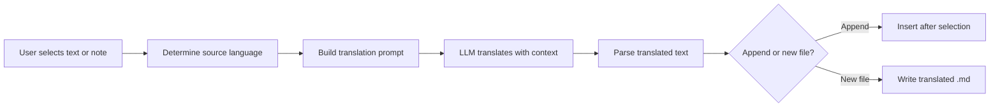

import TLDR from '@site/src/components/TLDR';

# Terjemahan

<TLDR>
**Notemd menerjemahkan teks antara 21+ bahasa menggunakan teknologi penerjemahan dari LLM.** Dukung penerjemahan pilihan tunggal, penerjemahan seluruh catatan, dan penerjemahan folder secara batch. Setiap tugas penerjemahan dapat menggunakan penyedia dan model khusus melalui pengaturan per-tugas. Bahasa keluaran dapat dikonfigurasi secara terpisah dari bahasa UI. Hasilnya ditambahkan di bawah teks asli atau ditulis ke file baru sesuai pilihan Anda.

Ini merupakan bagian dari [Obsidian Panduan Manajemen Pengetahuan AI](/docs/pillar-ai-knowledge).
</TLDR>

## Gambaran Umum

Penerjemahan dalam Notemd bukanlah pencarian kamus — melainkan penerjemahan yang didorong oleh LLM dan memperhatikan konteks. Model melihat paragraf atau catatan lengkap, sehingga tetap mempertahankan nada, istilah khusus bidang, dan struktur kalimat. Hal ini menghasilkan hasil yang lebih berkualitas dibanding layanan penerjemahan kata demi kata, terutama untuk tulisan teknis, akademis, dan kreatif.

Fitur ini mendukung tiga skop: pilihan, catatan aktif, dan seluruh folder. Dengan kombinasi pemilihan model per-tugas, Anda dapat menggunakan model cepat (Gemini Flash) untuk penerjemahan sehari-hari dan model kuat (Claude Sonnet) untuk konten yang membutuhkan nuansa — tanpa mengubah penyedia global Anda.

## Cara Kerjanya

### Perintah Translate



1. **Deteksi sumber** -- LLM menduga bahasa sumber dari isi teks. Anda tidak perlu menentukannya secara manual.
2. **Pembuatan prompt** -- Notemd membuat prompt yang mencakup bahasa tujuan, petunjuk bidang opsional, dan konten yang akan diterjemahkan.
3. **Penerjemahan LLM** -- `translateProvider` / `translateModel` yang telah dikonfigurasi memproses permintaan. Model mempertahankan format markdown, tautan wiki, dan blok kode.
4. **Keluaran** -- Teks yang telah diterjemahkan ditambahkan di bawah teks asli atau ditulis ke file baru di vault.

### Pasangan Bahasa

Notemd mendukung setiap pasangan bahasa yang didukung oleh LLM di baliknya. Pasangan umum meliputi:

| Sumber | Target | Kualitas Umum |
|--------|--------|----------------|
| Inggris | Bahasa Mandarin (Sederhana) | Ekstrem |
| Bahasa Cina | Bahasa Inggris | Bagus sekali |
| Bahasa Inggris | Bahasa Jepang | Sangat baik |
| Bahasa Inggris | Jerman / Prancis / Spanyol | Sangat baik |
| Semua yang didukung | Semua yang didukung | Tergantung model |

Pengaturan `translateLanguage` mengendalikan **bahasa keluaran**. Bahasa sumber dideteksi secara otomatis.

### Pemilihan Model Per Tugas

Kualitas terjemahan sangat bervariasi antar model. Notemd memungkinkan Anda menentukan model khusus hanya untuk proses penerjemahan:

| Model | Kecepatan | Kualitas | Biaya | Untuk Siapa |
|-------|-------|--------|------|----------|
| `gemini-2.0-flash-exp` | Cepat | Bagus | Rendah | Untuk penggunaan santai dengan volume tinggi |
| `gpt-4o-mini` | Cepat | Bagus | Rendah | Pencarian cepat |
| `deepseek-chat` | Sedang | Bagus | Sangat rendah | Untuk aplikasi berbahasa banyak dengan anggaran terbatas |
| `claude-3-5-sonnet` | Sedang | Luar biasa | Sedang | Teknis / akademis |
| `gpt-4o` | Sedang | Bagus | Sedang | Prosa yang peka terhadap nuansa |

### Penerjemahan Folder Berkelompok

Klik kanan folder lalu pilih **"Notemd: Translate folder"** untuk menerjemahkan setiap catatan di dalam folder tersebut. Setiap file diproses secara terpisah. Pengaturan konkurenensi mengontrol berapa banyak file yang diterjemahkan secara paralel.

## Konfigurasi

| Pengaturan | Default | Efek |
|---------|---------|--------|
| `translateProvider` / `translateModel` | DeepSeek | Penyedia khusus untuk tugas penerjemahan |
| `translateLanguage` | `'en'` | Bahasa output target |
| `translationAppendToNote` | `true` | Tambahkan teks terjemahan di bawah teks asli. Jika bernilai false, akan dibuat file baru. |
| `batchConcurrency` | `3` | Jumlah file yang diproses secara paralel selama penerjemahan berkelompok |

## Contoh

Anda sedang membaca catatan penelitian berbahasa Mandarin dan menginginkan versi bahasa Inggrisnya:

1. Buka catatan tersebut
2. Klik kanan --> **"Notemd: Translate current file"**
3. Notemd mendeteksi bahasa Mandarin, menerjemahkannya ke bahasa sasaran yang telah dikonfigurasi (bahasa Inggris), lalu menambahkan teks terjemahan di bawahnya:

```markdown
## Translation (English)

The experimental results show that the proposed method achieves
a 12% improvement in F1 score compared to the baseline, primarily
due to the enhanced feature extraction module described in Section 3.
```

Teks Mandarin asli tetap ada di atas teks terjemahan. Judul `## Translation` mempertahankan kedua versi dalam satu file agar mudah diakses.

## Tips

- **Gunakan Gemini Flash untuk jumlah yang banyak** -- ini adalah opsi tercepat dan termurah untuk penerjemahan berkelompok folder besar.
- **Mempertahankan tautan wiki** -- instruksi dari Notemd menyuruh LLM untuk mempertahankan `[[wiki-links]]` tetap utuh dalam terjemahan. Periksa setelah terjemahan, karena beberapa model kadang menghilangkan tautan tersebut.
- **Menetapkan bahasa keluaran secara eksplisit** -- deteksi otomatis berfungsi untuk sumber teks, tetapi selalu atur `translateLanguage` agar tidak ada kebingungan mengenai bahasa tujuan.
- **Menerjemahkan catatan konsep secara batch** -- jika folder konsep Anda dalam satu bahasa dan Anda membutuhkannya dalam bahasa lain, terjemahan di tingkat folder dapat menangani hal ini dalam satu langkah.

---

## Langkah Selanjutnya

- [Penelitian](./research) -- Cari dan ringkas dalam bahasa apa pun, lalu terjemahkan hasilnya
- [Alur Kerja](./workflows) -- Gabungkan proses terjemahan dengan tautan wiki atau ekstraksi konsep
- [Pemrosesan Batch](/docs/advanced/batch-processing) -- perilaku konkurensi dan penggantian file untuk operasi folder
- [LLM Penyedia](/docs/providers/overview) -- Pilih model terbaik untuk pasangan bahasa Anda
