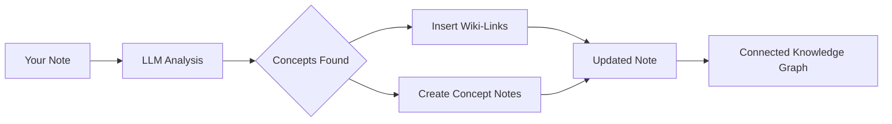

import TLDR from '@site/src/components/TLDR';

# Wiki-Links

<TLDR>
**Notemd secara otomatis menambahkan `[[wiki-links]]` ke konsep kunci dalam catatan Anda.** LLM membaca konten Anda, mengidentifikasi istilah penting dalam konteks, dan memasukkan tautan wiki bergaya Obsidian di setiap kemunculannya. Secara opsional membuat file catatan konsep dengan tautan balik. Dukung penekanan sinonim, integritas tautan saat diubah nama atau dihapus, serta mode ekstraksi murni (tanpa modifikasi file). Berbeda dengan Auto Link yang hanya mencocokkan judul catatan yang sudah ada, Notemd menggunakan AI untuk mengidentifikasi konsep baru dan membuat catatan yang sesuai. Ini merupakan bagian dari [Obsidian Panduan Manajemen Pengetahuan AI](/docs/pillar-ai-knowledge).
</TLDR>

## Gambaran Umum

Pembuatan tautan wiki adalah fitur inti dari Notemd. Fitur ini mengubah teks biasa menjadi grafik pengetahuan yang terhubung dengan cara berikut:

1. **Menganalisis catatan Anda** menggunakan LLM
2. **Mengidentifikasi konsep kunci** (istilah, orang, metode, teori)
3. **Memasukkan `[[wiki-links]]`** di setiap kemunculannya
4. **Membuat catatan konsep** (opsional) dengan tautan balik

## Cara Kerjanya

### Proses



### Contoh

**Sebelumnya:**
```markdown
Machine learning models use neural networks to learn patterns from data.
The transformer architecture revolutionized natural language processing.
```

**Setelahnya:**
```markdown
[[Machine learning]] models use [[neural networks]] to learn patterns from data.
The [[transformer architecture]] revolutionized [[natural language processing]].
```

## Penggunaan

### Dasar: Tambahkan Tautan ke Catatan Saat Ini

1. Buka sebuah catatan
2. Klik kanan di editor → **"Proses file (tambahkan tautan)"**
3. Tunggu beberapa detik
4. Konsep-konsep kini terhubung!

### Batch: Memproses Beberapa Catatan

1. Klik kanan pada folder di File Explorer
2. Pilih **"Notemd: Process folder (add links)"**
3. Konfigurasi:
   - Kerja paralel (banyaknya file yang diproses secara bersamaan)
   - Menulisi ulang tautan yang sudah ada (ya/tidak)
4. Klik **Proses**

### Selektif: Menghubungkan Teks Spesifik

1. Menyoroti teks yang akan diproses
2. Klik kanan → **"Memproses pilihan (tambahkan tautan)"**
3. Hanya bagian yang disoroti yang dianalisis

## Notemd vs Auto Link

Obsidian memiliki dua pendekatan untuk penghubungan wiki otomatis:

| | **Auto Link** | **Notemd** |
|--|---------------|-------------|
| Sumber tautan | Judul catatan yang sudah ada di vault | Konsep yang diidentifikasi oleh LLM dalam konten |
| Bisa menghubungkan konsep baru | Tidak — judul harus sudah ada | Ya — AI mengidentifikasi konsep dan membuat catatan |
| Penanganan sinonim | Tidak | Ya — penekanan sinonim |
| Pembuatan catatan konsep | Tidak | Ya — dengan tautan balik dan penghapusan duplikat |
| Pemrosesan batch | Tidak (satu file) | Ya (tingkat folder) |
| Rute model per tugas | Tidak | Ya |

**Auto Link** melakukan pencocokan judul: jika ada catatan bernama "Machine Learning", maka ia akan membungkus kemunculannya dalam `[[Machine Learning]]`. Jika catatan tersebut tidak ada, tidak ada yang terjadi.

**Notemd** dijalankan oleh AI: LLM membaca konten Anda, memahami konteksnya, mengidentifikasi konsep yang *seharusnya* dihubungkan — bahkan jika belum ada catatan — lalu membuat tautan dan catatan konsepnya.

## Fitur

### Penekanan Sinonim

**Masalah:** "transformer", "transformers", "Transformer architecture" → 3 konsep terpisah

**Solusi:** Notemd mendeteksi duplikat yang hampir sama dan menggunakan bentuk kanoniknya.

**Konfigurasi:**
```
Settings → Advanced → Synonym Suppression
Threshold: 0.8 (0 = off, 1 = aggressive)
```

### Integritas Tautan

**Saat Anda mengganti nama catatan konsep:**
- Semua tautan wiki akan diperbarui secara otomatis (Obsidian fitur inti)
- Tautan balik tetap utuh

**Saat Anda menghapus catatan konsep:**
- Tautan tetap ada namun ditampilkan sebagai "penyebutan yang tidak terhubung"
- Anda dapat membuatnya kembali dari setiap kemunculannya

### Mode Ekstraksi Murni

**Ekstrak konsep tanpa mengubah yang asli:**

1. Klik kanan → **"Ekstrak konsep (tanpa tautan)"**
2. Catatan konsep dibuat
3. File asli tidak berubah

Kasus penggunaan: Memproses konten hanya baca atau draf akhir.

## Pembuatan Catatan Konsep

### Pembuatan Otomatis

**Ketika diaktifkan (default), Notemd membuat:**

```markdown
---
tags: [concept, auto-generated]
created: 2026-06-13
source: [[Original Note Name]]
---

# Machine Learning

A branch of artificial intelligence that enables computers
to learn from data without explicit programming.

## Occurrences in Your Vault

- [[Original Note Name#Section]]
- [[Another Note#Header]]

## Related Concepts

- [[Neural Networks]]
- [[Deep Learning]]
- [[Supervised Learning]]
```

### Konfigurasi

**Folder keluaran:**
```
Settings → Output → Concept Folder
Default: concepts/
```

**Struktur hierarkis:**
```
Settings → Output → Use Hierarchical Folders
If enabled:
  papers/my-paper.md → papers/concepts/Concept.md
If disabled:
  → concepts/Concept.md
```

**Template:**
```
Settings → Output → Concept Template
Customize with variables:
  {{concept}} — Concept name
  {{description}} — LLM-generated description
  {{backlinks}} — List of source notes
  {{date}} — Creation date
```

## Opsi Lanjutan

### Jendela Konteks

**Berapa banyak teks sekitar yang akan dikirim:**

```
Settings → Linking → Context Window
Options: Sentence | Paragraph | Full Note
Default: Paragraph
```

Semakin besar = akurasi lebih baik, biaya lebih tinggi.

### Kemunculan Minimum

**Hanya tautkan konsep yang muncul berkali-kali:**

```
Settings → Linking → Min Occurrences
Default: 1 (link all)
```

Atur ke 2 atau 3 untuk fokus pada tema yang berulang.

### Pola yang Dikecualikan

** abaikan kata tertentu:**

```
Settings → Linking → Exclude List
Example: note, idea, example, thing
```

Mencegah terlalu banyak tautan pada istilah umum.

### Prompt Kustom

**Gantikan instruksi default LLM:**

```
Settings → Advanced → Custom Linking Prompt
Default:
  "Identify key concepts, theories, methods, and technical
   terms in the following text. Return as a list..."
```

Ubah sesuai kebutuhan spesifik domain (misalnya, "Fokus pada terminologi medis").

## Tips & Praktik Terbaik

### ✅ Lakukan

- **Proses catatan dengan >100 kata** — Catatan singkat menghasilkan sedikit konsep
- **Gunakan model yang kuat** untuk identifikasi konsep yang lebih baik (GPT-4o, Claude)
- **Periksa sebelum menerima** — Pastikan tautan yang disarankan masuk akal
- **Buat secara iteratif** — Proses 5-10 catatan, periksa grafik, sesuaikan pengaturan

### ❌ Jangan

- **Terlalu banyak tautan** — Tidak setiap kata benda memerlukan tautan
- **Proses draf berulang kali** — Konsep bisa berubah, tunggu hingga stabil
- **Abaikan sinonim** — Aktifkan penekanan untuk menghindari "ML" vs "Machine Learning"

## Kinerja

### Kecepatan

| Ukuran Catatan | GPT-4o-mini | Claude Sonnet | Ollama (lokal) |
|-----------|-------------|---------------|----------------|
| 500 kata | 2-3 detik | 3-5 detik | 5-10 detik |
| 2000 kata | 5-8 detik | 10-15 detik | 20-40 detik |
| 5000+ kata | Dibagi dalam bagian (panggilan ganda) | Dibagi menjadi bagian-bagian | Dibagi menjadi bagian-bagian |

### Perkiraan Biaya

**Contoh: Catatan 1000 kata menggunakan GPT-4o-mini**
- Masukan: ~1500 token
- Keluaran: ~200 token
- Biaya: ~

**Pemrosesan batch 100 catatan:** ~

## Pemecahan Masalah

### Tidak ada tautan yang ditambahkan

**Periksa:**
1. LLM pemanggilan berhasil (Settings → Diagnostics)
2. Catatan tersebut memiliki konten yang cukup (lebih dari 50 kata).
3. Konsep-konsep bersifat teknis/spesifik (bukan hanya kata ganti).

**Coba:**
- Gunakan model yang lebih kuat
- Meningkatkan jendela konteks
- Periksa validitas kunci API

### Terlalu Banyak Tautan

**Solusi:**
1. Tingkatkan jumlah kemunculan minimum (2 atau 3)
2. Tambahkan kata-kata umum ke daftar yang akan dikecualikan
3. Gunakan model yang kurang agresif

### Konsep yang Salah Terhubung

**Perbaikan:**
1. Gunakan prompt khusus untuk spesifisitas domain
2. Aktifkan penekanan sinonim
3. Teliti secara manual dan lepaskan tautan

### Tautan rusak setelah diubah nama

**Ini merupakan perilaku normal Obsidian.**

Untuk memperbarui semua tautan:
1. Ganti nama catatan konsep
2. Obsidian akan secara otomatis memperbarui `[[old]]` menjadi `[[new]]`

---

## Langkah Selanjutnya

- 📖 [Catatan Konsep](./concept-notes) — Penjelasan mendalam tentang pembuatan catatan konsep
- 🔍 [Integrasi Penelitian](./research) — Menggabungkan penautan dengan penelitian daring
- 🎨 [Diagram](./diagrams) — Visualisasi grafik pengetahuan Anda
