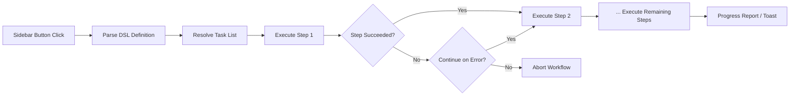

import TLDR from '@site/src/components/TLDR';

# Alur Kerja

<TLDR>
**Notemd Alur kerja menggabungkan beberapa tugas menjadi satu tindakan satu klik.** Tentukan urutan seperti `add-links > extract-concepts > research > diagram` menggunakan DSL sederhana. Alur kerja muncul sebagai tombol di sidebar yang menjalankan seluruh rangkaian pada catatan atau folder saat ini. Dilengkapi dengan alur kerja bawaan; buat alur kerja khusus di pengaturan. Setiap langkah menggunakan konfigurasi model per-tugasnya sendiri.

Ini merupakan bagian dari [Obsidian Panduan Manajemen Pengetahuan AI](/docs/pillar-ai-knowledge).
</TLDR>

## Gambaran Umum

Sebuah alur kerja menghilangkan hambatan dalam menjalankan tugas satu per satu. Alih-alih mengklik kanan empat kali untuk menambahkan tautan, mengekstrak konsep, mencari istilah yang tidak dikenal, dan membuat diagram, Anda hanya perlu menekan satu tombol di sidebar dan seluruh rangkaian akan dieksekusi. Notemd menangani urutan eksekusi, penyebaran kesalahan, dan pelaporan kemajuan.

Alur kerja didefinisikan dalam DSL ringan (bahasa khusus domain). Alur kerja tersebut berada di pengaturan, muncul sebagai tombol yang dapat diklik di sidebar Obsidian, dan dapat diterapkan pada catatan saat ini atau seluruh folder.

## Cara Kerjanya

### Saluran Eksekusi Alur Kerja



1. **Menguraikan** -- String DSL dipisahkan menggunakan `>` (atau `>`) menjadi daftar terurut dari identifikasi tugas.
2. **Menyelesaikan** -- Setiap identifikasi dipetakan ke perintah internal (add-links, extract-concepts, research, translate, diagram, dll.).
3. **Menjalankan** -- Langkah-langkah dijalankan secara berurutan. Setiap langkah menggunakan penyedia dan model per-tugas yang telah dikonfigurasi.
4. **Penanganan kesalahan** -- Jika suatu langkah gagal, alur kerja akan berhenti atau melanjutkan ke langkah berikutnya, tergantung pada kebijakan kesalahan Anda.
5. **Selesai** -- Pemberitahuan toast melaporkan keberhasilan atau mencantumkan langkah-langkah yang gagal.

### Format DSL

Alur kerja didefinisikan sebagai urutan identifikasi tugas yang dipisahkan dengan `>`:

```
process-current-add-links>extract-concepts-current>research-and-summarize
```

**Identifikasi tugas yang tersedia:**

| Identifikasi | Aksi |
|------------|--------|
| `process-current-add-links` | Menambahkan tautan wiki ke catatan yang aktif |
| `extract-concepts-current` | Mengeluarkan konsep dari catatan yang aktif |
| `research-and-summarize` | Meneliti teks yang dipilih atau judul catatan |
| `process-current-translate` | Menerjemahkan catatan yang aktif |
| `summarize-to-mermaid` | Membuat diagram dari catatan yang aktif |
| `generate-from-title` | Menghasilkan konten dari judul catatan |
| `extract-original-text` | Mengeluarkan teks asli (untuk OCR/konten yang dipindai) |

**Varian tingkat folder** mengganti `current` dengan `folder` dalam nama identifikator.

### Alur kerja yang sudah ditentukan vs. Alur kerja kustom

Notemd disertai alur kerja siap pakai untuk pola umum:

| Alur kerja | Rantai | Kasus Penggunaan |
|----------|-------|----------|
| **Ekstrak Sekali Klik** | tambah-tautan > ekstrak-konsep > teliti | Memproses makalah penelitian dalam satu langkah |
| **Saluran Kerja Lengkap** | add-links > extract-concepts > research > diagram | Ekstraksi pengetahuan lengkap dengan visualisasi |
| **Menerjemahkan + Menghubungkan** | translate > add-links | Menerjemahkan lalu menghubungkan konsep dalam bahasa sasaran |

**Alur kerja khusus** dibuat di pengaturan:

1. Buka **Settings** --> **Notemd** --> **Workflows**
2. Klik **"Add Workflow"**
3. Masukkan rantai DSL (misalnya, `process-current-add-links>extract-concepts-current`)
4. Berikan nama tampilan (misalnya, "Quick Link + Extract")
5. Button baru akan muncul di sidebar segera

## Konfigurasi

| Pengaturan | Default | Efek |
|---------|---------|--------|
| `workflows` | Kumpulan predefinisi | Array definisi alur kerja (nama + DSL) |
| `workflowContinueOnError` | `true` | Lanjut ke langkah berikutnya jika langkah saat ini gagal |
| `workflowShowProgress` | `true` | Tampilkan notifikasi progres setelah setiap langkah selesai |

### Model per-tugas dalam Alur Kerja

Setiap langkah dalam alur kerja menggunakan konfigurasi model per-tugas **sendiri**. Anda tidak perlu menentukan model di dalam DSL itu sendiri. Urutan penyelesaian adalah:

1. Provider/model per-tugas jika `useMultiModelSettings` ada di sana
2. `activeProvider` global jika tidak

Ini berarti `add-links` dapat dijalankan di DeepSeek sementara `research` dijalankan di GPT-4o -- semuanya dalam satu klik alur kerja yang sama.

## Contoh

Anda baru saja mengimpor PDF dari sebuah makalah machine learning ke vault Anda dan ingin melakukan ekstraksi pengetahuan secara penuh:

1. Buka catatan yang diimpor
2. Klik tombol sidebar **"Full Pipeline"**
3. Notemd dieksekusi sebagai berikut:
   - **Langkah 1**: Tambahkan tautan wiki -- `[[attention mechanism]]`, `[[transformer]]`, dll.
   - **Langkah 2**: Ekstrak konsep -- membuat catatan konsep di folder konsep Anda
   - **Langkah 3**: Lakukan penelitian -- merangkum sumber web untuk istilah kunci
   - **Langkah 4**: Buat diagram -- menghasilkan peta pikiran Mermaid dari struktur makalah tersebut
4. Setelah sekitar 30 detik, catatan Anda akan memiliki tautan, catatan konsep sudah ada, hasil penelitian ditambahkan, dan berkas diagram disimpan

Semuanya hanya dengan satu klik.

## Tips

- **Mulai dengan alur kerja yang sudah ditentukan** -- alur kerja ini mencakup pola-pola yang paling umum. Sesuaikan hanya bila Anda membutuhkan urutan yang berbeda.
- **Aktifkan `workflowContinueOnError`** -- kegagalan pada langkah diagram tidak boleh menghentikan seluruh pipeline.
- **Gunakan alur kerja folder** untuk pemrosesan massal -- klik kanan pada folder, pilih alur kerja, dan setiap catatan akan diproses.
- **Berikan nama alur kerja yang jelas** -- ruang di sidebar terbatas. Gunakan nama yang singkat dan berorientasi tindakan seperti "Quick Extract" atau "Translate + Link".

---

## Langkah Selanjutnya

- [Research](./research) -- Pahami apa fungsi langkah penelitian sebelum menambahkannya ke alur kerja
- [Wiki-Links](./wiki-links) -- Fitur pemberian tautan inti yang digunakan di sebagian besar alur kerja
- [Concept Notes](./concept-notes) -- Ekstraksi konsep sebagai langkah dalam alur kerja
- [Batch Processing](/docs/advanced/batch-processing) -- Konkurensi dan laporan kemajuan untuk alur kerja folder
