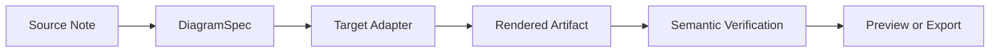
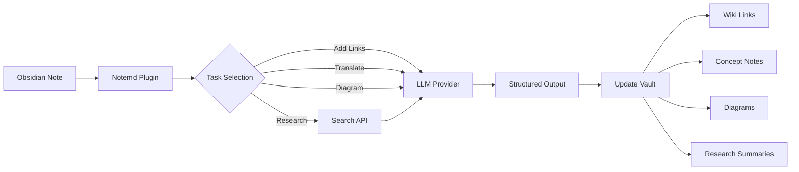

import TLDR from '@site/src/components/TLDR';

# Pengenalan Notemd

<TLDR>
**Notemd** (Note + EMD — Enhanced Markdown Documents) adalah plugin berbasis sumber terbuka untuk Obsidian yang mengubah pembacaan yang didorong oleh LLM menjadi pengetahuan yang persisten. Berbeda dengan AI berbasis chat di mana wawasan hilang setelah sesi selesai, Notemd menulis hasil **langsung ke vault Anda** dalam bentuk tautan wiki, catatan konsep, ringkasan penelitian, terjemahan, alur kerja, dan diagram. Alat ini dirancang untuk peneliti, mahasiswa, dan pekerja pengetahuan yang ingin agar pembacaan, penelitian, dan penjelasan visual terakumulasi menjadi graf pengetahuan yang terstruktur dan terus berkembang.
</TLDR>

## Apa itu Notemd?

Notemd mengintegrasikan **lebih dari 30 Model Bahasa Besar** (OpenAI, Anthropic, Google, DeepSeek, Qwen, Ollama, dan lainnya) ke dalam alur kerja Obsidian Anda untuk mengotomatisasi ekstraksi pengetahuan, pengorganisasian, penerjemahan, penelitian, dan pembuatan diagram.

### Perbedaan Utama: Pengetahuan Sementara vs. Pengetahuan Persisten

| Aspek | AI berbasis chat (ChatGPT, dll.) | Notemd |
|--------|-------------------------------|--------|
| **Ke mana hasilnya pergi** | Sejarah chat (hilang) | Vault Obsidian Anda (tetap ada) |
| **Format** | Jawaban teks biasa | File terstruktur: `[[wiki-links]]`, catatan konsep, diagram |
| **Nilai jangka panjang** | Harus ditanyakan ulang setiap kali | Terakumulasi menjadi graf pengetahuan |
| **Akses Offline** | Memerlukan koneksi internet | Bekerja sepenuhnya offline dengan Ollama |

## Kemampuan Inti

### 1. **Penghubungan Wiki Otomatis**
- LLM mengidentifikasi konsep kunci dalam catatan Anda
- Menyisipkan `[[wiki-links]]` di setiap kemunculannya
- Secara opsional membuat catatan konsep yang terhubung
- Penekanan sinonim untuk menghindari duplikat

### 2. **Pembuatan Catatan Konsep**
- Mengeluarkan konsep inti dari makalah, artikel, dan catatan
- Menghasilkan file konsep khusus dengan tautan balik
- Rute keluaran dan template yang dapat disesuaikan

### 3. **Integrasi Penelitian Web**
- Mencari Tavily atau DuckDuckGo dari dalam Obsidian
- LLM merangkum hasil beserta kutipan sumbernya
- Menyisipkan temuan penelitian ke catatan saat ini

### 4. **Terjemahan Multibahasa**
- Menerjemahkan bagian tertentu atau seluruh catatan
- Dukung lebih dari 21 bahasa UI
- Konfigurasi bahasa keluaran secara mandiri
- Dukungan terjemahan batch

### 5. **Pembuatan Diagram**
- **Mermaid**: Diagram alir, urutan, kelas, keadaan, ER, Gantt
- **JSON Canvas**: Tata letak asli Obsidian
- **Vega-Lite**: Grafik data, seri waktu, plot scatter
- **HTML / HTML yang dapat diedit/SVG**: Artefak gambar mandiri dengan anotasi semantik
- **Draw.io / batas artefak Drawnix**: Rute ekspor untuk pemelihara dari model gambar semantik yang sama
- **Rencana jalan cerita diagram sirkuit**: Dukungan circuitikz/TikZJax sedang dirancang berdasarkan referensi emas, prompt terbatas, umpan balik render, serta validasi topologi/layout alih-alih TikZ LLM yang tidak terbatas secara mentah
- **Diagnostik pratinjau**: Artefak render dapat menampilkan diagnosis kompilasi/rendering, dan sumber non-inline dapat diperiksa tanpa memerlukan runtime LaTeX di sisi plugin
- Perbaikan otomatis sintaks untuk kesalahan Mermaid

### 6. **Alur Kerja Sekali Klik**
- Menggabungkan beberapa tindakan menjadi tombol di sidebar
- Definisi alur kerja berbasis DSL
- Contoh: `add-links > extract-concepts > research > diagram`

## Siapa yang Harus Menggunakannya Notemd?

✅ **Peneliti** yang membaca makalah dan membuat tinjauan literatur
✅ **Mahasiswa** yang mengorganisir catatan belajar dan membuat peta konsep
✅ **Pekerja pengetahuan** yang ingin wawasan bacaan tetap tersimpan
✅ **Profesional bilingual** yang membutuhkan terjemahan + tautan wiki
✅ **Pengguna yang peduli privasi** yang menginginkan dukungan LLM lokal (Ollama)
✅ **Pengguna tingkat lanjut** yang menyesuaikan prompt dan alur kerja

## Mengapa Notemd + Obsidian?

**Obsidian** adalah basis pengetahuan berbasis markdown yang mengutamakan lokal. **Notemd** menambah kekuatan AI:
- Data Anda tetap ada di vault Anda (bukan layanan cloud)
- Bekerja offline dengan model lokal
- Gratis dan berbasis sumber terbuka (lisensi MIT)
- Terintegrasi dengan plugin Obsidian yang sudah ada
- Dapat menangani puluhan ribu catatan

## Panduan Penggunaan

1. **Instalasi**: Pengaturan → Plugin Komunitas → Cari → "Notemd"
2. **Konfigurasi**: Tambahkan kunci penyedia LLM API Anda (atau gunakan Ollama lokal)
3. **Coba sekarang**: Buka sebuah catatan → Klik kanan → "Proses file (tambahkan tautan)"
4. **Jelajahi**: Periksa panel samping untuk alur kerja satu klik

👉 [Panduan Instalasi](./getting-started/installation) | [Tutorial Cepat](./getting-started/quick-start)

## Arah Kemampuan Diagram

Pekerjaan diagram Notemd sedang beralih dari "meminta model menulis satu string sintaks" menjadi pipeline bertingkat:

Implementasi saat ini sudah mendukung Mermaid, JSON Canvas, Vega-Lite, fallback HTML, HTML/SVG yang dapat diedit, artefak Draw.io XML, subset minimal Drawnix JSON, diagnosis pratinjau/fallback hanya sumber kode, serta prototipe offline `CircuitSpec -> circuitikz` untuk template emas sumber umum dan inverter CMOS. Diagram rangkaian merupakan kategori yang lebih sulit: circuitikz dapat mengekspresikan topologi listrik yang akurat, tetapi output LLM yang tidak dibatasi sering menghasilkan rute yang tidak dapat dibaca atau LaTeX yang tidak terrender. Arah selanjutnya adalah membatasi circuitikz dengan template referensi emas, aturan tata letak grid node, diagnosis render, dan loop umpan balik tangkapan layar.

Baca detailnya di [Diagram](./features/diagrams).

## Arsitektur

## Notemd vs Plugin AI Obsidian Lainnya

Sebagian besar plugin AI Obsidian berfokus pada percakapan (Anda bertanya, AI menjawab, wawasan tetap di chat). Notemd adalah **penulisan terlebih dahulu**: AI memproses catatan Anda dan menulis hasil terstruktur langsung ke vault Anda.

| Kemampuan | Notemd | Copilot | Smart Connections | Text Generator |
|-----------|--------|---------|-------------------|-----------------|
| Pengisian tautan wiki otomatis | Ya | Tidak | Tidak | Tidak |
| Pembuatan nota konsep | Ya (dengan tautan balik + penghapusan duplikat) | Tidak | Tidak | Tidak |
| Pembuatan diagram | Ya (Mermaid, Canvas, Vega-Lite, HTML, artefak yang dapat diedit) | Tidak | Tidak | Tidak |
| Integrasi penelitian web | Ya (Tavily + DuckDuckGo) | Tidak | Tidak | Tidak |
| Pemrosesan folder secara batch | Ya | Terbatas | Tidak | Terbatas |
| Rute model per tugas | Ya (7 tugas, model independen) | Tidak | Tidak | Tidak |
| Rantai alur kerja satu klik | Ya (DSL) | Tidak | Tidak | Tidak |
| Penerjemahan (batch) | Ya | Tidak | Tidak | Tidak |
| Chating dengan vault | Tidak | Ya | Tidak | Tidak |
| Pencarian kemiripan semantik | Tidak | Tidak | Ya | Tidak |
| Pembuatan berbasis template | Tidak | Tidak | Tidak | Ya |
| Penyedia LLM | 36 (cloud + gateway + lokal) | 3-5 | 2-3 | 3-5 |
| Sepenuhnya offline | Ya (Ollama) | Sebagian | Sebagian | Sebagian |

**Kapan memilih Notemd**: Anda ingin AI membuat grafik pengetahuan yang persisten — bukan hanya berbicara tentang catatan Anda.

**Kapan memilih Copilot**: Anda menginginkan asisten AI konversasional di dalam Obsidian.

**Kapan memilih Smart Connections**: Anda ingin menemukan hubungan yang sudah ada antar catatan melalui pencarian semantik.

## Filosofi

**Notemd percaya bahwa AI seharusnya melengkapi pekerjaan pengetahuan manusia, bukan menggantikannya.** Plugin ini:
- Membuat Anda tetap mengendalikan (ulas terlebih dahulu sebelum menerapkan perubahan)
- Mempertahankan konteks (semua hasil mengarah kembali ke sumber)
- Menghormati privasi (dukungan LLM lokal, tanpa telemetri)
- Tetap dapat diperluas (pembukaan APIs, alur kerja khusus)

<!-- notemd-acknowledgments -->
## Ucapan terima kasih dan proyek rujukan

Notemd dipelihara secara independen. Kami berterima kasih kepada proyek dan komunitas sumber terbuka yang menginformasikan keputusan desain terdokumentasi atau menyediakan fondasi integrasi. Pencantuman hanya mengakui pengaruh atau interoperabilitas; tidak menyiratkan dukungan, afiliasi, kode yang dibundel, atau klaim penggunaan ulang kode.

- **Proyek rujukan:** [cloudy-tech-diagrams-skill](https://github.com/cloudy-liu/cloudy-tech-diagrams-skill), [Drawnix](https://github.com/plait-board/drawnix), [diagrams.net / draw.io](https://www.diagrams.net/), [repo-saga](https://github.com/teee32/repo-saga).
- **Fondasi sumber terbuka:** [Mermaid](https://github.com/mermaid-js/mermaid), [Vega-Lite](https://vega.github.io/vega-lite/), [Slidev](https://github.com/slidevjs/slidev), [CircuitikZ](https://github.com/circuitikz/circuitikz), [Tectonic](https://github.com/tectonic-typesetting/tectonic), [Docusaurus](https://docusaurus.io).
- Setiap proyek mempertahankan lisensi dan ketentuannya sendiri; Notemd tersedia di bawah [Lisensi MIT](https://github.com/Jacobinwwey/obsidian-NotEMD/blob/main/LICENSE).

## Sumber terbuka

- **Lisensi**: MIT
- **Sumber**: [github.com/Jacobinwwey/obsidian-NotEMD](https://github.com/Jacobinwwey/obsidian-NotEMD)
- **Komunitas**: [Discord](https://discord.gg/qnGgsQ9W) | [GitHub Discussions](https://github.com/Jacobinwwey/obsidian-NotEMD/discussions)
- **Berkontribusi**: PR diterima, lihat [CONTRIBUTING.md](https://github.com/Jacobinwwey/obsidian-NotEMD/blob/main/CONTRIBUTING.md)

---

**Selanjutnya**: [Installation →](./getting-started/installation)
