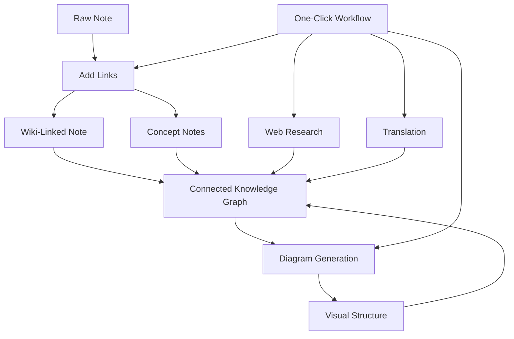

import TLDR from '@site/src/components/TLDR';

# Obsidian Panduan Manajemen Pengetahuan AI

<TLDR>
**Notemd mengubah pembacaan yang ditenagai LLM menjadi pengetahuan yang persisten: tautan wiki menghubungkan konsep, catatan konsep membuat graf yang dapat diakses, penelitian membawa konten web ke dalam arsip Anda, penerjemahan menghilangkan hambatan bahasa, diagram membuat struktur terlihat jelas, dan alur kerja menggabungkannya semua dengan satu klik.** Panduan ini mencakup seluruh proses — dari catatan mentah hingga basis pengetahuan yang terhubung, visual, dan multibahasa.
</TLDR>

## Mengapa Manajemen Pengetahuan AI?

Pencatatan konvensional menghasilkan file datar. Bahkan dengan tautan wiki manual, sebagian besar catatan tetap terpisah. Notemd menggunakan LLM untuk mengotomatisasi lapisan koneksi:

- **LLM membaca konten Anda** dan mengidentifikasi hal-hal yang penting — istilah, metode, orang, teori
- **Tautan ditambahkan secara otomatis** di setiap kemunculan konsep, bukan tersembunyi dalam bagian "lihat juga"
- **Catatan konsep dihasilkan** sebagai file yang dapat diakses secara mandiri
- **Penelitian memperkaya catatan** dengan konteks dari sumber web
- **Diagram membuat struktur terlihat jelas** — peta pikiran, alur kerja, grafik data dari konten yang sama

Hasilnya: graf pengetahuan yang terus tumbuh seiring setiap catatan yang Anda proses, bukan hanya saat Anda ingat untuk menambahkan tautan.

## Seluruh Prosesnya



Setiap langkah bersifat independen. Gunakan satu atau semuanya. Urutan yang paling efektif: **Tambahkan Tautan → Catatan Konsep → Diagram**.

---

## 1. Tautan Wiki: Menjadikan Koneksi Jelas

Tautan wiki merupakan tulang punggung graf pengetahuan. Notemd menggunakan LLM untuk:

1. Baca isi catatan Anda (bagi menjadi beberapa bagian untuk dokumen yang panjang)
2. Identifikasi konsep inti — utamakan istilah teknis tertentu daripada kata benda umum
3. Masukkan `[[wiki-links]]` di setiap kemunculannya
4. Hapus sinonim sehingga "ML" dan "Machine Learning" tidak menghasilkan node terpisah

### Kapan Digunakan

- **Setiap catatan >100 kata** — catatan yang lebih pendek menghasilkan sedikit konsep
- **Makalah penelitian, dokumen teknis, catatan rapat** — kaya akan istilah spesifik bidang
- **Setelah kontennya stabil** — jangan memproses draf berulang kali

### Pengaturan Utama

| Pengaturan | Disarankan | Alasan |
|---------|-----------|-----|
| `addLinksProvider` | DeepSeek atau GPT-4o-mini | Akurasi yang baik dengan biaya rendah |
| Penghapusan sinonim | Aktif | Mencegah node duplikat |
| Jendela konteks | Paragraf | Keseimbangan antara akurasi dan biaya |

→ [Wiki-Links deep dive](/docs/features/wiki-links)

---

## 2. Catatan Konsep: Node Pengetahuan yang Dapat Ditarik

Tautan wiki menghubungkan ide-ide secara langsung, namun catatan konsep memungkinkan setiap ide diakses secara mandiri. Setiap konsep memiliki file `.md`nya sendiri:

```markdown
# Machine Learning

## Linked From
- [[My Research Notes]]
- [[Neural Networks Explained]]
```

### Proses Ekstraksi

Prompt LLM memiliki struktur yang sangat teratur:
- Normalisasi ke bentuk tunggal
- Lebih prefer konsep berupa beberapa kata daripada kata tunggal (“Dielectric Relaxation” bukan “Relaxation”)
- abaikan bagian referensi/bibliografi
- Keluaran dalam bentuk baris `CONCEPT:` untuk parsing yang dapat diprediksi

Konsep-konsep dideduplikasikan di antara berbagai bagian melalui `Set<string>`. Kesalahan LLM pada bagian tertentu tidak menghentikan proses.

### Tautan Balik

Jika diaktifkan, setiap catatan konsep mencatat nota sumber mana yang menyebutkannya. Panel tautan balik bawaan Obsidian juga menampilkan koneksi terbalik.

### Penghapusan duplikat

Mesin deduplikasi 4 langkah Notemd dapat mendeteksi:
1. **Persamaan persis** — perbandingan nama file yang tidak sensitif terhadap huruf besar kecil
2. **Bentuk jamak** — "Models.md" vs "Model.md"
3. **Normalisasi simbol** — "A-B.md" vs "A B.md"
4. **Penyimpanan kata tunggal** — "ML.md" ditandai ketika "Machine Learning.md" ada

### Pengaturan Kunci

| Pengaturan | Disarankan | Alasan |
|---------|-----------|-----|
| `conceptNoteFolder` | `concepts/` atau `🧠 concepts/` | Mempertahankan tata letak vault |
| `extractConceptsAddBacklink` | On | Mengaktifkan pencarian terbalik |
| `extractConceptsMinimalTemplate` | Off | Template lengkap dengan Linked From |
| Model per tugas | DeepSeek | Ekstraksi konsep tidak memerlukan model yang mahal |
| Penekanan sinonim | On | Pengaturan yang sama mempengaruhi pemberian tautan dan ekstraksi |

→ [Penjelasan mendalam tentang Catatan Konsep](/docs/features/concept-notes)

---

## 3. Penelitian: Mengintegrasikan Web

Notemd menggabungkan pencarian web ke dalam alur kerja pembuatan catatan Anda:

1. **Pembuatan kueri** — judul atau pilihan catatan Anda menjadi kueri pencarian
2. **Pencarian web** — Tavily (direkomendasikan, memerlukan kunci API) atau DuckDuckGo (gratis, tanpa kunci)
3. ****LLM** ringkasan** — hasil pencarian diringkas menjadi ringkasan yang relevan
4. **Menambahkan ke catatan** — ringkasan ditambahkan di posisi kursor atau sebagai bagian baru

### Kapan Digunakan

- Sebelum memproses topik baru — dapatkan konteks web terlebih dahulu
- Ketika catatan konsep perlu diperkaya — lakukan penelitian lalu tambahkan tautan
- Untuk tinjauan literatur — lakukan penelitian secara massal pada folder catatan

### Pengaturan Utama

| Pengaturan | Direkomendasikan | Alasan |
|---------|-----------|-----|
| `researchProvider` | GPT-4o atau Claude | Penelitian memerlukan ringkasan dengan kualitas lebih tinggi |
| Layanan pencarian | Tavily | Relevansi yang lebih baik, kedalaman yang dapat dikonfigurasi |
| `maxResearchContentTokens` | 4000 | Keseimbangan antara kedalaman dan biaya |

→ [Penelitian mendalam tentang deep dive](/docs/features/research)

---

## 4. Penerjemahan: Menghilangkan Hambatan Bahasa

Notemd menerjemahkan catatan menggunakan LLM yang telah dikonfigurasi oleh Anda — bukan penerjemah khusus API. Artinya adalah.

- **Penerjemahan berbasis konteks** — LLM memahami seluruh dokumen, bukan hanya kalimat demi kalimat
- **Penanganan istilah teknis** — "gradient descent" tetap menjadi "梯度下降" dan bukan "坡度向下"
- **Dukungan batch** — menerjemahkan seluruh folder catatan sekaligus dalam satu operasi
- **Model per tugas** — gunakan Gemini Flash untuk penerjemahan (cepat, murah, multibahasa)

### Dukungan Bahasa

Notemd sendiri mendukung 21 bahasa UI. Bahasa tujuan penerjemahan dapat dikonfigurasi per tugas. Pasangan umum: EN↔ZH, EN↔JA, EN↔KO, EN↔DE, EN↔FR, EN↔ES.

→ [Penelitian mendalam tentang penerjemahan](/docs/features/translation)

---

## 5. Diagram: Menampilkan Struktur

Pipeline diagram Notemd berbasis spesifikasi terlebih dahulu: LLM menghasilkan `DiagramSpec` JSON yang terstruktur, lalu adapter menerjemahkannya ke format tujuan. Cara ini menghasilkan output yang lebih dapat diandalkan dibandingkan meminta LLM untuk sintaks Mermaid mentah.

### Deteksi niat

Notemd menyimpulkan jenis diagram terbaik dari kontennya:

- **Tabel dengan angka** → grafik data (Vega-Lite)
- **Kosakata klien/server** → diagram urutan (Mermaid)
- **Entitas/kunci utama** → diagram ER (Mermaid)
- **Langkah/alur proses** → diagram alir (Mermaid)
- **Kata kunci peta konsep** → JSON Canvas (Obsidian native)
- **Default** → peta pikiran (Mermaid)

### Rantai Rendering

Target utama → cadangan → cadangan → HTML. Jika sintaks Mermaid gagal, sistem mencoba sekali lagi dengan konteks kesalahan ke LLM, lalu beralih ke diagram minimal.

### Pengaturan Kunci

| Pengaturan | Disarankan | Alasan |
|---------|-----------|-----|
| `enableExperimentalDiagramPipeline` | On | Kualitas yang lebih baik melalui pendekatan berbasis spesifikasi |
| `experimentalDiagramCompatibilityMode` | `best-fit` | Target native sesuai intent |
| `summarizeToMermaidProvider` | GPT-4o atau Claude | Spesifikasi diagram memerlukan penalaran spasial |
| `autoMermaidFixAfterGenerate` | On | Menangkap kesalahan sintaks LLM secara otomatis |
| Peningkatan pengetahuan lokal | Diaktifkan untuk konteks spesifik domain | Meningkatkan akurasi dengan konteks vault |

→ [Penjelasan mendalam tentang diagram](/docs/features/diagrams)

---

## 6. Alur kerja: Otomatisasi satu klik

Alur kerja menggabungkan beberapa tugas ke dalam satu tombol di sidebar. Format DSL-nya adalah:

```
task1 | task2 | task3
```

Contoh: `addLinks | extractConcepts | generateDiagram` — memproses catatan dari teks mentah menjadi node pengetahuan visual yang terhubung sepenuhnya dengan satu klik.

### Alur kerja yang direkomendasikan

| Alur kerja | Rantai | Kasus Penggunaan |
|----------|-------|----------|
| Proses lengkap | `addLinks \| extractConcepts \| generateDiagram` | Catatan baru |
| Penelitian terlebih dahulu | `research \| addLinks` | Topik yang tidak dikenal |
| Polyglot | `translate \| addLinks` | Catatan berbahasa ganda |
| Hanya Diagram | `generateDiagram` | Visualisasi Cepat |

→ [Pengenalan Mendalam Mengenai Alur Kerja](/docs/features/workflows)

---

## 7. LLM Provider: 36 Opsi dari Cloud hingga Lokal

Notemd mendukung 36 provider di 4 jenis transportasi. Kelompok utama:

- **Cloud Internasional**: OpenAI, Anthropic, Google, Mistral, xAI
- **Cloud China**: DeepSeek, Qwen, Doubao, Moonshot, GLM, Baidu, SiliconFlow
- **Gateway**: OpenRouter, GitHub Models, Hugging Face, Vercel
- **Lokal**: Ollama, LMStudio, OVMS — tidak ada kunci API, data tidak keluar dari mesin Anda

### Strategi Model Per-Tugas

Pengaturan yang paling hemat biaya menggunakan model murah untuk tugas sederhana dan model kuat untuk tugas yang kompleks:

```
extractConcepts  → DeepSeek (fast, cheap, accurate enough)
addLinks          → DeepSeek or GPT-4o-mini
research          → GPT-4o or Claude (needs quality)
generateDiagram   → GPT-4o or Claude (needs spatial reasoning)
translate         → Gemini Flash (fast, multilingual)
```

→ [Gambaran Umum Provider LLM](/docs/providers/overview)

---

## Daftar Periksa Untuk Memulai

1. **Instal Notemd** — [Community Plugins](/docs/getting-started/installation) (disarankan) atau secara manual
2. **Konfigurasi provider** — DeepSeek (paling mudah), OpenAI, atau Ollama (gratis)
3. **Proses catatan pertama Anda** — klik kanan → "Proses file (tambahkan tautan)"
4. **Menetapkan folder konsep** — Pengaturan → Notemd → Keluaran → Folder Konsep
5. **Mengekstrak konsep** — jalankan "Mengekstrak konsep" pada catatan yang sama
6. **Menghasilkan diagram** — jalankan "Menghasilkan diagram" untuk memvisualisasikan koneksi
7. **Membuat alur kerja** — menggabungkan langkah di atas menjadi tombol satu klik

## Konfigurasi yang direkomendasikan

### Siswa (Anggaran)

```
Provider: DeepSeek (free tier available)
Concept extraction: DeepSeek
Research: DuckDuckGo (free) + DeepSeek
Diagrams: Off (or legacy Mermaid)
Workflows: addLinks | extractConcepts
```

### Peneliti (Kualitas)

```
Provider: GPT-4o (primary)
Concept extraction: DeepSeek (cost savings)
Research: GPT-4o + Tavily
Diagrams: best-fit mode, GPT-4o
Workflows: research | addLinks | extractConcepts | generateDiagram
```

### Privasi Terutama (Hanya Lokal)

```
Provider: Ollama (llama3 or qwen2.5:7b)
All tasks: Ollama
Research: DuckDuckGo (free, no API key)
Diagrams: legacy Mermaid mode
```

### Bilingual (ZH + EN)

```
Primary: DeepSeek (Chinese queries)
Translation: Google Gemini Flash
Research: Tavily + DeepSeek (Chinese search context)
Language output: per-task (extractConceptsLanguage: zh-CN)
```

---

## Pola Umum

### Pola: Memproses Makalah Penelitian

1. Impor konten PDF (atau tempel)
2. **Meneliti** — dapatkan konteks web tentang topik
3. **Menambahkan Tautan** — identifikasi dan hubungkan konsep kunci
4. **Mengekstrak Konsep** — buat catatan terpisah
5. **Menghasilkan Diagram** — visualisasikan struktur makalah

### Pola: Pemperkayaan Catatan Harian

1. Menulis catatan harian
2. **Tambahkan Tautan** — menghubungkan ide-ide hari ini dengan konsep yang sudah ada
3. Catatan konsep diperbarui otomatis dengan tautan balik

### Pola: Ulasan Literatur

1. Buat folder untuk menyimpan makalah/catatan
2. **Tambahkan Tautan Secara Massal** — memproses seluruh folder
3. **Hapus Duplikat Konsep** — membersihkan catatan yang hampir sama
4. **Buat Diagram** — peta pikiran dari seluruh literatur tersebut

---

*Notemd merupakan perangkat lunak sumber terbuka (MIT) dan berfungsi dengan Obsidian 0.15.0+ di semua platform. [Instal sekarang](/docs/getting-started/installation) atau [lihat di GitHub](https://github.com/Jacobinwwey/obsidian-NotEMD).*
