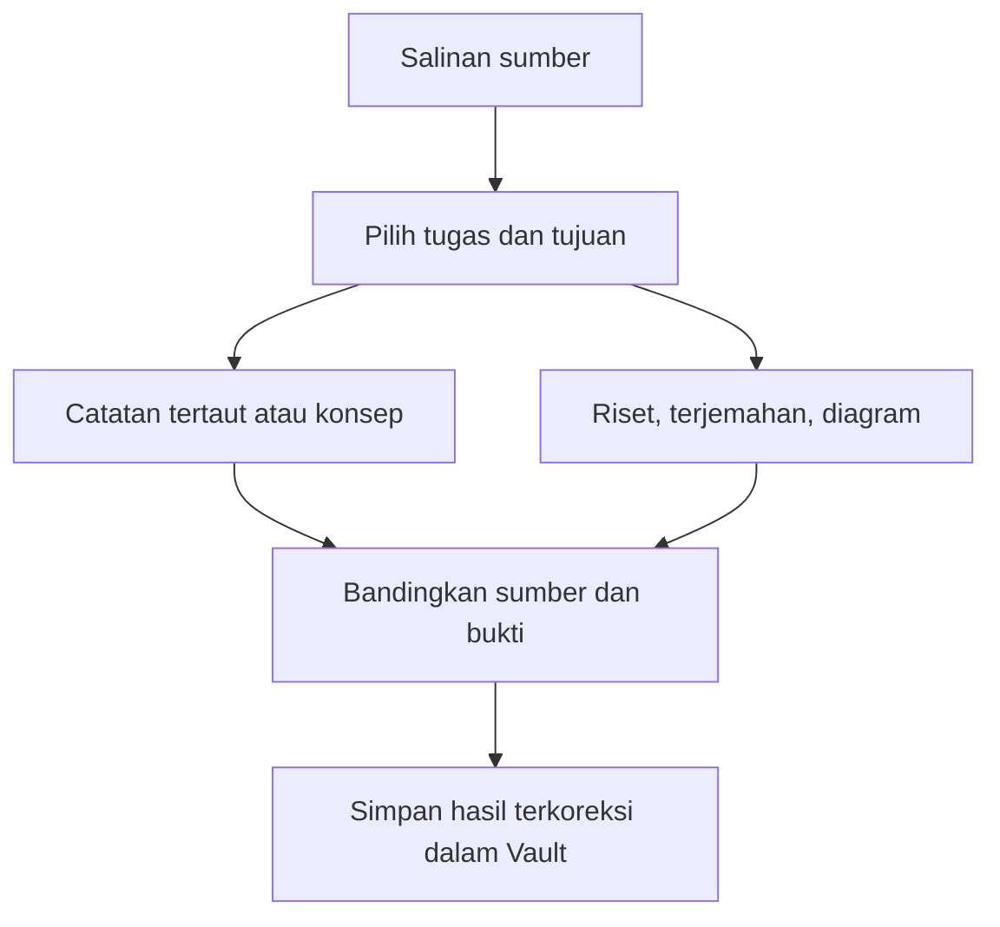

import TLDR from '@site/src/components/TLDR';

# Panduan pengetahuan berbantuan AI di Obsidian

<TLDR>Alur yang berguna membedakan sumber, hasil model, dan koreksi Anda. Notemd menyediakan tautan, ekstraksi, riset, terjemahan, serta diagram yang menulis berkas dapat diperiksa. Mulai dari satu sumber, verifikasi, lalu otomatisasikan folder terbatas.</TLDR>

## Tentukan hasil

Pilih artefak: catatan bacaan tertaut, konsep, ringkasan bersumber, terjemahan, atau diagram. Banyak berkas/tautan tidak otomatis meningkatkan pemahaman atau pengambilan. Tentukan cara memeriksa kebenaran dan menemukannya lagi.

## Alur lengkap


```mermaid
flowchart TD
    A["Salinan sumber"] --> B["Pilih tugas dan tujuan"]
    B --> C["Catatan tertaut atau konsep"]
    B --> D["Riset, terjemahan, diagram"]
    C --> E["Bandingkan sumber dan bukti"]
    D --> E
    E --> F["Simpan hasil terkoreksi dalam Vault"]
```

Ini tugas yang tersedia, bukan klaim satu tombol bawaan menjalankan semuanya. Pertahankan sumber dan periksa tujuan tiap tugas sebelum membuat alur.

## 1. Wiki-link: membuat hubungan eksplisit

Jalankan **Proses file (tambah tautan)** pada sampel. Periksa `_processed.md` bawaan di samping sumber. Tinjau kegunaan istilah untuk navigasi dan kesetiaan kutipan, kode, persamaan.

Pembelajaran terfokus/penekanan sinonim mengarahkan model, bukan memaksakan kesetaraan konsep atau ambang numerik. Pilih pencocokan judul deterministik jika reproduktibilitas terhadap nama yang ada menjadi prioritas.

[Panduan wiki-link](./features/wiki-links)

## 2. Konsep: pisahkan istilah dan penjelasan

Pilih folder sebelum ekstraksi. Bawaan mandiri hanya judul dan sumber tetap utuh. Aktifkan tautan balik serta nonaktifkan templat minimal untuk `Linked From` dalam catatan mandiri baru.

Ekstraksi dan generasi penjelasan terpisah. **Pembuatan massal dari judul** dapat mengisi catatan lama yang memenuhi syarat selain konsep baru. Gunakan folder khusus dan periksa pemindahan complete yang dilaporkan.

Deduplikasi memakai heuristik nama. Konfirmasi sebelum menghapus; nama mirip dapat bermakna teknis berbeda.

[Panduan konsep](./features/concept-notes)

## 3. Riset: pertahankan jejak bukti

Pilih topik atau judul, pilih Tavily/DuckDuckGo, lalu **Riset & rangkum**. Kunci Tavily hilang tidak berpindah otomatis. Buka URL sumber dan verifikasi klaim dalam ringkasan.

Pengambilan lokal opsional menyumbang kutipan terlingkup. Indeks leksikal dan teks dikirim ke LLM tugas. Pengindeksan lokal tidak berarti seluruh jalur offline atau hanya perangkat.

[Panduan riset](./features/research)

## 4. Terjemahan: tinjau makna dan struktur

Pilih bahasa dan terjemahkan berkas. Sufiks bawaan `_<language>.md`; tujuan lama dapat ditimpa. Untuk satu bagian, salin ke catatan sementara dahulu.

Periksa istilah, angka, kode, tautan, matematika. Pemotongan dapat menghilangkan konteks lintas bagian. Jumlah 21 UI/34 situs tidak membuktikan kualitas pasangan bahasa.

[Panduan terjemahan](./features/translation)

## 5. Diagram: pilih artefak editable

Pilih jenis dan sumber kompatibel, periksa pratinjau, lalu simpan sumber serta SVG/PNG/PDF yang didukung. Gambar bukan bukti editor lain mempertahankan semua hubungan semantik.

Gunakan katalog pilihan yang didukung. CircuitikZ terbatas dan kompilasi native memiliki pemeriksaan lingkungan sendiri. Panah statis lintas cabang Drawnix tidak menjamin kelekatan setelah penataan ulang. Tabel PowerPoint diperbaiki, tetapi Mermaid/SVG bisa tetap gambar.

[Panduan diagram](./features/diagrams)

## 6. Alur: otomatisasikan urutan teruji

Gunakan nama, `::`, dan ID terpisah `>`. Bawaan:

```text
One-Click Extract::process-current-add-links>batch-generate-from-titles>batch-mermaid-fix
```

Rantai menambah tautan, menghasilkan judul folder, memperbaiki Mermaid. Tidak menambah riset/diagram umum. Prasyarat dan efek tiap tindakan tetap berlaku; bukan pipa teks sembarang.

Kebijakan bawaan berhenti pada kegagalan yang dilaporkan. Lanjut setelah gagal hanya jika langkah berikut dapat memakai masukan tersisa. Pembatalan mempertahankan hasil, bukan rollback.

[Panduan alur](./features/workflows)

## 7. Penyedia: cocokkan protokol dan tugas

36 preset mencakup lima keluarga. Pilih endpoint, hak model, kebijakan data, dan hasil terukur yang sesuai. Gunakan sumber/prompt sama untuk membandingkan kecepatan/biaya.

Perutean per tugas nonaktif secara bawaan. Aktifkan bila memang perlu profil berbeda dan periksa semuanya sebelum menganggap alur lokal.

[Ikhtisar penyedia](./providers/overview)

## Daftar awal

1. Pasang Notemd, cadangkan sumber.
2. Atur dan uji model persis.
3. Pilih folder konsep dan tujuan terpisah.
4. Jalankan satu tugas pada salinan.
5. Bandingkan, simpan koreksi.
6. Coba folder kecil dan hasil parsial sebelum alur panjang.

## Pola umum

### Makalah penelitian

Konversikan ke Markdown dengan alat eksternal tepat dan periksa rumus, gambar, tabel. Ekstrak konsep/kutipan, teliti pertanyaan, buat diagram hanya jika menjelaskan hubungan yang dapat diverifikasi. Pertahankan tautan makalah asli dan koreksi.

### Koleksi konsep

Gunakan folder khusus, tinjau istilah setelah ekstraksi, hasilkan penjelasan untuk subset sengaja dipilih. Cadangkan sebelum pembersihan duplikat. Kuantitas bukan pengganti definisi benar dan navigasi berguna.

### Materi privat

Siapkan server lokal, model, dependensi, periksa perutean, dan hindari riset berjaringan jika offline wajib. Tinjau diagnostik. Default loopback tidak mencegah profil diubah ke server remote.

### Batch terputus

Tunggu batal/gagal menetap. Baca laporan, periksa hasil selesai/pemulihan, bandingkan konflik, ulangi hanya pekerjaan yang dimaksud. Status batal tidak berarti tanpa hasil; periksa referensi sebelum menghapus pendamping.

## Selanjutnya

- [Mulai cepat](./getting-started/quick-start): tugas pertama.
- [Batch](./advanced/batch-processing): lingkup/kepemilikan.
- [Pengembang](./developers/overview): perluas/verifikasi.
- [Agent](./agents/overview): kontrak publik nyata.
