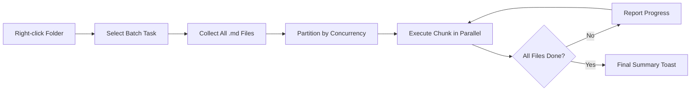

import TLDR from '@site/src/components/TLDR';

# Elaborazione batch

<TLDR>
**Notemd elabora intere cartelle in un’unica operazione, con concorrenza configurabile e controllo sulla sovrascrittura.** Fai clic con il tasto destro su una cartella per aggiungere in batch link wiki, estrarre concetti, effettuare ricerche o tradurre tutte le note al suo interno. I limiti di concorrenza prevengono gli errori legati ai limiti di velocità di API. Viene riportato il progresso per file. Il comportamento di sovrascrittura è configurabile: saltare i file esistenti, aggiungerli o sostituirli. I file che falliscono vengono registrati senza interrompere l’elaborazione batch.

Questo fa parte della [Obsidian Guida alla gestione delle conoscenze AI](/docs/pillar-ai-knowledge).
</TLDR>

## Panoramica

Il processing batch converte una cartella di note in un’unica operazione. Invece di aprire ciascuna nota e eseguire i comandi separatamente, basta fare clic con il tasto destro sulla cartella e selezionare il compito. Notemd scorre ogni file `.md`, applica l’azione scelta e riporta i progressi in tempo reale.

Questa funzionalità è essenziale per l’estrazione delle conoscenze in tutto il vault. Dopo aver importato decine di PDF, ad esempio, utilizzando prima l’operazione batch-add-links e poi batch-extract-concepts, è possibile creare il proprio grafo delle conoscenze in pochi minuti anziché in ore.

## Come funziona

### Modello di Esecuzione Batch

1. **Raccolta file** -- Notemd esamina la cartella di destinazione in modo ricorsivo (o solo a livello superiore, a seconda delle impostazioni) e raccoglie tutti i file `.md`.
2. **Partizionamento per concorrenza** -- I file vengono divisi in blocchi in base alla impostazione `batchConcurrency`. Ogni blocco viene eseguito in parallelo; i blocchi vengono invece eseguiti in sequenza.
3. **Esecuzione** -- Ogni file viene elaborato utilizzando la stessa logica del comando per un singolo file. Vengono rispettate le impostazioni del fornitore e del modello per ogni task.
4. **Rapporto di avanzamento** -- Una notifica tipo toast viene aggiornata dopo il completamento di ciascun file, mostrando l’ avanzamento di `N / Total`.
5. **Gestione degli errori** -- Se un file fallisce (errore API, timeout di rete, ecc.), l’errore viene registrato e il batch prosegue. La sintesi finale elenca tutti i file che hanno fallito.
6. **Completamento** -- Un messaggio di riepilogo indica il totale elaborato, i successi e i fallimenti.

### Comportamento di sovrascrittura

Quando si elabora un file che già contiene link wiki, note concettuali o traduzioni, il comportamento di Notemd dipende dall’impostazione di sovrascrittura:

| Modalità | Comportamento |
|------|----------|
| **Saltare** | Il contenuto esistente rimane invariato. Vengono elaborati solo i file non modificati. |
| **Append** (predefinito) | Viene aggiunto nuovo contenuto. I link wiki, i concetti o le traduzioni esistenti vengono mantenuti. |
| **Sostituisci** | Il file è stato completamente riprocessato. Tutte le modifiche precedenti di Notemd vengono sovrascritte. |

Per i collegamenti wiki in particolare: se una nota contiene già `[[wiki-links]]`, il modalità **skip** la lascia intatta, mentre **replace** invia nuovamente l’intera nota a LLM per inserire un link aggiornato. Utilizza **skip** per un elaborazione incrementale e **replace** per una riprocesso dopo un aggiornamento del modello.

### Controllo della concorrenza

La configurazione `batchConcurrency` limita le chiamate parallele API. Ciò previene errori di limitazione della velocità (HTTP 429) durante l’elaborazione di cartelle grandi con fornitori che hanno quote molto restrittive.

| Concorrenza | Consigliato per | Impatto tipico del limite di velocità |
|-------------|----------------|---------------------------|
| `1` | Livelli gratuiti, fornitori rigorosi | Nessuno (seriale) |
| `3` (predefinito) | La maggior parte dei fornitori di servizi cloud | Basso |
| `5` | Ollama (locale), livelli generosi | Nessuno / Basso |
| `10` | Modelli locali con inferenza rapida | Nessuno |

Se si verificano errori 429 durante l’elaborazione batch, riducete la concorrenza a 1 o 2.

## Configurazione

| Impostazioni | Predefinito | Effetto |
|---------|---------|--------|
| `batchConcurrency` | `3` | Numero massimo di chiamate parallele API durante le operazioni sulle cartelle |
| `batchOverwriteExisting` | `false` | Sovrascrivere il contenuto esistente di Notemd. `false` = modalità append. |
| `batchSkipProcessed` | `false` | Ssalta i file che contengono già i marcatori Notemd (ad esempio, link wiki) |
| `batchRecursive` | `true` | Includi i sottodirectory durante la scansione della cartella |
| `enableStableApiCall` | `false` | Abilita la logica di riprova (fino a 4 tentativi) per file durante il batch |

### Modelli per-task in batch

Ogni operazione di batch utilizza il modello corrispondente per task. batch-add-links utilizza `addLinksProvider`, batch-research utilizza `researchProvider`, e così via. Ciò significa che è possibile assegnare modelli economici alle operazioni ad alto volume e riservare modelli costosi ai task sensibili alla qualità.

## Esempio

Hai una cartella `papers/` che contiene 40 note di ricerca importate. Vuoi aggiungere link wiki ed estrarre i concetti da tutte di esse:

1. Fai clic con il tasto destro sul folder `papers/`
2. Seleziona **"Notemd: Processare cartella (aggiungere link)"**
3. Notemd esamina la cartella, trova 40 file `.md` e ne elabora 3 alla volta (concorrenza predefinita)
4. Un messaggio di avanzamento mostra: `12/40 files processed...`
5. Dopo circa 3 minuti, un messaggio di riepilogo riporta: `39 succeeded, 1 failed (API timeout on paper-37.md)`
6. Ripeti con **"Notemd: Process folder (extract concepts)"** per creare note sui concetti per tutti i 40

Il file che ha fallito è stato registrato. Potete eseguire di nuovo l’operazione solo su quel file in seguito.

## Consigli

- **Inizia con una bassa concorrenza** -- Se non sei sicuro dei limiti di velocità del tuo fornitore, inizia con `1` e aumentali gradualmente.
- **Utilizza il modalità di salto per aggiornamenti incrementali** -- Dopo il primo lotto completo, passa a `batchSkipProcessed: true` in modo che vengano elaborate solo le nuove note nelle esecuzioni successive.
- **Abilita le chiamate stabili API** -- `enableStableApiCall: true` aggiunge una logica di riprova che permette di recuperare da errori di rete temporanei durante l’elaborazione di batch lunghi.
- **Esegui nuovamente dopo gli aggiornamenti del modello** -- Se passi a un modello migliore, imposta `batchOverwriteExisting: true` ed esegui di nuovo per ottenere link e concetti migliorati.

---

## Prossimi passi

- [Workflows](/docs/features/workflows) -- Collega i task in batch in pulsanti sul lato sinistro con un solo clic
- [Custom Prompts](/docs/advanced/custom-prompts) -- Personalizza i prompt per l’estrazione in batch
- [Resoluzione dei problemi](/docs/advanced/troubleshooting) -- Correggi gli errori di limitazione della velocità e i fallimenti di connessione durante le esecuzioni batch
- [LLM Fornitori](/docs/providers/overview) -- Riferimento alla configurazione del modello per task
