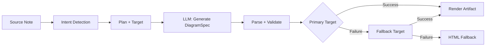
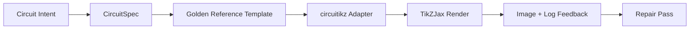

import TLDR from '@site/src/components/TLDR';

# Diagrammi

<TLDR>
**Notemd genera diagrammi dalle tue note attraverso un pipeline basato su specifiche.** Il LLM produce un formato `DiagramSpec` JSON indipendente dal renderer, dopodiché adattatori dedicati lo convertono in Mermaid, JSON Canvas, Vega-Lite, HTML o output editabile HTML/SVG. Supporta 8 tipi di intent, catene di fallback automatiche, anteprima in tempo reale con esportazione in SVG/PNG, verifica semantica e generazione arricchita da conoscenze locali.
</TLDR>

Questo fa parte della [Obsidian Guida alla gestione delle conoscenze AI](/docs/pillar-ai-knowledge).

## Architettura: Pipeline basato su specifiche

Notemd non chiede mai al LLM di produrre direttamente sintassi Mermaid/Vega/Canvas. Invece:



**Perché basarsi sulle specifiche?** I LLM producono spesso sintassi di renderer non valide (in particolare Mermaid). Un formato `DiagramSpec` strutturato può essere validato prima della rendering, e la stessa specifica può alimentare più renderer come fallback.

## Tipi di diagrammi supportati

| Intent | Renderer principale | Fallback | Caso d’uso |
|--------|-----------------|-----------|----------|
| `mindmap` | Mermaid | HTML | Scomposizione dei temi gerarchici |
| `flowchart` | Mermaid | HTML | Flussi di processo, alberi decisionali |
| `sequence` | Mermaid | HTML | Interazioni client-server, protocolli |
| `classDiagram` | Mermaid | HTML | Relazioni tra classi OOP |
| `erDiagram` | Mermaid | HTML | Schema di database, relazioni tra entità |
| `stateDiagram` | Mermaid | HTML | Macchine a stati, modelli di ciclo di vita |
| `canvasMap` | JSON Canvas | Mermaid → HTML | Mappe concettuali, grafi di conoscenza |
| `dataChart` | Vega-Lite | Mermaid → HTML | Barre, linee, aree, dispersioni, torte, tabelle |

## Rilevamento delle intenzioni

Notemd determina il tipo di diagramma più adatto dal contenuto della nota utilizzando la valutazione delle parole chiave:

| Intento | Attivatori | Confidenza |
|--------|----------|------------|
| `dataChart` | Tabelle, celle numeriche, parole chiave relative a metriche/trend, percentuali | 0.88 |
| `sequence` | Vocabolario richiesta/risposta (4+ corrispondenze) o marcatori `->`/`=>` | 0.82 |
| `erDiagram` | Chiave primaria, chiave esterna, entità, schema (2+ corrispondenze) | 0.80 |
| `stateDiagram` | Stato, transizione, in attesa, in esecuzione, fallito (3+ corrispondenze) | 0.76 |
| `flowchart` | Passaggi numerati (2+) o vocabolario if/then/else/workflow | 0.74 |
| `canvasMap` | Mappa concettuale, grafo di conoscenza, spaziale, cluster | 0.72 |
| `mindmap` | Ripiego predefinito | 0.55 |

Sovrascrivere con la impostazione **Tipo di diagramma preferito**, il selezionatore nella barra laterale o un’opzione esplicita della palette dei comandi.

## Selezione del bersaglio di rendering

Il pipeline sperimentale basato sulle specifiche ora dispone di due controlli indipendenti:

| Controllo | Impostazioni | Effetto |
|---------|---------|--------|
| Tipo di diagramma preferito | `preferredDiagramIntent` | Guida la forma semantica del `DiagramSpec` generato |
| Target di rendering preferito | `preferredDiagramRenderTarget` | Sceglie il renderer per gli artefatti nelle operazioni **Genera diagramma** e **Anteprima diagramma** |

Imposta **Target di rendering preferito** su **Auto** come valore predefinito per il pianificatore, oppure scegli esplicitamente Mermaid, JSON Canvas, Vega-Lite, HTML o Editable HTML/SVG. La sovrascrittura è valida solo per i comandi di generazione di artefatti e anteprime. Il comando standard **Riassumi come diagramma Mermaid** rimane legato a un output compatibile con Mermaid, così da evitare che i flussi di lavoro Markdown cambino silenziosamente formato.

Questa separazione è importante perché un’intenzione `flowchart` può ora essere visualizzata come Mermaid per le note Markdown, come HTML come fallback affidabile, o come Editable HTML/SVG per modifiche successive. Draw.io e Drawnix rimangono esportatori di artefatti CLI anziché target di rendering all’interno dell’plugin.

## Uso

### Genera un diagramma

1. Apri una nota
2. Esegui **"Notemd: Genera diagramma"** dal pannello dei comandi
3. Notemd rileva l’intenzione, genera le specifiche, esegue la visualizzazione e salva l’artefatto

**File di output per target:**

| Target | Estensione | Modello di nome del file |
|--------|-----------|------------------|
| Mermaid | `.md` | `{note}_summ.md` |
| JSON Canvas | `.canvas` | `{note}_diagram.canvas` |
| Vega-Lite | `.json` | `{note}_diagram.json` |
| HTML | `.html` | `{note}_diagram.html` |
| Editable HTML/SVG | `.html` | `{note}_diagram.html` |

### Visualizza una diagramma

1. Esegui **"Notemd: Visualizza diagramma"**
2. Si apre un modulo modale con il diagramma visualizzato
3. Esporta come SVG o PNG utilizzando i pulsanti della barra degli strumenti

**Apri automaticamente la visualizzazione** è disponibile nelle impostazioni — dopo la generazione, il modulo modale di anteprima si avvia automaticamente.

Il modulo modale di anteprima dispone anche di un pannello di diagnosi degli artefatti. I renderizzatori e i controlli di smoke possono aggiungere `RenderArtifact.diagnostics`; il modulo mostra un riepilogo delle diagnosi con i conteggi di errori/allarmi/informazioni, poi la gravità, il tipo di diagnosi, il messaggio e i suggerimenti per la riparazione accanto all’anteprima. Lo stesso riepilogo viene visualizzato nelle voci della cronologia delle anteprime, quindi è possibile confrontare tentativi ripetuti di smoke circuitikz senza aprire ogni voce. Per gli artefatti che hanno contenuto sorgente ma non possono essere renderizzati inline o tramite il percorso iframe HTML, il modulo ora passa a un’anteprima basata esclusivamente sulla sorgente invece di forzare un iframe vuoto. Questo consente ai controlli di smoke di compilazione/rendering circuitikz, alle verifiche dei token di testo SVG, alle verifiche dello screenshot PNG vuoto e ai futuri report di sovrapposizione di avere una superficie visibile UI senza rendere TikZJax o LaTeX una dipendenza obbligatoria in tempo di esecuzione del plugin o fingendo che il testo sorgente sia un rendering visivo verificato.

### Modalità Mermaid legacy

Quando `enableExperimentalDiagramPipeline` è disattivato, Notemd invia direttamente una richiesta Mermaid al LLM. Questo bypassa completamente il flusso di lavoro definito dalle specifiche. Se il flusso di lavoro sperimentale fallisce, si torna a questa modalità.

## Backend di rendering

### Mermaid

6 adattatori (mindmap, flusso di lavoro, sequenza, ER, classe, stato) traducono `DiagramSpec` nella sintassi Mermaid. Dopo la generazione, `mermaid.parse()` verifica l’output. In caso di fallimento della validazione:

1. **LLM retry** — un tentativo con il messaggio di errore Mermaid come contesto
2. **Fallback minimo** — un diagramma essenziale Mermaid basato sugli ID dei nodi della specifica

**Legacy Mermaid Fixer** ripara automaticamente i comuni errori di sintassi LLM: normalizzazione delle direttive note, escape delle etichette pipe, riposizionamento dei punti e virgola, citazioni intelligenti, frecce con doppio trattino, incoerenze nelle forme, e molto altro.

### JSON Canvas

Produce formato Obsidian JSON Canvas con disposizione spaziale:
- Node posizionati in base alla profondità (x = profondità × 420) e all’indice (y = indice × 170)
- Larghezza stimata in base alla lunghezza dell’etichetta
- Bordi con `fromSide: 'right'`, `toSide: 'left'`, `toEnd: 'arrow'`

### Vega-Lite

Crea specifiche complete per Vega-Lite v5 JSON con codifica automatica:
- **Grafici cartesiani** (a barre/linee/aree/punti/scatter): canali x + y + colore per più serie
- **Pie**: theta = y (quantitativo), colore = x (nominale)
- **Tabella**: riga = x, testo = y + colonna = serie

I patch per tema scuro e chiaro vengono fusi in profondità prima della compilazione.

### HTML

Fallback universale. Documento autocontenuto HTML con:
- Intestazioni meta CSP
- Modalità chiaro/scuro tramite `prefers-color-scheme`
- Etichette UI localizzate per 20 lingue
- Sezioni: hero, struttura (albero nodi), relazioni, note, tabelle di serie dati

### Editabile HTML/SVG

Target esplicito per figure nei flussi di esportazione editabili. Proietta `DiagramSpec` in un `SemanticFigureModel` deterministico, poi genera un documento autocontenuto HTML con gruppi inline SVG che contengono annotazioni in stile Draw.io:

- `data-drawio-type`, `data-drawio-id` e `data-drawio-role` sui nodi semantici
- `data-drawio-source` e `data-drawio-target` sugli spigoli semantici
- identificatori stabili di nodi/spigoli dopo normalizzazione degli spazi bianchi e gestione delle collisioni
- Nessun script, nessuna font esterna e nessun asset remoto

Questo obiettivo non è intenzionalmente la rotta predefinita del pianificatore. È disponibile come target di rendering esplicito mentre il percorso del prodotto dimostra il comportamento di modifica negli strumenti reali.

### Draw.io e Drawnix Limiti di esportazione

L’implementazione attuale mantiene il supporto degli editor di terze parti al confine dell’artefatto:

| Obiettivo | Contratto | Dipendenza in tempo di esecuzione |
|--------|----------|--------------------|
| Draw.io | `mxfile` XML decompresso in modo deterministico da `SemanticFigureModel` | nessuno nel runtime del plugin o nel CI |
| Drawnix | sottoset minimo di `.drawnix` JSON che utilizza elementi `geometry` e `arrow-line` | nessuno nel runtime del plugin o nel CI |

Il compromesso è intenzionale: Notemd può verificare etichette visibili, ID stabili e copertura delle primitive supportate senza incorporare diagram.net Desktop, Drawnix, Plait o lo stato dell’editor disponibile solo nei browser nel plugin.

### circuitikz / TikZJax Direzione

I diagrammi di circuito non rappresentano lo stesso tipo di problema dei flussogrammi generici. Il target sintattico corretto per i circuiti elettrici è solitamente **circuitikz**, visualizzato in Obsidian tramite plugin come TikZJax. TikZJax può caricare pacchetti come `circuitikz`, `pgfplots`, `tikz-cd` e `chemfig`, il che lo rende utile per appunti di fisica, circuiti, chimica e matematica.

Il rischio è che il TikZ generato direttamente da LLM sia fragile:

- una topologia di circuito complessa può essere corretta dal punto di vista elettrico ma illeggibile visivamente;
- cavi e etichette sovrapposti possono rendere inutilizzabile un netlist corretto per gli appunti di studio;
- assenza di prefazioni dei pacchetti, ancoraggi errati o nomi di componenti non validi possono impedire la visualizzazione;
- il feedback fornito dal renderer è solitamente a livello di immagine, mentre LLM genera geometria a livello di testo.

L’architettura migliore consiste nel trattare circuitikz come un target di diagramma vincolato, e non come una prompt libera:



Il modello di prima classe dovrebbe descrivere separatamente la topologia del circuito e la sua disposizione:

| Strato | Responsabilità | Esempio |
|-------|----------------|---------|
| Topologia | nodi elettrici e connessioni dei componenti | `VDD -> RD -> drain(M1)`, `source(M1) -> GND` |
| Layout | posizionamento a griglia, orientamento, corsie di routing | `M1 at (3,2.2)`, ingresso a sinistra, uscita a destra |
| Stile | confezione, convenzione di tensione, etichette, ancoraggi | `\begin{circuitikz}[american voltages]` |
| Validazione | registro di compilazione, ancoraggi mancanti, controlli di sovrapposizione/scrino | TikZJax/Diagnostica LaTeX più revisione visiva |

### Prototipo attuale circuitikz

Notemd include ora il primo prototipo di repository vincolato per questa direzione. È intenzionalmente offline e vincolato a un modello:

```bash
npm run diagram:export-circuitikz -- --input cmos-inverter.json --output cmos-inverter.tex
```

Il prototipo aggiunge un confine separato `CircuitSpec` e un esportatore deterministico per sei famiglie di riferimento d’oro:

| Tipo di circuito | Riferimento d’oro | Garanzia di corrente |
|--------------|------------------|-------------------|
| `common-source-amplifier` | `common-source-nmos-v1` | valida `VDD -> R_D -> M1.D`, `vin -> M1.G`, `M1.S -> GND` e `M1.D -> vout` prima di scrivere LaTeX |
| `cmos-inverter` | `cmos-inverter-v1` | valida la topologia PMOS-over-NMOS, l’ingresso gate condiviso, l’uscita drain condivisa, `VDD -> MP.S` e `MN.S -> GND` prima di scrivere LaTeX |
| `cmos-buffer` | `cmos-buffer-v1` | valida due stadi di inverter a cascata, il nodo intermedio `vmid`, il valore ripristinato `vout` e i binari VDD/GND condivisi prima di scrivere LaTeX |
| `cmos-transmission-gate` | `cmos-transmission-gate-v1` | valida dispositivi passivi paralleli PMOS/NMOS tra `vin` e `vout` con controlli complementari `phib` / `phi` prima di scrivere LaTeX |
| `cmos-nand2` | `cmos-nand2-v1` | valida un pull-up PMOS in serie, un pull-down NMOS in parallelo, ingressi duali `va` / `vb` e `vout` prima di scrivere LaTeX |
| `cmos-nor2` | `cmos-nor2-v1` | valida un pull-up PMOS in serie, un pull-down NMOS in parallelo, ingressi duali `va` / `vb` e `vout` prima di scrivere LaTeX |

Questo non è ancora un generatore TikZ generico. Non compila LaTeX, non chiama TikZJax, non esamina le schermate né esegue riparazioni automatiche tramite feedback visivo. Queste funzionalità rimangono fasi successive.

Il comando Diagramma di anteprima può riaprire direttamente gli artefatti di sorgente salvati circuitikz quando l’estensione del file è `.tex` o `.tikz` e la sorgente contiene `\usepackage{circuitikz}` o `\begin{circuitikz}`. Quel percorso è un’anteprima basata esclusivamente sulla sorgente circuitikz: il modulo mostra la sorgente, le diagnosi, i controlli di copia/ salvataggio e i metadati della cronologia, ma non compila LaTeX né chiama TikZJax durante l’esecuzione del plugin.

Il limite di anteprima basato esclusivamente sulla sorgente copre ora anche gli artefatti salvati Draw.io e Drawnix. I file `.drawio` vengono accettati se assomigliano a Draw.io XML (`mxfile` o `mxGraphModel`), mentre i file `.drawnix` vengono accettati se sono Drawnix JSON con `type: "drawnix"` e un array `elements`. Il plugin non incorpora ancora diagram.net né il host della lavagna bianca Drawnix; queste anteprime mostrano la sorgente, le diagnosi e la cronologia degli artefatti senza richiedere un editor visivo integrato.

Per la riparazione che preserva la topologia, passare lo spec di pre‑riparazione come riferimento prima di accettare un candidato riparato:

```bash
npm run diagram:export-circuitikz -- --input repaired-cmos-inverter.json --topology-reference cmos-inverter.json --output cmos-inverter.tex
```

La protezione di riparazione utilizza `createCircuitTopologySignature` e `assertCircuitTopologyUnchanged` per confrontare `circuitKind`, `goldenReferenceId`, reti, ID/tipi/terminali dei componenti e estremi delle connessioni non direzionali prima dell’output. Etichette, testo del titolo, suggerimenti di layout, ordine di connessione e etichette di connessione vengono intenzionalmente ignorati. Un candidato che aggiunge un elemento breve o ridisegna un terminale fallisce con `Circuit topology drift detected` prima che il file `.tex` venga scritto.

Il CLI può ora analizzare un log di compilazione esistente di LaTeX/TikZJax senza eseguire un compilatore:

```bash
npm run diagram:export-circuitikz -- --input cmos-inverter.json --output cmos-inverter.tex --compile-log cmos-inverter.log --diagnostics-output cmos-inverter.diagnostics.json
```

Questo percorso di diagnosi segnala pacchetti mancanti come `circuitikz.sty`, chiavi TikZ/circuitikz sconosciute, errori di sintassi del percorso TikZ come assenza di punti e virgola, argomenti fuori controllo da parentesi sbilanciate o etichette non chiuse, sequenze di controllo non definite, errori generici di LaTeX, arresti di emergenza e avvisi di sovraccarico del `\hbox`. Rimane basato sui log: l’esecuzione locale di LaTeX/TikZJax e i controlli di qualità simili a screenshot sono ancora lavoro futuro.

Per i controlli di funzionamento per gli amministratori, lo stesso CLI può opzionalmente eseguire un renderer configurato esplicitamente senza analizzare comandi shell:

```bash
npm run diagram:export-circuitikz -- --input cmos-inverter.json --output cmos-inverter.tex --compile-executable pdflatex --compile-arg -interaction=nonstopmode --compile-arg -halt-on-error --compile-arg -output-directory={outputDir} --compile-arg {tex} --expected-artifact {outputDir}/{jobName}.pdf
```

Il runner di compilazione utilizza `shell: false`, espande i placeholder `{tex}`, `{outputDir}` e `{jobName}` in valori di array di argomenti, legge il generato `{jobName}.log` e restituisce `compileExecution` più `compileDiagnostics` nell’output CLI JSON. `--compile-executable` indica soltanto il percorso del file binario del renderer; le flag del renderer appartengono ai valori ripetuti `--compile-arg`. Gli eseguibili vuoti falliscono come `compile-executable-invalid`, quelli mancanti falliscono come `compile-executable-not-found`, e le stringhe di eseguibile a forma di comando shell ricevono indicazioni per dividere gli argomenti in modo che Windows, Linux e macOS seguano lo stesso contratto di esecuzione diretta. Con `--expected-artifact`, viene anche segnalato `compileExecution.renderSmoke` e il CLI fallisce se il renderer non crea un artefatto non vuoto. Il plugin non include ancora LaTeX, non rende TikZJax una dipendenza in tempo di esecuzione né esegue riparazioni visive a livello di screenshot.

Se l’artefatto atteso è `.svg`, il controllo di funzionamento va un livello più in profondità:

```bash
npm run diagram:export-circuitikz -- --input cmos-inverter.json --output cmos-inverter.tex --compile-executable dvisvgm --compile-arg ... --expected-artifact {outputDir}/{jobName}.svg --expected-svg-text v_{in} --expected-svg-text v_{out}
```

Il controllo di fumo SVG verifica la radice `<svg>`, le dimensioni positive o `viewBox`, almeno un elemento grafico visibile dopo l’esclusione degli elementi nascosti/trasparenti, eventuali token di testo richiesti, elementi evidenti al di fuori del `viewBox`, etichette `<text>` / `<tspan>` posizionate sovrapposte in modo evidente e etichette di testo evidenti che sovrappongono gli elementi grafici tramite `render-svg-label-overlap`. Il testo atteso viene cercato nel testo visibile e decodificato dai metadati di accessibilità come `aria-label`, `<title>` e `<desc>`, così i renderer che conservano etichette semantiche al di fuori del `<text>` visibile possono comunque soddisfare il controllo dei token di testo senza necessità di OCR. La fase geometrica è ora una geometria consapevole delle trasformazioni per gli attributi comuni di gruppo ed elemento `transform`, quindi le caselle SVG tradotte, scalate, ruotate, inclinate o trasformate con matrici vengono controllate dopo la composizione delle trasformazioni. Copre i limiti esatti degli archi per gli estremi A/a, i limiti esatti delle curve Bézier per gli estremi C/S/Q/T, i limiti SVG consapevoli dello spessore del tratto e i controlli di sovrapposizione delle etichette, la geometria di disegno `polyline` / `polygon`, e risolve anche la posizionazione dei glifi basati solo su percorso da riferimenti `<use href="#...">`, così che le etichette convertite in percorsi di glifo riutilizzabili possano comunque fallire i controlli del canvas limitato quando la geometria del glifo posizionato escende dal `viewBox`. Diverse etichette `tspan` posizionate sotto un genitore `<text>` vengono confrontate come caselle di etichetta separate, il che permette di individuare output di tipo LaTeX SVG che altrimenti combinerebbero etichette distinte in un unico nodo di testo. Le caselle SVG `text` e `tspan` posizionate rispettano i valori `start`, `middle` e `end`, quindi le etichette centrate e allineate a destra possono generare diagnosi di sovrapposizione tra testo/testo e etichetta‑vs‑disegno senza richiedere un layout di testo di livello browser. I percorsi di glifo definitivi solo a livello di definizione all’interno di `<defs>` non vengono conteggiati come elementi grafici visibili, ma i loro attributi locali alla definizione `transform` vengono applicati prima della posizionazione `<use>`, così che le definizioni di glifo scalate o riflesse non vengano sottostimate. Il controllo etichetta‑vs‑disegno utilizza una piccola tolleranza per le caselle di disegno e il valore dichiarato `stroke-width`, quindi fili sottili, fili spessi e contorni di componenti poligonali possono essere considerati potenziali fallimenti di leggibilità delle etichette quando il loro tratto visibile raggiunge un’etichetta. Le etichette di glifo basate solo su percorso risolte da `<use href="#...">` vengono anch’esse confrontate con le caselle di disegno e falliscono con `render-svg-path-glyph-overlap` quando la geometria del glifo riutilizzabile sovrapponga fili o componenti. Se un renderer converte le etichette in glifi di percorso riutilizzabili invece che in `<text>` cercabili e non conserva i metadati di accessibilità, il rapporto di fumo registra `pathOnlyGlyphUseCount` e fallisce il token di testo richiesto tramite `render-svg-text-path-only` invece di fingere che l’etichetta sia semplicemente assente. Altri fallimenti vengono segnalati tramite `render-svg-invalid`, `render-svg-dimension-missing`, `render-svg-no-visible-elements`, `render-svg-text-missing`, `render-svg-out-of-bounds`, `render-svg-text-overlap`, `render-svg-label-overlap` o `render-svg-path-glyph-overlap`. I controlli dei token di testo e delle sovrapposizioni dovrebbero essere considerati solo come controllo strutturale per i renderer che conservano le etichette come testo SVG cercabile o metadati di accessibilità; l’output basato solo su percorso SVG richiede comunque il successivo controllo screenshot/OCR per dimostrare la leggibilità visiva delle etichette, e questo controllo di fumo non garantisce ancora una copertura completa del SVG percorso.

I gruppi e gli elementi nascosti SVG vengono sempre saltati durante il conteggio degli elementi visibili e la raccolta della geometria. Gli attributi o gli stili inline `display:none`, `visibility:hidden`, `visibility:collapse` e l’aspetto generale `opacity:0` non possono far sì che un artefatto di rendering altrimenti vuoto superi il controllo di output visibile.

Le definizioni di glifo basate solo su percorso possono essere percorsi diretti o contenitori di gruppo/simbolo all’interno di `<defs>`. Il controllo di fumo risolve la geometria dei percorsi figli da `<g id="...">` e `<symbol id="...">` prima della posizionazione `<use>`, quindi l’output di glifo incapsulato alimenta comunque `pathOnlyGlyphUseCount`, i controlli del canvas limitato e `render-svg-path-glyph-overlap`.

Il parser di percorso traccia anche gli inizi dei sottopercorsi e resetta il punto corrente su `Z/z`, così che i comandi relativi dopo un sottopercorso chiuso continuino dal punto corretto SVG invece di generare false diagnosi `render-svg-out-of-bounds`.

Lo stesso passaggio di geometria segue la grammatica SVG per i decimali con punto iniziale e i segni più espliciti, quindi le coordinate dvisvgm compatte come `.5`, `-.5` o `+.5` rimangono frazionali durante i controlli dei limiti anziché diventare geometrie fuori limite false o essere ignorate.

Se il renderer emette `.png`, lo stesso percorso previsto per gli artefatti diventa una prima schermata di smoke: Notemd decodifica file PNG a colori indexati a 1/2/4/8 bit non interlacciati, file PNG in grigio a 1/2/4/8/16 bit e file PNG in grigio‑alpha/RGB/RGBA a 8/16 bit. Le immagini a colori indexati e in grigio sub‑byte supportano campioni compressi; le immagini a colori indexati supportano anche dati PLTE e opzionali tRNS; le immagini in grigio/RGB supportano campioni trasparenti tRNS. I campioni diretti a 16 bit vengono normalizzati nello stesso spazio di confronto RGBA a 8 bit utilizzato dai controlli smoke. Il controllo smoke verifica le dimensioni positive, registra i limiti del primo piano come `foregroundBounds`, registra la densità del primo piano all’interno di quella scatola come `foregroundDensity`, fallisce con `render-png-blank` quando ogni pixel visibile corrisponde al colore di sfondo in alto a sinistra, fallisce con `render-png-content-clipped` quando il contenuto del primo piano tocca i bordi dell’immagine, fallisce con `render-png-foreground-too-small` quando una grande schermata ha meno di quattro pixel del primo piano, e fallisce con `render-png-foreground-dense` quando i pixel del primo piano sono insolitamente densi all’interno di una scatola di delimitazione non banale. I formati PNG non supportati falliscono con `render-png-unsupported` e vengono fornite indicazioni specifiche per i PNG interlacciati Adam7 o le profondità di colore indexate non supportate. Questo permette di rilevare schermate vuote, tagli evidenti del canvas, impronte del primo piano sottorendute, fallimenti di sovrapposizione a livello di pixel e impostazioni errate di esportazione PNG del renderer, senza aggiungere dipendenze da shell specifiche per piattaforma. Non si tratta ancora di riconoscimento di etichette a livello OCR, di rilevamento preciso di sovrapposizione di testo o di riparazione delle immagini che preserva la topologia.

Quando i diagnostichi mostrano un compilazione fallita o un’esecuzione render‑smoke fallita, il CLI può anche scrivere un breve di riparazione che preserva la topologia:

```bash
npm run diagram:export-circuitikz -- --input cmos-inverter.json --topology-reference cmos-inverter.json --output cmos-inverter.tex --compile-log cmos-inverter.log --repair-brief-output cmos-inverter.repair-brief.json
```

Il breve di riparazione utilizza lo schema `notemd.circuitikz.repair-brief.v1` e contiene la sorgente `CircuitSpec`, la firma topologica, i diagnostichi di compilazione/render, le modifiche consentite, le modifiche topologiche vietate, i prossimi passi di verifica e un `repairPrompt` strutturato. Il ruolo del prompt è `topology-preserving-circuitikz-repair`; la sua lista `diagnosticFocus` deriva dai diagnostichi di compilazione/render, e i suoi `acceptanceCriteria` richiedono validazione del candidato oltre a nuove compilazioni ed esecuzioni render‑smoke. È il formato di passaggio per un ciclo di riparazione successivo, non l’affermazione che Notemd esegua già una riparazione visiva autonoma.

Dopo che è stato prodotto un candidato di riparazione, lo stesso CLI può validarlo rispetto al breve prima di scrivere l’output:

```bash
npm run diagram:export-circuitikz -- --input repaired-cmos-inverter.json --repair-brief cmos-inverter.repair-brief.json --output repaired-cmos-inverter.tex
```

`--repair-brief` verifica la firma topologica del candidato tratta dal breve ed è esclusiva con `--topology-reference`. Superare questa fase dimostra solo la preservazione della topologia; il candidato richiede ancora i diagnostichi di compilazione e le verifiche render‑smoke.

Il risultato del `--repair-brief` include anche prove `repairAcceptance` con lo schema `notemd.circuitikz.repair-acceptance.v1`. Riporta le porte `topology-signature`, `compile-diagnostics` e `render-smoke` come `passed`, `failed` o `missing`; espone `remainingChecks`; e mantiene `readyForVisualAcceptance` falso fino a quando l’esecuzione del candidato non includa tutte le prove richieste.

Utilizzare `--repair-acceptance-output` con `--repair-brief` quando le prove di CI o di rilascio necessitano di un file JSON duraturo:

```bash
npm run diagram:export-circuitikz -- --input repaired-cmos-inverter.json --repair-brief cmos-inverter.repair-brief.json --output repaired-cmos-inverter.tex --repair-acceptance-output repaired-cmos-inverter.repair-acceptance.json
```

Per le prove di rilascio o di manutenzione, eseguire ogni famiglia gold supportata tramite il runner dei fixture aggregati:

```bash
npm run diagram:smoke-circuitikz -- --output-dir docs/export/circuitikz-smoke --compile-executable pdflatex --compile-arg -interaction=nonstopmode --compile-arg -halt-on-error --compile-arg -output-directory={outputDir} --compile-arg {tex} --expected-artifact {outputDir}/{jobName}.pdf
```

Il runner utilizza `docs/maintainer/fixtures/circuitikz/common-source-nmos-v1.json`, `docs/maintainer/fixtures/circuitikz/cmos-inverter-v1.json`, `docs/maintainer/fixtures/circuitikz/cmos-buffer-v1.json`, `docs/maintainer/fixtures/circuitikz/cmos-transmission-gate-v1.json`, `docs/maintainer/fixtures/circuitikz/cmos-nand2-v1.json` e `docs/maintainer/fixtures/circuitikz/cmos-nor2-v1.json`, chiama lo stesso percorso di esportazione senza shell per ciascun fixture e restituisce un rapporto aggregato JSON con `compileExecution` e `compileDiagnostics` per ogni fixture. Rimane comunque un comando per il manutentore, non una dipendenza runtime di plugin.

Quando la macchina del manutentore non ha ancora un renderer configurato, eseguire lo stesso comando del fixture senza `--compile-executable` e persistere esplicitamente la porta dell’ambiente:

```bash
npm run diagram:smoke-circuitikz -- --output-dir docs/export/circuitikz-smoke --report-output docs/export/circuitikz-smoke/renderer-availability.json
```

Quel percorso scrive comunque gli artefatti deterministici del fixture `.tex`, ma restituisce `ok: false` con `rendererAvailability.status` impostato su `missing-configuration` e un diagnostico `compile-executable-invalid`. Trattarlo solo come prova di disponibilità del renderer; non si tratta di compilazione, render‑smoke o accettazione visiva.

### Forma di prompt di riferimento dorato

Per un utilizzo a breve termine, fornire un riferimento dorato renderizzabile prima di richiedere una variante del circuito. Un prompt vincolato deve mantenere l’introduzione, la scala delle coordinate, lo stile degli ancoraggi e le convenzioni di routing:

```latex
\usepackage{circuitikz}
\begin{document}
\begin{circuitikz}[american voltages]
\draw
  (3,5) node[vcc]{$V_{DD}$}
  to [R, l=$R_D$] (3,3)
  to [short, *-o] (5,3) node[right]{$v_{out}$}
  (3,3) to [short] (3,2.2)
  node[nmos, anchor=D] (M1) {$M_1$}
  (M1.S) to [short] (3,0.5)
  node[ground]{}
  (M1.G) to [short, -o] (0.8,2.2)
  node[left]{$v_{in}$};
\draw
  (3,0.5) node[below right]{$S$};
\end{circuitikz}
\end{document}
```

Per un inverter CMOS, il prompt deve richiedere esplicitamente la topologia e i vincoli di layout, e non semplicemente "disegna un inverter CMOS":

- mantenere `VDD` in cima, `GND` in fondo, l’ingresso a sinistra e l’uscita a destra;
- utilizzare `pmos` sopra `nmos`, con porte e drenaggi condivisi;
- mantenere il nodo di uscita alla giunzione del drenaggio e contrassegnarlo con `*-o`;
- utilizzare ancoraggi nominati (`PM1.G`, `NM1.G`, `PM1.D`, `NM1.D`) invece di coordinate dedotte visivamente;
- evitare cavi diagonali o incrociati a meno che non sia strettamente necessario dal punto di vista elettrico.

### Progresso attuale e fasi successive

| Area | Stato attuale | Prossimo passo |
|------|----------------|-----------|
| Diagrammi generali | Pipeline basata sulle specifiche implementata per Mermaid, JSON Canvas, Vega-Lite, HTML | Continuare ad ampliare la copertura della verifica semantica |
| Figure editabili | Sono state implementate le barriere tra gli artefatti di `editable-html-svg`, Draw.io XML e Drawnix JSON | Aggiungere primitive più ricche solo dopo che i test avranno dimostrato l’editabilità |
| Supporto per CLI | `npm run diagram:export-artifact` esporta HTML/SVG, Draw.io e Drawnix editabili da un singolo `DiagramSpec` | Aggiungere fixture di smoke specifici per ogni target non appena vengono rilasciati nuovi target |
| circuitikz | Il prototipo di `CircuitSpec -> circuitikz` esporta template d’oro con codice sorgente comune, invertitore CMOS, `cmos-buffer` / `cmos-buffer-v1`, `cmos-transmission-gate` / `cmos-transmission-gate-v1`, `cmos-nand2` / `cmos-nand2-v1` e `cmos-nor2` / `cmos-nor2-v1`, progetti `layoutHints.inputSide` e `layoutHints.outputSide` per una disposizione deterministica delle porte di input/output senza modificare la topologia, rifiuta le deviazioni della topologia di riparazione tramite `--topology-reference`, emette briefing di riparazione che preservano la topologia tramite `--repair-brief-output` e lo schema `notemd.circuitikz.repair-brief.v1`, include contenuti strutturati di handoff con `diagnosticFocus`, `acceptanceCriteria` e il ruolo `topology-preserving-circuitikz-repair`, verifica i candidati per la riparazione tramite `--repair-brief`, restituisce prove delle porte `repairAcceptance` tramite lo schema `notemd.circuitikz.repair-acceptance.v1` insieme a `readyForVisualAcceptance` e `remainingChecks`, mantiene tali prove tramite `--repair-acceptance-output`, analizza i log di compilazione, può eseguire render locali espliciti oltre a `--expected-artifact`, SVG `--expected-svg-text`, controlli dei metadati di accessibilità tramite `aria-label`, `<title>` e `<desc>`, esclusione degli elementi SVG nascosti/trasparenti, classificazione `render-svg-text-path-only` / `pathOnlyGlyphUseCount` per etichette a percorsi soltanto, controlli di posizionamento dei glyph a percorsi soltanto per `<use href="#...">`, diagnosi di sovrapposizione dei glyph a percorsi soltanto tramite `render-svg-path-glyph-overlap`, gestione del punto corrente per percorsi chiusi per `Z/z`, limiti esatti degli archi A/a agli estremi, limiti esatti delle curve Bézier C/S/Q/T agli estremi, controlli di sovrapposizione tra bordi sensibili alla larghezza del tratto e etichette, controlli geometrici di disegno `polyline` / `polygon`, geometria delle etichette posizionate `tspan`, geometria del testo posizionato consapevole di `text-anchor`, geometria consapevole di trasformazioni per SVG bounded-canvas/text-overlap e smoke di etichetta contro disegno tramite `render-svg-label-overlap`, nonché controlli di screenshot PNG non vuoti / recisi / a primo piano denso, inclusa l’alpha della palette a colori indexati, campioni trasparenti in grigio/scuro/RGB tRNS e linee guida specifiche per il formato `render-png-unsupported` per PNG interlacciati Adam7 e errori di profondità bit indexata, tramite `foregroundBounds`, `foregroundDensity`, `render-png-content-clipped` e `render-png-foreground-dense` senza analisi della shell, include fixture di smoke aggregati per i mantentori tramite `npm run diagram:smoke-circuitikz`, registra la configurazione del renderer mancante tramite `rendererAvailability.status: "missing-configuration"` e `compile-executable-invalid`, e dispone di diagnosi di anteprima generiche, conteggi di riepilogo delle diagnosi, voci di storia consapevoli delle diagnosi e fallback basato solo sul codice sorgente tramite `RenderArtifact.diagnostics` e il modal di anteprima | Aggiungere riconoscimento delle etichette a livello OCR per testo visivo a percorsi soltanto, controlli di sovrapposizione precisi a livello di pixel, una copertura più ampia dei percorsi SVG dove necessario, installazione/discovery automatica del renderer solo se può rimanere opzionale, e esecuzione automatizzata di riparazioni che preservano la topologia |
| Integrazione con TikZJax | Scegliere il host di rendering per la visualizzazione sul lato Obsidian | Rimandarlo opzionale; non rendere TikZJax una dipendenza obbligatoria al runtime del plugin |

## Configurazione

| Impostazioni | Predefinito | Effetto |
|---------|---------|--------|
| `enableExperimentalDiagramPipeline` | `false` | Passare tra modalità basata sulle specifiche e modalità legacy Mermaid |
| `experimentalDiagramCompatibilityMode` | `'legacy-mermaid'` | `'legacy-mermaid'` = Mermaid solo; `'best-fit'` = target nativi + soluzioni di fallback |
| `preferredDiagramIntent` | `undefined` (automatico) | Sovrascrivere la rilevazione automatica delle intenzioni |
| `summarizeToMermaidLanguage` | `'en'` | Lingua di destinazione per le etichette del diagramma |
| `summarizeToMermaidProvider` / `Model` | DeepSeek | LLM per task specifici per la generazione del diagramma |
| `autoMermaidFixAfterGenerate` | (da costanti) | Eseguire automaticamente il correttore legacy sugli output di Mermaid |
| `enableLocalKnowledgeForDiagramGeneration` | `false` | Arricchire il codice sorgente con conoscenze locali del vault |

### Arricchimento delle conoscenze locali

Quando abilitato, Notemd recupera frammenti di contesto rilevanti dalla base di conoscenza locale del tuo vault (basata su MiniSearch) e li aggiunge all’inizio del markdown di origine. La nota di integrazione indica: "solo riferimento di supporto; mantenere la struttura principale fedele alla nota di origine."

### Modalità di compatibilità

- **`legacy-mermaid`**: Tutte le intenzioni vengono indirizzate a Mermaid. Le intenzioni non Mermaid (canvasMap, dataChart) vengono costrette a `flowchart` o `mindmap`. Nessuna catena di fallback.
- **`best-fit`**: Ogni intenzione viene indirizzata al suo target nativo. Se il primo fallisce, si percorre la catena di fallback (ad esempio, Vega-Lite → Mermaid → HTML).

## Anteprima ed esportazione

| Azione | Metodo |
|--------|--------|
| Esportazione SVG | Costruttore `mermaid.render()` / `vega.View.toSVG()` / SVG per Canvas |
| Esportazione PNG | SVG → Immagine → Canvas (rapporto pixel del dispositivo 1x-3x) → ArrayBuffer PNG |
| Salvataggio della fonte | Contenuto dell'artefatto grezzo salvato con estensione specifica per il target |
| Anteprima solo della sorgente | Artefatti non inline con il contenuto della sorgente visualizzato come codice più diagnosi, senza rendering tramite iframe |
| Audit semantico | Mermaid, JSON Canvas, Vega-Lite e HTML/SVG modificabili controllati da `scripts/diagram-semantic-verification.js` |

**Caching**: RenderCache utilizza una chiave deterministica JSON di `{spec, target, theme}`. La deduplicazione in tempo reale impedisce rendering duplicati.

## Consigli

- **Inizia con il modo `best-fit`** — produce il miglior output visivo per ogni tipo di intent
- **Utilizza modelli potenti per diagrammi complessi** — i diagrammi a flusso e i diagrammi ER traggono vantaggio da GPT-4o o Claude
- **Abilita la conoscenza locale** per diagrammi specifici del dominio — il contesto del vault rilevante migliora l'accuratezza
- **Imposta `autoMermaidFixAfterGenerate`** — gli errori di sintassi Mermaid sono comuni senza di esso
- **Il correttore legacy è completo** — se l'anteprima Mermaid fallisce, eseguire manualmente il comando del correttore spesso risolve il problema

---

## Prossimi passi

- 🔗 [Wiki-Links](./wiki-links) — Come i concetti vengono collegati inline
- 📝 [Note di concetto](./concept-notes) — Estrarre concetti per il materiale di partenza dei diagrammi
- 🔍 [Ricerca](./research) — Arricchire i diagrammi con dati provenienti da Internet
