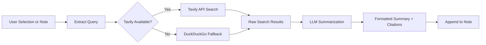

import TLDR from '@site/src/components/TLDR';

# Ricerca e ricerca su web

<TLDR>
**Notemd cerca su web e inserisce direttamente nelle note i risultati LLM riassunti.** Tavily API è il backend di ricerca principale; DuckDuckGo funge da soluzione di fallback senza configurazione. I risultati vengono riassunti con citazioni delle fonti e aggiunti sotto un’intestazione `## Research`. Supporta la ricerca in una singola nota, la ricerca su più note di una cartella e la selezione del modello per la fase di riassunto per ogni task.

Questo fa parte della [Obsidian Guida alla gestione delle conoscenze AI](/docs/pillar-ai-knowledge).
</TLDR>

## Panoramica

La ricerca è una delle integrazioni più potenti di Notemd: chiude il ciclo tra lettura, ricerca e scrittura. Invece di passare a un browser per cercare un termine sconosciuto, basta evidenziarlo e lasciare che Notemd effettui la ricerca, riassuma e aggiunga i risultati -- tutto all’interno del proprio vault.

Il processo è completamente configurabile. Si può scegliere il provider di ricerca, il LLM che scrive il riassunto e se i risultati vengano aggiunti alla nota attiva o salvati in file separati. Il modalità batch permette di cercare in tutte le note di una cartella con un solo clic.

## Come funziona

### Pipeline Ricerca‑poi‑Riassunto



1. **Estrazione della query** -- Notemd estrae i termini di ricerca dalla selezione o dal titolo della nota.
2. **Ricerca su web** -- Viene prima provato Tavily. Se non è configurata alcuna chiave API, viene utilizzato automaticamente DuckDuckGo (non è necessaria alcuna chiave).
3. **Riassunto con LLM** -- I risultati grezzi della ricerca vengono inviati al LLM configurato, che produce un riassunto conciso con citazioni delle fonti inline.
4. **Aggiunta** -- Il riassunto formattato viene aggiunto sotto un’intestazione `## Research` nella nota attiva.

### Tavily contro DuckDuckGo

| Aspetto | Tavily | DuckDuckGo |
|--------|--------|------------|
| Chiave API | Richiesto (fase gratuita disponibile) | Non richiesto |
| Qualità del risultato | Superiore (progettato appositamente per l'AI) | Adeguato per query generali |
| Limiti di velocità | Fase gratuita generosa | Soggetto a throttling |
| Configurazione | `tavilyApiKey` nelle impostazioni | Nessuna configurazione -- fallback automatico |

### Ricerca nella cartella di batch

Fare clic con il tasto destro su una cartella e selezionare **"Notemd: Cartella di ricerca"**. Ogni file `.md` presente nella cartella viene elaborato in sequenza (o in parallelo fino alla concorrenza configurata). Ogni nota riceve il proprio riassunto della ricerca.

## Configurazione

| Impostazioni | Predefinito | Effetto |
|---------|---------|--------|
| `tavilyApiKey` | `''` | Chiave Tavily API. Quando è vuota, viene utilizzato esclusivamente DuckDuckGo. |
| `researchProvider` / `researchModel` | DeepSeek | LLM per task per riassumere i risultati della ricerca |
| `maxResearchContentTokens` | `4000` | Budget di token per il contenuto inviato al LLM. L’eccesso viene troncato. |
| `researchAppendToNote` | `true` | Aggiungere il riassunto alla nota di origine. Se impostato su false, viene creato un file separato. |
| `researchLanguage` | `'en'` | Lingua di output per la ricerca riassunta |

### Raccomandazione del modello per task

La ricerca trae vantaggio da un modello in grado di gestire contenuti multilingue e di produrre prosa ben strutturata. Si considerino i seguenti modelli:

- **DeepSeek** -- predefinito, economico, buona qualità
- **GPT-4o** -- riassunto di qualità superiore, costo più elevato
- **Gemini Flash** -- veloce ed economico, adatto per query semplici

## Esempio

Stai leggendo un articolo sui *transformer attention mechanisms* e incontri un termine sconosciuto: *relative positional encoding*. Invece di lasciare Obsidian:

1. Evidenzia **"relative positional encoding"**
2. Clic con il tasto destro --> **"Notemd: Ricerca e riassunto"**
3. Notemd cerca su Internet, riassume i risultati principali e aggiunge:

```markdown
## Research

### Relative Positional Encoding

Relative positional encoding is a method used in transformer models
where positional information is expressed as relative distances between
tokens rather than absolute positions. Introduced by Shaw et al. (2018),
it improves generalization to unseen sequence lengths compared to
absolute encodings (Vaswani et al., 2017).

Sources:
- [Shaw et al., Self-Attention with Relative Position Representations (2018)](https://arxiv.org/abs/1803.02155)
- [Transformer Positional Encoding Overview](https://example.com/transformer-pos-enc)
```

Il riassunto fa ora parte del tuo archivio, è cercabile, linkabile e accessibile offline.

## Consigli

- **Imposta una chiave Tavily per ottenere i migliori risultati** -- anche il piano gratuito fornisce una rilevanza migliore rispetto a DuckDuckGo grezzo.
- **Utilizza un modello di riassunto efficace** -- i modelli economici possono semplificare troppo contenuti tecnici sofisticati.
- **Effettua una ricerca in batch** dopo una prima lettura per colmare le lacune in molte note contemporaneamente.
- **Rivedi i riassunti aggiunti** -- LLM può inventare dettagli sulle fonti. Verifica le affermazioni principali.

---

## Prossimi passi

- [Concept Notes](./concept-notes) -- Estrai e conserva i termini chiave dai risultati della ricerca
- [Wiki-Links](./wiki-links) -- Collega i concetti derivati dalla ricerca all’interno del tuo archivio
- [Translation](./translation) -- Traduci i riassunti della ricerca in un’altra lingua
- [Fornitori](/docs/providers/overview) -- Configurare il modello utilizzato per la sintesi
