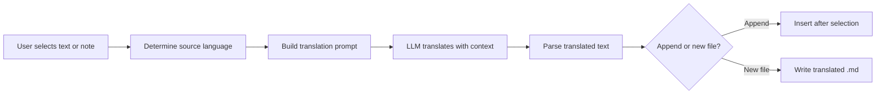

import TLDR from '@site/src/components/TLDR';

# Traduzione

<TLDR>
**Notemd traduce testi tra più di 21 lingue grazie alla traduzione alimentata da LLM.** Supporta la traduzione di singole selezioni, di intere note e di cartelle in batch. Ogni task di traduzione può utilizzare un provider e un modello dedicati tramite le impostazioni per task. La lingua di output può essere configurata separatamente rispetto alla lingua UI. I risultati vengono aggiunti o scritti in un nuovo file a seconda delle tue preferenze.

Questo fa parte della [Obsidian Guida alla gestione delle conoscenze AI](/docs/pillar-ai-knowledge).
</TLDR>

## Panoramica

La traduzione in Notemd non è una ricerca in dizionario -- è una traduzione consapevole del contesto, alimentata da LLM. Il modello analizza l’intero paragrafo o nota, preservando tono, terminologia di settore e struttura delle frasi. Ciò produce risultati di qualità superiore rispetto ai servizi basati su traduzione frase per frase, soprattutto per testi tecnici, accademici e creativi.

La funzionalità supporta tre ambiti: selezione, nota attiva e intera cartella. In combinazione con la selezione del modello per task, è possibile utilizzare un modello veloce (Gemini Flash) per traduzioni casuali e un modello potente (Claude Sonnet) per contenuti sensibili alle sfumature -- senza modificare il provider globale.

## Come funziona

### Il Comando Traduci



1. **Rilevamento della lingua di partenza** -- LLM deduce la lingua di partenza dal contenuto. Non è necessario specificarla manualmente.
2. **Costruzione del prompt** -- Notemd crea un prompt che include la lingua di destinazione, un suggerimento opzionale di settore e il contenuto da tradurre.
3. **Traduzione LLM** -- Il `translateProvider` / `translateModel` configurato elabora la richiesta. Il modello preserva la formattazione markdown, i link wiki e i blocchi di codice.
4. **Output** -- Il testo tradotto viene aggiunto sotto il testo originale o scritto in un nuovo file all’interno del vault.

### Coppie di lingue

Notemd supporta qualsiasi coppia di lingue supportata dal LLM sottostante. Le coppie più comuni includono:

| Fonte | Target | Qualità tipica |
|--------|--------|----------------|
| Inglese | Cinese semplificato | Eccellente |
| Cinese | Inglese | Eccellente |
| Inglese | Giapponese | Molto buono |
| Inglese | Tedesco / Francese / Spagnolo | Molto buono |
| Qualsiasi supportato | Qualsiasi supportato | Dipende dal modello |

La configurazione `translateLanguage` controlla il **linguaggio di output**. Il linguaggio di partenza viene rilevato automaticamente.

### Selezione del modello per attività

La qualità della traduzione varia notevolmente a seconda del modello. Notemd consente di assegnare un modello dedicato esclusivamente alla traduzione:

| Modello | Velocità | Qualità | Costo | Ideale per |
|-------|-------|--------|------|----------|
| `gemini-2.0-flash-exp` | Veloce | Bene | Basso | Casuale, alto volume |
| `gpt-4o-mini` | Veloce | Bene | Basso | Ricerche rapide |
| `deepseek-chat` | Medio | Bene | Molto basso | Multilingue a budget |
| `claude-3-5-sonnet` | Medio | Eccellente | Medio | Tecnico / accademico |
| `gpt-4o` | Medio | Eccellente | Medio | Prosa sensibile alle sfumature |

### Traduzione della cartella in lotti

Fare clic con il tasto destro su una cartella e selezionare **"Notemd: Traduci cartella"** per tradurre ogni nota presente in quella cartella. Ogni file viene elaborato in modo indipendente. La impostazione di concorrenza controlla quanti file vengono tradotti in parallelo.

## Configurazione

| Impostazioni | Predefinito | Effetto |
|---------|---------|--------|
| `translateProvider` / `translateModel` | DeepSeek | Fornitore dedicato per attività di traduzione |
| `translateLanguage` | `'en'` | Lingua di output target |
| `translationAppendToNote` | `true` | Aggiungere il testo tradotto sotto il testo originale. Se impostato su false, viene creato un nuovo file. |
| `batchConcurrency` | `3` | Numero di file elaborati in parallelo durante la traduzione in lotti |

## Esempio

Stai leggendo una nota di ricerca cinese e desideri una versione in inglese:

1. Apri la nota
2. Clic destro --> **"Notemd: Traduci il file attuale"**
3. Notemd rileva il cinese, lo traduce nella lingua di destinazione configurata (inglese) e aggiunge:

```markdown
## Translation (English)

The experimental results show that the proposed method achieves
a 12% improvement in F1 score compared to the baseline, primarily
due to the enhanced feature extraction module described in Section 3.
```

Il testo originale in cinese rimane invariato sopra la traduzione. L’intestazione `## Translation` mantiene entrambe le versioni nello stesso file per una facile consultazione.

## Consigli

- **Utilizza Gemini Flash per grandi quantità** -- è l’opzione più veloce e economica per la traduzione batch di cartelle grandi.
- **Mantieni i link wiki** -- l’istruzione di Notemd indica a LLM di lasciare `[[wiki-links]]` intatto nella traduzione. Verifica dopo la traduzione, poiché alcuni modelli a volte li smontano.
- **Imposta esplicitamente la lingua di output** -- il rilevamento automatico funziona per la sorgente, ma configura sempre `translateLanguage` per evitare ambiguità sulla lingua di destinazione.
- **Traduci in batch le note di concetto** -- se la tua cartella di concetti è in una lingua e ne hai bisogno in un’altra, la traduzione a livello di cartella la gestisce in un’unica operazione.

---

## Prossimi passi

- [Ricerca](./research) -- Cerca e riassumi in qualsiasi lingua, poi traduci i risultati
- [Flussi di lavoro](./workflows) -- Collega le traduzioni con link wiki o estrai concetti
- [Elaborazione batch](/docs/advanced/batch-processing) -- Comportamenti di concorrenza e sovrascrittura per le operazioni su cartelle
- [LLM Fornitori](/docs/providers/overview) -- Scegli il miglior modello per la tua coppia di lingue
