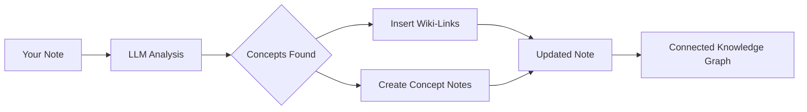

import TLDR from '@site/src/components/TLDR';

# Wiki-Link

<TLDR>
**Notemd aggiunge automaticamente `[[wiki-links]]` ai concetti chiave nelle tue note.** Il LLM legge il tuo contenuto, identifica i termini importanti nel contesto e inserisce link wiki in stile Obsidian ad ogni occorrenza. Opzionalmente crea file di note sui concetti con backlink. Supporta la soppressione dei sinonimi, l’integrità dei link in caso di rinomina o eliminazione e il modalità di estrazione pura (senza modifiche ai file). A differenza di Auto Link che riconosce solo i titoli delle note esistenti, Notemd utilizza l’AI per identificare nuovi concetti e creare le note corrispondenti. Questo fa parte della [Obsidian Guida all’Gestione della Conoscenza tramite AI](/docs/pillar-ai-knowledge).
</TLDR>

## Panoramica

La creazione di link wiki è la funzionalità principale di Notemd. Essa trasforma il testo semplice in una rete di conoscenza collegata attraverso:

1. **Analizzare la tua nota** con un LLM
2. **Identificare i concetti chiave** (termini, persone, metodi, teorie)
3. **Inserire `[[wiki-links]]`** ad ogni occorrenza
4. **Creare note sui concetti** (opzionale) con backlink

## Come funziona

### Processo



### Esempio

**Prima:**
```markdown
Machine learning models use neural networks to learn patterns from data.
The transformer architecture revolutionized natural language processing.
```

**Dopo:**
```markdown
[[Machine learning]] models use [[neural networks]] to learn patterns from data.
The [[transformer architecture]] revolutionized [[natural language processing]].
```

## Uso

### Base: Aggiungere link alla nota attuale

1. Apri una nota
2. Fare clic con il tasto destro nell'editor → **"Elabora file (aggiungi link)"**
3. Aspettare alcuni secondi
4. I concetti sono ora collegati!

### Lote: Elaborare più note

1. Fare clic con il tasto destro su una cartella nell'esplorafile
2. Seleziona **"Notemd: Processare cartella (aggiungere link)"**
3. Configurazione:
   - Concorrenza (quanti file in parallelo)
   - Sovrascrivere i link esistenti (sì/no)
4. Cliccare su **Elabora**

### Selettivo: Collegare testo specifico

1. Evidenziare il testo da elaborare
2. Clic destro → **"Processo di selezione (aggiungi collegamenti)"**
3. Viene analizzata solo la parte evidenziata

## Notemd contro Auto Link

Obsidian dispone di due metodi per il collegamento automatico al wiki:

| | **Auto Link** | **Notemd** |
|--|---------------|-------------|
| Fonte del collegamento | Titoli delle note esistenti nel vault | Concetti identificati da LLM nel contenuto |
| È possibile collegare nuovi concetti | No — il titolo deve già esistere | Sì — l’AI identifica i concetti e crea le note |
| Gestione dei sinonimi | No | Sì — soppressione dei sinonimi |
| Creazione della nota concettuale | No | Sì — con backlink e deduplica |
| Elaborazione batch | No (unico file) | Sì (a livello di cartella) |
| Inoltro del modello per task | No | Sì |

**Auto Link** effettua una corrispondenza basata sul titolo: se esiste una nota chiamata "Machine Learning", avvolge le occorrenze in `[[Machine Learning]]`. Se la nota non esiste, non accade nulla.

**Notemd** è guidato dall’AI: il LLM legge il tuo contenuto, comprende il contesto, identifica i concetti che *dovrebbero* essere collegati — anche se ancora non esiste una nota — e crea sia il link che la nota concettuale.

## Funzionalità

### Soppressione dei sinonimi

**Problema:** "transformer", "transformers", "Transformer architecture" → 3 concetti separati

**Soluzione:** Notemd rileva i casi quasi duplicati e utilizza la forma canonica.

**Configurazione:**
```
Settings → Advanced → Synonym Suppression
Threshold: 0.8 (0 = off, 1 = aggressive)
```

### Integrità dei link

**Quando si rinomina una nota concettuale:**
- Tutti i link wiki vengono aggiornati automaticamente (Obsidian funzionalità principale)
- I backlink rimangono intatti

**Quando si elimina una nota concettuale:**
- I link rimangono ma appaiono come "menzioni non collegate"
- È possibile ricrearla da qualsiasi occorrenza

### Modalità di estrazione pura

**Estrai concetti senza modificare il originale:**

1. Clic destro → **"Estrai concetti (nessun collegamento)"**
2. Vengono create le note concettuali
3. File originale invariato

Caso d'uso: elaborazione di contenuti solo lettura o bozze finali.

## Generazione della nota concettuale

### Creazione automatica

**Quando abilitato (predefinito), Notemd crea:**

```markdown
---
tags: [concept, auto-generated]
created: 2026-06-13
source: [[Original Note Name]]
---

# Machine Learning

A branch of artificial intelligence that enables computers
to learn from data without explicit programming.

## Occurrences in Your Vault

- [[Original Note Name#Section]]
- [[Another Note#Header]]

## Related Concepts

- [[Neural Networks]]
- [[Deep Learning]]
- [[Supervised Learning]]
```

### Configurazione

**Cartella di output:**
```
Settings → Output → Concept Folder
Default: concepts/
```

**Struttura gerarchica:**
```
Settings → Output → Use Hierarchical Folders
If enabled:
  papers/my-paper.md → papers/concepts/Concept.md
If disabled:
  → concepts/Concept.md
```

**Modello:**
```
Settings → Output → Concept Template
Customize with variables:
  {{concept}} — Concept name
  {{description}} — LLM-generated description
  {{backlinks}} — List of source notes
  {{date}} — Creation date
```

## Opzioni avanzate

### Finestra di contesto

**Quanta testo circostante inviare:**

```
Settings → Linking → Context Window
Options: Sentence | Paragraph | Full Note
Default: Paragraph
```

Più grande = maggiore accuratezza, costo più elevato.

### Occorrenze Minime

**Collega solo i concetti che compaiono più volte:**

```
Settings → Linking → Min Occurrences
Default: 1 (link all)
```

Impostalo su 2 o 3 per concentrarsi sui temi ricorrenti.

### Escludere Pattern

**Omettere certe parole:**

```
Settings → Linking → Exclude List
Example: note, idea, example, thing
```

Impedisce il collegamento eccessivo di termini generici.

### Prompt personalizzati

**Sovrascrivere le istruzioni predefinite LLM:**

```
Settings → Advanced → Custom Linking Prompt
Default:
  "Identify key concepts, theories, methods, and technical
   terms in the following text. Return as a list..."
```

Modificalo per esigenze specifiche del dominio (ad esempio, "Concentrarsi sulla terminologia medica").

## Consigli e Best Practice

### ✅ DA FARE

- **Eseguire il trattamento delle note con >100 parole** — Le note brevi producono pochi concetti
- **Utilizzare modelli potenti** per un migliore riconoscimento dei concetti (GPT-4o, Claude)
- **Revisione prima dell'accettazione** — Verifica che i link suggeriti siano coerenti
- **Costruisci in modo iterativo** — Elabora da 5 a 10 note, esamina il grafo, regola le impostazioni

### ❌ NON FARLO

- **Eccesso di link** — Non ogni sostantivo richiede un link
- **Elabora i bozze più volte** — I concetti possono cambiare, attendi fino a quando non saranno stabili
- **Ignora i sinonimi** — Abilita la soppressione per evitare "ML" e "Machine Learning"

## Performance

### Velocità

| Dimensione della nota | GPT-4o-mini | Claude Sonnet | Ollama (locale) |
|-----------|-------------|---------------|----------------|
| 500 parole | 2-3 secondi | 3-5 secondi | 5-10 secondi |
| 2000 parole | 5-8 secondi | 10-15 secondi | 20-40 secondi |
| 5000+ parole | Chunked (più chiamate) | Chunked | Chunked |

### Stima dei costi

**Esempio: nota di 1000 parole con GPT-4o-mini**
- Input: ~1500 tokeni
- Output: ~200 tokeni
- Costo: ~

**Elaborazione batch di 100 note:** ~

## Risoluzione dei problemi

### Nessun link aggiunto

**Verifica:**
1. LLM La chiamata è riuscita (Impostazioni → Diagnostica)
2. La nota contiene abbastanza contenuto (oltre 50 parole).
3. I concetti sono tecnici/specifici (non solo pronomi)

**Prova:**
- Utilizza un modello più potente
- Aumentare la finestra di contesto
- Verificare la validità della chiave API

### Troppi link

**Soluzioni:**
1. Aumentare il numero minimo di occorrenze (2 o 3)
2. Aggiungere parole comuni alla lista da escludere
3. Utilizzare un modello meno aggressivo

### Concetti errati collegati

**Correzioni:**
1. Utilizzare un prompt personalizzato per la specificità del dominio
2. Abilitare la soppressione dei sinonimi
3. Revisionare manualmente e disconnettere

### I link si rompono dopo il rinominamento

**Questo è un comportamento normale Obsidian.**

Per aggiornare tutti i link:
1. Rinomina la nota concettuale
2. Obsidian aggiorna automaticamente `[[old]]` → `[[new]]`

---

## Prossimi passi

- 📖 [Note Concettuali](./concept-notes) — Approfondimento sulla generazione delle note concettuali
- 🔍 [Integrazione della Ricerca](./research) — Combinare i link con la ricerca web
- 🎨 [Diagrammi](./diagrams) — Visualizzare il tuo grafo di conoscenza
