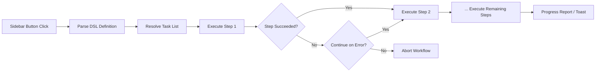

import TLDR from '@site/src/components/TLDR';

# Flussi di lavoro

<TLDR>
**Notemd i flussi di lavoro collegano più attività in un’unica azione con un clic.** Definisci sequenze come `add-links > extract-concepts > research > diagram` utilizzando un semplice DSL. I flussi di lavoro appaiono come pulsanti nel pannello laterale che eseguono l’intera catena sulla nota o cartella corrente. Vengono forniti con flussi di lavoro predefiniti; è possibile crearne di personalizzati nelle impostazioni. Ogni passaggio utilizza la propria configurazione di modello specifica per attività.

Questo fa parte della [Obsidian Guida alla gestione delle conoscenze AI](/docs/pillar-ai-knowledge).
</TLDR>

## Panoramica

Un flusso di lavoro elimina la fatica di eseguire le attività una alla volta. Invece di fare clic con il tasto destro quattro volte per aggiungere collegamenti, estrarre concetti, cercare termini sconosciuti e generare un diagramma, basta premere un pulsante nel pannello laterale e l’intera catena viene eseguita. Notemd si occupa della sequenziazione, della propagazione degli errori e della segnalazione dello stato di avanzamento.

I flussi di lavoro vengono definiti in un DSL leggero (linguaggio specifico del dominio). Si trovano nelle impostazioni, appaiono come pulsanti cliccabili nel pannello laterale di Obsidian e possono essere applicati sia alla nota corrente che a un’intera cartella.

## Come funziona

### Pipeline di esecuzione dei flussi di lavoro



1. **Analisi** -- La stringa DSL viene suddivisa in `>` (o `>`) per ottenere un elenco ordinato degli identificatori delle attività.
2. **Risoluzione** -- Ogni identificatore corrisponde a un comando interno (add-links, extract-concepts, research, translate, diagram, ecc.).
3. **Esecuzione** -- I passaggi vengono eseguiti in sequenza. Ogni passaggio utilizza il fornitore e il modello configurati specifici per attività.
4. **Gestione degli errori** -- Se un passaggio fallisce, il flusso di lavoro può interrompersi o continuare al passaggio successivo, a seconda della politica di gestione degli errori impostata.
5. **Fine** -- Una notifica toast segnala il successo o elenca i passaggi falliti.

### Formato DSL

I flussi di lavoro sono definiti come una sequenza separata da `>` di identificatori di task:

```
process-current-add-links>extract-concepts-current>research-and-summarize
```

**Identificatori di task disponibili:**

| Identificatore | Azione |
|------------|--------|
| `process-current-add-links` | Aggiungere link wiki alla nota attiva |
| `extract-concepts-current` | Estrai concetti dalla nota attiva |
| `research-and-summarize` | Ricerchare il testo selezionato o il titolo della nota |
| `process-current-translate` | Traduci la nota attiva |
| `summarize-to-mermaid` | Genera un diagramma dalla nota attiva |
| `generate-from-title` | Genera contenuto dal titolo della nota |
| `extract-original-text` | Estrai il testo originale (per OCR / contenuti scansionati) |

**Varianti a livello di cartella** sostituiscono `current` con `folder` nel nome dell’identificatore.

### Flussi di lavoro predefiniti vs. personalizzati

Notemd include flussi di lavoro pronti per schemi comuni:

| Flusso di lavoro | Catena | Caso d’uso |
|----------|-------|----------|
| **Estrazione con un clic** | aggiungi-link > estrai-concetti > ricerca | Elabora un articolo di ricerca in un’unica passata |
| **Pipeline completo** | aggiungi-link > estrai-concetti > ricerca > diagramma | Estrai completamente le conoscenze con visualizzazione |
| **Traduci + Collega** | traduci > aggiungi-link | Traduci poi collega i concetti nella lingua di destinazione |

Vengono creati **flussi di lavoro personalizzati** nelle impostazioni:

1. Apri **Impostazioni** --> **Notemd** --> **Flussi di lavoro
2. Clicca su **"Aggiungi flusso di lavoro"**
3. Inserisci la catena DSL (ad esempio, `process-current-add-links>extract-concepts-current`)
4. Assegna un nome visivo (ad esempio, "Collegamento rapido + Estrazione")
5. Il nuovo pulsante appare immediatamente nella barra laterale

## Configurazione

| Impostazioni | Predefinito | Effetto |
|---------|---------|--------|
| `workflows` | Set predefinito | Array di definizioni di flusso di lavoro (nome + DSL) |
| `workflowContinueOnError` | `true` | Procedi al passo successivo se il passo attuale fallisce |
| `workflowShowProgress` | `true` | Mostra una notifica di avanzamento dopo il completamento di ogni passo |

### Modelli per task nei flussi di lavoro

Ogni passo in un flusso di lavoro utilizza la propria configurazione di modello per task. Non è necessario specificare modelli direttamente nel DSL stesso. L’ordine di risoluzione è:

1. Il provider/modello per task se `useMultiModelSettings` è disponibile
2. Il `activeProvider` globale in caso contrario

Ciò significa che `add-links` può essere eseguito su DeepSeek mentre `research` viene eseguito su GPT-4o -- tutto all’interno dello stesso flusso di lavoro.

## Esempio

Hai appena importato un PDF di un articolo di machine learning nel tuo vault e desideri un’estrazione completa delle conoscenze:

1. Apri la nota importata
2. Clicca sul pulsante della barra laterale **"Full Pipeline"**
3. Notemd esegue:
   - **Passo 1**: Aggiungi link wiki -- `[[attention mechanism]]`, `[[transformer]]`, ecc.
   - **Passo 2**: Estrai i concetti -- crea note di concetto nella tua cartella dei concetti
   - **Passo 3**: Ricerca -- riassume le fonti web per i termini chiave
   - **Passo 4**: Diagramma -- genera una mappa mentale Mermaid della struttura dell’articolo
4. Dopo circa 30 secondi, la tua nota contiene link, esistono note di concetto, viene aggiunta la ricerca e viene salvato un file di diagramma

Tutto questo con un solo clic.

## Consigli

- **Inizia con flussi di lavoro predefiniti** -- coprono i pattern più comuni. Personalizzali solo quando è necessario un ordine diverso.
- **Abilita `workflowContinueOnError`** -- un passaggio del diagramma fallito non deve interrompere l’intero pipeline.
- **Utilizza flussi di lavoro per cartelle** per il trattamento in batch -- fai clic con il tasto destro su una cartella, seleziona un flusso di lavoro e ogni nota verrà elaborata.
- **Dà un nome chiaro ai flussi di lavoro** -- lo spazio nella barra laterale è limitato. Usa nomi brevi e orientati all’azione come "Estrai rapidamente" o "Traduci + Collega".

---

## Prossimi passi

- [Ricerca](./research) -- Capisci cosa fa il passaggio di ricerca prima di aggiungerlo ai flussi di lavoro
- [Collegamenti Wiki](./wiki-links) -- Funzionalità di collegamento fondamentale utilizzata nella maggior parte dei flussi di lavoro
- [Note di concetto](./concept-notes) -- Estrazione dei concetti come passaggio di un flusso di lavoro
- [Elaborazione batch](/docs/advanced/batch-processing) -- Concorrenza e report sullo stato per i flussi di lavoro per cartelle
