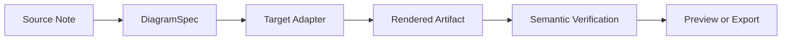
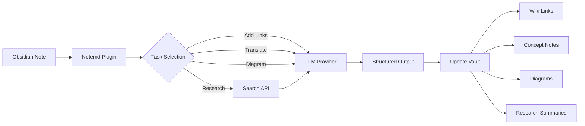

import TLDR from '@site/src/components/TLDR';

# Introduzione a Notemd

<TLDR>
**Notemd** (Note + EMD — Documenti Markdown migliorati) è un plugin open source per Obsidian che trasforma la lettura supportata da LLM in conoscenza persistente. A differenza dell’AI basato su chat, dove le informazioni scompaiono dopo la sessione, Notemd scrive i risultati **direttamente nel tuo vault** sotto forma di link wiki, note concettuali, riassunti di ricerca, traduzioni, flussi di lavoro e diagrammi. È progettato per ricercatori, studenti e professionisti della conoscenza che desiderano che la lettura, la ricerca e le spiegazioni visive si accumulino in un grafo di conoscenza strutturato ed evolutivo.
</TLDR>

## Cos’è Notemd?

Notemd integra **oltre 30 modelli linguistici di grandi dimensioni** (OpenAI, Anthropic, Google, DeepSeek, Qwen, Ollama e molti altri) nel tuo flusso di lavoro Obsidian per automatizzare l’estrazione della conoscenza, la sua organizzazione, la traduzione, la ricerca e la generazione di diagrammi.

### Differenza chiave: conoscenza effimera vs. conoscenza persistente

| Aspetto | AI basato su chat (ChatGPT, ecc.) | Notemd |
|--------|-------------------------------|--------|
| **Dove vanno i risultati** | Storia della chat (scompare) | Il tuo vault Obsidian (rimane) |
| **Formato** | Risposte in testo semplice | File strutturati: `[[wiki-links]]`, note concettuali, diagrammi |
| **Valore a lungo termine** | È necessario ripetere la domanda ogni volta | Si accumula in un grafo di conoscenza |
| **Accesso offline** | Richiede Internet | Funziona completamente offline con Ollama |

## Capacità principali

### 1. **Collegamento automatico al Wiki**
- LLM identifica i concetti chiave nelle tue note
- Inserisce `[[wiki-links]]` in ogni occorrenza
- Opzionalmente crea note concettuali collegate
- Suppressione dei sinonimi per evitare duplicati

### 2. **Generazione della nota concettuale**
- Estrae i concetti principali da articoli, paper e note
- Crea file dedicati ai concetti con collegamenti inversi
- Percorso di output e template personalizzabili

### 3. **Integrazione della ricerca web**
- Esegue ricerche su Tavily o DuckDuckGo all’interno di Obsidian
- LLM riassume i risultati con citazioni delle fonti
- Aggiunge i risultati della ricerca alla nota corrente

### 4. **Traduzione multilingue**
- Traduce selezioni o intere note
- Supporta più di 21 lingue UI
- Configurazione linguistica di output indipendente
- Supporto per la traduzione batch

### 5. **Generazione di diagrammi**
- **Mermaid**: Flussi, sequenza, classe, stato, ER, Gantt
- **JSON Canvas**: layout nativi Obsidian
- **Vega-Lite**: grafici dei dati, serie temporali, grafici a dispersione
- **HTML / HTML editabile / SVG**: artefatti di figura autonomi con annotazioni semantiche
- **Draw.io / confini dell’artefatto Drawnix**: percorsi di esportazione per gli amministratori basati sullo stesso modello di figura semantica
- **Roadmap per i diagrammi elettrici**: il supporto circuitikz/TikZJax viene progettato intorno a riferimenti d’oro, prompt vincolati, feedback di rendering e validazione di topologia/layout, piuttosto che a TikZ grezzo e non vincolato
- **Diagnostica della anteprima**: gli artefatti di rendering possono mostrare diagnosi di compilazione/rendering, e le fonti non inline possono essere esaminate senza richiedere un ambiente LaTeX sul lato del plugin
- Correzione automatica della sintassi per errori Mermaid

### 6. **Flussi operativi con un clic**
- Collegare più azioni in pulsanti del bar laterale
- Definizione di flussi di lavoro basati su DSL
- Esempio: `add-links > extract-concepts > research > diagram`

## Chi dovrebbe utilizzare Notemd?

✅ **Ricercatori** che leggono articoli e creano rassegne bibliografiche
✅ **Studenti** che organizzano appunti di studio e creano mappe concettuali
✅ **Lavoratori del settore della conoscenza** che desiderano che le intuizioni di lettura persistano
✅ **Professionisti bilingui** che hanno bisogno di traduzione + collegamenti wiki
✅ **Utenti attenti alla privacy** che vogliono supporto locale LLM (Ollama)
✅ **Utenti avanzati** che personalizzano prompt e flussi di lavoro

## Perché Notemd + Obsidian?

**Obsidian** è una base di conoscenza basata su markdown, orientata al locale. **Notemd** aggiunge potenzialità AI avanzate:
- I tuoi dati rimangono nel tuo vault (non in un servizio cloud)
- Funziona offline con modelli locali
- Gratuito e open source (licenza MIT)
- Si integra con i plugin Obsidian esistenti
- Si scalano fino a decine di migliaia di note

## Introduzione

1. **Installazione**: Impostazioni → Plugin della comunità → Esplora → "Notemd"
2. **Configurazione**: Aggiungi la chiave del provider LLM API (oppure utilizza il Ollama locale)
3. **Provalo**: Apri una nota → Clic destro → "Elabora file (aggiungi link)"
4. **Esplora**: Controlla la barra laterale per flussi di lavoro con un clic

👉 [Guida all’installazione](./getting-started/installation) | [Tutorial di avvio rapido](./getting-started/quick-start)

## Direzione delle capacità dei diagrammi

Il lavoro sui diagrammi di Notemd sta passando da "chiedere al modello di scrivere una stringa di sintassi" a un pipeline stratificato:

L’implementazione attuale supporta già Mermaid, JSON Canvas, Vega-Lite, fallback HTML, HTML/SVG editabili, artefatti Draw.io XML, un sottoinsieme minimo di Drawnix JSON, diagnosi di anteprima/fallback solo su fonte, e un prototipo offline `CircuitSpec -> circuitikz` per template golden di common-source e inverter CMOS. I diagrammi di circuito sono una categoria più difficile: circuitikz può esprimere una topologia elettrica precisa, ma l’output non vincolato di LLM produce spesso percorsi di cablaggio illeggibili o LaTeX che non viene visualizzato. La prossima direzione è mantenere circuitikz vincolato tramite template di riferimento golden, regole di layout a griglia dei nodi, diagnosi di rendering e cicli di feedback tramite screenshot.

Leggi i dettagli in [Diagrams](./features/diagrams).

## Architettura

## Notemd contro altri plugin AI Obsidian

La maggior parte dei plugin AI Obsidian è basata sulla conversazione (tu chiedi, l’AI risponde, le informazioni rimangono nella chat). Notemd è **basato sulla scrittura**: l’AI elabora le tue note e scrive direttamente i risultati strutturati nel tuo vault.

| Capacità | Notemd | Copilot | Smart Connections | Text Generator |
|-----------|--------|---------|-------------------|-----------------|
| Inserimento automatico di link wiki | Sì | No | No | No |
| Generazione di note concettuali | Sì (con backlink + deduplicazione) | No | No | No |
| Generazione di diagrammi | Sì (Mermaid, Canvas, Vega-Lite, HTML, artefatti editabili) | No | No | No |
| Integrazione con la ricerca web | Sì (Tavily + DuckDuckGo) | No | No | No |
| Elaborazione delle cartelle in batch | Sì | Limitato | No | Limitato |
| Inoltro del modello per task | Sì (7 task, modelli indipendenti) | No | No | No |
| Catene di flussi di lavoro con un clic | Sì (DSL) | No | No | No |
| Traduzione (batch) | Sì | No | No | No |
| Chat con il vault | No | Sì | No | No |
| Ricerca di similarità semantica | No | No | Sì | No |
| Generazione basata su template | No | No | No | Sì |
| Fornitori LLM | 36 (cloud + gateway + locale) | 3-5 | 2-3 | 3-5 |
| Completamente offline | Sì (Ollama) | Parziale | Parziale | Parziale |

**Quando scegliere Notemd**: desideri che l’AI crei un grafo di conoscenza persistente — non solo chattare sulle tue note.

**Quando scegliere Copilot**: desideri un assistente AI conversazionale all’interno di Obsidian.

**Quando scegliere Smart Connections**: desideri scoprire relazioni esistenti tra le note tramite ricerca semantica.

## Filosofia

**Notemd ritiene che l’IA dovrebbe potenziare il lavoro di conoscenza umana, non sostituirlo.** Il plugin:
- Ti mantiene sotto controllo (revisione prima dell’applicazione delle modifiche)
- Conserva il contesto (tutti i risultati rimandano alla fonte)
- Rispetta la privacy (supporto locale LLM, nessuna telemetria)
- Rimane estensibile (API aperte API, flussi di lavoro personalizzati)

<!-- notemd-acknowledgments -->
## Ringraziamenti e progetti di riferimento

Notemd è mantenuto in modo indipendente. Ringraziamo i progetti e le comunità open source che hanno informato decisioni di progettazione documentate o forniscono basi per le integrazioni. L’inclusione riconosce soltanto influenza o interoperabilità; non implica approvazione, affiliazione, codice incluso o una dichiarazione di riuso del codice.

- **Progetti di riferimento:** [cloudy-tech-diagrams-skill](https://github.com/cloudy-liu/cloudy-tech-diagrams-skill), [Drawnix](https://github.com/plait-board/drawnix), [diagrams.net / draw.io](https://www.diagrams.net/), [repo-saga](https://github.com/teee32/repo-saga).
- **Fondamenti open source:** [Mermaid](https://github.com/mermaid-js/mermaid), [Vega-Lite](https://vega.github.io/vega-lite/), [Slidev](https://github.com/slidevjs/slidev), [CircuitikZ](https://github.com/circuitikz/circuitikz), [Tectonic](https://github.com/tectonic-typesetting/tectonic), [Docusaurus](https://docusaurus.io).
- Ogni progetto conserva la propria licenza e le proprie condizioni; Notemd è disponibile con [licenza MIT](https://github.com/Jacobinwwey/obsidian-NotEMD/blob/main/LICENSE).

## Open Source

- **Licenza**: MIT
- **Fonte**: [github.com/Jacobinwwey/obsidian-NotEMD](https://github.com/Jacobinwwey/obsidian-NotEMD)
- **Comunità**: [Discord](https://discord.gg/qnGgsQ9W) | [GitHub Discussions](https://github.com/Jacobinwwey/obsidian-NotEMD/discussions)
- **Contribuisci**: sono benvenuti i PR, consulta [CONTRIBUTING.md](https://github.com/Jacobinwwey/obsidian-NotEMD/blob/main/CONTRIBUTING.md)

---

**Prossimo passo**: [Installation →](./getting-started/installation)
