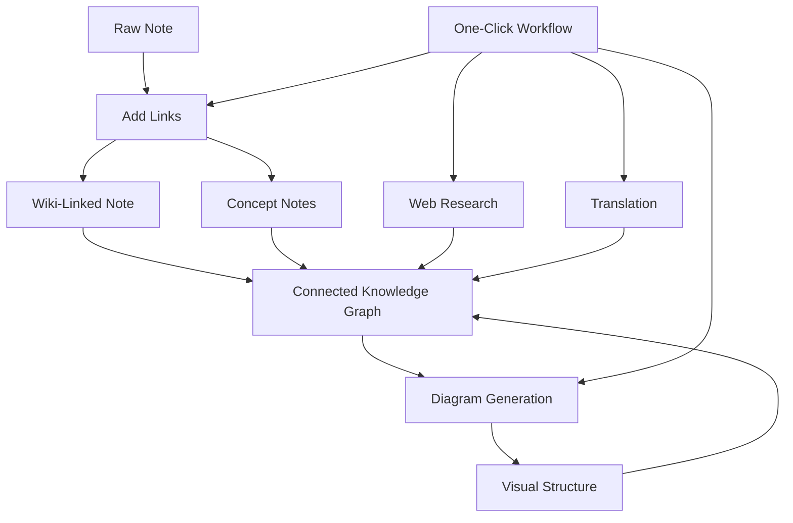

import TLDR from '@site/src/components/TLDR';

# Obsidian Guida alla gestione della conoscenza con l'AI

<TLDR>
**Notemd trasforma la lettura alimentata da LLM in conoscenza persistente: i collegamenti wiki collegano i concetti, le note dei concetti creano un grafo recuperabile, la ricerca porta il web nel tuo archivio, la traduzione elimina le barriere linguistiche, i diagrammi rendono visibile la struttura e i flussi di lavoro collegano tutto con un solo clic.** Questa guida copre l'intero processo — dalle note grezze a una base di conoscenza connessa, visiva e multilingue.
</TLDR>

## Perché la gestione della conoscenza con l'AI?

La tradizionale annotazione produce file piatti. Anche con collegamenti wiki manuali, la maggior parte delle note rimane disconnessa. Notemd utilizza LLM per automatizzare lo strato di connessione:

- **LLM leggono il tuo contenuto** e identificano ciò che è importante — termini, metodi, persone, teorie
- **I collegamenti vengono inseriti automaticamente** ad ogni occorrenza di un concetto, senza essere nascosti in sezioni "vedi anche"
- **Le note dei concetti vengono generate** come file recuperabili autonomi
- **La ricerca arricchisce le note** con contesto proveniente dal web
- **I diagrammi rendono visibile la struttura** — mappe mentali, flussi di lavoro, grafici dei dati basati sullo stesso contenuto

Il risultato: un grafo di conoscenza che cresce con ogni nota che elabori, non solo quando ti ricordi di aggiungere collegamenti.

## Il flusso di lavoro completo



Ogni passaggio è indipendente. Si può utilizzare uno o tutti. La sequenza più efficace: **Aggiungi link → Note concettuali → Diagrammi**.

---

## 1. Link wiki: rendere esplicite le connessioni

I link wiki costituiscono la struttura di base di un grafo di conoscenza. Notemd utilizza un LLM per:

1. Leggere il contenuto della nota (dividendolo in parti per documenti lunghi)
2. Identificare i concetti chiave — dando priorità a termini tecnici specifici rispetto a sostantivi generici
3. Inserire `[[wiki-links]]` in ogni occorrenza
4. Sopprimere i sinonimi affinché "ML" e "Machine Learning" non creino nodi separati

### Quando utilizzarlo

- **Ogni nota >100 parole** — le note più brevi forniscono pochi concetti
- **Articoli di ricerca, documentazione tecnica, note di riunione** — ricche di termini specifici del settore
- **Dopo che il contenuto è stabile** — non elaborare ripetutamente bozze

### Impostazioni chiave

| Impostazioni | Consigliato | Perché |
|---------|-----------|-----|
| `addLinksProvider` | DeepSeek o GPT-4o-mini | Buona accuratezza a basso costo |
| Soppressione dei sinonimi | Attivo | Impedisce nodi duplicati |
| Finestra di contesto | Paragrafo | Equilibrio tra accuratezza e costo |

→ [Wiki-Links deep dive](/docs/features/wiki-links)

---

## 2. Note concettuali: Nodi di conoscenza recuperabili

I collegamenti wiki uniscono le idee in modo inline, ma le note di concetto permettono di recuperare ogni idea in modo indipendente. Ogni concetto ha il proprio file `.md`:

```markdown
# Machine Learning

## Linked From
- [[My Research Notes]]
- [[Neural Networks Explained]]
```

### Il processo di estrazione

La richiesta LLM è fortemente strutturata:
- Normalizzare alla forma singolare
- Preferire concetti multi-parola rispetto a parole singole ("Dielectric Relaxation" invece di "Relaxation")
- Omettere le sezioni di riferimenti/bibliografia
- Eseguire l’output come righe `CONCEPT:` per una parsing deterministica

I concetti vengono de duplicati tra i vari blocchi tramite `Set<string>`. Gli errori LLM presenti in singoli blocchi non interrompono l’operazione.

### Backlink

Quando abilitato, ogni nota di concetto registra quali note di fonte la menzionano. Il pannello di backlink nativo di Obsidian mostra anche le connessioni inverse.

### Eliminazione delle duplicati

Il motore di de duplicazione a 4 passaggi di Notemd individua:
1. **Corrispondenze esatte** — confronto dei nomi dei file insensibile alla casistica
2. **Forme plurali** — "Models.md" contro "Model.md"
3. **Normalizzazione dei simboli** — "A-B.md" contro "A B.md"
4. **Contenimento di una singola parola** — "ML.md" segnalato quando esiste "Machine Learning.md"

### Impostazioni chiave

| Impostazioni | Consigliato | Perché |
|---------|-----------|-----|
| `conceptNoteFolder` | `concepts/` o `🧠 concepts/` | Mantiene il vault organizzato |
| `extractConceptsAddBacklink` | Attivo | Abilita la ricerca inversa |
| `extractConceptsMinimalTemplate` | Disattivato | Template completo con Linked From |
| Modello per task | DeepSeek | L'estrazione di concetti non richiede modelli costosi |
| Soppressione dei sinonimi | Attivo | La stessa impostazione influisce sia sull'elaborazione dei collegamenti che sull'estrazione |

→ [Approfondimento su Concept Notes](/docs/features/concept-notes)

---

## 3. Ricerca: Integrare il Web

Notemd integra la ricerca web nel tuo flusso di lavoro di annotazione:

1. **Costruzione della query** — il titolo o la selezione della nota diventa una query di ricerca
2. **Ricerca web** — Tavily (consigliato, richiesta della chiave API) oppure DuckDuckGo (gratuito, nessuna chiave)
3. **LLM riassunto** — i risultati della ricerca vengono condensati in un riassunto rilevante
4. **Aggiungere alla nota** — il riassunto viene inserito nella posizione del cursore o come nuova sezione

### Quando utilizzarlo

- Prima di elaborare un nuovo argomento — ottenere prima il contesto web
- Quando una nota concettuale richiede arricchimento — effettuare ricerche e poi aggiungere link
- Per le rassegne bibliografiche — effettuare ricerche in batch su una cartella di note

### Impostazioni principali

| Impostazioni | Consigliate | Perché |
|---------|-----------|-----|
| `researchProvider` | GPT-4o o Claude | Le ricerche richiedono una sintesi di qualità superiore |
| Servizio di ricerca | Tavily | Maggiore rilevanza, profondità configurabile |
| `maxResearchContentTokens` | 4000 | Equilibrio tra profondità e costo |

→ [Research deep dive](/docs/features/research)

---

## 4. Traduzione: Superare le barriere linguistiche

Notemd traduce le note utilizzando il LLM configurato — non è una traduzione dedicata API. Ciò significa:

- **Traduzioni consapevoli del contesto** — il LLM comprende l’intero documento, non frase per frase
- **Gestione dei termini tecnici** — "gradient descent" rimane "梯度下降" e non "坡度向下"
- **Supporto batch** — traduci un intero folder di note in un’unica operazione
- **Modello per task** — utilizza Gemini Flash per la traduzione (veloce, economico, multilingue)

### Supporto linguistico

Il Notemd stesso supporta 21 lingue UI. La lingua di destinazione della traduzione è configurabile per task. Coppie comuni: EN↔ZH, EN↔JA, EN↔KO, EN↔DE, EN↔FR, EN↔ES.

→ [Approfondimento sulla traduzione](/docs/features/translation)

---

## 5. Diagrammi: rendere visibile la struttura

Il pipeline di diagrammi di Notemd parte dalle specifiche: il LLM genera un `DiagramSpec` JSON strutturato, dopodiché gli adattatori lo traducono nel formato di destinazione. Questo produce un output più affidabile rispetto a chiedere al LLM la sintassi Mermaid grezza.

### Rilevamento delle intenzioni

Il Notemd deduce il tipo di diagramma più adatto dal contenuto:

- **Tabelle con numeri** → grafico dei dati (Vega-Lite)
- **Vocabolario client/server** → diagramma di sequenza (Mermaid)
- **Entità/chiave primaria** → diagramma ER (Mermaid)
- **Passo/flusso di processo** → flusso di lavoro (Mermaid)
- **Parole chiave della mappa concettuale** → JSON Canvas (Obsidian nativo)
- **Predefinito** → mappa mentale (Mermaid)

### Catena di rendering

Obiettivo principale → fallback → fallback → HTML. Se la sintassi di Mermaid fallisce, viene riprovato una volta con il contesto dell’errore inviato a LLM, dopodiché si ricorre a un diagramma minimo.

### Impostazioni chiave

| Impostazioni | Consigliato | Perché |
|---------|-----------|-----|
| `enableExperimentalDiagramPipeline` | Attivo | Maggiore qualità grazie al metodo basato sulle specifiche |
| `experimentalDiagramCompatibilityMode` | `best-fit` | Obiettivo nativo per intento |
| `summarizeToMermaidProvider` | GPT-4o o Claude | Le specifiche dei diagrammi richiedono ragionamento spaziale |
| `autoMermaidFixAfterGenerate` | Attivo | Cattura automaticamente gli errori di sintassi LLM |
| Aumento della conoscenza locale | Attivo per ambiti specifici | Migliora l'accuratezza con il contesto del vault |

→ [Approfondimento sui diagrammi](/docs/features/diagrams)

---

## 6. Flussi di lavoro: Automazione con un clic

I flussi di lavoro collegano più attività in un singolo pulsante nella barra laterale. Il formato DSL è:

```
task1 | task2 | task3
```

Esempio: `addLinks | extractConcepts | generateDiagram` — trasforma una nota dal testo grezzo in un nodo di conoscenza visivo completamente connesso con un solo clic.

### Flussi di lavoro consigliati

| Flusso di lavoro | Catena | Caso d’uso |
|----------|-------|----------|
| Processo completo | `addLinks \| extractConcepts \| generateDiagram` | Nuove note |
| Ricerca preliminare | `research \| addLinks` | Argomenti sconosciuti |
| Polyglot | `translate \| addLinks` | Note multilingue |
| Solo diagramma | `generateDiagram` | Visualizzazione rapida |

→ [Approfondimento sui flussi di lavoro](/docs/features/workflows)

---

## 7. LLM Fornitori: 36 opzioni da cloud a locale

Notemd supporta 36 fornitori su 4 tipi di trasporto. Gruppi chiave:

- **Cloud internazionale**: OpenAI, Anthropic, Google, Mistral, xAI
- **Cloud cinese**: DeepSeek, Qwen, Doubao, Moonshot, GLM, Baidu, SiliconFlow
- **Gateway**: OpenRouter, GitHub Models, Hugging Face, Vercel
- **Locale**: Ollama, LMStudio, OVMS — nessuna chiave API, nessun dato lascia il tuo dispositivo

### Strategia di modello per task

La configurazione più economica utilizza modelli economici per compiti semplici e modelli potenti per quelli complessi:

```
extractConcepts  → DeepSeek (fast, cheap, accurate enough)
addLinks          → DeepSeek or GPT-4o-mini
research          → GPT-4o or Claude (needs quality)
generateDiagram   → GPT-4o or Claude (needs spatial reasoning)
translate         → Gemini Flash (fast, multilingual)
```

→ [LLM Panoramica fornitori](/docs/providers/overview)

---

## Elenco controllo per iniziare

1. **Installare Notemd** — [Community Plugins](/docs/getting-started/installation) (consigliato) o manualmente
2. **Configurare un fornitore** — DeepSeek (più semplice), OpenAI, o Ollama (gratuito)
3. **Elaborare la prima nota** — clic destro → "Elabora file (aggiungi link)"
4. **Impostare cartella del concetto** — Impostazioni → Notemd → Output → Cartella del concetto
5. **Estrai i concetti** — esegui "Estrai i concetti" sulla stessa nota
6. **Genera un diagramma** — esegui "Genera diagramma" per visualizzare le connessioni
7. **Crea un flusso di lavoro** — collega gli step precedenti in un pulsante con un clic

## Configurazioni consigliate

### Studente (Budget)

```
Provider: DeepSeek (free tier available)
Concept extraction: DeepSeek
Research: DuckDuckGo (free) + DeepSeek
Diagrams: Off (or legacy Mermaid)
Workflows: addLinks | extractConcepts
```

### Ricercatore (Qualità)

```
Provider: GPT-4o (primary)
Concept extraction: DeepSeek (cost savings)
Research: GPT-4o + Tavily
Diagrams: best-fit mode, GPT-4o
Workflows: research | addLinks | extractConcepts | generateDiagram
```

### Privacy-First (Solo locale)

```
Provider: Ollama (llama3 or qwen2.5:7b)
All tasks: Ollama
Research: DuckDuckGo (free, no API key)
Diagrams: legacy Mermaid mode
```

### Bilingue (ZH + EN)

```
Primary: DeepSeek (Chinese queries)
Translation: Google Gemini Flash
Research: Tavily + DeepSeek (Chinese search context)
Language output: per-task (extractConceptsLanguage: zh-CN)
```

---

## Modelli comuni

### Modello: Elaborare un articolo di ricerca

1. Importa contenuti PDF (oppure incolla)
2. **Ricerca** — ottieni contesto web sull’argomento
3. **Aggiungi Link** — identifica e collega i concetti chiave
4. **Estrai Concetti** — crea note autonome
5. **Genera Diagramma** — visualizza la struttura del documento

### Modello: Arricchimento della nota giornaliera

1. Scrivi la nota giornaliera
2. **Aggiungi Link** — collega le idee di oggi ai concetti esistenti
3. Le note dei concetti vengono aggiornate automaticamente con i backlink

### Modello: Rassegna della letteratura

1. Crea una cartella con articoli/note
2. **Aggiungi Link in Batch** — elabora l'intera cartella
3. **Deduplica Concetti** — pulisce le note quasi duplicate
4. **Genera Diagramma** — mappa mentale dell'intera letteratura

---

*Notemd è open source (MIT) e funziona con Obsidian 0.15.0+ su tutte le piattaforme. [Installa ora](/docs/getting-started/installation) oppure [visualizza su GitHub](https://github.com/Jacobinwwey/obsidian-NotEMD).*
