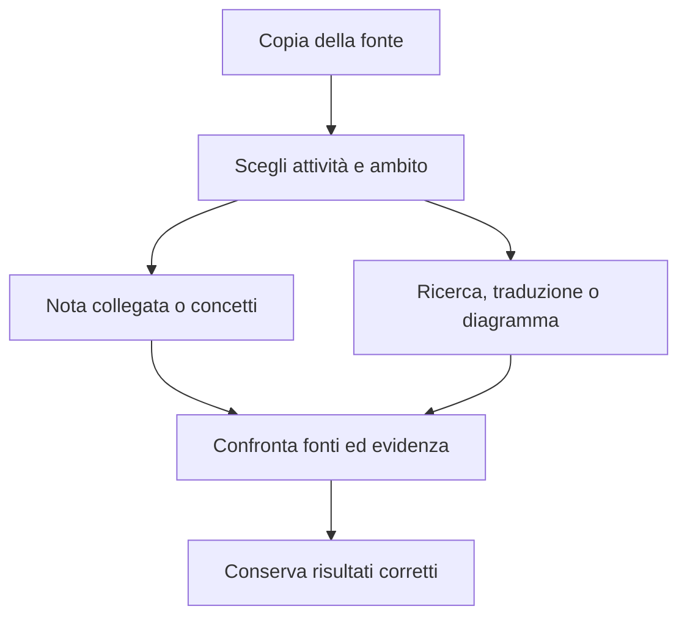

import TLDR from '@site/src/components/TLDR';

# Gestire conoscenza con IA in Obsidian

<TLDR>Un flusso utile distingue fonti, risposte del modello e correzioni personali. Notemd offre link, estrazione, ricerca, traduzione e diagrammi come documenti verificabili. Parti da una fonte, controlla il risultato, poi automatizza una cartella delimitata.</TLDR>

## Definire il risultato

Scegli nota collegata, concetti, sintesi con fonti, traduzione o diagramma. Più documenti e link non garantiscono comprensione o recupero. Definisci come verificare e ritrovare il contenuto.

## Percorso completo


```mermaid
flowchart TD
    A[Copia della fonte] --> B[Scegli attività e ambito]
    B --> C[Nota collegata o concetti]
    B --> D[Ricerca, traduzione o diagramma]
    C --> E[Confronta fonti ed evidenza]
    D --> E
    E --> F[Conserva risultati corretti]
```

Sono attività disponibili, non tutte le fasi di un pulsante predefinito. Conserva l’origine e verifica destinazioni prima di concatenare.

## 1. Link: esplicitare relazioni

Esegui **Elabora file (aggiungi link)** e controlla `_processed.md`: termini utili, citazioni, codice e formule fedeli. Dominio e istruzioni sui sinonimi orientano il modello, senza garantire identità o soglia numerica. Se serve ripetibilità su titoli esistenti, considera corrispondenza deterministica. [Link](./features/wiki-links).

## 2. Concetti: distinguere termine e spiegazione

Scegli cartella. L’estrazione autonoma conserva la fonte e crea solo titoli. Per `Linked From` attiva backlink e disabilita la forma minima. **Generazione batch dai titoli** è separato e può includere note precedenti idonee; controlla spostamento in complete. Nomi uguali non dimostrano significati uguali. [Concetti](./features/concept-notes).

## 3. Ricerca: mantenere evidenza

Scegli tema/titolo e Tavily o DuckDuckGo, quindi **Ricerca e riassunto**. La chiave Tavily vuota non cambia motore. Apri fonti e verifica affermazioni. Il recupero locale lessicale facoltativo invia estratti al modello scelto; indice locale non significa percorso offline. [Ricerca](./features/research).

## 4. Traduzione: significato e struttura

Scegli lingua e traduci il documento, normalmente `_<language>.md`; file esistenti possono essere sovrascritti. Per un passo crea nota temporanea. Confronta termini, numeri, codice, link e matematica; la suddivisione può perdere contesto. 21 lingue UI e 34 del sito non provano qualità delle coppie linguistiche. [Traduzione](./features/translation).

## 5. Diagrammi: scegliere fonti modificabili

Scegli tipo e fonte compatibili, controlla e salva origine ed export SVG/PNG/PDF necessari. Una figura non prova tutte le relazioni in un altro editor. CircuitikZ è delimitato con verifica nativa separata; frecce Drawnix tra rami sono statiche. PPTX migliora tabelle ma può usare immagini per Mermaid/SVG. [Diagrammi](./features/diagrams).

## 6. Workflow: automatizzare sequenze verificate

Nome, `::` e azioni separate da `>` definiscono la catena:

```text
One-Click Extract::process-current-add-links>batch-generate-from-titles>batch-mermaid-fix
```

Include link, titoli e riparazione Mermaid, non ricerca o diagrammi generici. Ogni azione conserva requisiti/output. Inizialmente si arresta dopo un errore segnalato. Continua solo se le fasi successive accettano gli input rimasti. Annullare non ripristina output conclusi. [Workflow](./features/workflows).

## 7. Provider: protocollo e compito

36 profili coprono cinque famiglie. Scegli endpoint, diritti, regole sui dati e risultati misurati. Confronta tempo/costo sulla stessa fonte e prompt. Le rotte per attività iniziano disattivate; controllale tutte prima di considerare locale un flusso. [Provider](./providers/overview).

## Controlli iniziali

1. Installa e conserva copia delle fonti.
2. Configura e verifica il modello esatto.
3. Scegli cartella concettuale e destinazioni separate.
4. Prova una copia.
5. Confronta e conserva correzioni.
6. Amplia a una cartella piccola e controlla parziali prima di catene lunghe.

## Casi tipici

### Elaborare un articolo

Converti esternamente in Markdown e controlla tabelle, formule e figure. Estrai concetti/passaggi, ricerca domande precise e visualizza solo relazioni verificabili. Mantieni articolo e correzioni.

### Mantenere concetti

Usa cartella dedicata, rivedi termini e genera spiegazioni per il sottoinsieme scelto. Fai backup prima della pulizia. Quantità non sostituisce definizioni esatte e navigazione utile.

### Materiale privato

Prepara server locale, modelli e dipendenze. Verifica rotte ed evita ricerca di rete quando necessario. Rivedi diagnosi prima di condividerle. Un URL loopback iniziale non impedisce configurazione remota.

### Riprendere un lotto

Attendi il termine di annullamento/errore. Controlla report, output e recupero, confronta conflitti e ripeti solo il necessario. Annullato non significa vuoto; verifica riferimenti prima di eliminare companion.

## Passi successivi

- [Avvio rapido](./getting-started/quick-start).
- [Lotti](./advanced/batch-processing).
- [Sviluppatori](./developers/overview).
- [Agent](./agents/overview).
