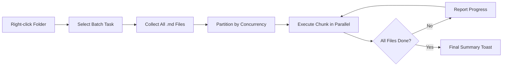

import TLDR from '@site/src/components/TLDR';

# バッチ処理

<TLDR>
**Notemdは、設定可能な並行処理数と上書き制御機能を備え、1回の操作でフォルダ全体を処理します。** フォルダを右クリックすることで、その中にあるすべてのノートにウィキリンクを一括追加したり、概念を抽出したり、調査を行ったり、翻訳したりできます。並行処理数の制限により、APIによるレート制限エラーを防ぎます。進捗状況はファイルごとに報告されます。上書き動作も設定可能で、既存のファイルをスキップしたり、追記したり、置き換えたりできます。処理に失敗したファイルもバッチ処理を中止することなくログに記録されます。

これは[Obsidian AI知識管理ガイド](/docs/pillar-ai-knowledge)の一部です。
</TLDR>

## 概要

バッチ処理により、ノートのフォルダを1回の操作で処理できます。各ノートを開いて個別にコマンドを実行する代わりに、フォルダを右クリックしてタスクを選択します。Notemdはすべての`.md`ファイルを順番に処理し、選択したアクションを適用し、進行状況をリアルタイムで報告します。

この機能は、バレット全体での知識抽出に不可欠です。例えば、数十個のPDFをインポートした後にbatch-add-linksを実行し、その後batch-extract-conceptsを実行することで、数時間かかる代わりにわずか数分で知識グラフを構築できます。

## 動作の仕組み

### バッチ実行モデル

1. **ファイル収集** -- Notemdは、設定に応じてターゲットフォルダを再帰的に（またはトップレベルのみ）スキャンし、すべての`.md`ファイルを収集します。
2. **並行処理のパーティショニング** – ファイルは`batchConcurrency`の設定に基づいてチャンクに分割されます。各チャンクは並行して実行され、一方でチャンク同士は順番に実行されます。
3. **実行** – 各ファイルは、単一ファイル用コマンドと同じロジックで処理されます。タスクごとのプロバイダー設定およびモデル設定が尊重されます。
4. **進捗状況の報告** – 各ファイルの処理が完了するたびにトースト通知が更新され、`N / Total`%の進捗が表示されます。
5. **エラー処理** – ファイルの処理に失敗した場合（APIエラー、ネットワークタイムアウトなど）、そのエラーはログに記録され、バッチ処理は続行されます。最終的なサマリーには失敗したファイルが一覧表示されます。
6. **完了** – 概要のトーストメッセージにて、処理された合計数、成功数、失敗数が報告されます。

### 上書き動作

既にウィキリンクやコンセプトノート、翻訳が含まれているファイルを処理する際、Notemdの動作は上書き設定によって異なります：

| モード | 動作 |
|------|----------|
| **スキップ** | 既存のコンテンツはそのまま残されます。変更されていないファイルのみが処理されます。 |
| **Append**（デフォルト） | 新しいコンテンツが追加されます。既存のウィキリンク、コンセプト、または翻訳はそのまま保持されます。 |
| **置き換える** | ファイルは完全に再処理されました。以前のすべてのNotemdによる変更内容は上書きされます。 |

wikiリンク機能について具体的に言うと、メモに既に`[[wiki-links]]`が含まれている場合、**skip**モードではそのままにしておき、一方**replace**モードではメモ全体をLLMに再送信して新しいリンクを挿入します。段階的な処理には**skip**を、モデルのアップグレード後の再処理には**replace**を使用してください。

### 並行制御

`batchConcurrency`の設定により、同時に実行できるAPI呼び出しの数が制限されます。これにより、厳格な制限を設けているプロバイダーを利用して大規模なフォルダを処理する際のレート制限エラー（HTTP 429）を防ぐことができます。

| 並行処理 | おすすめ対象 | 典型的なレート制限の影響 |
|-------------|----------------|---------------------------|
| `1` | 無料プラン、厳格なプロバイダー | なし（シリアル） |
| `3` (デフォルト) | ほとんどのクラウドプロバイダー | 低 |
| `5` | Ollama (ローカル)、充実したプラン | なし / 低 |
| `10` | 高速推論が可能なローカルモデル | なし |

バッチ処理中に429エラーが発生した場合は、並行処理数を1または2に減らしてください。

## 設定

| 設定 | デフォルト | エフェクト |
|---------|---------|--------|
| `batchConcurrency` | `3` | フォルダ操作中の最大並列API呼び出し数 |
| `batchOverwriteExisting` | `false` | 既存のNotemdコンテンツを上書きします。`false`は追記モードを意味します。 |
| `batchSkipProcessed` | `false` | Notemdマーカー（例：wikiリンク）が既に含まれているファイルはスキップする |
| `batchRecursive` | `true` | フォルダをスキャンする際にサブディレクトリも含める |
| `enableStableApiCall` | `false` | バッチ処理中にファイルごとに再試行ロジックを有効にする（最大4回まで） |

### バッチ処理におけるタスク単位モデル

各バッチ処理では、対応するタスクごとのモデルが使用されます。batch-add-linksは`addLinksProvider`を、batch-researchは`researchProvider`を使用するなどです。これにより、大量の処理には安価なモデルを割り当て、品質が重要なタスクには高価なモデルを確保することができます。

## 例

`papers/`というフォルダに、インポートされた40件の研究ノートがあります。これらすべてにウィキリンクを追加し、共通する概念を抽出したいです。

1. `papers/`フォルダを右クリックしてください
2. **「Notemd: フォルダを処理する（リンクを追加）」**を選択してください。
3. Notemdはフォルダをスキャンし、40個の`.md`ファイルを見つけ、デフォルトの並行処理数である3つずつ処理します。
4. 進行状況のトーストには次のように表示されます：`12/40 files processed...`
5. 約3分後、要約トーストが次のように報告します：`39 succeeded, 1 failed (API timeout on paper-37.md)`
6. **"Notemd: Process folder (extract concepts)"**を繰り返して、40件すべてのコンセプトノートを作成してください

失敗したファイルについてはログに記録されています。その後、そのファイルだけを再実行することができます。

## ヒント

- **低い並行処理数から始める** – プロバイダーのレート制限が不明な場合は、まず`1`から始めて徐々に増やしていきましょう。
- **インクリメンタル更新のためにスキップモードを使用する** – 最初の完全なバッチ処理後は`batchSkipProcessed: true`に切り替えることで、以降の実行時には新しいノートのみが処理されます。
- **安定したAPI呼び出しを有効にする** – `enableStableApiCall: true`は、長時間のバッチ処理中に発生する一時的なネットワークエラーから回復するための再試行ロジックを追加します。
- **モデルアップグレード後に再実行する** – より優れたモデルに切り替えた場合は、`batchOverwriteExisting: true`を設定して再実行し、より良いリンクやコンセプトを得てください。

---

## 次のステップ

- [ワークフロー](/docs/features/workflows) – バッチタスクを連携させて、ワンクリックでサイドバーボタンを作成
- [カスタムプロンプト](/docs/advanced/custom-prompts) -- バッチ抽出用のプロンプトをカスタマイズする
- [トラブルシューティング](/docs/advanced/troubleshooting) – バッチ実行時のレート制限エラーや接続失敗を修正する
- [LLM プロバイダー](/docs/providers/overview) -- タスクごとのモデル設定参照
