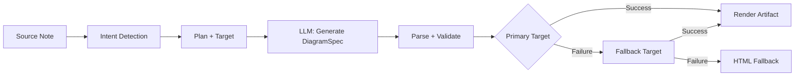
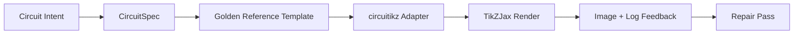

import TLDR from '@site/src/components/TLDR';

# 図表

<TLDR>
**Notemd**は、スペックファーストのパイプラインを通じてノートから図表を生成します。LLMはレンダラーに依存しない`DiagramSpec` JSONを作成し、専用のアダプターがそれをMermaid、JSON Canvas、Vega-Lite、HTML、または編集可能なHTML/SVG形式の出力に変換します。8種類のインテントタイプ、自動的なフォールバックチェーン、SVG/PNG出力を備えたリアルタイムプレビュー、セマンティック検証、およびローカル知識による生成強化をサポートしています。
</TLDR>

これは[Obsidian AI知識管理ガイド](/docs/pillar-ai-knowledge)の一部です。

## アーキテクチャ：仕様優先パイプライン

Notemdは決してLLMに直接Mermaid/Vega/Canvas構文を生成するよう要求しません。代わりに：



**なぜスペック優先なのか？** LLMは頻繁に無効なレンダラーシンタックスを生成する（特にMermaidがそうだ）。構造化された`DiagramSpec`はレンダリング前に検証でき、同じスペックを複数のレンダラーにフェールバックとして利用できる。

## サポートされている図の種類

| 意図 | プライマリレンダラー | フォールバック | ユースケース |
|--------|-----------------|-----------|----------|
| `mindmap` | Mermaid | HTML | 階層的なトピックの分解 |
| `flowchart` | Mermaid | HTML | 処理フロー、決定木 |
| `sequence` | Mermaid | HTML | クライアントサーバー間の通信、プロトコル |
| `classDiagram` | Mermaid | HTML | OOPクラスの関係性 |
| `erDiagram` | Mermaid | HTML | データベーススキーマ、エンティティ間の関係 |
| `stateDiagram` | Mermaid | HTML | ステートマシン、ライフサイクルモデル |
| `canvasMap` | JSON Canvas | Mermaid を HTML に変更します。 | 概念マップ、知識グラフ |
| `dataChart` | Vega-Lite | Mermaid を HTML に変更します。 | 棒グラフ、折れ線グラフ、面積グラフ、散布図、円グラフ、表 |

## 意図検出

Notemdはキーワードスコアリングを用いて、メモの内容から最適な図の種類を推測します：

| 意図 | トリガー | 自信 |
|--------|----------|------------|
| `dataChart` | 表、数値セル、指標・トレンドに関するキーワード、パーセンテージ | 0.88 |
| `sequence` | リクエスト/レスポンス用語集（4件以上のマッチ）または`->`/`=>`マーカー | 0.82 |
| `erDiagram` | 主キー、外部キー、エンティティ、スキーマ（2件以上のマッチ） | 0.80 |
| `stateDiagram` | ステータス、トランジション、ペンディング、実行中、失敗（3件以上のマッチ） | 0.76 |
| `flowchart` | 番号付きステップ（2以上）またはif/then/else/ワークフロー用語 | 0.74 |
| `canvasMap` | 概念マップ、知識グラフ、空間的、クラスター | 0.72 |
| `mindmap` | デフォルトのフォールバック | 0.55 |

**Preferred diagram type**設定、サイドバーのセレクタ、または明示的なコマンドパレットオプションで上書きしてください。

## レンダーターゲットの選択

実験用のスペックファーストパイプラインには、現在2つの独立したコントロールがあります：

| コントロール | 設定 | エフェクト |
|---------|---------|--------|
| 希望する図の種類 | `preferredDiagramIntent` | 生成される`DiagramSpec`の意味的な形状を決定する |
| 優先レンダーターゲット | `preferredDiagramRenderTarget` | **図の生成**および**図のプレビュー**用のアーティファクトレンダラーを選択します |

プランナーのデフォルト設定として**Preferred render target**を**Auto**に設定するか、明示的にMermaid、JSON Canvas、Vega-Lite、HTML、またはEditable HTML/SVGを選択してください。この上書き設定はartifactおよびpreviewコマンドにのみ適用されます。標準の**Summarise as Mermaid diagram**コマンドはMermaid互換の出力に固定されているため、既存のMarkdownワークフローが自動的にフォーマットを変更することはありません。

この分離は重要です。なぜなら、`flowchart`のインテントをMarkdownノート用にはMermaidとして、信頼性の高いフォールバック用にはHTMLとして、また後工程での編集用には編集可能なHTML/SVGとしてレンダリングできるからです。一方、Draw.ioとDrawnixは依然としてプラグイン内のレンダリング対象ではなく、CLIのアーティファクトエクスポーターのままです。

## 使用方法

### 図を生成する

1. メモを開く
2. コマンドパレットから**“Notemd: Generate diagram”**を実行してください
3. Notemdは意図を検出し、仕様を生成し、レンダリングして、アーティファクトを保存します。

**ターゲット別出力ファイル:**

| ターゲット | 拡張機能 | ファイル名パターン |
|--------|-----------|------------------|
| Mermaid | `.md` | `{note}_summ.md` |
| JSON Canvas | `.canvas` | `{note}_diagram.canvas` |
| Vega-Lite | `.json` | `{note}_diagram.json` |
| HTML | `.html` | `{note}_diagram.html` |
| 編集可能な HTML/SVG | `.html` | `{note}_diagram.html` |

### 図のプレビューを表示する

1. **"Notemd: プレビュー図"**を実行してください。
2. レンダリングされた図が表示されるモーダルが開きます
3. ツールバーのボタンを使用してSVGまたはPNG形式でエクスポートします

設定で「自動プレビュー表示」を有効にすることができ、生成後にプレビューモーダルが自動的に開きます。

プレビューモーダルにはアーティファクト診断パネルも備わっています。レンダラーやスモークチェックでは `RenderArtifact.diagnostics` を添付でき、モーダルにはエラー/警告/情報の件数、その後に重大度、診断の種類、メッセージ、および修復アドバイスがプレビューの横に表示されます。同じ要約はプレビュー履歴エントリにも表示されるため、各エントリを開かなくても繰り返される circuitikz スモークテストを比較できます。ソースコンテンツはあるもののインラインでのレンダリングや HTML iframe パス経由でのレンダリングができないアーティファクトの場合、モーダルは空のiframeを強制する代わりにソースのみのプレビューに切り替わります。これにより、circuitikz のコンパイル/レンダリングスモークテスト、SVG のテキストトークンチェック、PNGの空白スクリーンショットチェック、そして将来的な重複報告に対して、TikZJax やLaTeXを厳格なプラグイン実行時依存項目にすることなく、またソーステキストが検証済みの視覚レンダリングであるかのように振る舞うことなく、目に見える UI の表示面を提供します。

### レガシー Mermaid モード

`enableExperimentalDiagramPipeline`がオフの場合、Notemdは直接MermaidプロンプトをLLMに送信します。これによりスペックパイプラインが完全にバイパスされます。実験的なパイプラインが失敗した場合は、このモードに切り替わります。

## レンダリングバックエンド

### Mermaid

6つのアダプタ（マインドマップ、フローチャート、シーケンス、ER、クラス、ステート）を用いて`DiagramSpec`をMermaid構文に変換します。生成後、`mermaid.parse()`が出力を検証します。検証に失敗した場合：

1. **LLM 再試行** — コンテキストとしてMermaidのエラーメッセージを使用した1回の試行
2. **最小限のフォールバック** — スペックノードIDから作成されるシンプルな Mermaid ダイアグラム

**Legacy Mermaid Fixer**は、ノートディレクティブの正規化、パイプラベルのエスケープ、セミコロンの位置修正、スマートクォート、ダブルダッシュアロー、形状の不一致など、よくあるLLM構文エラーを自動的に修復します。

### JSON Canvas

空間レイアウトを持つObsidian JSON Canvas形式で出力します：
- 深さ(x = 深さ × 420)とインデックス(y = インデックス × 170)によって位置決めされるノード
- ラベルの長さから推定される幅
- `fromSide: 'right'`、`toSide: 'left'`、`toEnd: 'arrow'`を含むエッジ

### Vega-Lite

自動エンコーディングを使用して、完全な Vega-Lite v5 JSON の仕様を作成します：
- **座標グラフ**（棒グラフ/折れ線グラフ/面積グラフ/点グラフ/散布図）：複数シリーズ用にxチャネル、yチャネル、色を使用
- **Pie**: theta = y（量的）、color = x（名義的）
- **表**: 行 = x、テキスト = y + 列 = シリーズ

暗色テーマと明色テーマのパッチは、コンパイル前にディープマージされます。

### HTML

ユニバーサルフォールバック。以下を含む自己完結型のHTMLドキュメント：
- CSPメタヘッダー
- `prefers-color-scheme`を介した明るい/暗いモード
- 20のロケール向けにローカライズされたUIラベル
- セクション：ヘロー、構造（ノードツリー）、関係性、コールアウト、データシリーズテーブル

### 編集可能な HTML/SVG

編集可能なエクスポートワークフロー向けの明示的な図形ターゲット。これにより`DiagramSpec`が決定的な`SemanticFigureModel`へと変換され、その後、Draw.ioスタイルの注釈を含むインラインのSVGグループを持つ、自己完結型のHTMLドキュメントが生成されます。

- セマンティックノード上の`data-drawio-type`、`data-drawio-id`、および`data-drawio-role`
- セマンティックエッジ上の`data-drawio-source`と`data-drawio-target`
- 空白の正規化と衝突処理後の安定したノード/エッジ識別子
- スクリプトも外部フォントもリモートアセットも使用しない

このターゲットは意図的にまだデフォルトのプランナールートとはしていません。製品パスが実際のツール間での編集動作を証明する間、明示的なレンダーターゲットとして利用可能です。

### Draw.ioおよびDrawnixのエクスポート境界

現在の実装では、サードパーティエディタのサポートをアーティファクトの境界に留めています：

| ターゲット | 契約 | 実行時依存性 |
|--------|----------|--------------------|
| Draw.io | `SemanticFigureModel`からの決定的な非圧縮形式の`mxfile` XML | プラグインの実行時やCI環境には何もありません。 |
| Drawnix | `geometry`および`arrow-line`の要素を使用したminimal `.drawnix` JSONサブセット | プラグインの実行時やCI環境には何もありません。 |

このトレードオフは意図的なものです。図表生成機能やPlait、ブラウザ専用エディタの状態をプラグインに組み込まずとも、Notemdは目に見えるラベルや安定したID、サポートされているプリミティブのカバレッジを検証できます。

### circuitikz / TikZJax 方向

回路図は一般的なフローチャートとは異なる問題です。電気回路の正しい構文ターゲットは通常**circuitikz**であり、TikZJaxのようなプラグインを通じて Obsidian で表示されます。TikZJaxは `circuitikz`、`pgfplots`、`tikz-cd`、`chemfig` といったパッケージを読み込むことができ、そのため物理、回路、化学、数学のノート作成に適しています。

問題は、LLMで生成された生のTikZコードが脆弱であるという点です。

- 複雑な回路のトポロジーは電気的には正しいものの、視覚的には読みにくい場合があります。
- 重なったワイヤやラベルのせいで、正確なネットリストが学習ノートとして使用できなくなってしまいます。
- パッケージのプレアンブルが欠落していたり、アンカーが間違っていたり、コンポーネント名が無効だったりすると、レンダリングが妨げられることがあります。
- レンダラーからのフィードバックは通常画像レベルであり、LLMが生成するのはテキストレベルのジオメトリです。

より良いアーキテクチャとしては、circuitikzを自由形式のプロンプトではなく、制約付きの図面ターゲットとして扱うことです。



一流のモデルでは、回路のトポロジーとレイアウトを別々に記述すべきです。

| レイヤー | 責任 | 例 |
|-------|----------------|---------|
| トポロジー | 電気ノードとコンポーネントの接続 | `VDD -> RD -> drain(M1)`、`source(M1) -> GND` |
| レイアウト | グリッド配置、向き、ルーティングレーン | `M1 at (3,2.2)`、入力は左側、出力は右側 |
| スタイル | パッケージ、電圧規格、ラベル、アンカー | `\begin{circuitikz}[american voltages]` |
| 検証 | コンパイルログ、アンカーが欠落している、重複/スクリーンショットのチェック | TikZJax/LaTeXの診断機能と視覚的レビュー |

### 現在のcircuitikzプロトタイプ

Notemdには、この方向性向けの最初の制約付きリポジトリプロトタイプが含まれています。意図的にオフライン状態であり、テンプレートに縛られています：

```bash
npm run diagram:export-circuitikz -- --input cmos-inverter.json --output cmos-inverter.tex
```

このプロトタイプでは、6つのゴールデンリファレンスファミリーに対して、別途の`CircuitSpec`境界と決定的なエクスポータが追加されています。

| 回路の種類 | ゴールデンリファレンス | 現在の保証期間 |
|--------------|------------------|-------------------|
| `common-source-amplifier` | `common-source-nmos-v1` | LaTeXを書き出す前に `VDD -> R_D -> M1.D`、`vin -> M1.G`、`M1.S -> GND`、および `M1.D -> vout` を検証します |
| `cmos-inverter` | `cmos-inverter-v1` | LaTeXに書き出す前に、PMOS-over-NMOSのトポロジ、共有ゲート入力、共有ドレイン出力、`VDD -> MP.S`、および`MN.S -> GND`を検証する |
| `cmos-buffer` | `cmos-buffer-v1` | LaTeXを書き出す前に、2つのカスケード型インバータステージ、中間ノード`vmid`、復元された`vout`、および共有されているVDD/GNDレールを検証する |
| `cmos-transmission-gate` | `cmos-transmission-gate-v1` | LaTeXを書き込む前に、補完的な`phib` / `phi`制御を用いて`vin`と`vout`の間にある並列PMOS/NMOSパスデバイスを検証する |
| `cmos-nand2` | `cmos-nand2-v1` | LaTeXを書き出す前に、並列PMOSプルアップ、直列NMOSプルダウン、デュアル入力の`va` / `vb`、および`vout`を検証します |
| `cmos-nor2` | `cmos-nor2-v1` | LaTeXに書き出す前に、シリアルPMOSプルアップ、パラレルNMOSプルダウン、デュアル入力の`va` / `vb`、および`vout`を検証します |

これはまだ一般的なTikZジェネレータではありません。LaTeXをコンパイルしたり、TikZJaxを呼び出したり、スクリーンショットを確認したり、自動的な画像フィードバックによる修復を行ったりする機能はありません。これらは今後の実装段階で追加される予定です。

Preview diagramコマンドは、ファイルの拡張子が`.tex`または`.tikz`で、ソースに`\usepackage{circuitikz}`や`\begin{circuitikz}`が含まれている場合、保存されたcircuitikzのソースアーティファクトを直接再開することができます。このルートはcircuitikzのソースのみのプレビューであり、モーダルウィンドウにはソース、診断情報、コピー/保存用のコントロール、および履歴メタデータが表示されますが、LaTeXをコンパイルしたり、プラグインの実行中にTikZJaxを呼び出したりすることはありません。

同じソースのみのプレビュー範囲が、保存されたDraw.ioおよびDrawnixのアーティファクトも対象になりました。`.drawio`形式のファイルは、Draw.io XML（`mxfile`または`mxGraphModel`）のような形式であれば受け入れられ、`.drawnix`形式のファイルは、`type: "drawnix"`と`elements`の配列を含み、Drawnix JSONの形式であれば受け入れられます。このプラグインは依然としてdiagrams.netやDrawnixのホワイトボードサーバーを組み込んでおらず、これらのプレビューではプラグイン内のビジュアルエディターを使用せずにソースコード、診断情報、アーティファクトの履歴が表示されます。

トポロジを保持した修復を行う場合、修復済みの候補を受け入れる前に、事前の修復仕様を参照として渡してください：

```bash
npm run diagram:export-circuitikz -- --input repaired-cmos-inverter.json --topology-reference cmos-inverter.json --output cmos-inverter.tex
```

この修復ガードは、出力する前に`createCircuitTopologySignature`および`assertCircuitTopologyUnchanged`を使用して`circuitKind`、`goldenReferenceId`、ネットワーク、コンポーネントのID/タイプ/端子、および無向接続エンドポイントを比較します。ラベル、タイトルテキスト、レイアウトヒント、接続順序、接続ラベルは意図的に無視されます。端子を短くしたり再配線したりする候補は、`.tex`ファイルが書き込まれる前に`Circuit topology drift detected`によって失敗します。

CLIは、コンパイラを実行することなく、既存のLaTeX/TikZJaxコンパイルログを解析できるようになりました。

```bash
npm run diagram:export-circuitikz -- --input cmos-inverter.json --output cmos-inverter.tex --compile-log cmos-inverter.log --diagnostics-output cmos-inverter.diagnostics.json
```

この診断パスでは、`circuitikz.sty`のような欠落しているパッケージや、未知のTikZ/circuitikzキー、セミコロンが欠落しているなどのTikZのパス構文エラー、不均衡なブラケットや未終了のラベルによる余分な引数、定義されていない制御シーケンス、一般的なLaTeXエラー、緊急停止、そして過剰な容量を示す`\hbox`警告などが報告されます。依然としてログ駆動型のままであり、ローカルでのLaTeX/TikZJax実行やスクリーンショット品質のチェック機能は、今後の別途の課題となっています。

メンテナンス用のスモークチェックでは、同じCLIを使用して、シェルコマンドの解析を行わずに明示的に設定されたレンダラーを任意で実行できます。

```bash
npm run diagram:export-circuitikz -- --input cmos-inverter.json --output cmos-inverter.tex --compile-executable pdflatex --compile-arg -interaction=nonstopmode --compile-arg -halt-on-error --compile-arg -output-directory={outputDir} --compile-arg {tex} --expected-artifact {outputDir}/{jobName}.pdf
```

コンパイルランナーは`shell: false`を使用し、`{tex}`、`{outputDir}`、`{jobName}`といったプレースホルダーを引数配列の値に展開した後、生成された`{jobName}.log`を読み込み、`compileExecution`と`compileDiagnostics`を合わせてCLI JSON形式の出力として返します。`--compile-executable`はレンダラーバイナリまたはラッパーパスのみであり、レンダラーフラグは繰り返される`--compile-arg`の値に含まれます。空の実行ファイルは`compile-executable-invalid`として失敗し、バイナリが欠落している場合は`compile-executable-not-found`として失敗します。また、シェルコマンド形式の実行ファイル文字列に対しては、Windows、Linux、macOSが同じ直接実行規約に従うよう引数を分割するよう指示が出されます。`--expected-artifact`を使用することで、`compileExecution.renderSmoke`も報告され、レンダラーが空でないアーティファクトを生成しない場合はCLIとして失敗します。なお、LaTeXをバンドルしたり、TikZJaxをプラグインの実行時依存項目にしたり、スクリーンショットレベルでの視覚的修復を行うことはありません。

期待されるアーティファクトが`.svg`の場合、スモークチェックはさらに一層詳細なレベルで実行されます：

```bash
npm run diagram:export-circuitikz -- --input cmos-inverter.json --output cmos-inverter.tex --compile-executable dvisvgm --compile-arg ... --expected-artifact {outputDir}/{jobName}.svg --expected-svg-text v_{in} --expected-svg-text v_{out}
```

SVGのスモークテストでは、隠された要素や透明な要素を除外した後でも少なくとも1つの可視な図形要素が存在するか、正の寸法または`viewBox`であること、要求されたテキストトークンが含まれているか、`viewBox`の外側に明らかな要素があるか、位置が重なっている`<text>`/`<tspan>`のラベルが明らかか、そして`render-svg-label-overlap`を通じて図形要素と重なっている明らかなテキストラベルがあるかを確認します。期待されるテキストは可視テキストや`aria-label`、`<title>`、`<desc>`といったアクセシビリティメタデータのデコード結果でも検索されるため、可視範囲外のセマンティックラベルを保持するレンダラーでもOCRを必要とせずにテキストトークンのスモークテストを通過できます。ジオメトリチェックでは、一般的なグループや要素の`transform`属性に対応した変換を考慮したジオメトリが使用されるため、翻訳されたりスケール変更されたり回転されたり歪められたり行列変換されたりしたSVGボックスも変換の合成後にチェックされます。これにはA/a弧の端点の正確な弧の境界、C/S/Q/T曲線の端点の正確なベジエ曲線の境界、ストローク幅を考慮したSVGの境界やラベルの重なりチェック、`polyline`/`polygon`の図形ジオメトリが含まれ、また`<use href="#...">`から参照されるパスのみのグリフ配置も処理されるため、再利用可能なグリフパスに変換されたラベルでも配置されたグリフのジオメトリが`viewBox`を超えた場合には境界内チェックに失敗することがあります。1つの`<text>`親要素の下にある複数の位置付けられた`tspan`ラベルは別々のラベルボックスとして比較され、そうでなければ異なるラベルを1つのテキストノードにまとめてしまうLaTeXスタイルのSVG出力も検出できます。位置付けられたSVGの`text`および`tspan`ボックスは`text-anchor`の値`start`、`middle`、`end`を尊重するため、中央揃えや右揃えのラベルでもブラウザレベルのテキストレイアウトを必要とせずにテキスト同士やラベルと図形の重なり診断が行われます。`<defs>`内の定義のみのグリフパスは可視な図形要素としてはカウントされませんが、`<use>`の配置前に独自の定義ローカルの`transform`属性が適用されるため、スケール変更や鏡像処理が施されたグリフ定義も過小評価されることはありません。ラベルと図形の重なりチェックでは小さな描画ボックスの許容範囲と宣言された`stroke-width`が使用されるため、細いワイヤーや太いワイヤー、多角形のコンポーネントのアウトラインも、その可視ストロークがラベルに達した場合にはラベルの可読性に問題がある可能性があると見なされます。`<use href="#...">`から解決されたパスのみのグリフラベルも描画ボックスと比較され、再利用可能なグリフのジオメトリがワイヤーやコンポーネントと重なった場合には`render-svg-path-glyph-overlap`で失敗します。レンダラーがラベルを検索可能な`<text>`のパスグリフに変換し、アクセシビリティメタデータを保持しない場合、スモークレポートには`pathOnlyGlyphUseCount`が記録され、ラベルが単に存在しないかのように振る舞う代わりに`render-svg-text-path-only`を通じて要求されたテキストトークンのチェックに失敗します。その他の失敗は`render-svg-invalid`、`render-svg-dimension-missing`、`render-svg-no-visible-elements`、`render-svg-text-missing`、`render-svg-out-of-bounds`、`render-svg-text-overlap`、`render-svg-label-overlap`、または`render-svg-path-glyph-overlap`を通じて報告されます。テキストトークンや重なりチェックは、ラベルを検索可能なSVGテキストやアクセシビリティメタデータとして保持するレンダラーに対してのみ構造的なスモークテストとして扱われるべきであり、パスのみのSVG出力については視覚的なラベルの可読性を証明するために後続のスクリーンショット/OCRチェックが依然として必要であり、このスモークテストでも完全なSVGパスカバレッジを主張することはありません。

非表示のSVGグループや要素は、表示可能な要素のカウントやジオメトリ収集時に一貫してスキップされます。属性やインラインスタイルの`display:none`、`visibility:hidden`、`visibility:collapse`、および全体的な`opacity:0`設定では、本来空白のはずのレンダリング結果を表示可能な出力として認めさせることはできません。

パスのみのグリフ定義は、直接のパスであるか、`<defs>`内のグループ化された/シンボルコンテナであることができます。スモークパスは、`<use>`による配置処理の前に、`<g id="...">`および`<symbol id="...">`から子パスの幾何形状を解決するため、ラップされたグリフの出力も依然として`pathOnlyGlyphUseCount`、境界付きキャンバスのチェック、および`render-svg-path-glyph-overlap`に渡されます。

パスパーサーはサブパスの開始位置も追跡し、`Z/z`で現在のポイントをリセットするため、閉じられたサブパスの後の相対コマンドは誤った`render-svg-out-of-bounds`の診断を出すことなく、正しいSVGのポイントから続行されます。

同じジオメトリパスは、小数点付きの数値や明示的なプラス記号に関してSVG番目の文法規則に従うため、`.5`、`-.5`、`+.5`といったコンパクトなdvisvgm座標は境界チェック時にも分数のままであり、不正な境界外のジオメトリになったりスキップされたりすることはありません。

レンダラーが`.png`を出力すると、同じ期待されるアーティファクトパスが最初のスクリーンショットスモークチェックとなります。 Notemdは、非インターレース型の1/2/4/8ビットインデックスカラーPNGファイル、1/2/4/8/16ビットグレースケールPNGファイル、および8/16ビットグレースケール-アルファ/RGB/RGBA PNGファイルをデコードします。インデックスカラー画像やサブバイトグレースケール画像はパックドサンプルをサポートし、インデックスカラー画像はPLTEやオプションのtRNSデータもサポートします。グレースケール/RGB画像はtRNS透明サンプルをサポートします。16ビットの直接サンプルは、スモークチェックで使用される同じ8ビットRGBA比較空間に正規化されます。スモークチェックでは正しい寸法が確認され、前景の境界は`foregroundBounds`として記録され、その範囲内の前景密度は`foregroundDensity`として記録されます。すべての可視ピクセルが左上の背景色と一致する場合は`render-png-blank`で失敗し、前景コンテンツが画像の境界に触れる場合は`render-png-content-clipped`で失敗し、大きなスクリーンショットで前景ピクセルが4つ未満の場合は`render-png-foreground-too-small`で失敗し、単純でない境界ボックス内で前景ピクセルの密度が異常に高い場合は`render-png-foreground-dense`で失敗します。サポートされていないPNG形式の場合は`render-png-unsupported`で失敗し、Adam7インターレースPNGやサポートされていないインデックスカラービット深度については形式固有のガイダンスが示されます。これにより、空白のスクリーンショット、明らかなキャンバスのクリッピング、十分にレンダリングされていない前景部分、最初のピクセルレベルでの混雑による失敗、不正なレンダラーのPNGエクスポート設定などが検出されますが、プラットフォーム固有のシェル依存性は追加されません。これはまだOCRレベルのラベル認識や正確なテキスト重なり検出、トポロジーを保持した画像修復機能ではありません。

診断結果でコンパイルやrender-smoke実行に失敗が示された場合、CLIはトポロジーを保持した修復報告書も作成できます：

```bash
npm run diagram:export-circuitikz -- --input cmos-inverter.json --topology-reference cmos-inverter.json --output cmos-inverter.tex --compile-log cmos-inverter.log --repair-brief-output cmos-inverter.repair-brief.json
```

この修理概要書はスキーマ`notemd.circuitikz.repair-brief.v1`を使用し、ソース`CircuitSpec`、トポロジーの署名、コンパイル/レンダリング時の診断結果、許可される編集内容、禁止されているトポロジー編集、次の検証ステップ、そして構造化された`repairPrompt`を含んでいます。プロンプトの役割は`topology-preserving-circuitikz-repair`であり、その`diagnosticFocus`リストはコンパイル/レンダリング時の診断結果から導き出され、`acceptanceCriteria`については候補となる内容の検証に加えて新たなコンパイルおよびレンダリングスモークテストが必要です。これは後続の修理ループ用の引き継ぎフォーマットであり、Notemdがすでに自律的な視覚修復を実行しているという主張ではありません。

修理候補が作成された後、同じCLIを使って出力を記述する前に、ブリーフと照合して検証できます。

```bash
npm run diagram:export-circuitikz -- --input repaired-cmos-inverter.json --repair-brief cmos-inverter.repair-brief.json --output repaired-cmos-inverter.tex
```

`--repair-brief`はブリーフから得られた候補トポロジーのシグネチャをチェックし、`--topology-reference`とは互いに排他的です。このチェックに合格してもトポロジーが保持されていることのみが証明されるだけで、候補コードには依然としてコンパイル診断やレンダースモークテストが必要です。

`--repair-brief`の結果には、スキーマ`notemd.circuitikz.repair-acceptance.v1`を持つ`repairAcceptance`の証拠も含まれています。これは`topology-signature`、`compile-diagnostics`、`render-smoke`のゲートを`passed`、`failed`、または`missing`として報告し、`remainingChecks`を明らかにし、候補の実行が必要なすべての証拠を含むまで`readyForVisualAcceptance`を偽の状態に保ちます。

CIやリリースの証拠として耐久性のあるJSONファイルが必要な場合は、`--repair-acceptance-output`を`--repair-brief`と一緒に使用してください：

```bash
npm run diagram:export-circuitikz -- --input repaired-cmos-inverter.json --repair-brief cmos-inverter.repair-brief.json --output repaired-cmos-inverter.tex --repair-acceptance-output repaired-cmos-inverter.repair-acceptance.json
```

リリースやメンテナー向けの証拠として、サポートされているすべてのゴールデンファミリーをアグリゲートフィクスチャランナーで実行してください：

```bash
npm run diagram:smoke-circuitikz -- --output-dir docs/export/circuitikz-smoke --compile-executable pdflatex --compile-arg -interaction=nonstopmode --compile-arg -halt-on-error --compile-arg -output-directory={outputDir} --compile-arg {tex} --expected-artifact {outputDir}/{jobName}.pdf
```

このランナーは`docs/maintainer/fixtures/circuitikz/common-source-nmos-v1.json`、`docs/maintainer/fixtures/circuitikz/cmos-inverter-v1.json`、`docs/maintainer/fixtures/circuitikz/cmos-buffer-v1.json`、`docs/maintainer/fixtures/circuitikz/cmos-transmission-gate-v1.json`、`docs/maintainer/fixtures/circuitikz/cmos-nand2-v1.json`、`docs/maintainer/fixtures/circuitikz/cmos-nor2-v1.json`を使用し、各フィクスチャに対して同じシェル不要のエクスポーターパスを呼び出し、各フィクスチャの `compileExecution` と `compileDiagnostics` を含む集約された JSON レポートを返します。これは依然としてメンテナンス用のコマンドであり、プラグインの実行時依存関係ではありません。

メンテナンス用マシンにまだレンダラーが設定されていない場合は、`--compile-executable`を含めずに同じフィクストチェーンコマンドを実行し、環境ゲートを明示的に保存してください：

```bash
npm run diagram:smoke-circuitikz -- --output-dir docs/export/circuitikz-smoke --report-output docs/export/circuitikz-smoke/renderer-availability.json
```

そのパスでは依然として決定的なフィクストチャーである`.tex`のアーティファクトが書き出されますが、`rendererAvailability.status`が`missing-configuration`に設定された`ok: false`と`compile-executable-invalid`の診断情報を返します。これはレンダラーの利用可能性の証拠としてのみ扱い、コンパイルやrender-smoke、視覚的な検証とは見なしません。

### ゴールデン・リファレンス・プロンプト・シェイプ

短期間の使用に向けて、回路のバリアントを依頼する前にレンダリング可能なゴールデンリファレンスを提供してください。制約付きのプロンプトでは、前置き、座標スケール、アンカースタイル、およびルーティング規則を保持しなければなりません：

```latex
\usepackage{circuitikz}
\begin{document}
\begin{circuitikz}[american voltages]
\draw
  (3,5) node[vcc]{$V_{DD}$}
  to [R, l=$R_D$] (3,3)
  to [short, *-o] (5,3) node[right]{$v_{out}$}
  (3,3) to [short] (3,2.2)
  node[nmos, anchor=D] (M1) {$M_1$}
  (M1.S) to [short] (3,0.5)
  node[ground]{}
  (M1.G) to [short, -o] (0.8,2.2)
  node[left]{$v_{in}$};
\draw
  (3,0.5) node[below right]{$S$};
\end{circuitikz}
\end{document}
```

CMOSインバーターの場合、「CMOSインバーターを描いて」とだけ依頼するのではなく、明確なトポロジーとレイアウト制約も指定して依頼する必要があります。

- 上に`VDD`を、下に`GND`を配置し、左側に入力、右側に出力を設置します。
- `nmos`の上に`pmos`を使用し、共有ゲートと共有ドレインを適用する。
- 出力ノードをドレイン接合部に保持し、`*-o`でマークしてください。
- 視覚的に推測される座標の代わりに、名前付きアンカー（`PM1.G`, `NM1.G`, `PM1.D`, `NM1.D`）を使用してください。
- 電気的に必要でない限り、対角線上や交差する配線は避けてください。

### 現在の進捗状況と次の段階

| エリア | 現在のステータス | 次の手 |
|------|----------------|-----------|
| 一般的な図 | Mermaid、JSON Canvas、Vega-Lite、HTML向けにスペックファーストパイプラインが実装されました | 意味論的検証のカバレッジを引き続き拡大していく |
| 編集可能な図 | `editable-html-svg`、Draw.io XML、および Drawnix JSON のアーティファクト境界が実装されました | テストで編集可能性が証明された後にのみ、より高度なプリミティブを追加してください |
| CLIのサポート | `npm run diagram:export-artifact`は、1つの`DiagramSpec`から編集可能なHTML/SVG、Draw.io、およびDrawnixをエクスポートします | 新しいターゲットがリリースされた際に、そのターゲット専用のスモークフィクスチャを追加する |
| circuitikz | `CircuitSpec -> circuitikz`プロトタイプは、common-source、CMOSインバータ、`cmos-buffer` / `cmos-buffer-v1`、`cmos-transmission-gate` / `cmos-transmission-gate-v1`、`cmos-nand2` / `cmos-nand2-v1`、および`cmos-nor2` / `cmos-nor2-v1`のゴールデンテンプレートやプロジェクト`layoutHints.inputSide`、`layoutHints.outputSide`を、トポロジーを変更することなく決定的な入力/出力ポート配置に変換し、`--topology-reference`を通じてトポロジーの変動を拒否し、`--repair-brief-output`およびスキーマ`notemd.circuitikz.repair-brief.v1`を通じてトポロジーを保持する修復ブリーフを出力し、`diagnosticFocus`、`acceptanceCriteria`、および役割`topology-preserving-circuitikz-repair`を含む構造化された`repairPrompt`の引き継ぎコンテンツを提供し、`--repair-brief`を通じて修復候補を検証し、スキーマ`notemd.circuitikz.repair-acceptance.v1`を通じて`readyForVisualAcceptance`、`remainingChecks`を含むゲートエビデンスを返し、`--repair-acceptance-output`を通じてそのエビデンスを保持し、コンパイルログを解析し、明示的なローカルレンダラーおよび`--expected-artifact`、SVG `--expected-svg-text`を実行でき、`aria-label`、`<title>`、`<desc>`を通じてアクセシビリティメタデータのチェックを行い、隠し/透明なSVG要素の除外、パスのみのラベル用の`render-svg-text-path-only` / `pathOnlyGlyphUseCount`分類、`<use href="#...">`用のパスのみのグリフ配置チェック、`render-svg-path-glyph-overlap`を通じたパスのみのグリフの重なり診断、`Z/z`用のクローズドパスのカレントポイント処理、A/aアークの極値用の正確なアーク境界、C/S/Q/T曲線の極値用の正確なベジエ曲線境界、ストローク幅を考慮したSVG境界およびラベルの重なりチェック、`polyline` / `polygon`の描画幾何学的チェック、位置付けられた`tspan`ラベルの幾何学、`text-anchor`を考慮した位置付けられたテキストの幾何学、SVGのbounded-canvas/text-overlapおよびlabel-vs-drawingスモークテスト用の変換を考慮した幾何学、`foregroundBounds`、`foregroundDensity`、`render-png-content-clipped`、`render-png-foreground-dense`を通じてシェル解析なしで、インデックス付きカラーパレットのアルファ値、グレースケール/RGB tRNS透明サンプル、およびAdam7インターレースPNGやインデックス付きビット深度エラー向けの形式固有の`render-png-unsupported`ガイダンスを含み、シェル解析なしで、`npm run diagram:smoke-circuitikz`を通じて集約されたメンテナー用のスモークフィクストチェックを含み、`rendererAvailability.status: "missing-configuration"`、`compile-executable-invalid`を通じて欠落しているレンダラー設定を記録し、汎用的なプレビューディアグノスティクス、ディアグノスティクスに基づくサマリーカウント、ディアグノスティクスを考慮した履歴エントリ、および`RenderArtifact.diagnostics`およびプレビューモーダルを通じたソースのみのフォールバックを備えている | パスのみが含まれる視覚的テキストに対するOCRレベルのラベル認識機能、正確なピクセル単位での重複チェック、必要に応じたより広範なSVGパスカバレッジ、オプションとして残せる場合にのみ自動的にレンダラーのインストールや検出を行い、トポロジーを保持した自動修復処理の実行 |
| TikZJaxの統合 | Obsidian側の表示用の候補となるレンダーホスト | 任意で構いますので、TikZJaxをプラグイン実行時の必須依存項目にしないでください。 |

## 設定

| 設定 | デフォルト | エフェクト |
|---------|---------|--------|
| `enableExperimentalDiagramPipeline` | `false` | spec-firstとlegacy Mermaidの間で切り替える |
| `experimentalDiagramCompatibilityMode` | `'legacy-mermaid'` | `'legacy-mermaid'`はMermaidのみです。`'best-fit'`はネイティブターゲットとフォールバックです。 |
| `preferredDiagramIntent` | `undefined` (自動) | 自動インテント検出を上書きする |
| `summarizeToMermaidLanguage` | `'en'` | 図のラベル用の対象言語 |
| `summarizeToMermaidProvider` / `Model` | DeepSeek | 図面生成のタスクごとのLLM |
| `autoMermaidFixAfterGenerate` | （定数から） | Mermaidの出力に対してレガシー修正ツールを自動実行する |
| `enableLocalKnowledgeForDiagramGeneration` | `false` | ローカルのヴォルトの知識をソースに追加する |

### ローカルナレッジ強化

有効にすると、Notemdはバレットのローカルナレッジベース（MiniSearchベース）から関連するコンテキストスニペットを取得し、それらを元のマークダウン文書の先頭に追加します。拡張用のプロンプトには「参照としてのみ利用し、元のノートの主要な構造はそのまま保持すること」と記載されています。

### 互換性モード

- **`legacy-mermaid`**: すべてのインテントはMermaidにルーティングされます。Mermaidでないインテント（canvasMap、dataChart）は強制的に`flowchart`または`mindmap`に送られます。フォールバックチェーンはありません。
- **`best-fit`**: 各インテントはそれぞれのネイティブなターゲットにルーティングされます。プライマリな処理が失敗した場合は、フォールバックチェーンが順に実行されます（例：Vega-Lite → Mermaid → HTML）。

## プレビュー＆エクスポート

| アクション | メソッド |
|--------|--------|
| SVG export | Canvas用の`mermaid.render()` / `vega.View.toSVG()` / SVGビルダー |
| PNGエクスポート | SVG → 画像 → キャンバス（デバイスピクセル比 1x～3x）→ PNG ArrayBuffer |
| ソースの保存 | ターゲット固有の拡張子を使用して、Raw artifactのコンテンツが保存されました |
| ソースのみのプレビュー | コードとして表示されるソースコンテンツと診断情報を含む、iframeでレンダリングされないノンインラインアーティファクト |
| セマンティック監査 | Mermaid、JSON Canvas、Vega-Lite、および編集可能なHTML/SVGは`scripts/diagram-semantic-verification.js`によってチェックされました |

**キャッシング**: RenderCacheは`{spec, target, theme}`の決定的なJSONキーを使用します。インフライト重複排除により、重複したレンダリングが防がれます。

## ヒント

- **`best-fit`モードで開始してください** — これにより、各インテントタイプに最適な視覚的出力が得られます
- **複雑な図表に強力なモデルを活用しよう** — フローチャートやER図はGPT-4oやClaudeの恩恵を受けられます
- ドメイン固有の図面に対して**ローカル知識を有効化**する — 関連するヴォールトのコンテキストにより精度が向上します
- **`autoMermaidFixAfterGenerate`の設定** — これがないとMermaidの構文エラーが頻繁に発生します
- **レガシー修正ツールは非常に包括的です** — Mermaidでのプレビューが失敗した場合、修正ツールのコマンドを手動で実行することで多くの場合問題が解決します

---

## 次のステップ

- 🔗 [Wiki-Links](./wiki-links) — コンセプトがインラインでリンクされる仕組み
- 📝 [Concept Notes](./concept-notes) — 図の作成に使用するソース資料からコンセプトを抽出する
- 🔍 [Research](./research) — ウェブから取得したデータで図を補完する
