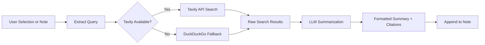

import TLDR from '@site/src/components/TLDR';

# 調査とウェブ検索

<TLDR>
**Notemdはウェブを検索し、LLMで要約された結果を直接メモに挿入します。** Tavily APIが主要な検索バックエンドであり、DuckDuckGoは設定不要の代替手段として機能します。結果は出典の引用と共に要約され、`## Research`という見出しの下に追加されます。単一メモでの調査、フォルダ全体での調査、および要約ステップでのタスク別モデル選択に対応しています。

これは[Obsidian AI知識管理ガイド](/docs/pillar-ai-knowledge)の一部です。
</TLDR>

## 概要

ResearchはNotemdが提供する最も強力な統合機能の一つで、読み取り、検索、書き込みのサイクルを完結させます。見慣れない用語を調べるためにブラウザに切り替える代わりに、その用語をハイライトし、Notemdに検索や要約、結果の追加を任せることができ、すべてはあなたのVault内で行われます。

このプロセスは完全にカスタマイズ可能です。検索プロバイダや要約を記述するLLM、そして結果をアクティブなノートに追加するか別のファイルに保存するかを選択できます。バッチモードを使えば、ワンクリックでフォルダ内のすべてのノートを調査できます。

## 動作の仕組み

### 検索後要約パイプライン



1. **クエリ抽出** – Notemdは、選択した内容やメモのタイトルから検索語を抽出します。
2. **ウェブ検索** – まず Tavily が試行されます。API キーが設定されていない場合は、自動的に DuckDuckGo が使用されます（キーは不要）。
3. **LLM 要約** -- 生の検索結果は設定されたLLMに送信され、そこでインラインの出典引用を含む簡潔な要約が生成されます。
4. **Append** -- フォーマット済みの要約が、アクティブなノート内の`## Research`見出しの下に追加されます。

### Tavily と DuckDuckGo の比較

| アスペクト | Tavily | DuckDuckGo |
|--------|--------|------------|
| APIキー | 必須（無料プランあり） | 必要ありません |
| 結果の品質 | より高度なもの（AI向けに特別に設計されている） | 一般的なクエリには十分です |
| レート制限 | 手厚い無料プラン | スロットリングの対象となります |
| 設定 | 設定の中の`tavilyApiKey` | ゼロ設定 -- 自動フォールバック |

### バッチフォルダーの調査

フォルダを右クリックし、**「Notemd: Research folder」**を選択します。フォルダ内のすべての`.md`ファイルが順番に（または設定された並行度まで同時に）処理されます。各ノートには独自の研究要約が生成されます。

## 設定

| 設定 | デフォルト | エフェクト |
|---------|---------|--------|
| `tavilyApiKey` | `''` | Tavily APIキー。空の場合は、DuckDuckGoのみが使用されます。 |
| `researchProvider` / `researchModel` | DeepSeek | 検索結果を要約するためのタスクごとのLLM |
| `maxResearchContentTokens` | `4000` | LLMに送信されるコンテンツのトークン予算です。超過分は切り捨てられます。 |
| `researchAppendToNote` | `true` | ソースノートに要約を追加します。falseの場合は、別のファイルを作成します。 |
| `researchLanguage` | `'en'` | 要約された研究の出力言語 |

### タスク別モデル推薦

多言語コンテンツを扱い、構造の整った文章を生成するモデルは、研究に大きな恩恵をもたらします。以下を考慮してください：

- **DeepSeek** – デフォルト、手頃な価格、高品質
- **GPT-4o** – より高品質な要約機能、ただしコストも高い
- **Gemini Flash** – 迅速で低コスト、シンプルなクエリに最適

## 例

*transformer attention mechanisms*に関する論文を読んでいると、*relative positional encoding*という見慣れない用語に出会います。Obsidianのままにしておく代わりに：

1. **「relative positional encoding」**をハイライトしてください
2. 右クリック --> **"Notemd: 研究して要約する"**
3. Notemdはウェブを検索し、上位の結果を要約した上で、次の内容を追加します：

```markdown
## Research

### Relative Positional Encoding

Relative positional encoding is a method used in transformer models
where positional information is expressed as relative distances between
tokens rather than absolute positions. Introduced by Shaw et al. (2018),
it improves generalization to unseen sequence lengths compared to
absolute encodings (Vaswani et al., 2017).

Sources:
- [Shaw et al., Self-Attention with Relative Position Representations (2018)](https://arxiv.org/abs/1803.02155)
- [Transformer Positional Encoding Overview](https://example.com/transformer-pos-enc)
```

その要約は現在、あなたのヴォルトに保存されており、検索可能で、リンクを貼れ、オフラインでもアクセスできます。

## ヒント

- **最良の結果を得るためにTavilyキーを設定してください** – 無料プランであっても、生のDuckDuckGoよりも高い関連性が得られます。
- **高性能な要約モデルを使用してください** – 安価なモデルでは微妙な技術的な内容が単純化されてしまう可能性があります。
- 最初に全体を通読した後に**Batch research**を行い、複数のノートに散在する情報のギャップを一度に埋めます。
- **追加された要約の確認** – LLMsは出典の詳細を誤って生成する可能性があります。重要な主張を確認してください。

---

## 次のステップ

- [概念ノート](./concept-notes) – 研究結果から重要な用語を抽出し、保存する
- [Wiki-Links](./wiki-links) – あなたのバンク内で研究から得られた概念同士をリンクする
- [翻訳](./translation) -- 研究の要約を別の言語に翻訳する
- [LLM プロバイダー](/docs/providers/overview) -- 要約に使用するモデルを設定する
