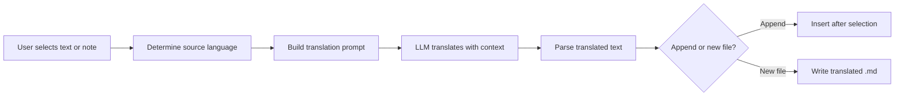

import TLDR from '@site/src/components/TLDR';

# 翻訳

<TLDR>
**Notemdは、LLMが提供する翻訳エンジンを利用して21言語以上でテキストの翻訳を行います。** シングル選択翻訳、全文翻訳、バッチフォルダ翻訳に対応しています。各翻訳タスクでは、タスクごとの設定を通じて専用のプロバイダーやモデルを使用できます。出力言語はUI言語とは別に独立して設定可能です。結果は、お客様の希望に応じて既存ファイルに追記されるか、新しいファイルに書き出されます。

これは[Obsidian AI知識管理ガイド](/docs/pillar-ai-knowledge)の一部です。
</TLDR>

## 概要

Notemdでの翻訳は単なる辞書検索ではなく、LLMを活用した文脈認識型翻訳です。モデルは全文やメモ全体を把握し、文体や専門用語、文の構造を保持します。そのため、フレーズ単位で処理するサービスよりも、特に技術的、学術的、創作的な文章において高品質な結果が得られます。

この機能は、選択、アクティブなノート、およびフォルダ全体という3つのスコープをサポートしています。タスクごとのモデル選択と組み合わせることで、カジュアルな翻訳には高速なモデル（Gemini Flash）を、ニュアンスが重要なコンテンツには高性能なモデル（Claude Sonnet）を使用でき、グローバルプロバイダを変更する必要はありません。

## 動作の仕組み

### 翻訳コマンド



1. **ソース検出** – LLMがコンテンツからソース言語を推測します。手動で指定する必要はありません。
2. **プロンプトの作成** -- Notemdは、対象言語、任意のドメインヒント、そして翻訳する内容を含むプロンプトを作成します。
3. **LLM 翻訳** – 設定された `translateProvider` / `translateModel` がリクエストを処理します。このモデルはマークダウンフォーマット、ウィキリンク、およびコードブロックを保持します。
4. **出力** -- 翻訳されたテキストは、元のテキストの下に追記されるか、バンク内の新しいファイルに書き込まれます。

### 言語ペア

Notemdは、基盤となるLLMがサポートするあらゆる言語ペアをサポートしています。一般的なペアには以下のものがあります：

| ソース | ターゲット | 典型的な品質 |
|--------|--------|----------------|
| 英語 | 中国語（簡体字） | 素晴らしいです。 |
| 中国語 | 英語 | 素晴らしいです。 |
| 英語 | 日本語 | とても良いです。 |
| 英語 | ドイツ語 / フランス語 / スペイン語 | とても良いです。 |
| 対応しているものは何でも | 対応しているものは何でも | モデル依存型 |

`translateLanguage`の設定によって**出力言語**が制御されます。ソース言語は自動的に検出されます。

### タスクごとのモデル選択

翻訳の品質はモデルによって大きく異なります。Notemdを使えば、翻訳専用のモデルを割り当てることができます：

| モデル | スピード | 品質 | コスト | 最適な用途 |
|-------|-------|--------|------|----------|
| `gemini-2.0-flash-exp` | 速い | よし | 低 | カジュアルで大量処理に対応 |
| `gpt-4o-mini` | 速い | よし | 低 | クイック検索 |
| `deepseek-chat` | ミディアム | よし | 非常に低い | 予算多言語対応 |
| `claude-3-5-sonnet` | ミディアム | 素晴らしいです。 | ミディアム | 技術的／学術的 |
| `gpt-4o` | ミディアム | 素晴らしいです。 | ミディアム | ニュアンスに敏感な文章 |

### バッチフォルダ翻訳

フォルダを右クリックし、**「Notemd: フォルダを翻訳」**を選択すると、そのフォルダ内のすべてのノートが翻訳されます。各ファイルは個別に処理されます。並行処理数の設定によって、同時に翻訳されるファイルの数が制御されます。

## 設定

| 設定 | デフォルト | エフェクト |
|---------|---------|--------|
| `translateProvider` / `translateModel` | DeepSeek | 翻訳タスク専用のプロバイダー |
| `translateLanguage` | `'en'` | ターゲット出力言語 |
| `translationAppendToNote` | `true` | 翻訳済みのテキストを元のテキストの下に追加します。falseの場合は新しいファイルを作成します。 |
| `batchConcurrency` | `3` | バッチ翻訳時に並行して処理されるファイル数 |

## 例

中国語の研究ノートを読んでおり、英語版が欲しいです。

1. メモを開く
2. 右クリック --> **「Notemd: 現在のファイルを翻訳する」**
3. Notemdは中国語を検出し、設定された対象言語（英語）に翻訳した上で、次のように追加します：

```markdown
## Translation (English)

The experimental results show that the proposed method achieves
a 12% improvement in F1 score compared to the baseline, primarily
due to the enhanced feature extraction module described in Section 3.
```

翻訳の上にある元の中国語テキストはそのままです。`## Translation`という見出しにより、両方のバージョンが同じファイルに保存され、参照しやすくなっています。

## ヒント

- **大量の翻訳にはGemini Flashを使用してください** – 大規模なフォルダのバッチ翻訳において、最も高速でコストも安いオプションです。
- **ウィキリンクを保持する** – Notemdの指示により、LLMは翻訳時に`[[wiki-links]]`をそのまま維持するよう求められています。一部のモデルでは時折これらが展開されてしまうため、翻訳後に確認してください。
- **出力言語を明示的に設定する** – ソース側は自動検出で対応できますが、ターゲットに関する曖昧さを避けるために常に `translateLanguage` を設定してください。
- **一括翻訳コンセプトノート** – コンセプトフォルダがある言語で作成されており、別の言語に変換したい場合、フォルダ単位の翻訳機能を使えば一括で対応できます。

---

## 次のステップ

- [Research](./research) -- 任意の言語で検索・要約し、その後結果を翻訳する
- [ワークフロー](./workflows) – ワイキリンクや概念抽出を用いた連続翻訳
- [バッチ処理](/docs/advanced/batch-processing) -- フォルダ操作における並行処理と上書き動作
- [LLM プロバイダー](/docs/providers/overview) – ご使用の言語ペアに最適なモデルを選択してください
