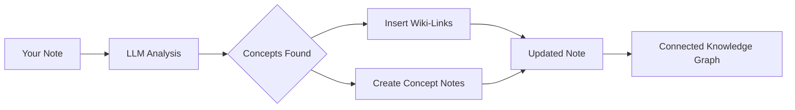

import TLDR from '@site/src/components/TLDR';

# ウィキリンク

<TLDR>
**Notemd**は、ノート内のキーコンセプトに自動的に`[[wiki-links]]`を追加します。LLMはコンテンツを読み取り、文脈内の重要な用語を特定し、各出現箇所にObsidianスタイルのウィキリンクを挿入します。必要に応じて、バックリンク付きのコンセプトノートファイルも作成できます。同義語の抑制、名前変更や削除時のリンクの完全性維持、そしてファイルを修正しない純粋な抽出モードにも対応しています。既存のノートタイトルのみをマッチングするAuto Linkとは異なり、NotemdはAIを利用して新しいコンセプトを特定し、対応するノートを作成します。これは[Obsidian AI Knowledge Management Guide](/docs/pillar-ai-knowledge)の一部です。
</TLDR>

## 概要

ウィキリンク機能はNotemdの核心的な特徴です。これにより、プレーンテキストを以下の方法で相互に接続された知識グラフに変換します：

1. LLMを使ってメモの分析を行います
2. **重要な概念の特定**（用語、人物、手法、理論）
3. 各出現箇所に `[[wiki-links]]` を挿入する
4. **コンセプトノートの作成**（任意）とバックリンク

## 動作の仕組み

### 処理



### 例

**以前:**
```markdown
Machine learning models use neural networks to learn patterns from data.
The transformer architecture revolutionized natural language processing.
```

**後:**
```markdown
[[Machine learning]] models use [[neural networks]] to learn patterns from data.
The [[transformer architecture]] revolutionized [[natural language processing]].
```

## 使用方法

### 基本：現在のノートにリンクを追加する

1. メモを開く
2. エディタで右クリック → **「ファイルを処理する（リンクを追加）」**
3. 数秒待ってください。
4. コンセプトがリンクされました！

### バッチ処理：複数のノートを処理する

1. ファイルエクスプローラーでフォルダを右クリックします
2. **「Notemd: フォルダを処理する（リンクを追加）」**を選択してください。
3. 設定する：
   - 並行処理数（同時に処理できるファイルの数）
   - 既存のリンクを上書きする（はい/いいえ）
4. **Process**をクリックしてください

### 選択的：特定のテキストをリンクする

1. 処理対象のテキストをハイライトしてください
2. 右クリック → **「プロセスの選択（リンクの追加）」**
3. ハイライトされた部分のみが分析されます。

## Notemdとオートリンクの比較

Obsidianには自動的なウィキリンクを行うための2つの方法があります：

| | **自動リンク** | **Notemd** |
|--|---------------|-------------|
| リンク元 | Vault内の既存のノートタイトル | LLMで特定されたコンテンツ内の概念 |
| 新しい概念をリンクできますか | いいえ——タイトルは既に存在していなければなりません。 | はい — AIが概念を認識し、メモを作成します |
| 同義語の処理 | いいえ | はい — 同義語抑制 |
| コンセプトノートの作成 | いいえ | はい — バックリンクと重複排除機能付きです |
| バッチ処理 | いいえ（単一ファイル） | はい（フォルダレベル） |
| タスクごとのモデルルーティング | いいえ | はい |

**Auto Link**はタイトルマッチング機能を持っており、「Machine Learning」という名前のノートが存在する場合、該当部分を`[[Machine Learning]]`で囲みます。ノートが存在しない場合は何も起こりません。

**Notemd**はAI駆動です。LLMがコンテンツを読み取り、文脈を理解し、まだメモが存在しなくてもリンクされるべき概念を特定し、リンクと概念メモの両方を作成します。

## 機能

### 類義語抑制

**問題:** "transformer", "transformers", "Transformer architecture" → 3つの異なる概念

**解決策：** Notemdはほぼ同一のデータを検出し、標準形を使用します。

**設定:**
```
Settings → Advanced → Synonym Suppression
Threshold: 0.8 (0 = off, 1 = aggressive)
```

### リンクの完全性

**コンセプトノートの名前を変更する際：**
- すべてのウィキリンクは自動的に更新されます（Obsidian コア機能）
- バックリンクはそのまま保持されます。

**コンセプトノートを削除するとき：**
- リンクは残っていますが、「未リンクの言及」として表示されます。
- どの出現例からでも再作成できます

### 純粋抽出モード

**元の内容を変更せずに概念を抽出する：**

1. 右クリック → **「コンセプトを抽出（リンクなし）」**
2. コンセプトノートが作成されます。
3. 元のファイルはそのままです

使用例：読み取り専用のコンテンツや最終稿の処理。

## コンセプトノート作成

### 自動作成

**有効になっている場合（デフォルト）、Notemdは次のものを作成します：**

```markdown
---
tags: [concept, auto-generated]
created: 2026-06-13
source: [[Original Note Name]]
---

# Machine Learning

A branch of artificial intelligence that enables computers
to learn from data without explicit programming.

## Occurrences in Your Vault

- [[Original Note Name#Section]]
- [[Another Note#Header]]

## Related Concepts

- [[Neural Networks]]
- [[Deep Learning]]
- [[Supervised Learning]]
```

### 設定

**出力フォルダ:**
```
Settings → Output → Concept Folder
Default: concepts/
```

**階層構造:**
```
Settings → Output → Use Hierarchical Folders
If enabled:
  papers/my-paper.md → papers/concepts/Concept.md
If disabled:
  → concepts/Concept.md
```

**テンプレート:**
```
Settings → Output → Concept Template
Customize with variables:
  {{concept}} — Concept name
  {{description}} — LLM-generated description
  {{backlinks}} — List of source notes
  {{date}} — Creation date
```

## 高度なオプション

### コンテキストウィンドウ

**送信する周辺テキストの量：**

```
Settings → Linking → Context Window
Options: Sentence | Paragraph | Full Note
Default: Paragraph
```

サイズが大きいほど精度は向上しますが、コストも高くなります。

### 最小出現回数

**複数回出現する概念のみリンクしてください：**

```
Settings → Linking → Min Occurrences
Default: 1 (link all)
```

繰り返し出現するテーマに焦点を当てるには、2または3に設定してください。

### 除外パターン

**特定の単語をスキップする:**

```
Settings → Linking → Exclude List
Example: note, idea, example, thing
```

一般的な用語による過度なリンクを防ぎます。

### カスタムプロンプト

**デフォルトのLLM指示を上書きする：**

```
Settings → Advanced → Custom Linking Prompt
Default:
  "Identify key concepts, theories, methods, and technical
   terms in the following text. Return as a list..."
```

ドメイン固有のニーズに合わせて変更する（例：「医療用語に焦点を当てる」）。

## ヒントとベストプラクティス

### ✅ 完了

- **100語以上のメモを処理する** — 短いメモでは概念が少なくなります
- より優れた概念特定のために、強力なモデルを利用してください（GPT-4o、Claude）
- **承認する前に確認してください** — 提示されたリンクが適切かどうかをチェックしてください
- **反復的にビルドする** — 5〜10件のメモを処理し、グラフを確認して設定を調整する

### ❌ やめてください

- **Over-link** — すべての名詞にリンクは必要ない
- **ドラフトを繰り返し処理する** — コンセプトは変わる可能性があるため、安定するまで待機する
- **同義語を無視する** — 「ML」と「Machine Learning」の区別を避けるために抑制機能を有効にする

## パフォーマンス

### スピード

| ノートサイズ | GPT-4o-mini | Claude Sonnet | Ollama (ローカル) |
|-----------|-------------|---------------|----------------|
| 500語 | 2～3秒 | 3～5秒 | 5～10秒 |
| 2000語 | 5～8秒 | 10～15秒 | 20～40秒 |
| 5000語以上 | 分割送信（複数回の呼び出し） | チャンク化された | チャンク化された |

### コスト見積もり

**例：GPT-4o-miniを使った1000語のメモ**
- 入力：約1500トークン
- 出力結果：約200トークン
- コスト：約0.001ドル

**100件のノートをバッチ処理する:** 約0.10ドル

## トラブルシューティング

### リンクは追加されていません。

**チェック:**
1. LLM の呼び出しが成功しました（設定 → 診断）
2. このメモには十分な内容があります（50語以上）。
3. コンセプトとは技術的で具体的なものです（単なる代名詞ではありません）。

**試してみて：**
- より強力なモデルを使用してください
- コンテキストウィンドウを拡大する
- APIキーの有効性を確認します

### リンクが多すぎます

**ソリューション:**
1. 最小出現回数を（2または3）に増やす
2. 除外リストによく使われる単語を追加する
3. より穏やかなモデルを使用してください

### 誤った概念がリンクされています

**修正内容:**
1. ドメイン固有の詳細に合わせてカスタムプロンプトを使用してください
2. 同義語抑制を有効にする
3. 手動で確認し、リンクを解除してください

### 名前を変更するとリンクが切れる

**これは正常なObsidianの動作です。**

すべてのリンクを更新するには：
1. コンセプトノートの名前を変更する
2. Obsidianは自動的に`[[old]]`を`[[new]]`に更新します

---

## 次のステップ

- 📖 [Concept Notes](./concept-notes) — コンセプトノート作成の詳細解説
- 🔍 [Research Integration](./research) — リンク機能とウェブ検索を組み合わせる
- 🎨 [Diagrams](./diagrams) — ナレッジグラフを可視化する
