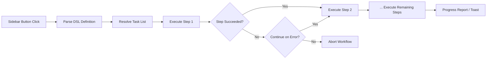

import TLDR from '@site/src/components/TLDR';

# ワークフロー

<TLDR>
**Notemdワークフロー**は、複数のタスクを1回のクリックで実行できる単一のアクションにまとめます。簡単なDSLを使って`add-links > extract-concepts > research > diagram`のようなシーケンスを定義できます。ワークフローはサイドバーのボタンとして表示され、現在のノートやフォルダで全体的な処理が実行されます。事前定義されたワークフローが搭載されており、設定からカスタムのワークフローを作成できます。各ステップは、そのタスク専用のモデル設定を使用します。

これは[Obsidian AI知識管理ガイド](/docs/pillar-ai-knowledge)の一部です。
</TLDR>

## 概要

ワークフローにより、タスクを一つずつ実行する際の手間がなくなります。リンクの追加、概念の抽出、見慣れない用語の調査、図の作成といった作業を行うために4回右クリックする代わりに、サイドバーのボタンを1回押すだけで一連の処理が自動的に実行されます。Notemdが順序の管理、エラーの伝播、進捗状況の報告を担当します。

ワークフローは軽量なDSL（ドメイン特化言語）で定義されます。これらは設定に格納され、Obsidianサイドバーにあるクリック可能なボタンとして表示され、現在のノートまたはフォルダ全体に適用することができます。

## 動作の仕組み

### ワークフロー実行パイプライン



1. **Parse** -- DSL文字列は`>`（または`>`）で区切られ、タスク識別子の順序付きリストに変換されます。
2. **Resolve** -- 各識別子は内部コマンド（add-links、extract-concepts、research、translate、diagramなど）に対応しています。
3. **Execute** -- ステップは順番に実行されます。各ステップでは、タスクごとに設定されたプロバイダーとモデルが使用されます。
4. **エラー処理** – ステップが失敗した場合、エラーポリシーに応じてワークフローは中止されるか、次のステップに進み続けます。
5. **完了** – トースト通知によって成功が報告されるか、失敗したステップが一覧表示されます。

### DSL形式

ワークフローとは、`>`で区切られたタスク識別子の連なりとして定義されます。

```
process-current-add-links>extract-concepts-current>research-and-summarize
```

**利用可能なタスク識別子:**

| 識別子 | アクション |
|------------|--------|
| `process-current-add-links` | アクティブなノートにウィキリンクを追加する |
| `extract-concepts-current` | アクティブなノートから概念を抽出する |
| `research-and-summarize` | 選択したテキストやメモのタイトルについて調査してください |
| `process-current-translate` | アクティブなノートを翻訳する |
| `summarize-to-mermaid` | アクティブなノートから図を生成する |
| `generate-from-title` | メモのタイトルからコンテンツを生成する |
| `extract-original-text` | 元のテキストを抽出する（OCRやスキャンされたコンテンツ用） |

**フォルダレベルのバリアント**では、識別子名内の`current`が`folder`に置き換えられます。

### 事前定義済みワークフローとカスタムワークフロー

Notemdには、よくあるパターン用の既成のワークフローが同梱されています：

| ワークフロー | チェーン | ユースケース |
|----------|-------|----------|
| **ワンクリック抽出** | add-links > extract-concepts > research | 一度の処理で研究論文を処理する |
| **フルパイプライン** | add-links > extract-concepts > research > diagram | 可視化を伴う完全な知識抽出 |
| **翻訳 + リンク** | 翻訳 > リンクの追加 | 翻訳してから、対象言語での概念をリンクします |

**カスタムワークフロー**は設定で作成されます：

1. **設定**を開き、**Notemd**、次に**ワークフロー**へ進みます。
2. **「ワークフローを追加」**をクリックしてください。
3. DSLチェーンを入力してください（例：`process-current-add-links>extract-concepts-current`）
4. 表示名を設定してください（例：「クイックリンク + 抽出」）。
5. 新しいボタンがすぐにサイドバーに表示されます。

## 設定

| 設定 | デフォルト | エフェクト |
|---------|---------|--------|
| `workflows` | 事前定義されたセット | ワークフロー定義の配列（名前 + DSL） |
| `workflowContinueOnError` | `true` | 現在のステップで失敗した場合は、次のステップに進んでください。 |
| `workflowShowProgress` | `true` | 各ステップが完了するたびに進捗のトーストを表示します |

### ワークフローにおけるタスク単位モデル

ワークフローの各ステップでは、タスクごとに**独自の**モデル設定が使用されます。DSL自体でモデルを指定する必要はありません。解決順序は次の通りです：

1. `useMultiModelSettings`が有効な場合のタスクごとのプロバイダー/モデル
2. グローバル `activeProvider` でなければ

つまり、`add-links`はDeepSeek上で実行でき、`research`はGPT-4o上で実行される――すべて同じワークフローのクリック内で行われます。

## 例

あなたはちょうど機械学習の論文のPDFをバンクにインポートし、完全な知識抽出を行いたいと思っています。

1. インポートされたノートを開く
2. **「Full Pipeline」**サイドバーのボタンをクリックしてください
3. Notemd が実行されます：
   - **ステップ1**: wikiリンクを追加する -- `[[attention mechanism]]`、`[[transformer]]`など。
   - **ステップ2**: コンセプトの抽出 – コンセプトフォルダにコンセプトノートを作成します
   - **ステップ3**: 調査 -- キーワードに関するウェブソースを要約する
   - **ステップ4**: ダイアグラム – 論文の構成を示すMermaidマインドマップを生成する
4. 約30秒後、メモにはリンクが追加され、コンセプトノートが作成され、調査結果が付加され、図表ファイルが保存されます

ワンクリックで全てが可能です。

## ヒント

- **事前定義されたワークフローから始めましょう** – これらは最も一般的なパターンをカバーしています。異なる順序が必要な場合のみカスタマイズしてください。
- **`workflowContinueOnError`を有効にする** – ダイアグラムのステップが失敗しても、パイプライン全体が中断されるべきではありません。
- 一括処理には**Use folder workflows**を利用してください。フォルダを右クリックし、ワークフローを選択すると、すべてのノートが処理されます。
- **ワークフローの名前を明確に** – サイドバーのスペースは限られています。「Quick Extract」や「Translate + Link」のような短くて具体的な名前を使用してください。

---

## 次のステップ

- [Research](./research) -- ワークフローに追加する前に、リサーチステップが何を行うのかを理解する
- [Wiki-Links](./wiki-links) – ほとんどのワークフローで使用されるコアなリンク機能
- [Concept Notes](./concept-notes) – ワークフローステップとしての概念抽出
- [バッチ処理](/docs/advanced/batch-processing) – フォルダワークフローにおける並行処理と進捗報告
