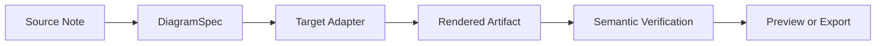
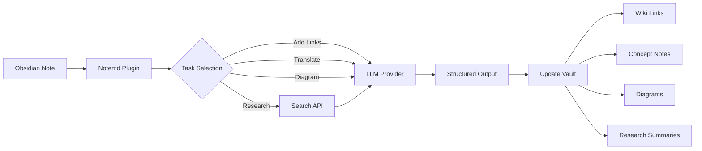

import TLDR from '@site/src/components/TLDR';

# Notemd入門

<TLDR>
**Notemd**（Note + EMD — Enhanced Markdown Documents）は、LLMを利用した読書内容を永続的な知識に変換するオープンソースのObsidianプラグインです。セッション終了後に洞察が消えてしまうチャット型AIとは異なり、Notemdは結果をウィキリンク、コンセプトノート、研究要約、翻訳、ワークフロー、図表といった形で**直接あなたのバルトに保存**します。これは、読書や研究、視覚的説明を構造化された、進化し続ける知識グラフとして蓄積したい研究者、学生、知識労働者向けに作られています。
</TLDR>

## Notemdとは何ですか？

Notemdは、**30以上の大規模言語モデル**（OpenAI、Anthropic、Google、DeepSeek、Qwen、Ollamaなど）をあなたのObsidianワークフローに統合し、知識の抽出、整理、翻訳、調査、図表作成を自動化します。

### 主な違い：一時的知識と永続的知識

| アスペクト | チャットベースのAI（ChatGPTなど） | Notemd |
|--------|-------------------------------|--------|
| **結果の保存先** | チャット履歴（消去される） | お使いのObsidianバレット（永続的に保存されます） |
| **形式** | プレーンテキストの回答 | 構造化ファイル：`[[wiki-links]]`、コンセプトノート、図解 |
| **長期的な価値** | 毎回再び尋ねなければなりません。 | 知識グラフとして蓄積される |
| **オフラインアクセス** | インターネットが必要です。 | Ollamaを使えば完全にオフラインで動作します。 |

## コア機能

### 1. **自動的なWikiリンク生成**
- LLMは、メモ内の重要な概念を示します。
- 各出現位置に `[[wiki-links]]` を挿入します
- 必要に応じて、リンク付きのコンセプトノートを作成します
- 重複を避けるための同義語抑制

### 2. **コンセプトノートの作成**
- 論文、記事、メモから核心的な概念を抽出する
- バックリンクを含む専用のコンセプトファイルを生成します
- 出力パスとテンプレートのカスタマイズ

### 3. **ウェブリサーチの統合**
- Obsidian内からTavilyまたはDuckDuckGoをクエリしてください
- LLMは出典を引用して結果を要約します
- 現在のメモに研究結果を追加する

### 4. **多言語翻訳**
- 選択部分またはノート全体を翻訳する
- 21以上のUI言語に対応しています。
- 独立した出力言語設定
- バッチ翻訳サポート

### 5. **図の生成**
- **Mermaid**: フローチャート、シーケンス、クラス、ステート、ER、ガントチャート
- **JSON Canvas**: Obsidian ネイティブレイアウト
- **Vega-Lite**: データチャート、時系列グラフ、散布図
- **HTML / 編集可能な HTML/SVG**: 意味論的注釈を持つ、独立した図面アーティファクト
- **Draw.io / Drawnix アーティファクト境界**: 同じセマンティックフィギュアモデルからメンテナ向けにエクスポートされるパス
- **回路図ロードマップ**：circuitikz/TikZJaxのサポートは、制約のない生のLLMTikZではなく、ゴールデンリファレンス、制約付きプロンプト、レンダリングフィードバック、およびトポロジー/レイアウトの検証を中心に設計されています。
- **プレビュー診断**: レンダリングエラーによりコンパイルやレンダリング時の問題が発生することがあり、プラグイン側のLaTeXランタイムを必要とせずに非インラインソースを確認できます
- Mermaidエラーの構文自動修正

### 6. **ワンクリックワークフロー**
- サイドバーのボタンに複数のアクションを連結する
- DSLベースのワークフロー定義
- 例：`add-links > extract-concepts > research > diagram`

## Notemdは誰が使うべきですか？

✅ 論文を読んだり、レビューを作成したりする**研究者**
✅ **学生**が学習ノートを整理し、概念マップを作成しています
✅ 読んだ内容の知見を保持したい**ナレッジワーカー**向け
✅ 翻訳とウィキリンクが必要な**バイリンガルの専門家**
✅ ローカルのLLMサポートを希望する、プライバシーを重視するユーザー (Ollama)
✅ プロンプトやワークフローをカスタマイズする**パワーユーザー**

## なぜNotemd + Obsidianなのでしょうか？

**Obsidian**はローカル優先の、Markdownベースのナレッジベースです。**Notemd**はAIの強力な機能を追加します：
- お客様のデータはお客様のバルトに保管されます（クラウドサービスではありません）。
- ローカルモデルを使用してオフラインで動作します
- 無料でオープンソース（MITライセンス）
- 既存のObsidianプラグインと連携します
- 数万のノートまでスケーラブル

## はじめに

1. **インストール**: 設定 → コミュニティプラグイン → 取得 → "Notemd"
2. **設定**: 自分のLLMプロバイダーのAPIキーを追加するか（またはローカルのOllamaを使用する）
3. **試してみる**: メモを開く → 右クリック → 「ファイルを処理する（リンクを追加）」
4. **探索**: サイドバーでワンクリックワークフローを確認してください

👉 [インストールガイド](./getting-started/installation) | [クイックスタートチュートリアル](./getting-started/quick-start)

## 図表作成機能の方向性

Notemdの図作成手法は、「モデルに1つの構文文字列を書かせる」というアプローチから、階層的なパイプラインへと移行しつつあります。

現在の実装では、Mermaid、JSON Canvas、Vega-Lite、HTMLへのフォールバック、編集可能なHTML/SVG、Draw.io XMLアーティファクト、最小限のDrawnix JSONサブセット、プレビュー診断機能/ソースのみのフォールバック、そして一般的なソースやCMOSインバータのゴールデンテンプレート向けのオフライン版`CircuitSpec -> circuitikz`プロトタイプが既にサポートされています。回路図はより扱いが難しいカテゴリであり、circuitikzでは正確な電気的トポロジーを表現できますが、制約のないLLM出力では読みにくい配線やレンダリングされないLaTeXが生成されることが多いです。今後の方向性としては、ゴールデンリファレンステンプレート、ノードグリッドレイアウトルール、レンダリング診断機能、スクリーンショットフィードバックループによってcircuitikzを引き続き制約することです。

[Diagrams](./features/diagrams)にある詳細をご覧ください。

## アーキテクチャ

## Notemd と他の Obsidian AI プラグインの比較

ほとんどのObsidian AIプラグインは会話中心で（ユーザーが質問し、AIが回答し、洞察はチャット内に残ります）。一方、Notemdは**記述中心**で、AIがユーザーのメモを処理し、構造化された結果を直接ユーザーのバンクに書き込みます。

| 機能性 | Notemd | Copilot | Smart Connections | Text Generator |
|-----------|--------|---------|-------------------|-----------------|
| 自動ウィキリンク挿入 | はい | いいえ | いいえ | いいえ |
| コンセプトノートの作成 | はい（バックリンク付き＋重複除外） | いいえ | いいえ | いいえ |
| 図の生成 | はい（Mermaid、Canvas、Vega-Lite、HTML、編集可能なアーティファクト） | いいえ | いいえ | いいえ |
| ウェブリサーチ統合 | はい (Tavily + DuckDuckGo) | いいえ | いいえ | いいえ |
| バッチフォルダ処理 | はい | 限定版 | いいえ | 限定版 |
| タスクごとのモデルルーティング | はい（7つのタスク、独立したモデル） | いいえ | いいえ | いいえ |
| ワンクリックワークフローチェーン | はい (DSL) | いいえ | いいえ | いいえ |
| 翻訳（バッチ） | はい | いいえ | いいえ | いいえ |
| Vaultとチャットする | いいえ | はい | いいえ | いいえ |
| 意味的類似性検索 | いいえ | いいえ | はい | いいえ |
| テンプレートベースの生成 | いいえ | いいえ | いいえ | はい |
| LLM プロバイダー | 36（クラウド + ゲートウェイ + ローカル） | 3-5 | 2-3 | 3-5 |
| 完全なオフライン状態 | はい (Ollama) | 部分的 | 部分的 | 部分的 |

**Notemdを選ぶべきタイミング**: ノートについてチャットするだけでなく、AIに永続的な知識グラフを構築してほしい場合です。

**Copilotを選ぶべき時期**: Obsidian内に会話型のAIアシスタントを導入したい場合です。

**Smart Connectionsを選ぶべきタイミング**: セマンティック検索を通じて、ノート間の既存の関係性を発見したい場合です。

## 哲学

**Notemd**は、AIは人間の知識労働を置き換えるのではなく、補完すべきだと考えています。このプラグイン：
- 変更を適用する前に確認でき、コントロールを維持します。
- コンテキストを保持します（すべての結果は元の情報にリンクしています）
- プライバシーを尊重（ローカルのLLMサポート、テレメトリなし）
- 拡張性が保たれる（オープンなAPIs、カスタムワークフロー）

<!-- notemd-acknowledgments -->
## 謝辞と参照プロジェクト

Notemd は独立して保守されています。文書化された設計判断に影響を与えた、または統合の基盤を提供するオープンソースのプロジェクトとコミュニティに感謝します。ここへの掲載は影響または相互運用性のみを示すものであり、推奨、提携、コードの同梱、またはコード再利用の主張を意味しません。

- **参照プロジェクト:** [cloudy-tech-diagrams-skill](https://github.com/cloudy-liu/cloudy-tech-diagrams-skill), [Drawnix](https://github.com/plait-board/drawnix), [diagrams.net / draw.io](https://www.diagrams.net/), [repo-saga](https://github.com/teee32/repo-saga).
- **オープンソースの基盤:** [Mermaid](https://github.com/mermaid-js/mermaid), [Vega-Lite](https://vega.github.io/vega-lite/), [Slidev](https://github.com/slidevjs/slidev), [CircuitikZ](https://github.com/circuitikz/circuitikz), [Tectonic](https://github.com/tectonic-typesetting/tectonic), [Docusaurus](https://docusaurus.io).
- 各プロジェクトは独自のライセンスと条件を保持します。Notemd は [MIT ライセンス](https://github.com/Jacobinwwey/obsidian-NotEMD/blob/main/LICENSE) で提供されています。

## オープンソース

- **ライセンス**: MIT
- **出典**: [github.com/Jacobinwwey/obsidian-NotEMD](https://github.com/Jacobinwwey/obsidian-NotEMD)
- **コミュニティ**: [Discord](https://discord.gg/qnGgsQ9W) | [GitHub Discussions](https://github.com/Jacobinwwey/obsidian-NotEMD/discussions)
- **貢献する**: PRの提出を歓迎します。[CONTRIBUTING.md](https://github.com/Jacobinwwey/obsidian-NotEMD/blob/main/CONTRIBUTING.md)をご覧ください。

---

**次へ**: [インストール →](./getting-started/installation)
