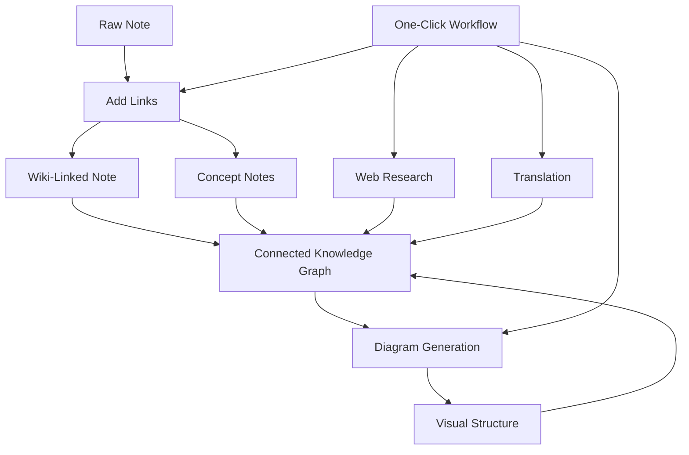

import TLDR from '@site/src/components/TLDR';

# Obsidian AIナレッジマネジメントガイド

<TLDR>
**Notemdは、LLMを活用した読書内容を永続的な知識に変換します。ウィキリンクによって概念同士が結びつき、コンセプトノートによって検索可能なグラフが作成され、研究機能によってウェブ上の情報が自分だけのデータベースに取り込まれ、翻訳機能によって言語の壁が取り払われ、図表によって構造が可視化され、ワークフローによってこれらすべてがワンクリックで連携します。**このガイドでは、生のメモから相互につながった視覚的で多言語対応の知識ベースが完成するまでの全プロセスを解説しています。
</TLDR>

## なぜAIナレッジマネジメントなのか？

従来のメモ取りでは平らなファイルが作成されます。手動でウィキリンクを設定しても、ほとんどのメモは結びつきません。Notemdは LLMs を利用して接続層を自動化します：

- **LLMsはあなたのコンテンツを読み**、重要な要素——用語、手法、人物、理論——を特定します
- 各コンセプトが出現するたびに**リンクが自動的に挿入**され、「関連項目」に隠されることはありません。
- **コンセプトノートは**、独立した取得可能なファイルとして生成されます
- **Research enriches notes**はウェブからの情報を使ってノートを充実させます
- **図表によって構造が可視化される** — 同じコンテンツから作成されたマインドマップ、フローチャート、データチャート

その結果、リンクを追加するのを忘れている時だけでなく、処理する各ノートごとに成長していく知識グラフができあがります。

## フルパイプライン



各ステップは独立しています。1つまたはすべてを使用してください。最も効果的な順序は：**Add Links → Concept Notes → Diagrams**です。

---

## 1. Wikiリンク：接続関係を明示的にする

ウィキリンクはナレッジグラフの骨格となるものです。NotemdはLLMを使用して以下のことを行います：

1. メモの内容を読み込みます（長文の場合は複数のチャンクに分割されます）
2. 核心的な概念を特定する——一般的な名詞よりも具体的な技術用語を優先する
3. 各出現箇所に `[[wiki-links]]` を挿入してください
4. 同義語を抑制し、「ML」と「Machine Learning」が別々のノードを生成しないようにする

### いつ使用するか

- **100語を超えるすべてのメモ** — 短いメモでは概念が少なくなります
- **研究論文、技術ドキュメント、会議メモ** — 分野特有の用語が豊富に含まれている
- **コンテンツが安定した後** — ドラフトを繰り返し処理しないでください

### キー設定

| 設定 | おすすめ | なぜですか？ |
|---------|-----------|-----|
| `addLinksProvider` | DeepSeek または GPT-4o-mini | 低コストで高い精度 |
| 同義語抑制 | オン | 重複するノードの発生を防ぎます |
| コンテキストウィンドウ | 段落 | 精度とコストのバランス |

→ [Wiki-Linksの詳細解説](/docs/features/wiki-links)

---

## 2. コンセプトノート：取得可能な知識ノード

ウィキリンクはアイデア同士を文中で結びつけますが、コンセプトノートでは各アイデアを独立して検索可能にします。各コンセプトには独自の`.md`ファイルが割り当てられます：

```markdown
# Machine Learning

## Linked From
- [[My Research Notes]]
- [[Neural Networks Explained]]
```

### 抽出処理

LLMプロンプトは非常に構造化されています：
- 単数形に正規化する
- 単語よりも複数の単語で構成される概念を優先してください（「Relaxation」ではなく「Dielectric Relaxation」）。
- 参考文献や書誌情報のセクションをスキップする
- 決定的な解析のために`CONCEPT:`行で出力してください

コンセプトは`Set<string>`を介して各チャンク間で重複が排除されます。個々のチャンクで発生するLLMエラーは処理の中止にはつながりません。

### バックリンク

有効にすると、各コンセプトノートはそれを言及しているソースノートを追跡します。Obsidianのネイティブなバックリンクパネルでも逆方向の接続が表示されます。

### 重複除去

Notemdの4ステップ重複除去エンジンが検出するもの：
1. **正確な一致** — 大小文字を区別しないファイル名の比較
2. **複数形** — 「Models.md」と「Model.md」
3. **シンボルの正規化** — 「A-B.md」と「A B.md」
4. **単語単位の検出** — 「Machine Learning.md」が存在する場合、「ML.md」がフラグ付けされる

### キー設定

| 設定 | おすすめ | なぜですか？ |
|---------|-----------|-----|
| `conceptNoteFolder` | `concepts/` または `🧠 concepts/` | 金庫を整理整頓しておく |
| `extractConceptsAddBacklink` | オン | 逆引き検索を有効にする |
| `extractConceptsMinimalTemplate` | オフ | Linked Fromが含まれた完全なテンプレート |
| タスクごとのモデル | DeepSeek | 概念抽出には高価なモデルは必要ありません。 |
| 同義語抑制 | オン | 同じ設定はリンク作成と抽出の両方に影響します。 |

→ [コンセプトノートの詳細解説](/docs/features/concept-notes)

---

## 3. 研究：ウェブの活用

Notemdは、ノート作成のワークフローにウェブ検索機能を統合します：

1. **クエリの作成** — メモのタイトルや選択内容が検索クエリになります
2. **ウェブ検索** — Tavily（推奨、APIキーが必要）または DuckDuckGo（無料、キー不要）
3. **LLM要約機能** — 検索結果を関連性の高い要約にまとめます
4. **メモに追加** — カーソル位置に要約を追加するか、新しいセクションとして追加します

### いつ使用するか

- 新しいトピックを処理する前に、まずウェブコンテキストを取得してください
- コンセプトノートに詳細情報が必要な場合は、まず調査を行い、その後リンクを追加してください
- 文献レビュー用に、メモのフォルダを一括で調査する

### キー設定

| 設定 | おすすめ | なぜですか？ |
|---------|-----------|-----|
| `researchProvider` | GPT-4oかClaudeか | 研究にはより高品質な要約が求められます。 |
| 検索サービス | Tavily | より高い関連性、深さの設定が可能 |
| `maxResearchContentTokens` | 4000 | 深さとコストのバランス |

→ [詳細調査](/docs/features/research)

---

## 4. 翻訳：言語の壁を打ち破る

Notemdは、設定されたLLMを使ってメモを翻訳します。専用の翻訳APIではありません。つまり、次のようなことになります：

- **文脈認識型翻訳** — LLMは文単位ではなく、文書全体を理解します
- **技術用語の扱い** — 「gradient descent」は「坡度向下」ではなく「梯度下降」として保持されます
- **バッチサポート** — 1回の操作でノートのフォルダ全体を翻訳する
- **タスクごとのモデル** — 翻訳にはGemini Flashを使用（高速で低コスト、多言語対応）

### 言語サポート

Notemd自体は21のUI言語に対応しています。翻訳対象言語はタスクごとに設定可能です。よく使われるペアはEN↔ZH、EN↔JA、EN↔KO、EN↔DE、EN↔FR、EN↔ESです。

→ [翻訳の詳細分析](/docs/features/translation)

---

## 5. ダイアグラム：構造を可視化する

Notemdの図面パイプラインは仕様優先です。まずLLMが構造化された`DiagramSpec` JSONを生成し、その後アダプターがそれを目的の形式に変換します。これにより、LLMに生のMermaid構文を依頼するよりも信頼性の高い出力が得られます。

### 意図検出

Notemdはコンテンツから最適な図の種類を推測します：

- **数字付きの表** → データチャート (Vega-Lite)
- **クライアント/サーバー用語集** → シーケンス図 (Mermaid)
- **エンティティ/主キー** → ER図 (Mermaid)
- **ステップ/プロセスフロー** → フローチャート (Mermaid)
- **コンセプトマップのキーワード** → JSON Canvas (Obsidian ネイティブ)
- **デフォルト** → マインドマップ (Mermaid)

### レンダリングチェーン

一次ターゲット → フォールバック → フォールバック → HTML。もし Mermaid の構文にエラーが発生した場合、エラー内容を含めて LLM に一度再試行し、その後最小限の図に切り替えます。

### キー設定

| 設定 | おすすめ | なぜですか？ |
|---------|-----------|-----|
| `enableExperimentalDiagramPipeline` | オン | 仕様優先によるより高い品質 |
| `experimentalDiagramCompatibilityMode` | `best-fit` | インテントごとのネイティブターゲット |
| `summarizeToMermaidProvider` | GPT-4oかClaudeか | 図面の仕様には空間的推理が必要です。 |
| `autoMermaidFixAfterGenerate` | オン | LLMの構文エラーを自動的に検出します |
| ローカル知識の拡張 | ドメイン固有の設定でオンにする | Vaultコンテキストにより精度が向上します |

→ [図解の詳細解説](/docs/features/diagrams)

---

## 6. ワークフロー：ワンクリック自動化

ワークフローは複数のタスクを1つのサイドバーボタンに連結します。DSLの形式は次の通りです：

```
task1 | task2 | task3
```

例: `addLinks` | 概念抽出 | generateDiagram` — テキストからワンクリックで完全に接続された視覚的な知識ノードに変換します。

### 推奨されるワークフロー

| ワークフロー | チェーン | ユースケース |
|----------|-------|----------|
| 全処理 | `addLinks \| extractConcepts \| generateDiagram` | 新しいメモ |
| まずは調査を行う | `research \| addLinks` | 馴染みのないトピック |
| ポリグロット | `translate \| addLinks` | 多言語メモ |
| 図面のみ | `generateDiagram` | 迅速な可視化 |

→ [ワークフローの詳細解説](/docs/features/workflows)

---

## 7. LLM プロバイダー：クラウドからローカルまで36のオプション

Notemdは4種類のトランスポートタイプにわたり36のプロバイダをサポートしています。キーグループ：

- **国際クラウド**: OpenAI, Anthropic, Google, Mistral, xAI
- **China cloud**: DeepSeek, Qwen, Doubao, Moonshot, GLM, Baidu, SiliconFlow
- **ゲートウェイ**: OpenRouter, GitHub Models, Hugging Face, Vercel
- **ローカル**: Ollama、LMStudio、OVMS — APIキーはなく、データはお使いのマシンから外部に出ません

### タスクごとのモデル戦略

最もコスト効率の高い構成とは、単純なタスクには安価なモデルを、複雑なタスクには高性能なモデルを使用することです：

```
extractConcepts  → DeepSeek (fast, cheap, accurate enough)
addLinks          → DeepSeek or GPT-4o-mini
research          → GPT-4o or Claude (needs quality)
generateDiagram   → GPT-4o or Claude (needs spatial reasoning)
translate         → Gemini Flash (fast, multilingual)
```

→ [LLM プロバイダー概要](/docs/providers/overview)

---

## はじめにチェックリスト

1. **Notemdのインストール** — [Community Plugins](/docs/getting-started/installation)（推奨）または手動
2. **プロバイダの設定** — DeepSeek（最も簡単）、OpenAI、または Ollama（無料）
3. **最初のメモを処理する** — 右クリック → 「ファイルを処理する（リンクを追加）」
4. **コンセプトフォルダの設定** — 設定 → Notemd → 出力 → コンセプトフォルダ
5. **概念抽出** — 同じノートに対して「概念抽出」を実行する
6. **図を生成する** — 「図を生成する」コマンドを実行して接続関係を可視化します
7. **ワークフローの作成** — 上記を連携させてワンクリックボタンにする

## 推奨設定

### 学生（予算版）

```
Provider: DeepSeek (free tier available)
Concept extraction: DeepSeek
Research: DuckDuckGo (free) + DeepSeek
Diagrams: Off (or legacy Mermaid)
Workflows: addLinks | extractConcepts
```

### 研究員（品質）

```
Provider: GPT-4o (primary)
Concept extraction: DeepSeek (cost savings)
Research: GPT-4o + Tavily
Diagrams: best-fit mode, GPT-4o
Workflows: research | addLinks | extractConcepts | generateDiagram
```

### プライバシー最優先（ローカルのみ）

```
Provider: Ollama (llama3 or qwen2.5:7b)
All tasks: Ollama
Research: DuckDuckGo (free, no API key)
Diagrams: legacy Mermaid mode
```

### 二か国語対応（中国語 + 英語）

```
Primary: DeepSeek (Chinese queries)
Translation: Google Gemini Flash
Research: Tavily + DeepSeek (Chinese search context)
Language output: per-task (extractConceptsLanguage: zh-CN)
```

---

## よくあるパターン

### パターン：研究論文の処理

1. PDFのコンテンツをインポートする（または貼り付ける）
2. **Research** — そのトピックに関するウェブ上の情報を取得する
3. **リンクの追加** — 主要な概念を特定してリンクを設定する
4. **概念抽出** — 独立したメモの作成
5. **図の生成** — 論文の構造を可視化する

### パターン：デイリーノートの充実化

1. 日記を書く
2. **リンクの追加** — 今日のアイデアを既存の概念と結びつける
3. コンセプトノートはバックリンクによって自動的に更新されます

### パターン：文献レビュー

1. papers/notesという名前のフォルダを作成してください
2. **一括リンク追加** — フォルダ全体を処理する
3. **重複するコンセプトの除去** — 近似した重複ノートの整理
4. **図の生成** — 全ての文献のマインドマップ

---

*Notemdはオープンソース（MITライセンス）で、すべてのプラットフォーム上でObsidian 0.15.0+と連携して動作します。[今すぐインストール](/docs/getting-started/installation)するか、[GitHubで確認](https://github.com/Jacobinwwey/obsidian-NotEMD)してください。*
