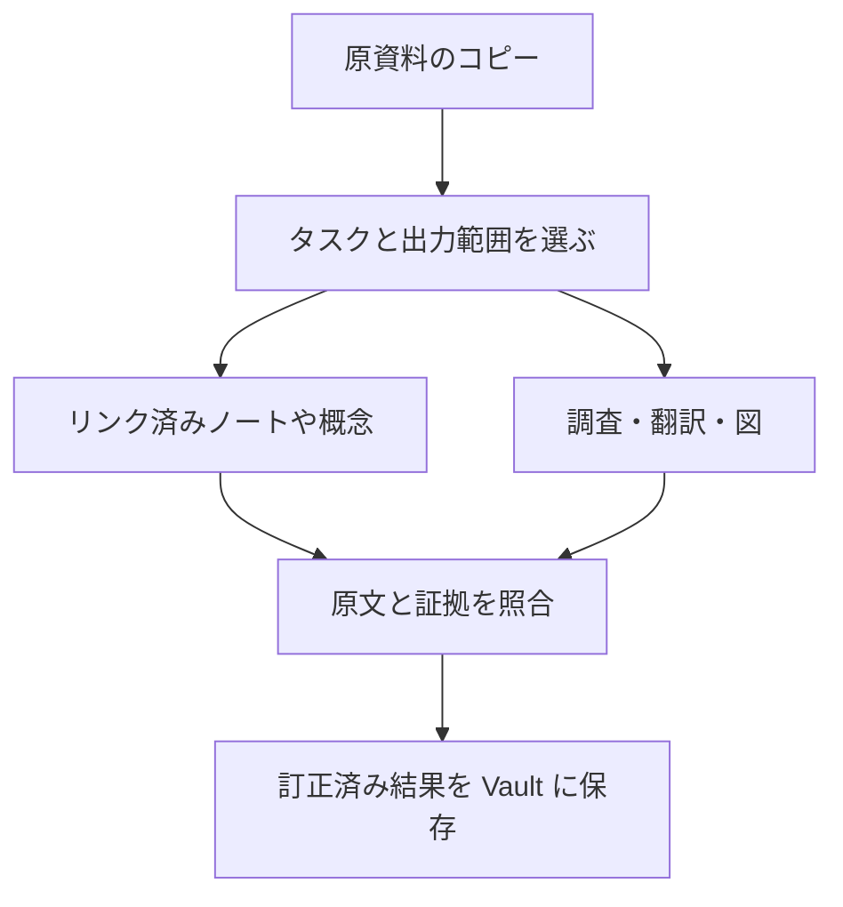

import TLDR from '@site/src/components/TLDR';

# Obsidian AI 知識管理ガイド

<TLDR>
役立つ知識ワークフローでは原資料、モデル出力、自分の訂正を区別します。Notemd は確認できるファイルを生成するリンク、抽出、調査、翻訳、図のタスクを提供します。一つの資料を検証してから、範囲を絞ったフォルダーを自動化します。
</TLDR>

## 欲しい成果を定義する

リンク済み読書ノート、概念集、出典のある要約、翻訳、図のどれが必要かを決めます。ファイルやリンクの増加は理解や検索の改善を自動的には意味しません。正しさの確認方法と後で探す方法を決めます。

## 全体の流れ


```mermaid
flowchart TD
    A[原資料のコピー] --> B[タスクと出力範囲を選ぶ]
    B --> C[リンク済みノートや概念]
    B --> D[調査・翻訳・図]
    C --> E[原文と証拠を照合]
    D --> E
    E --> F[訂正済み結果を Vault に保存]
```

選べるタスクの図であり、一つの既定ボタンですべてを行う意味ではありません。原文と出力先を確認してから連続処理にします。

## 1. Wiki リンク：関係を明示

**ファイルを処理（リンク追加）** を試し、既定の `_processed.md` を確認します。語が有用な移動先か、引用、コード、式が忠実かを照合します。

分野指定と同義語抑制はモデルを導きますが、同一概念や数値閾値は強制しません。既存名への再現可能性が重要なら決定的なタイトル照合を選びます。

[Wiki リンク](./features/wiki-links)

## 2. 概念ノート：語と説明を分ける

抽出前に概念フォルダーを設定します。単独抽出はタイトルのみで原文を変更しません。新規ファイルに `Linked From` が必要ならバックリンクを有効にし、最小テンプレートを無効にします。

抽出と説明生成は別操作です。**タイトルから一括生成** は新規だけでなく既存の対象ノートも処理し得ます。試行用フォルダーと complete 移動先を確認します。

重複判定は名前のヒューリスティックです。近い名称でも技術的意味が異なり得るため、削除候補を確認します。

[概念ノート](./features/concept-notes)

## 3. 調査：証拠を残す

主題またはタイトルを使い、Tavily／DuckDuckGo を選んで **調査して要約** を実行します。Tavily キーが空でも自動切替しません。URL を開き、追記された重要な主張を確認します。

任意のローカル検索は語彙索引を使います。抜粋は選択 LLM に渡るため、索引がローカルでも全経路がオフラインまたは端末内とは限りません。

[調査](./features/research)

## 4. 翻訳：意味と構造を確認

目標言語でファイル翻訳します。既定 `_<language>.md` は既存出力を上書きし得ます。段落だけなら一時ノートへコピーします。

用語、数字、コード、リンク、数式を原文と照合します。長文の分割は文脈を落とす場合があります。UI 21 とサイト34言語は翻訳精度の証拠ではありません。

[翻訳](./features/translation)

## 5. 図：編集できる成果物を選ぶ

1 回の実行で複数の図表タイプを選び、タイプごとに複数の出力形式を指定できます。選択を解除しても形式の設定は保持されます。すべて解除すると、本文を自動解析します。 チェックボックスで生成対象に含めます。名前をクリックすると、そのタイプを選択して形式設定を開きます。ホバーやキーボードフォーカスでは設定を保存せずプレビューだけ切り替えます。Escape でメニューを閉じ、フォーカスを戻します。

カタログ内の対応選択肢を使います。CircuitikZ は制約付きで別途コンパイル確認が必要。Drawnix の静的枝間矢印は再配置で外れ得ます。PowerPoint 表は改善されていますが Mermaid／SVG は画像フォールバックがあり得ます。

[図のガイド](./features/diagrams)

## 6. ワークフロー：検証した順序を自動化

名前、`::`、`>` 区切りの ID を使います。既定は：

```text
One-Click Extract::process-current-add-links>batch-generate-from-titles>batch-mermaid-fix
```

リンク、フォルダー本文生成、Mermaid 修復で、一般的な調査や図生成は追加しません。各タスクの前提と出力は維持され、任意のテキストパイプではありません。

報告失敗で停止するのが既定です。残り入力で後続が動ける場合だけエラー後の続行を使います。キャンセルは出力を保持し、取り消しません。

[ワークフロー](./features/workflows)

## 7. プロバイダー：プロトコルと負荷を合わせる

36 プリセットは五系列をカバーします。URL、利用権、データ方針、実測結果で選びます。速度や費用の比較には同じ入力とプロンプトを使います。

タスク別の指定は既定で無効です。明確に異なる profile を使いたいときだけ有効化し、ローカルだとみなす前に全タスクを確認します。

[プロバイダー概要](./providers/overview)

## 開始チェック

1. 導入し、原資料を保存。
2. 正確な provider/model を設定・試験。
3. 概念フォルダーと別出力先を設定。
4. コピー一つに一タスクを実行。
5. 原文と照合し、訂正を保持。
6. 小フォルダーの部分完了を確認してから長い列に拡張。

## よく使う構成

### 論文を読む

外部ツールで Markdown に変換し、数式、表、図の誤りを先に点検します。概念や原文を抽出し、指定問題を調査します。検証できる関係の説明に役立つときだけ図を生成し、原論文リンクと訂正を残します。

### 概念集を管理

専用フォルダーで用語を確認し、選んだ部分集合だけに説明を生成します。重複整理前に保存します。数ではなく定義の正確さと移動のしやすさを確認します。

### 非公開資料を扱う

ローカルモデルと依存を事前導入し、タスク別配信先を調べます。オフラインが必要ならネット調査を避け、共有前に診断を確認します。プリセットのループバックは遠隔 URL の指定を禁止しません。

### 中断したバッチから復旧

キャンセル／失敗が落ち着くまで待ち、報告、完了／復旧出力、競合を確認して意図した部分だけ再実行します。キャンセルから出力ゼロを推定せず、付属ファイルは参照を調べてから削除します。

## 次に読む

- [クイックスタート](./getting-started/quick-start)：一つのタスク。
- [バッチ処理](./advanced/batch-processing)：範囲と所有権。
- [開発者](./developers/overview)：拡張と検証。
- [Agent](./agents/overview)：実際の公開契約。
