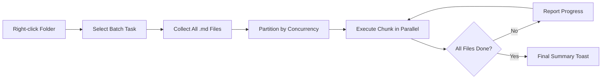

import TLDR from '@site/src/components/TLDR';

# 배치 처리

<TLDR>
**Notemd는 설정 가능한 동시 처리 수와 덮어쓰기 제어 기능을 통해 한 번의 작업으로 전체 폴더를 처리합니다.** 폴더를 마우스 오른쪽 버튼으로 클릭하면 해당 폴더 내의 모든 노트에 위키 링크를 일괄 추가하거나, 개념을 추출하거나, 조사를 수행하거나, 번역할 수 있습니다. 동시 처리 제한을 통해 API의 속도 제한 오류를 방지할 수 있습니다. 진행 상황은 파일별로 보고됩니다. 덮어쓰기 동작은 기존 파일을 건너뛰거나, 추가하거나, 대체하는 등 설정이 가능합니다. 실패한 파일도 일괄 처리를 중단하지 않고 로그에 기록됩니다.

이것은 [Obsidian AI 지식 관리 가이드](/docs/pillar-ai-knowledge)의 일부입니다.
</TLDR>

## 개요

배치 처리는 노트가 저장된 폴더를 단일 작업으로 변환합니다. 각 노트를 개별적으로 열어 명령을 실행하는 대신, 폴더를 마우스 오른쪽 버튼으로 클릭하여 해당 작업을 선택하면 됩니다. Notemd은 모든 `.md` 파일을 순회하며 선택된 작업을 적용하고 실시간으로 진행 상황을 보고합니다.

이 기능은 전체 볼트에 걸친 지식 추출에 필수적입니다. 예를 들어, 수십 개의 PDF를 가져온 후 batch-add-links를 실행한 다음 batch-extract-concepts를 사용하면 몇 시간이 아닌 몇 분 만에 지식 그래프를 구축할 수 있습니다.

## 작동 원리

### 배치 실행 모델

1. **파일 수집** -- Notemd은 설정에 따라 대상 폴더를 재귀적으로(또는 최상위 수준만) 스캔하여 모든 `.md` 파일을 수집합니다.
2. **동시성 파티셔닝** -- 파일들은 `batchConcurrency` 설정에 따라 청크로 나뉩니다. 각 청크는 병렬로 실행되며, 청크들은 순차적으로 실행됩니다.
3. **실행** -- 각 파일은 단일 파일 명령과 동일한 로직을 사용하여 처리됩니다. 작업별 제공자 및 모델 설정이 존중됩니다.
4. **진행 상황 보고** -- 각 파일 처리가 완료될 때마다 토스트 알림이 업데이트되어 `N / Total` 진행률을 표시합니다.
5. **오류 처리** -- 파일에 문제가 발생할 경우(API 오류, 네트워크 시간 초과 등), 해당 오류는 기록되고 배치 처리는 계속 진행됩니다. 최종 요약에는 실패한 파일들이 목록으로 표시됩니다.
6. **완료** -- 요약 토스트에는 처리된 총 건수, 성공 건수, 실패 건수가 표시됩니다.

### 덮어쓰기 동작

이미 위키 링크, 개념 노트, 또는 번역이 포함된 파일을 처리할 때, Notemd의 동작은 덮어쓰기 설정에 따라 달라집니다:

| 모드 | 동작 방식 |
|------|----------|
| **건너뛰기** | 기존 콘텐츠는 그대로 유지됩니다. 수정되지 않은 파일만 처리됩니다. |
| **Append** (기본값) | 새로운 콘텐츠가 추가됩니다. 기존의 위키 링크, 개념, 번역 내용은 그대로 유지됩니다. |
| **대체하기** | 파일이 완전히 재처리되었습니다. 이전의 모든 Notemd 수정 사항들이 덮어씌워집니다. |

위키 링크 연동과 관련하여 특별히 다음과 같습니다: 메모에 이미 `[[wiki-links]]`가 포함되어 있는 경우 **skip** 모드는 그대로 두지만, **replace** 모드는 새로운 링크를 삽입하기 위해 메모 전체를 LLM로 다시 전송합니다. 점진적인 처리에는 **skip**를, 모델 업그레이드 후 재처리에는 **replace**를 사용하십시오.

### 동시성 제어

`batchConcurrency` 설정은 동시에 실행되는 API 호출의 수를 제한합니다. 이를 통해 할당량이 엄격한 서비스 제공업체를 사용하여 대용량 폴더를 처리할 때 속도 제한 오류(HTTP 429)가 발생하는 것을 방지할 수 있습니다.

| 동시성 | 추천 대상 | 일반적인 속도 제한의 영향 |
|-------------|----------------|---------------------------|
| `1` | 무료 티어, 엄격한 공급업체들 | 없음 (시리얼) |
| `3` (기본값) | 대부분의 클라우드 제공업체 | 낮음 |
| `5` | Ollama (로컬), 넉넉한 티어 | 없음 / 낮음 |
| `10` | 빠른 추론이 가능한 로컬 모델들 | 없음 |

배치 처리 중 429 오류가 발생하면 동시성을 1 또는 2로 줄이세요.

## 구성 설정

| 설정 | 기본값 | 효과 |
|---------|---------|--------|
| `batchConcurrency` | `3` | 폴더 작업 중 최대 병렬 API 호출 횟수 |
| `batchOverwriteExisting` | `false` | 기존의 Notemd 내용을 덮어씁니다. `false`는 추가 모드를 의미합니다. |
| `batchSkipProcessed` | `false` | Notemd 마커가 이미 포함된 파일들(예: 위키 링크)은 건너뜁니다. |
| `batchRecursive` | `true` | 폴더를 스캔할 때 하위 디렉터리도 포함시키세요. |
| `enableStableApiCall` | `false` | 배치 처리 중 각 파일에 대해 재시도 로직(최대 4회)을 활성화합니다. |

### 배치 처리의 작업별 모델

각 배치 작업은 해당하는 작업별 모델을 사용합니다. batch-add-links는 `addLinksProvider`를, batch-research는 `researchProvider`를 사용하는 식입니다. 이를 통해 대량의 작업에는 저렴한 모델을 할당하고, 품질이 중요한 작업에는 고가의 모델을 사용할 수 있습니다.

## 예시

`papers/`에는 가져온 40개의 연구 노트가 포함된 폴더가 있습니다. 이 모든 노트에 위키 링크를 추가하고 개념을 추출하고 싶습니다.

1. `papers/` 폴더를 마우스 오른쪽 버튼으로 클릭하세요.
2. **"Notemd: 폴더 처리 (링크 추가)"**를 선택하세요.
3. Notemd은 폴더를 스캔하여 40개의 `.md` 파일을 찾아내고, 기본 동시 처리 수준인 3개씩 처리합니다.
4. 진행 상황 토스트에는 다음과 같이 표시됩니다: `12/40 files processed...`
5. 약 3분 후, 요약 토스트가 다음과 같이 보고합니다: `39 succeeded, 1 failed (API timeout on paper-37.md)`
6. **"Notemd: Process folder (extract concepts)"**를 반복하여 40개 모두에 대한 콘셉트 노트를 생성하세요.

실패한 파일에 대한 기록이 남아 있습니다. 나중에 해당 파일만 다시 실행하면 됩니다.

## 팁

- **낮은 동시성으로 시작하기** – 제공업체의 속도 제한이 불확실한 경우, `1`부터 시작하여 점차 증가시키세요.
- **증분 업데이트를 위해 건너뛰기 모드 사용** – 첫 번째 전체 배치 처리가 끝난 후 `batchSkipProcessed: true`로 전환하여 이후 실행 시 새로운 노트만 처리되도록 합니다.
- **안정적인 API 호출 활성화** – `enableStableApiCall: true`는 긴 처리 작업 중 일시적인 네트워크 오류로부터 복구할 수 있는 재시도 로직을 추가합니다.
- **모델 업그레이드 후 재실행** -- 더 우수한 모델로 전환할 경우 `batchOverwriteExisting: true`을 설정하고 재실행하여 개선된 링크와 개념을 얻을 수 있습니다.

---

## 다음 단계

- [Workflows](/docs/features/workflows) -- 일괄 작업을 원클릭 사이드바 버튼으로 연결하기
- [Custom Prompts](/docs/advanced/custom-prompts) -- 일괄 추출을 위한 프롬프트를 사용자 지정하기
- [문제 해결](/docs/advanced/troubleshooting) -- 일괄 실행 중 발생하는 속도 제한 오류 및 연결 실패 문제를 수정합니다
- [LLM 제공업체](/docs/providers/overview) -- 작업별 모델 설정 참조
