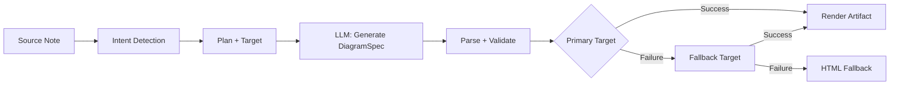
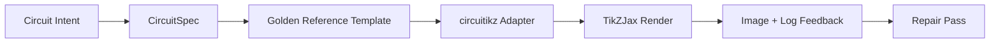

import TLDR from '@site/src/components/TLDR';

# 다이어그램

<TLDR>
**Notemd은 사양 기반 파이프라인을 통해 노트에서 다이어그램을 생성합니다.** LLM은 렌더러와 무관한 `DiagramSpec` JSON을 생성하며, 이후 전용 어댑터들이 이를 Mermaid, JSON Canvas, Vega-Lite, HTML, 편집 가능한 HTML/SVG, Draw.io, Drawnix, 혹은 제약이 적용된 circuitikz 형태로 변환합니다. 9가지 의도 유형을 지원하며, 자동 대체 체인, SVG/PNG/PDF 내보내기 기능이 포함된 실시간 미리 보기, 의미론적 검증, 그리고 로컬 지식을 활용한 생성 기능도 제공합니다.
</TLDR>

이것은 [Obsidian AI 지식 관리 가이드](/docs/pillar-ai-knowledge)의 일부입니다.

## 아키텍처: 사양 우선 파이프라인

Notemd는 절대로 LLM에게 Mermaid/Vega/Canvas 구문을 직접 생성하도록 요청하지 않습니다. 대신:



**왜 스펙을 먼저 고려해야 할까요?** LLM는 자주 잘못된 렌더러 구문을 생성합니다(특히 Mermaid의 경우). 구조화된 `DiagramSpec`는 렌더링하기 전에 검증될 수 있으며, 동일한 스펙은 여러 대체 렌더러에 사용될 수 있습니다.

## 지원되는 다이어그램 유형

| 의도 | 주요 렌더러 | 대체 옵션들 | 사용 사례 |
|--------|-----------------|-----------|----------|
| `mindmap` | Mermaid | HTML | 계층적 주제 분류 |
| `flowchart` | Mermaid | HTML | 프로세스 흐름, 의사결정 트리 |
| `sequence` | Mermaid | HTML | 클라이언트-서버 상호작용, 프로토콜 |
| `classDiagram` | Mermaid | HTML | OOP 클래스 관계 |
| `erDiagram` | Mermaid | HTML | 데이터베이스 스키마, 엔티티 관계 |
| `stateDiagram` | Mermaid | HTML | 상태 머신, 라이프사이클 모델 |
| `canvasMap` | JSON Canvas | Mermaid → HTML | 개념 지도, 지식 그래프 |
| `dataChart` | Vega-Lite | Mermaid → HTML | 바, 선, 면, 산점, 파이, 표 |
| `circuit` | circuitikz | none | 유효한 `CircuitSpec` 데이터를 기반으로 한 제약이 적용된 회로 다이어그램 |

## 의도 감지

Notemd는 키워드 점수를 활용하여 노트의 내용에서 가장 적합한 다이어그램 유형을 추론합니다:

| 의도 | 트리거 | 자신감 |
|--------|----------|------------|
| `dataChart` | 표, 숫자 셀, 지표/추세 관련 키워드, 백분율 | 0.88 |
| `sequence` | 요청/응답 용어집 (4개 이상 일치) 또는 `->`/`=>` 마커 | 0.82 |
| `erDiagram` | 기본 키, 외래 키, 엔티티, 스키마 (2개 이상 일치) | 0.80 |
| `stateDiagram` | 상태, 전환, 대기 중, 실행 중, 실패 (3개 이상 일치) | 0.76 |
| `flowchart` | 번호가 매겨진 단계(2개 이상) 또는 if/then/else/workflow 관련 용어 | 0.74 |
| `canvasMap` | 개념 지도, 지식 그래프, 공간적, 클러스터 | 0.72 |
| `circuit` | circuitikz, TikZJax, circuit, schematic, CMOS, NMOS, PMOS, MOSFET, VDD/GND, `vin`/`vout` | 0.78 |
| `mindmap` | 기본 대체값 | 0.55 |

**Preferred diagram type** 설정이나 사이드바 선택기, 혹은 명시적인 커맨드 팔레트 옵션을 사용하여 재정의합니다.

## 렌더 타겟 선택

실험적인 스펙-퍼스트 파이프라인에 이제 두 개의 독립적인 제어 기능이 추가되었습니다:

| 제어 | 설정 | 효과 |
|---------|---------|--------|
| 선호하는 다이어그램 유형 | `preferredDiagramIntent` | 생성된 `DiagramSpec`의 의미적 형태를 안내합니다. |
| 선호하는 렌더 타겟 | `preferredDiagramRenderTarget` | **다이어그램 생성** 및 **다이어그램 미리보기**에 사용할 아티팩트 렌더러를 선택합니다. |

플래너의 기본 설정으로 **Preferred render target**를 **Auto**로 지정하거나, Mermaid, JSON Canvas, Vega-Lite, HTML, Editable HTML/SVG, Draw.io, Drawnix, Circuitikz 중 원하는 형식을 명시적으로 선택할 수 있습니다. 이러한 재지정은 오직 자산 및 미리 보기 관련 명령에만 적용됩니다. 기존 Markdown 작업 흐름이 은밀하게 형식이 변경되는 것을 방지하기 위해, **Summarise as Mermaid diagram** 명령은 계속해서 Mermaid와 호환되는 형태로 출력됩니다.

이러한 분리가 중요한 이유는 이제 `flowchart` 의도는 Markdown 노트의 경우 Mermaid로, 안정적인 대체용으로는 HTML로, 후속 편집을 위해 Editable HTML/SVG로, 혹은 SVG 검토 파일과 함께 제공되는 Draw.io/Drawnix 형태의 소스 자산으로도 렌더링될 수 있기 때문입니다. 반면 `circuit` 의도는 Circuitikz를 사용하며 유효한 `CircuitSpec`이 필요하므로, 임의의 TikZ 텍스트를 요청하는 것과는 다릅니다.
## 사용법

### 다이어그램 생성

1. 메모 열기
2. 명령 팔레트에서 **"Notemd: Diagram 생성"**을 실행하세요.
3. Notemd는 의도를 감지하고, 스펙을 생성하며, 렌더링한 후 결과물을 저장합니다.

**대상별 출력 파일:**

| 타겟 | 확장 프로그램 | 파일명 패턴 |
|--------|-----------|------------------|
| Mermaid | `.md` | `{note}_summ.md` |
| JSON Canvas | `.canvas` | `{note}_diagram.canvas` |
| Vega-Lite | `.json` | `{note}_diagram.json` |
| HTML | `.html` | `{note}_diagram.html` |
| 편집 가능한 HTML/SVG | `.html` | `{note}_diagram.html` |
| Draw.io | `.drawio` + `.drawio.svg` + `.drawio.md` | `{note}_diagram.drawio` 및 검토용 파일들 |
| Drawnix | `.drawnix` + `.drawnix.svg` + `.drawnix.md` | `{note}_diagram.drawnix` 및 검토용 파일들 |
| Circuitikz | `.tex` + `.tex.svg` + `.tex.md` | `{note}_diagram.tex` 및 검토용 파일들 |

### 다이어그램 미리 보기

1. **"Notemd: Preview diagram"**을 실행하세요.
2. 렌더링된 다이어그램과 함께 모달 창이 열립니다.
3. 도구 모음 버튼을 사용하여 SVG, PNG 또는 PDF 형태로 내보냅니다.

설정에서 **자동 미리보기** 기능을 사용할 수 있습니다. 생성이 완료되면 미리보기 모달이 자동으로 열립니다.

PNG 및 PDF 미리 보기 내보내기 시에는 설정된 미리 보기 PPI가 적용됩니다. 기본값은 300 PPI이며, 600 PPI를 초과하는 값은 600으로 제한됩니다. SVG의 경우는 벡터 크기 그대로 유지됩니다. `.drawio`, `.drawnix`, `.tex`와 같은 소스 자산들은 `previewSvg`라는 보조 파일을 제공함으로써, Obsidian이 diagram.net, Drawnix, LaTeX, TikZJax를 플러그인 실행 환경에 포함시키지 않고도 검토 가능한 이미지를 표시하고 내보낼 수 있게 해줍니다.

프리뷰 모달에도 애셋 진단 패널이 존재합니다. 렌더러와 스모크 체크는 `RenderArtifact.diagnostics`를 연결할 수 있으며, 모달은 프리뷰 옆에 오류/경고/정보의 개수와 그 심각도, 진단 유형, 메시지, 그리고 수정 방법에 대한 요약 정보를 표시합니다. 이와 동일한 요약 정보는 진단 기능이 적용된 기록 항목들에서도 표시되므로, 각 항목을 일일이 열어보지 않고도 반복적으로 수행된 circuitikz 스모크 테스트 결과들을 비교할 수 있습니다. 소스 콘텐츠는 있지만 인라인으로 또는 HTML iframe 경로를 통해 렌더링할 수 없는 애셋의 경우, 이제 모달은 빈 iframe을 강제로 표시하는 대신 소스 코드만 보여주는 프리뷰로 전환됩니다. 이를 통해 circuitikz 컴파일/렌더링 스모크 테스트, SVG 텍스트 토큰 검사, PNG 빈 스크린샷 검사, 경로만 기반으로 하는 글리프 중첩 보고서, 그리고 향후 등장할 추가적인 중첩 보고서들이 TikZJax나 LaTeX와 같은 플러그인 런타임 의존성 없이도 시각적으로 확인될 수 있게 됩니다.

### 레거시 Mermaid 모드

`enableExperimentalDiagramPipeline`가 꺼져 있을 때, Notemd는 LLM에 직접 Mermaid 프롬프트를 보냅니다. 이 방식은 스펙 파이프라인을 완전히 우회합니다. 실험용 파이프라인에 문제가 생기면 이 모드로 전환됩니다.

## 렌더링 백엔드

### Mermaid

6개의 어댑터(마인드맵, 플로우차트, 시퀀스, ER, 클래스, 상태)를 사용하여 `DiagramSpec`을 Mermaid 구문으로 변환합니다. 생성된 후 `mermaid.parse()`이 결과를 검증합니다. 검증에 실패할 경우:

1. **LLM retry** — Mermaid 오류 메시지를 상황 정보로 사용한 1회 시도
2. **최소한의 대체 옵션** — 사양 노드 ID를 기반으로 한 간소화된 Mermaid 다이어그램

**Legacy Mermaid Fixer**는 주석 지시어 표준화, 파이프-라벨 이스케이핑, 세미콜론 재배치, 스마트 따옴표, 이중 대시 화살표, 형태 불일치 등과 같은 일반적인 LLM 구문 오류를 자동으로 수정합니다.

### JSON Canvas

공간 레이아웃을 포함한 Obsidian JSON Canvas 형식으로 생성합니다:
- 깊이(x = depth × 420)와 인덱스(y = index × 170)에 따라 위치가 결정되는 노드들
- 라벨 길이를 기준으로 한 너비 추정값
- `fromSide: 'right'`, `toSide: 'left'`, `toEnd: 'arrow'`가 있는 엣지들

### Vega-Lite

자동 인코딩을 통해 완전한 Vega-Lite v5 JSON 사양을 생성합니다:
- **데카르트 차트** (막대/선/면/점/산점): 다중 시리즈를 위한 x + y 채널 + 색상
- **Pie**: 세타 = y (정량형), 색상 = x (명목형)
- **표**: 행 = x, 텍스트 = y + 열 = 시리즈

다크 및 라이트 테마 패치는 컴파일 전에 깊이 병합됩니다.

### HTML

범용 대체 파일. 다음을 포함하는 독립형 HTML 문서:
- CSP 메타 헤더
- `prefers-color-scheme`를 통한 밝기/어둡기 모드
- 20개 로케일에 맞는 현지화된 UI 레이블
- 섹션: 히어로, 구조(노드 트리), 관계, 강조 표시, 데이터 시리즈 표

### 편집 가능한 HTML/SVG

편집 가능한 내보내기 워크플로우를 위한 명시적인 그림 대상입니다. 이 기능은 `DiagramSpec`을 결정론적인 `SemanticFigureModel`으로 변환한 다음, Draw.io 스타일의 주석이 포함된 인라인 SVG 그룹을 가진 독립적인 HTML 문서를 생성합니다.

- 의미적 노드상의 `data-drawio-type`, `data-drawio-id`, 그리고 `data-drawio-role`
- 의미적 엣지상의 `data-drawio-source`와 `data-drawio-target`
- 공백 정규화 및 충돌 처리 후의 안정적인 노드/엣지 식별자
- 스크립트도, 외부 폰트도, 원격 자산도 사용하지 않습니다.

이 타겟은 의도적으로 아직 기본 플래너 루트가 아닙니다. 제품 경로가 실제 도구들 간의 편집 동작을 입증하는 동안 명시적 렌더 타겟으로 사용할 수 있습니다.

### Draw.io 및 Drawnix 내보내기 경계

현재의 구현 방식은 명시적인 렌더링 대상을 제공하는 동시에, 서드파티 에디터 지원 기능을 아티팩트 경계 외부에 유지합니다:

| 타겟 | 계약 | 실행 시간 의존성 |
|--------|----------|--------------------|
| Draw.io | `SemanticFigureModel`에서 생성된 결정론적이고 압축되지 않은 `mxfile` XML 형식, 그리고 SVG/PNG/PDF 형태의 검토용 파일들 | 플러그인 실행 시나 CI 환경에서는 해당 기능 없음 |
| Drawnix | `geometry` 및 `arrow-line` 요소를 사용하는 최소한의 `.drawnix` JSON 하위 집합, 그리고 SVG/PNG/PDF 형태의 검토용 파일들 | 플러그인 실행 시나 CI 환경에서는 해당 기능 없음 |

이러한 타협은 의도적인 것입니다. Notemd는 diagrams.net Desktop, Drawnix, Plait, 또는 브라우저 전용 에디터 상태를 플러그인에 포함시키지 않고도 가시적인 레이블, 안정적인 ID, 그리고 지원되는 프리미티브 커버리지를 확인할 수 있습니다.

### circuitikz / TikZJax 방향

회로도는 일반적인 흐름도와는 다른 문제입니다. 전기 회로의 적절한 구문 목표는 보통 **circuitikz**이며, TikZJax와 같은 플러그인을 통해 Obsidian에서 렌더링됩니다. TikZJax은 `circuitikz`, `pgfplots`, `tikz-cd`, `chemfig`와 같은 패키지를 로드할 수 있어 물리학, 회로학, 화학, 수학 노트 작성에 유용합니다.

위험한 점은 원시 LLM로 생성된 TikZ가 취약하다는 것입니다:

- 복잡한 회로 토폴로지는 전기적으로는 올바를 수 있지만 시각적으로는 읽기 어려울 수 있습니다.
- 중복된 와이어와 레이블로 인해 정확한 넷리스트가 학습 자료로 사용할 수 없게 될 수 있습니다.
- 패키지 프리앰블이 누락되거나 앵커가 잘못되었거나 유효하지 않은 컴포넌트 이름이 있으면 렌더링이 방해받을 수 있습니다.
- 렌더러의 피드백은 보통 이미지 단위이며, LLM는 텍스트 단위의 기하학 정보를 생성합니다.

더 나은 아키텍처는 circuitikz를 자유형 프롬프트가 아닌 제약이 있는 다이어그램 대상으로 취급하는 것입니다.



1등급 모델은 회로의 토폴로지와 레이아웃을 별도로 설명해야 합니다.

| 레이어 | 책임 | 예시 |
|-------|----------------|---------|
| 토폴로지 | 전기 노드와 부품 연결 | `VDD -> RD -> drain(M1)`, `source(M1) -> GND` |
| 레이아웃 | 그리드 배치, 방향, 라우팅 차선 | `M1 at (3,2.2)`, 입력은 왼쪽, 출력은 오른쪽 |
| 스타일 | 패키지, 전압 표기 규칙, 라벨, 앵커 | `\begin{circuitikz}[american voltages]` |
| 유효성 검사 | 컴파일 로그, 앵커 누락, 중첩/스크린샷 확인 | TikZJax/LaTeX 진단 기능 및 시각적 검토 |

### 현재 circuitikz 프로토타입

Notemd에는 이 방향을 위한 첫 번째 제약이 적용된 리포지토리 프로토타입이 포함되어 있습니다. 이는 의도적으로 오프라인 상태이며 템플릿에 의해 제한됩니다.

```bash
npm run diagram:export-circuitikz -- --input cmos-inverter.json --output cmos-inverter.tex
```

이 프로토타입은 제한된 `CircuitSpec` 경계와 6가지 골든 리퍼런스 패밀리에 대한 결정론적인 내보내기 기능을 추가합니다:

실험적인 다이어그램 파이프라인에서는 이제 `intent: "circuit"` 및 렌더링 대상 `circuitikz`를 통해 이 기능에 접근할 수도 있습니다. 생성된 `DiagramSpec`은 회로 관련 작업의 경우에만 `circuitSpec`을 포함할 수 있습니다. `CircuitikzRenderer`는 동일한 결정론적인 `.tex` 소스를 작성하고, 검증된 회로 토폴로지에서 파생된 SVG 미리보기 파일을 함께 첨부하여 Obsidian 미리보기 기능과 SVG/PNG/PDF 내보내기 기능을 지원합니다. 이 미리보기 파일은 LaTeX/TikZJax 컴파일 결과가 아니며, 실제 렌더링 증거는 아래에 명시된 명령어들에서 확인할 수 있습니다.

지원되는 골든 템플릿의 경우, `layoutHints.inputSide`와 `layoutHints.outputSide`는 단순히 표시용으로만 사용되는 제어 항목입니다. 이들은 결정론적인 입력/출력 포트의 위치를 조정할 수는 있지만, 토폴로지의 구조 자체를 변경하거나 회로를 재연결하기 위한 수정 과정을 제공하지는 않습니다.

| 회로 종류 | 골든 리퍼런스 | 현재 보증 기간 |
|--------------|------------------|-------------------|
| `common-source-amplifier` | `common-source-nmos-v1` | LaTeX를 작성하기 전에 `VDD -> R_D -> M1.D`, `vin -> M1.G`, `M1.S -> GND`, 그리고 `M1.D -> vout`을 검증합니다. |
| `cmos-inverter` | `cmos-inverter-v1` | LaTeX로 작성하기 전에 PMOS-over-NMOS 토폴로지, 공유 게이트 입력, 공유 드레인 출력, `VDD -> MP.S`, 그리고 `MN.S -> GND`을 검증합니다. |
| `cmos-buffer` | `cmos-buffer-v1` | LaTeX를 작성하기 전에 두 개의 계단식 인버터 단계, 중간 노드 `vmid`, 복구된 `vout`, 그리고 공유된 VDD/GND 레일을 검증합니다. |
| `cmos-transmission-gate` | `cmos-transmission-gate-v1` | LaTeX를 작성하기 전에 `vin`와 `vout` 사이의 병렬 PMOS/NMOS 패스 소자들을 보완적인 `phib` / `phi` 제어 기능을 사용하여 검증합니다. |
| `cmos-nand2` | `cmos-nand2-v1` | LaTeX를 작성하기 전에 병렬 PMOS 풀업, 직렬 NMOS 풀다운, 듀얼 입력 `va` / `vb`, 그리고 `vout`를 검증합니다. |
| `cmos-nor2` | `cmos-nor2-v1` | LaTeX로 작성하기 전에 시리즈 PMOS 풀업, 병렬 NMOS 풀다운, 듀얼 입력 `va` / `vb`, 그리고 `vout`를 검증합니다. |

이 도구는 일반적인 TikZ 생성기가 아닙니다. 임의의 TikZ 코드를 받아들이거나 LaTeX를 컴파일하거나 TikZJax를 호출하거나, 플러그인 실행 시간 동안 스크린샷을 확인하거나 자동화된 이미지 피드백 기반의 수정 기능을 제공하지 않습니다. 이러한 기능들은 향후 단계에서 추가될 예정입니다.

Preview diagram 명령어는 파일 확장자가 `.tex` 또는 `.tikz`이고 소스에 `\usepackage{circuitikz}` 또는 `\begin{circuitikz}`가 포함된 경우 저장된 circuitikz 소스 파일들을 직접 다시 열 수 있습니다. 이 방식은 circuitikz 형태의 소스 전용 미리보기입니다. 모달 창에는 소스 코드, 진단 정보, 복사/저장 버튼, 그리고 기록 메타데이터가 표시되지만, LaTeX를 컴파일하거나 플러그인 실행 중에 TikZJax을 호출하지는 않습니다.

이제 동일한 소스 전용 미리보기 범위가 저장된 Draw.io 및 Drawnix 결과물도 포함합니다. `.drawio` 파일은 Draw.io XML (`mxfile` 또는 `mxGraphModel`)와 유사한 형태일 때 받아들여지며, `.drawnix` 파일은 Drawnix JSON 형태에 `type: "drawnix"`와 `elements` 배열이 포함될 때 받아들여집니다. 이 플러그인은 여전히 diagrams.net이나 Drawnix 화이트보드 호스트를 내장하지 않으며, 이러한 미리보기 기능은 플러그인 내부의 시각적 편집기를 사용하지 않고도 소스 코드, 진단 정보, 결과물 기록을 보여줍니다.

토폴로지 보존 복구를 위해서는 복구된 후보를 수락하기 전에 사전 복구 사양을 참조로 전달해야 합니다.

```bash
npm run diagram:export-circuitikz -- --input repaired-cmos-inverter.json --topology-reference cmos-inverter.json --output cmos-inverter.tex
```

수리 가드는 출력하기 전에 `createCircuitTopologySignature`와 `assertCircuitTopologyUnchanged`를 사용하여 `circuitKind`, `goldenReferenceId`, 네트워크, 부품의 ID/타입/터미널, 그리고 비방향성 연결 엔드포인트들을 비교합니다. 레이블, 제목 텍스트, 레이아웃 힌트, 연결 순서, 연결 레이블은 의도적으로 무시됩니다. 터미널을 추가하거나 재연결하는 후보는 `.tex` 파일이 작성되기 전에 `Circuit topology drift detected`로 인해 실패합니다.

CLI는 이제 컴파일러를 실행하지 않고도 기존의 LaTeX/TikZJax 컴파일 로그를 파싱할 수 있습니다.

```bash
npm run diagram:export-circuitikz -- --input cmos-inverter.json --output cmos-inverter.tex --compile-log cmos-inverter.log --diagnostics-output cmos-inverter.diagnostics.json
```

이 진단 경로는 `circuitikz.sty`와 같이 누락된 패키지, 알 수 없는 TikZ/circuitikz 키, 세미콜론이 누락된 것과 같은 TikZ 경로 구문 오류, 균형이 맞지 않는 대괄호나 미완료된 레이블로 인한 과도한 인수, 정의되지 않은 제어 시퀀스, 일반적인 LaTeX 오류, 긴급 중단 상황, 그리고 `\hbox` 용량 초과 경고와 같은 참고용 경고들을 보고합니다. 이 도구는 여전히 로그 기반으로 작동하며, 로컬 LaTeX/TikZJax 실행 및 스크린샷 품질 검사 기능은 아직 별도의 향후 작업으로 남아 있습니다.

유지보수자용 스모크 체크에서는 동일한 CLI를 사용하여 셸 명령어 파싱 없이 사전에 설정된 렌더러를 선택적으로 실행할 수 있습니다.

```bash
npm run diagram:export-circuitikz -- --input cmos-inverter.json --output cmos-inverter.tex --compile-executable pdflatex --compile-arg -interaction=nonstopmode --compile-arg -halt-on-error --compile-arg -output-directory={outputDir} --compile-arg {tex} --expected-artifact {outputDir}/{jobName}.pdf
```

컴파일 러너는 `shell: false`를 사용하여 `{tex}`, `{outputDir}`, `{jobName}`와 같은 플레이스홀더를 인수 배열 값으로 확장한 뒤, 생성된 `{jobName}.log`를 읽어 `compileExecution`와 `compileDiagnostics`를 함께 CLI JSON 형태의 출력으로 반환합니다. `--compile-executable`은 렌더러 바이너리나 래퍼 경로만을 나타내며, 렌더러 플래그들은 반복되는 `--compile-arg` 값에 포함됩니다. 빈 실행 파일의 경우 `compile-executable-invalid` 오류가 발생하고, 누락된 바이너리의 경우 `compile-executable-not-found` 오류가 발생합니다. 셸 명령어 형태의 실행 파일 문자열의 경우 인수를 분할하도록 안내되어 Windows, Linux, macOS가 동일한 직접 실행 규칙을 따르도록 합니다. `--expected-artifact`을 통해 `compileExecution.renderSmoke`도 보고되며, 렌더러가 비어 있지 않은 결과물을 생성하지 않으면 CLI 오류가 발생합니다. 이 도구는 여전히 LaTeX를 번들로 제공하지 않으며, TikZJax을 플러그인 런타임 의존성으로 처리하지도 않고, 스크린샷 수준의 시각적 복구 작업도 수행하지 않습니다.

예상되는 결과물이 `.svg`인 경우, 스모크 체크는 한 단계 더 깊이 진행됩니다:

```bash
npm run diagram:export-circuitikz -- --input cmos-inverter.json --output cmos-inverter.tex --compile-executable dvisvgm --compile-arg ... --expected-artifact {outputDir}/{jobName}.svg --expected-svg-text v_{in} --expected-svg-text v_{out}
```

SVG 스모크 테스트는 `<svg>` 루트, 양수형 치수 또는 `viewBox`, 숨겨지거나 투명한 요소를 제외한 후에도 존재하는 최소 하나의 가시적 드로잉 요소, 요청된 모든 텍스트 토큰, `viewBox` 외부의 눈에 잘 보이는 요소들, 서로 겹치는 위치에 있는 `<text>` / `<tspan>` 레이블, 그리고 `render-svg-label-overlap`를 통해 드로잉 요소 위에 겹쳐지는 눈에 잘 보이는 텍스트 레이블들을 확인합니다. 예상되는 텍스트는 가시적 텍스트와 `aria-label`, `<title>`, `<desc>`와 같은 접근성 메타데이터를 검색하여 해독되므로, 가시적 `<text>` 영역 밖의 의미적 레이블을 그대로 유지하는 렌더러도 OCR 없이도 텍스트 토큰 스모크 테스트를 통과할 수 있습니다. 현재의 기하학 검사는 일반적인 그룹 및 요소 `transform` 속성에 대해 변환을 고려한 기하학 검사를 수행하므로, 번역되거나 확대/회전/기울어지거나 행렬 변환된 SVG 상자들도 변환 조합 후에 검사됩니다. 이 검사는 A/a 곡선의 정확한 경계, C/S/Q/T 곡선의 정확한 베지어 곡선 경계, 스트로크 너비를 고려한 SVG 경계 및 레이블 겹침 검사, `polyline` / `polygon` 드로잉 기하학뿐만 아니라 `<use href="#...">` 참조에서 파생된 경로만 있는 글리프 배치도 처리하여, 재사용 가능한 글리프 경로로 변환된 레이블의 기하학적 형태가 `viewBox`를 벗어날 경우에도 경계 제한 검사에서 실패할 수 있도록 합니다. 하나의 `<text>` 부모 요소 아래에 위치한 여러 `tspan` 레이블들은 별개의 레이블 상자로 비교되므로, 그렇지 않으면 서로 다른 레이블들이 하나의 텍스트 노드로 합쳐지는 LaTeX 스타일의 SVG 출력도 감지할 수 있습니다. 위치가 지정된 SVG `text` 및 `tspan` 상자들은 `text-anchor` 값 `start`, `middle`, `end`를 준수하므로, 가운데 정렬되거나 오른쪽에 정렬된 레이블들도 브라우저급 텍스트 레이아웃을 요구하지 않고도 텍스트 간 또는 레이블과 드로잉 간의 겹침 문제를 진단할 수 있습니다. `<defs>` 내부에 있는 정의만 존재하는 글리프 경로들은 가시적 드로잉 요소로 간주되지 않지만, `<use>` 배치 전에 해당 글리프의 정의에 포함된 `transform` 속성들이 적용되므로 확대되거나 미러링된 글리프 정의들도 누락되지 않습니다. 레이블과 드로잉 간의 겹침 검사는 작은 드로잉 상자 허용 오차와 명시된 `stroke-width`을 사용하므로, 얇은 선, 굵은 선, 다각형 형태의 컴포넌트 윤곽선들도 그 가시적 스트로크가 레이블에 닿을 경우 레이블 가독성 문제로 간주될 수 있습니다. `<use href="#...">`에서 파생된 경로만 있는 글리프 레이블들도 드로잉 상자와 비교되며, 재사용 가능한 글리프 기하학적 형태가 선이나 컴포넌트와 겹칠 경우 `render-svg-path-glyph-overlap`으로 인해 실패합니다. 만약 렌더러가 레이블들을 검색 가능한 `<text>` 형태가 아닌 재사용 가능한 경로 글리프로 변환하고 접근성 메타데이터를 유지하지 않는다면, 스모크 보고서에는 `pathOnlyGlyphUseCount`이 기록되며 레이블이 단순히 존재하지 않는 것으로 간주하는 대신 `render-svg-text-path-only`을 통해 요청된 텍스트 토큰 검사에서 실패합니다. 그 외의 실패 사항들은 `render-svg-invalid`, `render-svg-dimension-missing`, `render-svg-no-visible-elements`, `render-svg-text-missing`, `render-svg-out-of-bounds`, `render-svg-text-overlap`, `render-svg-label-overlap`, `render-svg-path-glyph-overlap`를 통해 보고됩니다. 텍스트 토큰 및 겹침 검사는 레이블들을 검색 가능한 SVG 텍스트나 접근성 메타데이터로 유지하는 렌더러의 경우에만 구조적 스모크 테스트로 간주되어야 하며, 경로만 있는 SVG 출력의 경우에는 시각적 레이블 가독성을 증명하기 위해 후속의 스크린샷/OCR 검사가 여전히 필요하며, 이 스모크 테스트도 완전한 SVG 경로 커버리지를 주장하지는 않습니다.

보이는 요소를 세거나 형상을 수집할 때 숨겨진 SVG 그룹과 요소들은 일관되게 무시됩니다. 속성이나 내장 스타일인 `display:none`, `visibility:hidden`, `visibility:collapse`, 그리고 전체적인 `opacity:0` 설정만으로는 원래 비어 있던 렌더링 결과물이 보이는 출력 검사를 통과하도록 만들 수 없습니다.

경로만 포함된 글리프 정의는 직접적인 경로일 수도 있고 `<defs>` 내부의 그룹화된/심볼 컨테이너일 수도 있습니다. 스모크 패스는 `<use>` 배치 전에 `<g id="...">`와 `<symbol id="...">`에서 자식 경로의 기하학적 정보를 결정하므로, 래퍼로 감싸진 글리프의 출력도 여전히 `pathOnlyGlyphUseCount`, 경계가 정해진 캔버스 검사, 그리고 `render-svg-path-glyph-overlap`에 전달됩니다.

경로 파서는 서브패스의 시작 지점도 추적하며 `Z/z`에서 현재 위치를 재설정하여, 닫힌 서브패스 이후의 상대적 명령들이 잘못된 `render-svg-out-of-bounds` 진단을 생성하는 대신 올바른 SVG 지점부터 계속 실행될 수 있도록 합니다.

동일한 기하학 처리 과정은 선행 점이 있는 소수와 명시적 더하기 기호에 대해 SVG 번호 체계를 따르므로, `.5`, `-.5`, `+.5`와 같은 간결한 dvisvgm 좌표들은 경계 확인 시 분수 형태를 그대로 유지하여 잘못된 범위 외 기하학 데이터가 되거나 무시되는 일이 없습니다.

렌더러가 `.png`를 출력하면 동일한 예상된 아티팩트 경로가 첫 번째 스크린샷 스모크 체크의 대상이 됩니다. Notemd는 비인터레이스드 1/2/4/8비트 인덱스드 컬러 PNG 파일, 1/2/4/8/16비트 그레이스케일 PNG 파일, 그리고 8/16비트 그레이스케일-알파/RGB/RGBA PNG 파일을 디코딩합니다. 인덱스드 컬러 이미지와 서브바이트 그레이스케일 이미지는 패킹된 샘플을 지원하며, 인덱스드 컬러 이미지는 PLTE 및 선택적 tRNS 데이터도 지원합니다. 그레이스케일/RGB 이미지는 tRNS 투명 샘플을 지원합니다. 16비트 직접 샘플은 스모크 체크에서 사용되는 동일한 8비트 RGBA 비교 공간으로 정규화됩니다. 스모크 체크는 적절한 크기를 확인하고, 전경 영역의 경계를 `foregroundBounds`로 기록하며, 해당 영역 내의 전경 밀도를 `foregroundDensity`로 기록합니다. 모든 보이는 픽셀이 왼쪽 상단의 배경 색상과 일치할 경우 `render-png-blank` 오류가 발생하고, 전경 콘텐츠가 이미지 경계에 닿을 경우 `render-png-content-clipped` 오류가 발생합니다. 큰 스크린샷에서 전경 픽셀이 4개 미만일 경우 `render-png-foreground-too-small` 오류가 발생하며, 복잡한 경계 상자 내에서 전경 픽셀의 밀도가 비정상적으로 높을 경우 `render-png-foreground-dense` 오류가 발생합니다. 지원되지 않는 PNG 형식의 경우 `render-png-unsupported` 오류가 발생하며, Adam7 인터레이스드 PNG나 지원되지 않는 인덱스드 컬러 비트 심도에 대한 형식별 안내가 제공됩니다. 이 방법은 플랫폼별 셸 의존성을 추가하지 않고도 빈 스크린샷, 명백한 캔버스 클리핑, 과소 렌더링된 전경 영역, 첫 번째 픽셀 단위의 과밀 문제, 잘못된 렌더러 PNG 내보내기 설정 등을 감지할 수 있습니다. 다만 이는 아직 OCR 수준의 라벨 인식, 정확한 텍스트 중첩 감지, 혹은 토폴로지를 유지하는 이미지 복구 기능은 아닙니다.

진단 결과 컴파일이 실패하거나 render-smoke 실행에 문제가 있을 경우, CLI는 토폴로지를 그대로 유지하는 수리 보고서도 작성할 수 있습니다.

```bash
npm run diagram:export-circuitikz -- --input cmos-inverter.json --topology-reference cmos-inverter.json --output cmos-inverter.tex --compile-log cmos-inverter.log --repair-brief-output cmos-inverter.repair-brief.json
```

수리 요약서는 스키마 `notemd.circuitikz.repair-brief.v1`를 사용하며, 소스 `CircuitSpec`, 토폴로지 서명, 컴파일/렌더링 진단 결과, 허용되는 수정 사항, 금지된 토폴로지 수정 사항, 다음 검증 단계, 그리고 구조화된 `repairPrompt`를 포함합니다. 프롬프트의 역할은 `topology-preserving-circuitikz-repair`이며, 해당 프롬프트의 `diagnosticFocus` 목록은 컴파일/렌더링 진단 결과에서 도출되고, `acceptanceCriteria`의 경우 후보 항목의 유효성 검사와 새로운 컴파일 및 렌더링 테스트가 필요합니다. 이는 이후 수리 과정을 위한 전달 형식일 뿐, Notemd가 이미 자동화된 시각적 수리를 수행한다는 의미는 아닙니다.

수리 후보가 생성된 후, 동일한 CLI를 사용하여 출력을 작성하기 전에 요구사항과 비교하여 검증할 수 있습니다.

```bash
npm run diagram:export-circuitikz -- --input repaired-cmos-inverter.json --repair-brief cmos-inverter.repair-brief.json --output repaired-cmos-inverter.tex
```

`--repair-brief`는 요약 정보에서 제공된 후보 토폴로지 서명을 확인하며, 이는 `--topology-reference`과 상호 배타적입니다. 이 단계를 통과한다고 해도 토폴로지가 보존되었음만을 증명할 뿐이며, 후보 코드는 여전히 컴파일 진단 및 렌더 스모크 검사를 거쳐야 합니다.

`--repair-brief` 결과에는 스키마 `notemd.circuitikz.repair-acceptance.v1`를 포함한 `repairAcceptance` 증거도 함께 포함되어 있습니다. 이 결과는 `topology-signature`, `compile-diagnostics`, `render-smoke` 게이트를 `passed`, `failed`, 또는 `missing`로 표시하며, `remainingChecks`를 노출시키고, 후보 실행이 모든 필요한 증거를 포함할 때까지 `readyForVisualAcceptance`을 거짓 상태로 유지합니다.

CI나 릴리스 증거에 내구성 있는 JSON 파일이 필요할 때는 `--repair-acceptance-output`를 `--repair-brief`과 함께 사용하세요:

```bash
npm run diagram:export-circuitikz -- --input repaired-cmos-inverter.json --repair-brief cmos-inverter.repair-brief.json --output repaired-cmos-inverter.tex --repair-acceptance-output repaired-cmos-inverter.repair-acceptance.json
```

릴리스나 유지보수 증거를 위해, 지원되는 모든 골든 패밀리를 집계 픽스처 러너를 통해 실행하십시오:

```bash
npm run diagram:smoke-circuitikz -- --output-dir docs/export/circuitikz-smoke --compile-executable pdflatex --compile-arg -interaction=nonstopmode --compile-arg -halt-on-error --compile-arg -output-directory={outputDir} --compile-arg {tex} --expected-artifact {outputDir}/{jobName}.pdf
```

이 러너는 `docs/maintainer/fixtures/circuitikz/common-source-nmos-v1.json`, `docs/maintainer/fixtures/circuitikz/cmos-inverter-v1.json`, `docs/maintainer/fixtures/circuitikz/cmos-buffer-v1.json`, `docs/maintainer/fixtures/circuitikz/cmos-transmission-gate-v1.json`, `docs/maintainer/fixtures/circuitikz/cmos-nand2-v1.json`, `docs/maintainer/fixtures/circuitikz/cmos-nor2-v1.json`를 사용하며, 각 픽스처에 대해 동일한 셸 없는 엑스포터 경로를 호출하여 각 픽스처별 `compileExecution`와 `compileDiagnostics` 정보가 포함된 종합적인 JSON 보고서를 반환합니다. 이것은 여전히 메인테이너 명령어이며 플러그인 런타임 의존성은 아닙니다.

유지보수용 머신에 아직 렌더러가 설정되어 있지 않을 경우, `--compile-executable`를 생략한 동일한 픽스처 명령을 실행하고 환경 게이트를 명시적으로 저장해야 합니다:

```bash
npm run diagram:smoke-circuitikz -- --output-dir docs/export/circuitikz-smoke --report-output docs/export/circuitikz-smoke/renderer-availability.json
```

그 경로는 여전히 결정론적 픽스처 `.tex` 아티팩트를 작성하지만, `rendererAvailability.status`가 `missing-configuration`으로 설정되고 `compile-executable-invalid` 진단 정보가 포함된 `ok: false`을 반환합니다. 이는 렌더러 가용성 증거로만 간주해야 하며, 컴파일, render-smoke, 시각적 검수와는 관련이 없습니다.

### 골든 리퍼런스 프롬프트 셰이프

단기적인 사용을 위해 회로 변형을 요청하기 전에 렌더링 가능한 골든 리퍼런스를 제공해 주십시오. 제한된 프롬프트는 서문, 좌표 축척, 앵커 스타일, 그리고 라우팅 규칙을 그대로 유지해야 합니다.

```latex
\usepackage{circuitikz}
\begin{document}
\begin{circuitikz}[american voltages]
\draw
  (3,5) node[vcc]{$V_{DD}$}
  to [R, l=$R_D$] (3,3)
  to [short, *-o] (5,3) node[right]{$v_{out}$}
  (3,3) to [short] (3,2.2)
  node[nmos, anchor=D] (M1) {$M_1$}
  (M1.S) to [short] (3,0.5)
  node[ground]{}
  (M1.G) to [short, -o] (0.8,2.2)
  node[left]{$v_{in}$};
\draw
  (3,0.5) node[below right]{$S$};
\end{circuitikz}
\end{document}
```

CMOS 인버터의 경우, 단순히 “CMOS 인버터를 그려주세요”라고 요청하는 대신 명확한 토폴로지와 레이아웃 제약 조건을 함께 요청해야 합니다.

- 위쪽에 `VDD`를, 아래쪽에 `GND`를 두고, 왼쪽에 입력을, 오른쪽에 출력을 배치합니다.
- `nmos` 위에 `pmos`을 사용하고, 공유 게이트와 공유 드레인을 적용합니다.
- 출력 노드를 드레인 접합부에 그대로 두고 `*-o`로 표시하십시오.
- 시각적으로 추론된 좌표 대신 명명된 앵커(`PM1.G`, `NM1.G`, `PM1.D`, `NM1.D`)를 사용하십시오.
- 전기적으로 필요한 경우가 아니라면 대각선이나 교차하는 전선은 사용하지 마십시오.

### 현재 진행 상황 및 다음 단계

| 영역 | 현재 상태 | 다음 수 |
|------|----------------|-----------|
| 일반 다이어그램 | Mermaid, JSON Canvas, Vega-Lite, HTML를 위해 스펙-퍼스트 파이프라인이 구현되었습니다. | 의미론적 검증 커버리지를 계속 확장해 나가세요. |
| 편집 가능한 그림 | `editable-html-svg`, Draw.io XML, 그리고 Drawnix JSON 아티팩트 경계가 구현되었습니다 | 테스트를 통해 편집 가능성이 입증된 후에만 더 다양한 프리미티브를 추가하십시오. |
| CLI 지원 | `npm run diagram:export-artifact`는 검증된 하나의 `DiagramSpec`에서 편집 가능한 HTML/SVG, Draw.io, Drawnix, Circuitikz 형식의 파일과 SVG/PNG/PDF 형태의 리뷰용 증거 자료를 내보냅니다. | 새로운 대상 환경이 배포될 때 해당 대상에 맞는 스모크 픽스처를 추가합니다. |
| circuitikz | `DiagramSpec(intent: "circuit", circuitSpec) -> CircuitikzRenderer -> circuitikz`는 커먼 소스, CMOS 인버터, `cmos-buffer` / `cmos-buffer-v1`, `cmos-transmission-gate` / `cmos-transmission-gate-v1`, `cmos-nand2` / `cmos-nand2-v1`, 그리고 `cmos-nor2` / `cmos-nor2-v1`용 골든 템플릿을 내보내며, UI 의도 및 렌더링 대상 관련 옵션들을 제공합니다. 또한 TeX 코드와 함께 SVG/PNG/PDF 형태의 미리보기 파일도 생성하고, 출력하기 전에 회로 구조를 검증하며 컴파일 로그를 파싱할 수 있습니다. 명시적인 로컬 렌더러를 사용하거나 `--expected-artifact` 옵션을 지정할 수도 있으며, 소스 파일만으로도 작동하는 대체 방식과 함께 `RenderArtifact.diagnostics` 및 미리보기 모달을 통해 미리보기 관련 진단 정보를 확인할 수 있습니다. | 경로만 포함된 시각적 텍스트에 대한 OCR 수준의 레이블 인식 기능, 정밀한 픽셀 단위의 중첩 검사 기능, 필요한 경우 보다 광범위한 SVG 경로 지원 기능, 선택 사항으로 남을 수 있는 경우에만 자동으로 렌더러를 설치하거나 찾아주는 기능, 그리고 회로 구조를 그대로 유지하면서 자동으로 오류를 수정해 주는 기능을 추가할 예정입니다. |
| TikZJax 통합 | Obsidian-쪽 디스플레이용 후보 렌더 호스트 | 선택 사항으로 남겨두세요. TikZJax을 필수적인 플러그인 런타임 의존성으로 만들지 마세요. |

## 구성 설정

| 설정 | 기본값 | 효과 |
|---------|---------|--------|
| `enableExperimentalDiagramPipeline` | `false` | spec-first와 legacy Mermaid 사이를 전환합니다. |
| `experimentalDiagramCompatibilityMode` | `'legacy-mermaid'` | `'legacy-mermaid'`는 Mermaid만 가능하며, `'best-fit'`은 기본 대상과 예비 대상입니다. |
| `preferredDiagramIntent` | `undefined` (자동) | 자동 의도 감지를 무시하기 |
| `preferredDiagramRenderTarget` | `undefined` (자동) | Draw.io, Drawnix, Circuitikz를 포함한 아티팩트 렌더러를 재정의하기 |
| `summarizeToMermaidLanguage` | `'en'` | 다이어그램 레이블의 대상 언어 |
| `summarizeToMermaidProvider` / `Model` | DeepSeek | 다이어그램 생성 시 작업별 LLM |
| `autoMermaidFixAfterGenerate` | (상수에서) | Mermaid 출력 결과에 대해 레거시 픽서를 자동으로 실행합니다. |
| `enableLocalKnowledgeForDiagramGeneration` | `false` | 로컬 볼트의 정보를 소스에 추가합니다. |

### 로컬 지식 증강

활성화되면 Notemd는 볼트의 로컬 지식 베이스(미니서치 기반)에서 관련된 컨텍스트 스니펫을 가져와 소스 마크다운 앞에 추가합니다. 증강 프롬프트에는 “참고용 자료일 뿐이며, 원본 내용의 기본 구조를 그대로 유지해야 합니다”라고 명시되어 있습니다.

### 호환성 모드

- **`legacy-mermaid`**: 모든 인텐트는 Mermaid로 라우팅됩니다. Mermaid가 아닌 인텐트(canvasMap, dataChart)는 `flowchart` 또는 `mindmap`로 강제 전송됩니다. 대체 경로 체인은 없습니다.
- **`best-fit`**: 각 인텐트는 해당하는 기본 대상으로 라우팅됩니다. 기본 대상이 실패할 경우, 대체 체인을 따라 전달됩니다(예: Vega-Lite → Mermaid → HTML).

## 미리 보기 및 내보내기

| 동작 | 메서드 |
|--------|--------|
| SVG export | Canvas용 `mermaid.render()` / `vega.View.toSVG()` / SVG 빌더 |
| PNG 내보내기 | SVG → 이미지 → 설정된 PPI에 따른 캔버스/프리뷰 래스터라이저 → PNG ArrayBuffer |
| PDF 내보내기 | SVG → 설정된 PPI에 따른 래스터 이미지 → 단일 페이지 PDF |
| 소스 저장 | 대상에 맞는 확장자를 사용하여 원시 아티팩트 콘텐츠가 저장되었습니다. |
| 소스 전용 미리보기 | 코드 형태로 표시된 소스 콘텐츠와 진단 정보를 포함하며 iframe을 사용하지 않고 표시되는 비인라인 아티팩트 |
| 의미론적 감사 | `scripts/diagram-semantic-verification.js`와 렌더러/CLI 테스트를 통해 Mermaid, JSON Canvas, Vega-Lite, 편집 가능한 HTML/SVG, Draw.io, Drawnix 및 제한된 Circuitikz가 검사됨 |

**캐싱**: RenderCache는 `{spec, target, theme}`의 결정론적인 JSON 키를 사용합니다. 전송 중 중복 제거 기능을 통해 중복된 렌더링을 방지합니다.

## 팁

- **`best-fit` 모드로 시작하세요** — 이 모드는 각 의도 유형에 가장 적합한 시각적 결과를 제공합니다
- **복잡한 다이어그램을 위한 강력한 모델 사용** — 플로우차트와 ER 다이어그램은 GPT-4o나 Claude의 도움을 받아 더욱 효과적으로 만들어질 수 있습니다.
- 도메인별 다이어그램을 위해 **로컬 지식 활성화**하기 — 관련된 볼트 컨텍스트가 정확도를 향상시킵니다
- **`autoMermaidFixAfterGenerate` 설정** — 이를 사용하지 않으면 Mermaid 구문 오류가 자주 발생합니다
- **레거시 픽서는 매우 포괄적입니다** — 만약 Mermaid 미리보기에 문제가 생기면, 픽서 명령어를 수동으로 실행하면 대개 문제가 해결됩니다

---

## 다음 단계

- 🔗 [Wiki-Links](./wiki-links) — 개념들이 인라인으로 연결되는 방식
- 📝 [Concept Notes](./concept-notes) — 다이어그램 작성을 위한 소스 자료의 개념 추출
- 🔍 [Research](./research) — 웹에서 가져온 데이터로 다이어그램 보강
