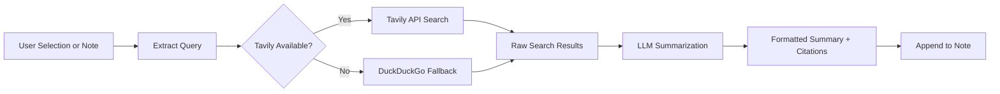

import TLDR from '@site/src/components/TLDR';

# 조사 및 웹 검색

<TLDR>
**Notemd는 웹을 검색한 후 LLM로 요약된 결과를 직접 사용자의 노트에 삽입합니다.** Tavily API가 주요 검색 백엔드이며, DuckDuckGo은 설정이 전혀 필요 없는 대체 옵션으로 작동합니다. 결과는 출처 정보와 함께 요약되어 `## Research` 제목 아래에 표시됩니다. 단일 노트 연구, 일괄 폴더 연구, 그리고 요약 단계에서의 작업별 모델 선택 기능을 지원합니다.

이것은 [Obsidian AI 지식 관리 가이드](/docs/pillar-ai-knowledge)의 일부입니다.
</TLDR>

## 개요

Research는 Notemd의 가장 강력한 통합 기능 중 하나입니다. 이 기능은 읽기, 검색, 쓰기 과정을 연결해 줍니다. 생소한 용어를 찾기 위해 브라우저로 전환할 필요 없이, 해당 용어를 강조 표시한 다음 Notemd에게 검색, 요약, 결과 추가 작업을 맡기면 됩니다. 모든 것이 사용자의 보관소 내에서 이루어집니다.

이 프로세스는 완전히 설정할 수 있습니다. 검색 제공업체와 요약을 작성하는 LLM, 그리고 결과를 현재 노트에 추가할지 별도의 파일에 저장할지를 직접 선택할 수 있습니다. 일괄 모드를 사용하면 한 번의 클릭으로 폴더 내의 모든 노트를 검색할 수 있습니다.

## 작동 원리

### 검색-요약 파이프라인



1. **쿼리 추출** -- Notemd은 선택한 내용이나 노트 제목에서 검색어를 추출합니다.
2. **웹 검색** – 먼저 Tavily을 시도합니다. API 키가 설정되어 있지 않으면 자동으로 DuckDuckGo이 사용됩니다(키는 필요 없음).
3. **LLM 요약** -- 원본 검색 결과는 설정된 LLM로 전송되며, 해당 서비스는 인라인 출처 인용과 함께 간결한 요약을 생성합니다.
4. **Append** -- 형식이 지정된 요약 내용이 활성 노트의 `## Research` 제목 아래에 추가됩니다.

### Tavily 대 DuckDuckGo

| Aspect | Tavily | DuckDuckGo |
|--------|--------|------------|
| API 키 | 필수 (무료 티어 제공) | 필요 없습니다. |
| 결과 품질 | 고성능형 (AI 전용으로 설계됨) | 일반적인 질의에 적합합니다. |
| 속도 제한 | 광범위한 무료 티어 | 속도 제한이 적용될 수 있습니다. |
| 구성 설정 | 설정의 `tavilyApiKey` | 제로 설정 -- 자동 fallback |

### 배치 폴더 조사

폴더를 마우스 오른쪽 버튼으로 클릭한 다음 **"Notemd: Research folder"**를 선택하세요. 폴더 내의 모든 `.md` 파일은 순차적으로(또는 설정된 동시 처리 수준까지는 병렬적으로) 처리됩니다. 각 노트에는 고유한 연구 요약이 생성됩니다.

## 구성 설정

| 설정 | 기본값 | 효과 |
|---------|---------|--------|
| `tavilyApiKey` | `''` | Tavily API 키. 비어 있을 경우에는 DuckDuckGo만 사용됩니다. |
| `researchProvider` / `researchModel` | DeepSeek | 검색 결과 요약을 위한 작업당 LLM |
| `maxResearchContentTokens` | `4000` | LLM로 전송되는 콘텐츠에 사용할 수 있는 토큰 예산입니다. 초과분은 잘려나갑니다. |
| `researchAppendToNote` | `true` | 원본 노트에 요약을 추가합니다. false인 경우 별도의 파일을 생성합니다. |
| `researchLanguage` | `'en'` | 요약된 연구의 출력 언어 |

### 작업별 모델 추천

다국어 콘텐츠를 처리하고 잘 구성된 프로즈를 생성하는 모델은 연구에 큰 도움이 됩니다. 다음 사항을 고려해 보세요:

- **DeepSeek** -- 기본형, 합리적인 가격, 우수한 품질
- **GPT-4o** -- 더 높은 품질의 요약, 더 높은 비용
- **Gemini Flash** -- 빠르고 저렴하며, 간단한 쿼리에 적합합니다

## 예시

*transformer attention mechanisms*에 관한 논문을 읽다가 *relative positional encoding*이라는 생소한 용어를 접했습니다. Obsidian: 대신에

1. **"relative positional encoding"**을 강조 표시하세요.
2. 마우스 오른쪽 버튼 클릭 --> **"Notemd: 연구 및 요약"**
3. Notemd는 웹을 검색하여 상위 결과들을 요약한 뒤 다음 내용을 추가합니다:

```markdown
## Research

### Relative Positional Encoding

Relative positional encoding is a method used in transformer models
where positional information is expressed as relative distances between
tokens rather than absolute positions. Introduced by Shaw et al. (2018),
it improves generalization to unseen sequence lengths compared to
absolute encodings (Vaswani et al., 2017).

Sources:
- [Shaw et al., Self-Attention with Relative Position Representations (2018)](https://arxiv.org/abs/1803.02155)
- [Transformer Positional Encoding Overview](https://example.com/transformer-pos-enc)
```

요약 내용은 이제 보안 금고에 저장되어 검색이 가능하며, 링크로 공유할 수 있고 오프라인에서도 접근할 수 있습니다.

## 팁

- **최상의 결과를 위해 Tavily 키를 설정하세요** – 무료 플랜조차도 원본 DuckDuckGo보다 더 우수한 관련성을 제공합니다.
- **유능한 요약 모델을 사용하세요** – 저가형 모델은 섬세한 기술적 내용을 단순화할 수 있습니다.
- 첫 번째 훑어보기 후에 **Batch research**를 수행하여 여러 노트 전체의 정보 공백을 한 번에 채웁니다.
- **검토된 요약 내용 확인** -- LLMs는 출처에 대한 세부 정보를 오류 있게 생성할 수 있습니다. 핵심 주장들을 반드시 검증하십시오.

---

## 다음 단계

- [개념 노트](./concept-notes) -- 연구 결과에서 핵심 용어를 추출하여 저장하기
- [Wiki-Links](./wiki-links) -- 볼트 내에서 연구를 통해 도출된 개념들을 서로 연결합니다
- [번역](./translation) -- 연구 요약을 다른 언어로 번역하기
- [LLM 제공업체](/docs/providers/overview) -- 요약에 사용될 모델을 구성합니다
