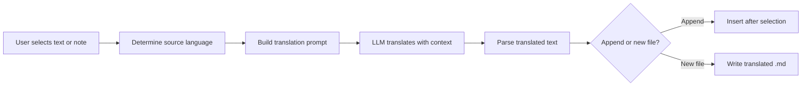

import TLDR from '@site/src/components/TLDR';

# 번역

<TLDR>
**Notemd는 LLM 기술을 활용하여 21개 이상의 언어 간에 텍스트를 번역합니다.** 단일 선택 번역, 전체 내용 번역, 그리고 일괄 폴더 번역을 지원합니다. 각 번역 작업은 작업별 설정을 통해 별도의 제공업체와 모델을 사용할 수 있습니다. 출력 언어는 UI 언어와는 별도로 설정할 수 있습니다. 결과는 사용자의 선호에 따라 기존 파일에 추가되거나 새 파일로 저장됩니다.

이것은 [Obsidian AI 지식 관리 가이드](/docs/pillar-ai-knowledge)의 일부입니다.
</TLDR>

## 개요

Notemd에서의 번역은 단순한 사전 검색이 아니라 LLM 기술을 활용한 상황 인식형 번역입니다. 모델은 전체 단락이나 메모를 파악하여 톤, 분야별 용어, 문장 구조를 그대로 유지합니다. 이를 통해 단어별 번역 서비스보다 더 높은 품질의 결과를 제공하며, 특히 기술적, 학술적, 창의적 글쓰기에 효과적입니다.

이 기능은 선택, 현재 열린 노트, 전체 폴더라는 세 가지 범위를 지원합니다. 작업별 모델 선택 기능과 함께 사용하면 전체 공급자를 변경하지 않고도 캐주얼한 번역에는 빠른 모델(Gemini Flash)을, 미묘한 뉘앙스가 중요한 콘텐츠에는 강력한 모델(Claude Sonnet)을 활용할 수 있습니다.

## 작동 원리

### 번역 명령어



1. **출처 감지** -- LLM가 콘텐츠에서 출처 언어를 추론합니다. 수동으로 지정할 필요가 없습니다.
2. **프롬프트 구성** -- Notemd는 대상 언어, 선택적인 도메인 힌트, 그리고 번역할 콘텐츠가 포함된 프롬프트를 만듭니다.
3. **LLM 번역** -- 설정된 `translateProvider` / `translateModel`이 요청을 처리합니다. 이 모델은 마크다운 포맷, 위키 링크, 그리고 코드 블록을 그대로 유지합니다.
4. **출력** -- 번역된 텍스트는 원본 아래에 추가되거나 볼트의 새 파일에 저장됩니다.

### 언어 쌍

Notemd는 기반으로 하는 LLM이 지원하는 모든 언어 쌍을 지원합니다. 일반적인 쌍으로는 다음이 있습니다:

| 소스 | 타겟 | 일반적인 품질 |
|--------|--------|----------------|
| 영어 | 중국어(간체) | 훌륭합니다. |
| 중국어 | 영어 | 훌륭합니다. |
| 영어 | 일본어 | 매우 좋습니다. |
| 영어 | 독일어 / 프랑스어 / 스페인어 | 매우 좋습니다. |
| 지원되는 모든 경우 | 지원되는 모든 경우 | 모델에 따라 달라짐 |

`translateLanguage` 설정은 **출력 언어**를 제어합니다. 소스 언어는 자동으로 감지됩니다.

### 작업별 모델 선택

번역 품질은 모델에 따라 크게 달라집니다. Notemd를 사용하면 번역 전용으로 특정 모델을 지정할 수 있습니다.

| 모델 | 속도 | 품질 | 비용 | 가장 적합한 용도 |
|-------|-------|--------|------|----------|
| `gemini-2.0-flash-exp` | 빠름 | 좋습니다. | 낮음 | 캐주얼, 대용량 |
| `gpt-4o-mini` | 빠름 | 좋습니다. | 낮음 | 빠른 조회 |
| `deepseek-chat` | 중간 | 좋습니다. | 매우 낮음 | 예산 다국어 |
| `claude-3-5-sonnet` | 중간 | 훌륭합니다. | 중간 | 기술/학술 |
| `gpt-4o` | 중간 | 훌륭합니다. | 중간 | 뉘앙스에 민감한 문체 |

### 배치 폴더 번역

폴더를 마우스 오른쪽 버튼으로 클릭한 다음 **"Notemd: 폴더 번역"**을 선택하여 해당 폴더의 모든 노트를 번역할 수 있습니다. 각 파일은 독립적으로 처리됩니다. 동시성 설정은 몇 개의 파일을 병렬로 번역할지를 제어합니다.

## 구성 설정

| 설정 | 기본값 | 효과 |
|---------|---------|--------|
| `translateProvider` / `translateModel` | DeepSeek | 번역 작업 전용 제공업체 |
| `translateLanguage` | `'en'` | 목표 출력 언어 |
| `translationAppendToNote` | `true` | 원문 아래에 번역된 텍스트를 추가합니다. false인 경우 새 파일을 생성합니다. |
| `batchConcurrency` | `3` | 배치 번역 중에 병렬로 처리된 파일의 수 |

## 예시

중국어로 된 연구 노트를 읽고 있으며 영문 버전을 원합니다:

1. 노트를 열어주세요.
2. 마우스 오른쪽 버튼 클릭 --> **"Notemd: 현재 파일 번역"**
3. Notemd는 중국어를 감지하여 설정된 대상 언어(영어)로 번역한 뒤 다음 내용을 추가합니다:

```markdown
## Translation (English)

The experimental results show that the proposed method achieves
a 12% improvement in F1 score compared to the baseline, primarily
due to the enhanced feature extraction module described in Section 3.
```

번역 위에는 원본 중국어 텍스트가 그대로 유지됩니다. `## Translation` 제목을 통해 두 버전을 같은 파일에 함께 보관하여 쉽게 참조할 수 있습니다.

## 팁

- **대량 처리에는 Gemini Flash를 사용하세요** – 대용량 폴더의 일괄 번역에 가장 빠르고 저렴한 옵션입니다.
- **위키 링크 보존** – Notemd의 지시에 따라 LLM는 번역 시 `[[wiki-links]]`를 그대로 유지해야 합니다. 일부 모델은 때때로 이를 풀어버리므로 번역 후 반드시 확인해 주십시오.
- **출력 언어를 명시적으로 설정하세요** – 소스 코드의 경우 자동 감지가 가능하지만, 대상 언어에 대한 혼동을 피하기 위해 항상 `translateLanguage`을 설정해 주세요.
- **일괄 번역 콘셉트 노트** -- 콘셉트 폴더가 한 언어로 되어 있고 다른 언어로 변환해야 하는 경우, 폴더 단위 번역 기능을 통해 한 번에 처리할 수 있습니다.

---

## 다음 단계

- [Research](./research) -- 모든 언어로 검색하고 요약한 뒤 결과를 번역합니다
- [Workflows](./workflows) -- 위키 링크 연동 또는 개념 추출을 활용한 연쇄 번역
- [배치 처리](/docs/advanced/batch-processing) -- 폴더 작업의 동시성 및 덮어쓰기 동작
- [LLM 제공업체](/docs/providers/overview) -- 사용 중인 언어 쌍에 가장 적합한 모델을 선택하세요
