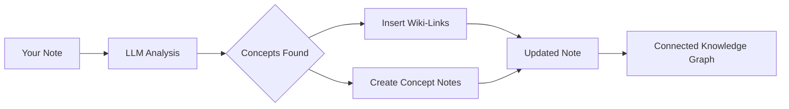

import TLDR from '@site/src/components/TLDR';

# 위키 링크들

<TLDR>
**Notemd는 노트의 핵심 개념들에 자동으로 `[[wiki-links]]`를 추가합니다.** LLM은 콘텐츠를 읽고 문맥 내에서 중요한 용어들을 식별한 다음, 각각의 출현 지점에 Obsidian 스타일의 위키 링크를 삽입합니다. 필요에 따라 백링크가 포함된 개념 노트 파일도 생성할 수 있습니다. 동의어 제거, 이름 변경/삭제 시의 링크 무결성 유지, 그리고 파일 수정이 이루어지지 않는 순수 추출 모드도 지원합니다. 기존 노트 제목만 일치시키는 Auto Link와 달리, Notemd는 AI를 활용하여 새로운 개념들을 식별하고 해당 노트를 생성합니다. 이 기능은 [Obsidian AI 지식 관리 가이드](/docs/pillar-ai-knowledge)의 일부입니다.
</TLDR>

## 개요

위키 링크 기능은 Notemd의 핵심 기능입니다. 이 기능은 다음과 같은 방식으로 일반 텍스트를 연결된 지식 그래프로 변환합니다:

1. LLM를 사용하여 **노트 분석** 중입니다.
2. **핵심 개념 식별** (용어, 인물, 방법, 이론)
3. 각 발생 지점에 `[[wiki-links]]`를 삽입합니다.
4. **개념 노트 작성** (선택 사항) 및 백링크

## 작동 원리

### 처리



### 예시

**이전:**
```markdown
Machine learning models use neural networks to learn patterns from data.
The transformer architecture revolutionized natural language processing.
```

**완료 후:**
```markdown
[[Machine learning]] models use [[neural networks]] to learn patterns from data.
The [[transformer architecture]] revolutionized [[natural language processing]].
```

## 사용법

### 기본: 현재 노트에 링크 추가

1. 메모 열기
2. 편집기에서 마우스 오른쪽 버튼 클릭 → **"파일 처리 (링크 추가)"**
3. 몇 초 기다려 주세요.
4. 개념들이 이제 연결되었습니다!

### 일괄 처리: 여러 노트 처리

1. 파일 탐색기에서 폴더를 마우스 오른쪽 버튼으로 클릭하세요.
2. **"Notemd: 폴더 처리 (링크 추가)"**를 선택하세요.
3. 구성하기:
   - 동시성 (동시에 처리하는 파일의 수)
   - 기존 링크 덮어쓰기 (예/아니오)
4. **Process**를 클릭하세요.

### 선택적: 특정 텍스트 링크하기

1. 처리할 텍스트를 강조 표시하세요
2. 마우스 오른쪽 버튼 클릭 → **"프로세스 선택 (링크 추가)"**
3. 강조된 부분만 분석됩니다.

## Notemd 대 자동 링크

Obsidian에는 자동 위키 링크 생성을 위한 두 가지 방법이 있습니다:

| | **자동 링크** | **Notemd** |
|--|---------------|-------------|
| 링크 출처 | 볼트에 있는 기존 노트 제목들 | LLM-콘텐츠 내 식별된 개념들 |
| 새로운 개념을 연결할 수 있나요? | 아니요 — 제목은 이미 존재해야 합니다. | 네 — AI가 개념을 파악하고 메모를 작성합니다. |
| 동의어 처리 | 안 됨 | 네 — 동의어 억제 |
| 컨셉 노트 작성 | 안 됨 | 네 — 백링크와 중복 제거 기능이 있습니다. |
| 배치 처리 | 아니요 (단일 파일) | 예 (폴더 수준) |
| 작업별 모델 라우팅 | 안 됨 | 네 |

**Auto Link**는 제목 일치 방식을 사용합니다: “Machine Learning”이라는 이름의 노트가 존재하면 해당 부분을 `[[Machine Learning]]`로 감싸줍니다. 노트가 존재하지 않으면 아무런 작업도 이루어지지 않습니다.

**Notemd**는 AI가 구동합니다. LLM은 사용자의 콘텐츠를 읽고 맥락을 이해한 뒤, 아직 메모가 없더라도 연결되어야 하는 개념들을 파악하여 링크와 개념 메모를 모두 생성합니다.

## 기능들

### 동의어 억제

**문제:** "transformer", "transformers", "Transformer architecture" → 3개의 별개 개념

**해결 방법:** Notemd은 거의 동일한 데이터를 감지하고 표준 형태를 사용합니다.

**구성 설정:**
```
Settings → Advanced → Synonym Suppression
Threshold: 0.8 (0 = off, 1 = aggressive)
```

### 링크 무결성

**컨셉 노트의 이름을 변경할 때:**
- 모든 위키 링크는 자동으로 업데이트됩니다 (Obsidian 핵심 기능)
- 백링크는 그대로 유지됩니다.

**컨셉 노트를 삭제할 때:**
- 링크는 그대로 남아 있지만 “비연결된 언급”으로 표시됩니다.
- 어떤 발생 사례에서든 다시 만들 수 있습니다.

### 순수 추출 모드

**원본을 변경하지 않고 개념을 추출합니다:**

1. 마우스 오른쪽 버튼 클릭 → **"개념 추출 (링크 없음)"**
2. 컨셉 노트가 생성됩니다.
3. 원본 파일은 그대로 유지됨

사용 사례: 읽기 전용 콘텐츠나 최종 초안을 처리하는 경우.

## 컨셉 노트 생성

### 자동 생성

**활성화되면(기본값), Notemd는 다음을 생성합니다:**

```markdown
---
tags: [concept, auto-generated]
created: 2026-06-13
source: [[Original Note Name]]
---

# Machine Learning

A branch of artificial intelligence that enables computers
to learn from data without explicit programming.

## Occurrences in Your Vault

- [[Original Note Name#Section]]
- [[Another Note#Header]]

## Related Concepts

- [[Neural Networks]]
- [[Deep Learning]]
- [[Supervised Learning]]
```

### 구성 설정

**출력 폴더:**
```
Settings → Output → Concept Folder
Default: concepts/
```

**계층 구조:**
```
Settings → Output → Use Hierarchical Folders
If enabled:
  papers/my-paper.md → papers/concepts/Concept.md
If disabled:
  → concepts/Concept.md
```

**템플릿:**
```
Settings → Output → Concept Template
Customize with variables:
  {{concept}} — Concept name
  {{description}} — LLM-generated description
  {{backlinks}} — List of source notes
  {{date}} — Creation date
```

## 고급 옵션

### 컨텍스트 윈도우

**보낼 주변 텍스트의 양:**

```
Settings → Linking → Context Window
Options: Sentence | Paragraph | Full Note
Default: Paragraph
```

크기가 클수록 정확도는 높아지지만 비용은 증가합니다.

### 최소 발생 횟수

**여러 번 나타나는 개념만 링크로 연결하세요:**

```
Settings → Linking → Min Occurrences
Default: 1 (link all)
```

반복되는 주제에 집중하려면 2 또는 3으로 설정하세요.

### 패턴 제외

**특정 단어 건너뛰기:**

```
Settings → Linking → Exclude List
Example: note, idea, example, thing
```

일반적인 용어의 과도한 링크를 방지합니다.

### 커스텀 프롬프트

**기본 LLM 지침 덮어쓰기:**

```
Settings → Advanced → Custom Linking Prompt
Default:
  "Identify key concepts, theories, methods, and technical
   terms in the following text. Return as a list..."
```

도메인별 요구사항에 맞게 수정하기 (예: “의료 용어에 중점을 둠”).

## 팁 및 모범 사례

### ✅ 완료

- **100단어 이상의 메모 처리** — 짧은 메모는 핵심 개념이 적습니다
- 더 나은 개념 식별을 위해 강력한 모델을 사용하세요(GPT-4o, Claude)
- **수락하기 전에 검토하세요** — 제안된 링크들이 적절한지 확인하십시오
- **반복적으로 빌드하기** — 5~10개의 노트를 처리하고, 그래프를 검토한 후 설정을 조정합니다.

### ❌ 하지 마세요

- **Over-link** — 모든 명사에 링크가 필요한 것은 아닙니다
- **초안을 반복적으로 처리하기** — 개념이 변할 수 있으므로 안정화될 때까지 기다립니다.
- **동의어 무시** — “ML”과 “Machine Learning”을 구분하지 않도록 억제 기능을 활성화합니다.

## 성능

### 속도

| 노트 크기 | GPT-4o-mini | 클로드 소네트 | Ollama (로컬) |
|-----------|-------------|---------------|----------------|
| 500단어 | 2-3초 | 3-5초 | 5-10초 |
| 2000단어 | 5-8초 | 10-15초 | 20-40초 |
| 5000단어 이상 | 분할 처리 (여러 번 호출) | 분할된 | 분할된 |

### 비용 산정

**예시: GPT-4o-mini를 사용한 1000단어 노트**
- 입력: 약 1500 토큰
- 출력: ~200 토큰
- 비용: 약 $0.001

**100개의 노트 일괄 처리:** 약 $0.10

## 문제 해결

### 링크가 추가되지 않았습니다.

**확인:**
1. LLM 호출이 성공했습니다 (설정 → 진단).
2. 노트에는 충분한 내용이 있습니다(50단어 이상).
3. 개념은 기술적이고 구체적입니다(단순한 대명사가 아닙니다).

**시도해 보세요:**
- 더 강력한 모델을 사용하세요.
- 컨텍스트 윈도우를 확장합니다.
- API 키의 유효성을 확인하세요.

### 링크가 너무 많습니다.

**솔루션:**
1. 최소 발생 횟수를 (2 또는 3)으로 늘리기
2. 제외 목록에 일반적인 단어들을 추가하세요
3. 덜 공격적인 모델을 사용하세요

### 잘못된 개념이 연결되었습니다.

**수정 사항:**
1. 도메인 특수성에 맞는 사용자 지정 프롬프트를 사용하세요
2. 동의어 억제 기능 활성화
3. 수동으로 검토하고 연결을 해제합니다.

### 이름을 바꾼 후 링크가 깨짐

**이것은 정상적인 Obsidian 동작입니다.**

모든 링크를 업데이트하려면:
1. 컨셉 노트의 이름을 변경하세요
2. Obsidian는 자동으로 `[[old]]`를 `[[new]]`로 업데이트합니다.

---

## 다음 단계

- 📖 [Concept Notes](./concept-notes) — 콘셉트 노트 작성에 대한 심층 분석
- 🔍 [Research Integration](./research) — 웹 검색과 링크 연동하기
- 🎨 [Diagrams](./diagrams) — 당신의 지식 그래프를 시각화하세요
