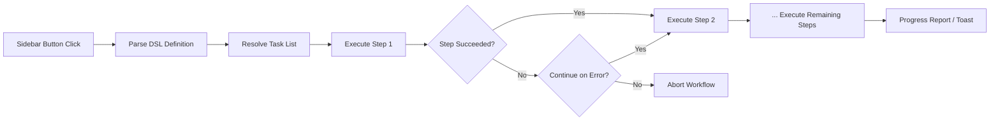

import TLDR from '@site/src/components/TLDR';

# 워크플로우

<TLDR>
**Notemd 워크플로우는 여러 작업을 하나의 클릭식 동작으로 연결합니다.** 간단한 DSL을 사용하여 `add-links > extract-concepts > research > diagram`와 같은 순서를 정의할 수 있습니다. 워크플로우는 사이드바 버튼 형태로 표시되며, 현재 노트나 폴더에서 전체 작업 체인을 실행합니다. 사전 정의된 워크플로우가 함께 제공되며, 설정에서 자신만의 워크플로우를 만들 수 있습니다. 각 단계는 고유한 작업별 모델 설정을 사용합니다.

이것은 [Obsidian AI 지식 관리 가이드](/docs/pillar-ai-knowledge)의 일부입니다.
</TLDR>

## 개요

워크플로우는 작업을 하나씩 순차적으로 수행할 때 발생하는 복잡함을 없애줍니다. 링크를 추가하고, 개념을 추출하며, 생소한 용어를 조사하고, 다이어그램을 생성하기 위해 마우스 오른쪽 버튼을 네 번 클릭할 필요 없이 사이드바의 버튼 하나만 누르면 전체 작업 과정이 자동으로 실행됩니다. Notemd가 작업 순서 관리, 오류 전파, 진행 상황 보고를 담당합니다.

워크플로우는 경량형 DSL(도메인 특화 언어)로 정의됩니다. 이들은 설정에 저장되며 Obsidian 사이드바에 클릭 가능한 버튼으로 표시되고, 현재 노트나 전체 폴더에 적용될 수 있습니다.

## 작동 원리

### 워크플로우 실행 파이프라인



1. **Parse** -- DSL 문자열은 `>`(또는 `>`)를 기준으로 순서가 지정된 작업 식별자 목록으로 분할됩니다.
2. **Resolve** -- 각 식별자는 내부 명령어(add-links, extract-concepts, research, translate, diagram 등)에 매핑됩니다.
3. **실행** -- 단계들은 순차적으로 실행됩니다. 각 단계는 해당 작업에 설정된 공급자와 모델을 사용합니다.
4. **오류 처리** -- 단계가 실패할 경우, 오류 정책에 따라 워크플로우는 중단되거나 다음 단계로 계속 진행됩니다.
5. **완료** -- 토스트 알림을 통해 성공 여부를 알리거나 실패한 단계들을 목록으로 표시합니다.

### DSL 형식

워크플로우는 `>`로 구분된 작업 식별자들의 순서로 정의됩니다:

```
process-current-add-links>extract-concepts-current>research-and-summarize
```

**사용 가능한 작업 식별자:**

| 식별자 | 동작 |
|------------|--------|
| `process-current-add-links` | 활성 노트에 위키 링크를 추가하세요 |
| `extract-concepts-current` | 활성 노트에서 개념을 추출합니다. |
| `research-and-summarize` | 선택한 텍스트나 노트 제목에 대해 조사하십시오. |
| `process-current-translate` | 활성 노트 번역 |
| `summarize-to-mermaid` | 활성 노트에서 다이어그램을 생성합니다. |
| `generate-from-title` | 노트 제목에서 콘텐츠를 생성합니다. |
| `extract-original-text` | 원본 텍스트 추출 (OCR/스캔된 콘텐츠용) |

**폴더 수준 변형**은 식별자 이름에서 `current`를 `folder`로 대체합니다.

### 사전 정의된 워크플로우 vs. 사용자 지정 워크플로우

Notemd에는 일반적인 패턴에 대한 사전 구성된 워크플로우가 포함되어 있습니다:

| 워크플로우 | 체인 | 사용 사례 |
|----------|-------|----------|
| **원클릭 추출** | add-links > extract-concepts > research | 한 번에 연구 논문을 처리합니다. |
| **전체 파이프라인** | add-links > extract-concepts > research > diagram | 시각화를 활용한 완전한 지식 추출 |
| **번역 + 링크** | 번역 > 링크 추가 | 목표 언어로 번역한 다음 개념들을 연결하세요. |

**커스텀 워크플로우**는 설정에서 생성됩니다:

1. **설정**을 열어 --> **Notemd** --> **워크플로우**로 이동하세요.
2. **"워크플로우 추가"**를 클릭하세요.
3. DSL 체인을 입력하세요(예: `process-current-add-links>extract-concepts-current`).
4. 표시 이름을 지정해 주세요(예: “빠른 링크 + 추출”).
5. 새로운 버튼이 즉시 사이드바에 나타납니다.

## 구성 설정

| 설정 | 기본값 | 효과 |
|---------|---------|--------|
| `workflows` | 사전 정의된 집합 | 워크플로우 정의 배열 (이름 + DSL) |
| `workflowContinueOnError` | `true` | 현재 단계에서 실패하면 다음 단계로 계속 진행합니다. |
| `workflowShowProgress` | `true` | 각 단계가 완료될 때마다 진행 상황 토스트를 표시합니다. |

### 워크플로우의 작업별 모델

워크플로우의 각 단계는 자체적인 작업별 모델 설정을 사용합니다. DSL 자체에서 모델을 명시할 필요가 없습니다. 해결 순서는 다음과 같습니다:

1. `useMultiModelSettings`가 활성화된 경우 작업별 제공자/모델
2. 글로벌 `activeProvider`이 아닌 경우

이는 `add-links`가 DeepSeek에서 실행될 수 있고 `research`은 GPT-4o에서 실행된다는 뜻으로, 모두 동일한 워크플로우 클릭 내에서 이루어집니다.

## 예시

방금 머신러닝 논문의 PDF를 볼트에 가져왔으며, 전체적인 지식 추출을 원합니다:

1. 수입된 노트를 열어주세요.
2. **"Full Pipeline"** 사이드바 버튼을 클릭하세요
3. Notemd가 실행됩니다:
   - **1단계**: 위키 링크를 추가합니다 -- `[[attention mechanism]]`, `[[transformer]]` 등.
   - **2단계**: 개념 추출 -- 개념 폴더에 개념 노트를 생성합니다
   - **3단계**: 조사 -- 핵심 키워드에 대한 웹 자료를 요약합니다
   - **4단계**: 다이어그램 -- 논문의 구조에 대한 Mermaid 마인드맵을 생성합니다
4. 약 30초가 지나면 메모에 링크가 추가되고, 개념 노트가 생성되며, 연구 내용이 포함되고, 다이어그램 파일이 저장됩니다.

한 번의 클릭으로 모든 작업이 완료됩니다.

## 팁

- **사전 정의된 워크플로우부터 시작하세요** – 이들은 가장 일반적인 패턴들을 다룹니다. 다른 순서가 필요할 때만 맞춤 설정하십시오.
- **`workflowContinueOnError`를 활성화하십시오** -- 실패한 다이어그램 단계가 전체 파이프라인을 중단시켜서는 안 됩니다.
- 대량 처리를 위해 **폴더 워크플로우**를 사용하세요 -- 폴더를 마우스 오른쪽 버튼으로 클릭하고 워크플로우를 선택하면 모든 노트가 처리됩니다.
- **작업 흐름을 명확하게 지정하세요** – 사이드바 공간이 제한되어 있습니다. “빠른 추출”이나 “번역 + 링크”와 같이 짧고 동작 중심의 이름을 사용하세요.

---

## 다음 단계

- [Research](./research) -- 워크플로우에 추가하기 전에 연구 단계가 하는 역할을 이해하세요
- [Wiki-Links](./wiki-links) -- 대부분의 워크플로우에서 사용되는 핵심 링크 기능
- [개념 노트](./concept-notes) -- 워크플로우 단계로서의 개념 추출
- [배치 처리](/docs/advanced/batch-processing) -- 폴더 작업 흐름을 위한 동시성 및 진행 상황 보고
