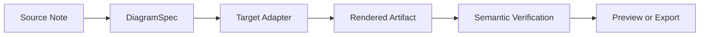
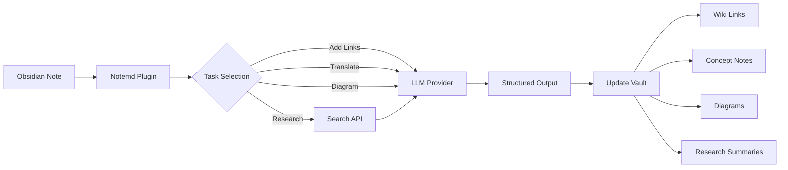

import TLDR from '@site/src/components/TLDR';

# Notemd 입문

<TLDR>
**Notemd** (Note + EMD — Enhanced Markdown Documents)는 LLM 기반의 독서 내용을 지속적인 지식으로 변환해주는 오픈소스 Obsidian 플러그인입니다. 세션이 끝나면 통찰력이 사라지는 채팅형 AI와 달리, Notemd는 결과물을 위키 링크, 개념 노트, 연구 요약, 번역문, 워크플로우, 다이어그램 형태로 **직접 사용자의 보관소에 저장**합니다. 이 플러그인은 독서, 연구, 시각적 설명을 체계적이고 지속적으로 발전하는 지식 그래프로 축적하고자 하는 연구자, 학생, 지식 근로자들을 위해 만들어졌습니다.
</TLDR>

## Notemd는 무엇인가요?

Notemd는 **30개 이상의 대형 언어 모델**(OpenAI, Anthropic, Google, DeepSeek, Qwen, Ollama 등)을 여러분의 Obsidian 워크플로우에 통합하여 지식 추출, 정리, 번역, 연구, 다이어그램 생성 작업을 자동화해 줍니다.

### 주요 차이점: 일시적 지식과 영구적 지식

| Aspect | 챗 기반 AI (ChatGPT 등) | Notemd |
|--------|-------------------------------|--------|
| **결과 저장 위치** | 채팅 기록 (사라짐) | 귀하의 Obsidian 금고(지속 저장됨) |
| **형식** | 플레인 텍스트 답변 | 구조화된 파일: `[[wiki-links]]`, 개념 노트, 다이어그램 |
| **장기적 가치** | 매번 다시 물어봐야 해요. | 지식 그래프로 축적됩니다. |
| **오프라인 접근** | 인터넷 연결이 필요합니다. | Ollama를 사용하면 오프라인에서도 완전히 작동합니다. |

## 핵심 기능

### 1. **자동 위키 링크 생성**
- LLM는 노트의 핵심 개념들을 식별합니다.
- 각 발생 위치에 `[[wiki-links]]`를 삽입합니다.
- 선택적으로 연결된 콘셉트 노트를 생성합니다.
- 중복을 방지하기 위한 동의어 억제

### 2. **개념 문서 작성**
- 논문, 기사, 메모에서 핵심 개념을 추출합니다.
- 백링크가 포함된 전용 콘셉트 파일을 생성합니다.
- 사용자 지정 가능한 출력 경로 및 템플릿

### 3. **웹 리서치 통합**
- Obsidian 내부에서 Tavily 또는 DuckDuckGo를 조회하세요.
- LLM는 출처를 명시하여 결과를 요약합니다.
- 현재 노트에 연구 결과를 추가합니다.

### 4. **다국어 번역**
- 선택한 부분 또는 전체 노트를 번역하세요
- 21개 이상의 UI 언어를 지원합니다.
- 독립적인 출력 언어 설정
- 일괄 번역 지원

### 5. **다이어그램 생성**
- **Mermaid**: 플로우차트, 시퀀스, 클래스, 상태, ER, 간트 차트
- **JSON Canvas**: Obsidian 네이티브 레이아웃
- **Vega-Lite**: 데이터 차트, 시계열, 산점도
- **HTML / 편집 가능한 HTML/SVG**: 의미론적 주석이 포함된 독립형 그래프 자산
- **Draw.io / Drawnix 아티팩트 경계**: 동일한 의미론적 모델에서 관리자용으로 제공되는 내보내기 경로
- **회로도 로드맵**: circuitikz/TikZJax에 대한 지원은 원시적이고 제약이 없는 LLM TikZ가 아닌, 골든 리퍼런스, 제약 조건이 적용된 프롬프트, 렌더링 피드백, 그리고 토폴로지/레이아웃 검증을 중심으로 설계되고 있습니다.
- **미리보기 진단**: 렌더링 오류로 인해 컴파일/렌더링 관련 진단 정보가 표시될 수 있으며, 인라인이 아닌 소스는 플러그인 측의 LaTeX 런타임 없이도 검사할 수 있습니다.
- Mermaid 오류에 대한 구문 자동 수정

### 6. **원클릭 워크플로우**
- 사이드바 버튼에 여러 작업을 연결하기
- DSL 기반 워크플로우 정의
- 예시: `add-links > extract-concepts > research > diagram`

## 누가 Notemd을 사용해야 하나요?

✅ 논문을 읽고 문헌 고찰을 작성하는 **연구자들**
✅ **학생들**이 학습 노트를 정리하고 개념도를 만들고 있습니다.
✅ 통찰력을 지속적으로 저장하고 싶은 **지식 노동자**들
✅ 번역 및 위키 링크가 필요한 **이중 언어 전문가**
✅ 로컬 LLM 지원을 원하는 **개인정보 보호를 중시하는 사용자들** (Ollama)
✅ 프롬프트와 워크플로우를 자동화하는 **고급 사용자**

## 왜 Notemd + Obsidian인가요?

**Obsidian**는 로컬 중심의 마크다운 기반 지식 베이스입니다. **Notemd**는 AI의 강력한 기능을 추가합니다.
- 귀하의 데이터는 클라우드 서비스가 아닌 귀하의 보안 금고에 안전하게 보관됩니다.
- 로컬 모델을 사용해 오프라인에서도 작동합니다.
- 무료이며 오픈 소스(MIT 라이선스)
- 기존의 Obsidian 플러그인과 연동됩니다.
- 수만 개의 노트까지 확장 가능

## 시작하기

1. **설치**: 설정 → 커뮤니티 플러그인 → 탐색 → "Notemd"
2. **구성**: 여러분의 LLM 공급자 API 키를 추가하거나 로컬 Ollama을 사용하세요.
3. **시도해 보기**: 노트를 열어 → 마우스 오른쪽 버튼 클릭 → “파일 처리(링크 추가)”
4. **탐색**: 원클릭 워크플로우를 확인하려면 사이드바를 보세요.

👉 [설치 가이드](./getting-started/installation) | [빠른 시작 튜토리얼](./getting-started/quick-start)

## 다이어그램 기능 방향

Notemd의 다이어그램 작업은 “모델에게 하나의 구문 문자열을 작성하도록 요청하는” 방식에서 벗어나 계층적 파이프라인 방식으로 전환되고 있습니다.

현재 구현은 Mermaid, JSON Canvas, Vega-Lite, HTML로의 폴백 기능, 편집 가능한 HTML/SVG, Draw.io XML 형태의 아티팩트, 최소한의 Drawnix JSON 하위 집합, 미리보기 진단 기능/소스 전용 폴백 기능, 그리고 일반 소스 및 CMOS 인버터 골든 템플릿을 위한 오프라인 `CircuitSpec -> circuitikz` 프로토타입을 이미 지원합니다. 회로도는 다루기 더 어려운 분야인데, circuitikz는 정확한 전기적 구조를 표현할 수 있지만 제약이 없는 LLM 출력은 종종 읽기 어려운 라우팅이나 렌더링되지 않는 LaTeX 코드를 생성합니다. 향후 방향은 골든 리퍼런스 템플릿, 노드 그리드 레이아웃 규칙, 렌더링 진단 기능, 스크린샷 피드백 루프를 통해 circuitikz을 계속해서 제약하는 것입니다.

[Diagrams](./features/diagrams)에 있는 세부 정보를 읽어보세요.

## 아키텍처

## Notemd 대 기타 Obsidian AI 플러그인들

대부분의 Obsidian AI 플러그인은 대화 중심으로 작동합니다(질문하면 AI가 답변하고, 인사이트는 채팅창에 그대로 남습니다). 반면 Notemd은 **작성 중심**으로, AI가 사용자의 메모를 처리하여 구조화된 결과를 직접 사용자의 보관소에 저장해 줍니다.

| 기능성 | Notemd | Copilot | Smart Connections | Text Generator |
|-----------|--------|---------|-------------------|-----------------|
| 자동 위키 링크 삽입 | 네 | 안 됨 | 안 됨 | 안 됨 |
| 컨셉 노트 생성 | 예 (백링크 + 중복 제거 포함) | 안 됨 | 안 됨 | 안 됨 |
| 다이어그램 생성 | 네 (Mermaid, Canvas, Vega-Lite, HTML, 편집 가능한 아티팩트) | 안 됨 | 안 됨 | 안 됨 |
| 웹 리서치 통합 | 네 (Tavily + DuckDuckGo) | 안 됨 | 안 됨 | 안 됨 |
| 배치 폴더 처리 | 네 | 제한된 | 안 됨 | 제한된 |
| 작업별 모델 라우팅 | 예 (7개의 작업, 독립적인 모델들) | 안 됨 | 안 됨 | 안 됨 |
| 원클릭 워크플로우 체인 | 예 (DSL) | 안 됨 | 안 됨 | 안 됨 |
| 번역 (배치) | 네 | 안 됨 | 안 됨 | 안 됨 |
| Vault와 채팅하기 | 안 됨 | 네 | 안 됨 | 안 됨 |
| 의미적 유사도 검색 | 안 됨 | 안 됨 | 네 | 안 됨 |
| 템플릿 기반 생성 | 안 됨 | 안 됨 | 안 됨 | 네 |
| LLM 제공업체들 | 36 (클라우드 + 게이트웨이 + 로컬) | 3-5 | 2-3 | 3-5 |
| 완전한 오프라인 상태 | 네 (Ollama) | 부분적인 | 부분적인 | 부분적인 |

**Notemd를 선택해야 하는 경우**: 단순히 메모에 대해 채팅하는 것이 아니라, AI가 지속적인 지식 그래프를 구축해 주기를 원할 때입니다.

**Copilot을 선택해야 하는 경우**: Obsidian 내에 대화형 AI 어시스턴트를 원할 때입니다.

**Smart Connections를 선택해야 하는 경우**: 의미 검색을 통해 노트들 간의 기존 관계를 발견하고자 할 때입니다.

## 철학

**Notemd**는 AI가 인간의 지식 기반 업무를 대체하는 것이 아니라 보완해야 한다고 생각합니다. 플러그인:
- 변경 사항 적용 전에 미리 검토하여 제어권을 유지해 줍니다.
- 맥락을 그대로 유지합니다(모든 결과는 출처로 연결됨).
- 개인정보를 보호합니다(로컬 LLM 지원, 텔레메트리 없음).
- 확장성이 유지됨 (개방형 APIs, 사용자 정의 워크플로우)

<!-- notemd-acknowledgments -->
## 감사와 참고 프로젝트

Notemd는 독립적으로 유지 관리됩니다. 문서화된 설계 결정에 영향을 주었거나 통합 기반을 제공한 오픈 소스 프로젝트와 커뮤니티에 감사드립니다. 이 목록은 영향 또는 상호 운용성만을 인정하며, 보증, 제휴, 번들 코드 또는 코드 재사용 주장을 의미하지 않습니다.

- **참고 프로젝트:** [cloudy-tech-diagrams-skill](https://github.com/cloudy-liu/cloudy-tech-diagrams-skill), [Drawnix](https://github.com/plait-board/drawnix), [diagrams.net / draw.io](https://www.diagrams.net/), [repo-saga](https://github.com/teee32/repo-saga).
- **오픈 소스 기반:** [Mermaid](https://github.com/mermaid-js/mermaid), [Vega-Lite](https://vega.github.io/vega-lite/), [Slidev](https://github.com/slidevjs/slidev), [CircuitikZ](https://github.com/circuitikz/circuitikz), [Tectonic](https://github.com/tectonic-typesetting/tectonic), [Docusaurus](https://docusaurus.io).
- 각 프로젝트는 자체 라이선스와 조건을 유지하며, Notemd는 [MIT 라이선스](https://github.com/Jacobinwwey/obsidian-NotEMD/blob/main/LICENSE)로 제공됩니다.

## 오픈 소스

- **라이선스**: MIT
- **출처**: [github.com/Jacobinwwey/obsidian-NotEMD](https://github.com/Jacobinwwey/obsidian-NotEMD)
- **커뮤니티**: [Discord](https://discord.gg/qnGgsQ9W) | [GitHub Discussions](https://github.com/Jacobinwwey/obsidian-NotEMD/discussions)
- **기여하기**: PR 환영합니다. [CONTRIBUTING.md](https://github.com/Jacobinwwey/obsidian-NotEMD/blob/main/CONTRIBUTING.md)를 참조하세요.

---

**다음**: [설치 →](./getting-started/installation)
