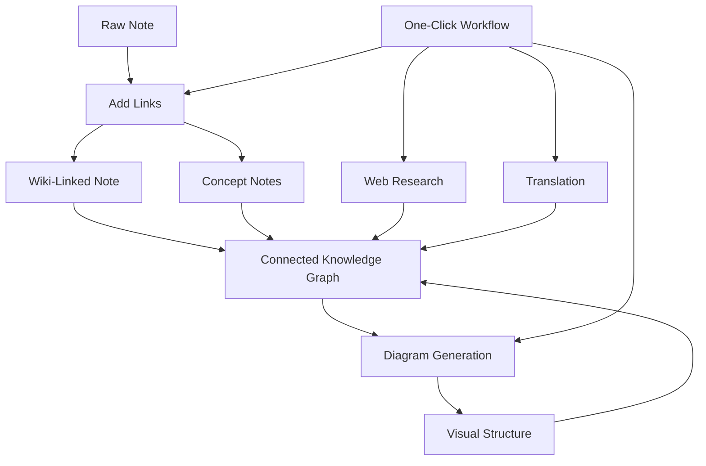

import TLDR from '@site/src/components/TLDR';

# Obsidian AI 지식 관리 가이드

<TLDR>
**Notemd는 LLM 기술을 활용한 독서 내용을 지속적인 지식으로 전환해 줍니다: 위키 링크가 개념들을 연결하고, 개념 노트는 검색 가능한 그래프를 만들어 주며, 연구 기능은 웹의 정보를 사용자의 저장소로 가져옵니다. 번역 기능은 언어 장벽을 없애주고, 다이어그램은 구조를 명확하게 보여주며, 워크플로우는 이 모든 것을 한 번의 클릭으로 연결해 줍니다.** 이 가이드는 원본 노트부터 상호 연결되고 시각적이며 다국어 지원이 가능한 지식 베이스에 이르기까지 전체 프로세스를 다룹니다.
</TLDR>

## 왜 AI 지식 관리인가요?

전통적인 메모 작성 방식은 평면 파일을 생성합니다. 수동으로 위키 링크를 사용하더라도 대부분의 메모는 서로 연결되지 않습니다. Notemd는 연결 계층을 자동화하기 위해 LLMs를 활용합니다:

- **LLMs가 귀하의 콘텐츠를 읽고** 중요한 요소들 — 용어, 방법, 사람, 이론들을 식별합니다.
- 각 개념이 등장할 때마다 **링크가 자동으로 삽입**되며, “참고 항목”에 숨겨지지 않습니다.
- **컨셉 노트는** 독립적인 검색 가능한 파일로 생성됩니다.
- **연구는 웹에서 가져온 맥락을 활용해 노트를 더욱 풍부하게 만듭니다**
- **다이어그램은 구조를 명확하게 보여줍니다** — 동일한 콘텐츠에서 만들어진 마인드맵, 흐름도, 데이터 차트

결과: 링크를 추가하는 것만 기억할 때가 아니라, 처리하는 모든 노트와 함께 성장하는 지식 그래프입니다.

## 전체 파이프라인



각 단계는 독립적입니다. 하나 또는 전부를 사용할 수 있습니다. 가장 효과적인 순서는 **링크 추가 → 개념 노트 → 다이어그램**입니다.

---

## 1. 위키 링크: 명시적인 연결 구축

위키 링크는 지식 그래프의 핵심입니다. Notemd는 LLM을 사용하여 다음과 같은 작업을 수행합니다:

1. 메모 내용을 읽어주세요(긴 문서의 경우 여러 블록으로 나뉨).
2. 핵심 개념을 파악하되, 일반적인 명사보다는 구체적인 기술 용어를 우선시합니다.
3. 각 발생 위치에 `[[wiki-links]]`를 삽입하세요.
4. 동의어를 억제하여 “ML”과 “Machine Learning”이 별도의 노드를 생성하지 않도록 하세요.

### 언제 사용할까요?

- **100단어 이상인 모든 노트** — 짧은 노트는 핵심 개념이 적습니다
- **연구 논문, 기술 문서, 회의록** — 분야별 전문 용어가 풍부함
- **콘텐츠가 안정화된 후** — 초안을 반복적으로 처리하지 마세요

### 키 설정

| 설정 | 추천됨 | 왜요? |
|---------|-----------|-----|
| `addLinksProvider` | DeepSeek 또는 GPT-4o-mini | 저렴한 가격에 높은 정확도 |
| 동의어 억제 | 켜짐 | 중복 노드를 방지합니다. |
| 컨텍스트 윈도우 | 단락 | 정확도와 비용의 균형 |

→ [위키 링크 심층 분석](/docs/features/wiki-links)

---

## 2. 개념 노트: 검색 가능한 지식 노드

위키 링크는 내용 안에서 아이디어들을 연결해 주지만, 개념 노트는 각 아이디어를 독립적으로 검색할 수 있게 해줍니다. 각 개념은 자체적인 `.md` 파일을 가집니다:

```markdown
# Machine Learning

## Linked From
- [[My Research Notes]]
- [[Neural Networks Explained]]
```

### 추출 과정

LLM 프롬프트는 매우 체계적으로 구성되어 있습니다:
- 단수 형태로 정규화하기
- 단어 하나보다는 여러 단어로 구성된 개념을 선호합니다("Dielectric Relaxation"가 아닌 "Relaxation").
- 참고문헌/참고자료 섹션은 생략합니다.
- 결정론적 파싱을 위해 `CONCEPT:` 줄 형태로 출력합니다

개념들은 `Set<string>`를 통해 각 청크별로 중복 제거됩니다. 개별 청크에서 발생하는 LLM 오류는 작업을 중단시키지 않습니다.

### 백링크

활성화되면 각 콘셉트 노트는 어떤 소스 노트들이 해당 노트를 언급하는지 추적합니다. Obsidian의 기본 백링크 패널에서도 역방향 연결을 확인할 수 있습니다.

### 중복 제거

Notemd의 4단계 중복 제거 엔진은 다음을 포착합니다:
1. **정확한 일치** — 대소문자를 구분하지 않는 파일명 비교
2. **복수형** — "Models.md" 대 "Model.md"
3. **기호 정규화** — "A-B.md" 대 "A B.md"
4. **단어 단위 포함 여부** — "Machine Learning.md"가 존재할 때 "ML.md"가 플래그 지정됨

### 키 설정

| 설정 | 추천됨 | 왜요? |
|---------|-----------|-----|
| `conceptNoteFolder` | `concepts/` 또는 `🧠 concepts/` | 금고를 체계적으로 유지합니다. |
| `extractConceptsAddBacklink` | 켜짐 | 역방향 조회를 활성화합니다. |
| `extractConceptsMinimalTemplate` | 끄기 | Linked From가 포함된 전체 템플릿 |
| 작업별 모델 | DeepSeek | 개념 추출에는 고성능 모델이 필요하지 않습니다. |
| 동의어 억제 | 켜짐 | 동일한 설정은 링크와 추출 모두에 영향을 미칩니다. |

→ [컨셉 노트 심층 분석](/docs/features/concept-notes)

---

## 3. 연구: 웹을 도입하기

Notemd는 노트 작성 워크플로우에 웹 검색 기능을 통합해 줍니다:

1. **쿼리 생성** — 메모 제목이나 선택 내용이 검색 쿼리가 됩니다
2. **웹 검색** — Tavily (권장, API 키 필요) 또는 DuckDuckGo (무료, 키 불필요)
3. **LLM 요약** — 검색 결과가 관련성 있는 요약으로 요약됩니다
4. **노트에 추가** — 커서 위치에 요약이 추가되거나 새로운 섹션으로 생성됨

### 언제 사용할까요?

- 새로운 주제를 처리하기 전에 먼저 웹 컨텍스트를 가져옵니다.
- 개념서에 보완이 필요할 때는 연구 내용을 추가한 뒤 링크를 넣으세요.
- 문헌 고찰을 위해 — 메모 폴더를 일괄적으로 조사하세요

### 키 설정

| 설정 | 추천됨 | 왜요? |
|---------|-----------|-----|
| `researchProvider` | GPT-4o 또는 Claude | 연구에는 더 높은 품질의 요약이 필요합니다. |
| 검색 서비스 | Tavily | 더 나은 관련성, 설정 가능한 깊이 |
| `maxResearchContentTokens` | 4000 | 깊이와 비용의 균형 |

→ [심층 연구](/docs/features/research)

---

## 4. 번역: 언어의 장벽을 허물다

Notemd는 설정된 LLM을 사용하여 노트를 번역합니다 — 전용 번역 API가 아닙니다. 즉, 다음과 같은 의미입니다:

- **상황 인식형 번역** — LLM은 문장 단위가 아닌 전체 문서를 이해합니다
- **기술 용어 처리** — "gradient descent"는 "坡度向下"이 아닌 "梯度下降"로 유지됩니다.
- **일괄 처리 지원** — 한 번의 작업으로 노트가 포함된 전체 폴더를 번역합니다
- **작업별 모델** — 번역에 Gemini Flash를 사용합니다(빠르고 저렴하며 다국어 지원).

### 언어 지원

Notemd 자체는 21개의 UI 언어를 지원합니다. 번역 대상 언어는 작업별로 설정할 수 있습니다. 일반적인 쌍으로는 EN↔ZH, EN↔JA, EN↔KO, EN↔DE, EN↔FR, EN↔ES가 있습니다.

→ [번역 심층 분석](/docs/features/translation)

---

## 5. 다이어그램: 구조를 가시화하기

Notemd의 다이어그램 파이프라인은 사양을 우선시합니다: LLM가 구조화된 `DiagramSpec` JSON를 생성한 후, 어댑터들이 이를 목표 형식으로 변환합니다. 이 방식은 LLM에게 원시 Mermaid 구문을 요청하는 것보다 더 안정적인 결과물을 만들어냅니다.

### 의도 감지

Notemd는 콘텐츠로부터 가장 적합한 다이어그램 유형을 추론합니다:

- **숫자가 포함된 표** → 데이터 차트 (Vega-Lite)
- **클라이언트/서버 용어** → 시퀀스 다이어그램 (Mermaid)
- **엔티티/주키** → ER 다이어그램 (Mermaid)
- **단계/프로세스 흐름** → 플로우차트 (Mermaid)
- **개념도 키워드** → JSON Canvas (Obsidian 네이티브)
- **기본값** → 마인드맵 (Mermaid)

### 렌더링 체인

주요 대상 → 백업 → 백업 → HTML. 만약 Mermaid 구문에 오류가 발생하면 오류 상황과 함께 LLM에 한 번 더 시도한 후, 최소한의 다이어그램으로 전환됩니다.

### 키 설정

| 설정 | 추천됨 | 왜요? |
|---------|-----------|-----|
| `enableExperimentalDiagramPipeline` | 켜짐 | 사양 우선 접근 방식을 통한 더 우수한 품질 |
| `experimentalDiagramCompatibilityMode` | `best-fit` | 의도별 네이티브 타겟 |
| `summarizeToMermaidProvider` | GPT-4o 또는 Claude | 다이어그램 사양에는 공간적 추론이 필요합니다. |
| `autoMermaidFixAfterGenerate` | 켜짐 | LLM 구문 오류를 자동으로 감지합니다. |
| 로컬 지식 증강 | 도메인별로 켜기 | 볼트 컨텍스트를 통해 정확도를 향상시킵니다. |

→ [다이어그램 심층 분석](/docs/features/diagrams)

---

## 6. 워크플로우: 원클릭 자동화

워크플로우는 여러 작업을 하나의 사이드바 버튼으로 연결합니다. DSL 형식은 다음과 같습니다:

```
task1 | task2 | task3
```

예시: `addLinks | 개념 추출 | generateDiagram` — 원본 텍스트의 노트를 한 번의 클릭으로 완전히 연결된 시각적 지식 노드로 변환합니다.

### 권장 워크플로우

| 워크플로우 | 체인 | 사용 사례 |
|----------|-------|----------|
| 전체 처리 과정 | `addLinks \| extractConcepts \| generateDiagram` | 새 노트 |
| 먼저 조사하기 | `research \| addLinks` | 생소한 주제들 |
| 폴리글롯 | `translate \| addLinks` | 다국어 노트 |
| 다이어그램만 | `generateDiagram` | 빠른 시각화 |

→ [워크플로우 심층 분석](/docs/features/workflows)

---

## 7. LLM 제공업체: 클라우드부터 로컬까지 36가지 옵션

Notemd는 4가지 전송 유형에 걸쳐 36개의 제공업체를 지원합니다. 주요 그룹:

- **국제 클라우드**: OpenAI, Anthropic, Google, Mistral, xAI
- **중국 클라우드**: DeepSeek, Qwen, Doubao, Moonshot, GLM, 바이두, SiliconFlow
- **게이트웨이**: OpenRouter, GitHub Models, Hugging Face, Vercel
- **로컬**: Ollama, LMStudio, OVMS — API 키는 없으며, 데이터는 귀하의 컴퓨터를 떠나지 않습니다

### 작업별 모델 전략

가장 비용 효율적인 설정은 간단한 작업에는 저렴한 모델을, 복잡한 작업에는 강력한 모델을 사용하는 것입니다:

```
extractConcepts  → DeepSeek (fast, cheap, accurate enough)
addLinks          → DeepSeek or GPT-4o-mini
research          → GPT-4o or Claude (needs quality)
generateDiagram   → GPT-4o or Claude (needs spatial reasoning)
translate         → Gemini Flash (fast, multilingual)
```

→ [LLM 제공업체 개요](/docs/providers/overview)

---

## 시작하기 체크리스트

1. **Notemd 설치하기** — [Community Plugins](/docs/getting-started/installation) (권장) 또는 수동 설치
2. **프로바이더 설정** — DeepSeek (가장 간편함), OpenAI, 또는 Ollama (무료)
3. **첫 번째 노트 처리하기** — 마우스 오른쪽 클릭 → "파일 처리(링크 추가)"
4. **컨셉 폴더 설정** — 설정 → Notemd → 출력 → 컨셉 폴더
5. **개념 추출** — 동일한 노트에 “개념 추출”을 실행하세요
6. **다이어그램 생성** — 연결 관계를 시각화하려면 “다이어그램 생성”을 실행하세요
7. **워크플로우 생성하기** — 위의 단계들을 원클릭 버튼으로 연결합니다

## 권장 설정

### 학생(예산)

```
Provider: DeepSeek (free tier available)
Concept extraction: DeepSeek
Research: DuckDuckGo (free) + DeepSeek
Diagrams: Off (or legacy Mermaid)
Workflows: addLinks | extractConcepts
```

### 연구원(품질)

```
Provider: GPT-4o (primary)
Concept extraction: DeepSeek (cost savings)
Research: GPT-4o + Tavily
Diagrams: best-fit mode, GPT-4o
Workflows: research | addLinks | extractConcepts | generateDiagram
```

### 개인정보 우선(로컬 전용)

```
Provider: Ollama (llama3 or qwen2.5:7b)
All tasks: Ollama
Research: DuckDuckGo (free, no API key)
Diagrams: legacy Mermaid mode
```

### 이중 언어 (중문 + 영문)

```
Primary: DeepSeek (Chinese queries)
Translation: Google Gemini Flash
Research: Tavily + DeepSeek (Chinese search context)
Language output: per-task (extractConceptsLanguage: zh-CN)
```

---

## 일반적인 패턴

### 패턴: 연구 논문 처리

1. PDF 콘텐츠를 가져오기(또는 붙여넣기)
2. **Research** — 해당 주제에 대한 웹 상의 정보 수집
3. **링크 추가** — 핵심 개념을 식별하고 링크 연결하기
4. **개념 추출** — 독립적인 노트 생성
5. **다이어그램 생성** — 논문의 구조를 시각화하기

### 패턴: 일일 노트 풍부화

1. 일일 노트 작성
2. **링크 추가** — 오늘의 아이디어를 기존 개념들과 연결합니다
3. 컨셉 노트는 백링크와 함께 자동으로 업데이트됩니다.

### 패턴: 문헌 고찰

1. papers/notes 폴더를 생성합니다.
2. **일괄 링크 추가** — 전체 폴더 처리
3. **중복 개념 제거** — 거의 중복된 노트 정리
4. **다이어그램 생성** — 전체 문헌에 대한 마인드 맵

---

*Notemd는 오픈 소스(MIT 라이선스)이며 모든 플랫폼에서 Obsidian 0.15.0+와 함께 작동합니다. [지금 설치하기](/docs/getting-started/installation) 또는 [GitHub에서 확인하기](https://github.com/Jacobinwwey/obsidian-NotEMD).*
