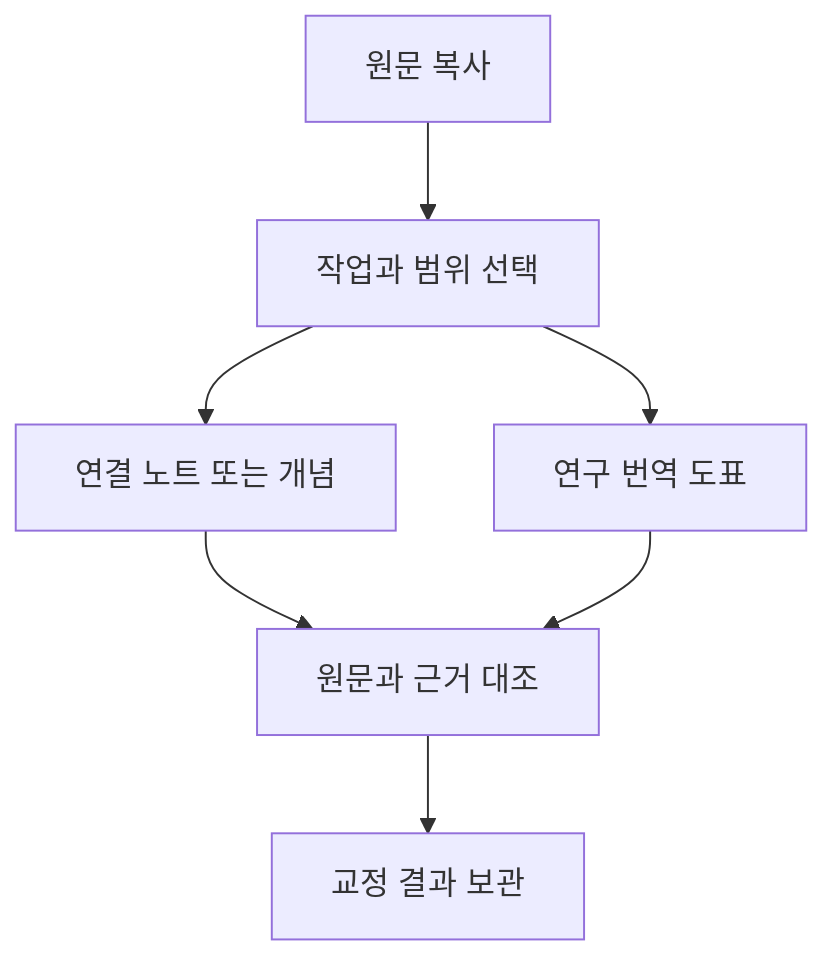

import TLDR from '@site/src/components/TLDR';

# Obsidian에서 AI로 지식 관리

<TLDR>유용한 흐름은 원문, 모델 응답과 직접 교정한 내용을 구분합니다. Notemd는 링크·추출·연구·번역·도표를 검토 가능한 문서로 만듭니다. 원문 하나에서 시작해 검토한 뒤 제한된 폴더를 자동화하세요.</TLDR>

## 목표 출력 정하기

연결 노트, 개념, 출처 있는 요약, 번역이나 도표를 고르세요. 파일과 링크가 많아도 이해와 검색이 좋아진다고 보장하지 않습니다. 검증하고 다시 찾는 방법부터 정합니다.

## 전체 흐름


```mermaid
flowchart TD
    A[원문 복사] --> B[작업과 범위 선택]
    B --> C[연결 노트 또는 개념]
    B --> D[연구 번역 도표]
    C --> E[원문과 근거 대조]
    D --> E
    E --> F[교정 결과 보관]
```

가능한 작업을 표현한 것이며 기본 버튼이 모두 실행한다는 뜻은 아닙니다. 연결 전 원문과 목적지를 확인하세요.

## 1. 링크로 관계 표현

**파일 처리 (링크 추가)** 후 `_processed.md`의 용어·인용·코드·수식을 원문과 비교합니다. 분야/동의어 지시는 정체성이나 수치 임계값을 강제하지 않습니다. 기존 제목에 대한 재현성이 우선이면 결정적 매칭을 고려하세요. [링크](./features/wiki-links).

## 2. 개념과 설명 분리

폴더를 지정하면 독립 추출은 원문을 보존하고 제목만 만듭니다. 새 노트의 `Linked From`에는 역링크를 켜고 최소 형식을 꺼야 합니다. 별도 **제목에서 일괄 생성**는 기존 적격 파일도 확장할 수 있습니다. complete 이동과 동명 이의어를 검토하세요. [개념](./features/concept-notes).

## 3. 연구 근거 보존

주제/제목과 Tavily 또는 DuckDuckGo를 고른 뒤 **조사 및 요약**를 실행합니다. 빈 Tavily 키는 전환하지 않습니다. 출처를 열어 확인하세요. 선택적 로컬 어휘 검색도 발췌를 LLM으로 보내므로 로컬 색인이 offline 증거는 아닙니다. [연구](./features/research).

## 4. 번역의 의미와 구조

언어를 선택해 파일을 번역합니다. 기본 `_<language>.md`는 기존 파일을 덮어쓸 수 있습니다. 구절만 원하면 임시 노트를 만드세요. 용어·숫자·코드·링크·수식을 비교하고 분할 문맥 손실을 확인합니다. UI/사이트 언어 개수는 번역 품질 증거가 아닙니다. [번역](./features/translation).

## 5. 편집 가능한 도표 원본

호환 종류와 원본 형식을 골라 source와 필요한 SVG/PNG/PDF를 보관하세요. 이미지는 다른 editor에서 관계 유지의 증거가 아닙니다. CircuitikZ는 제한된 지원/별도 컴파일, Drawnix 가지 간 화살표는 정적 관계, PPTX Mermaid/SVG는 이미지일 수 있습니다. [도표](./features/diagrams).

## 6. 검증된 단계 자동화

이름, `::`, `>`로 체인을 정의합니다:

```text
One-Click Extract::process-current-add-links>batch-generate-from-titles>batch-mermaid-fix
```

링크·제목·Mermaid 복구이며 연구나 일반 도표 단계는 아닙니다. 각 단계의 조건/출력은 유지됩니다. 기본은 보고된 오류에서 중지합니다. 남은 입력으로 후속 실행이 가능할 때만 계속하도록 설정하세요. 취소는 완료 파일을 되돌리지 않습니다. [워크플로](./features/workflows).

## 7. 작업과 프로토콜에 맞춘 provider

36개 프로필은 다섯 계열입니다. 주소·권한·데이터 조건과 측정 결과로 선택하고 동일 원문/prompt로 비용·시간을 비교하세요. 작업별 경로는 기본 꺼짐이며 모두 확인해야 로컬 흐름이라 판단할 수 있습니다. [Provider](./providers/overview).

## 시작 점검

1. 설치하고 원문 복사본을 보관합니다.
2. 정확한 모델을 시험합니다.
3. 개념 폴더와 구분된 목적지를 정합니다.
4. 복사본에서 실행합니다.
5. 대조하고 교정 결과를 보존합니다.
6. 작은 폴더로 늘리고 긴 체인 전 부분 결과를 확인합니다.

## 사용 시나리오

### 논문 처리

외부 도구로 Markdown 변환 후 표·수식·그림을 확인합니다. 개념/구절 추출, 좁은 질문 연구와 검증 가능한 관계 도표를 만드세요. 논문 원문과 교정을 유지합니다.

### 개념 유지

전용 폴더의 용어를 검토하고 선택한 집합만 설명을 생성하세요. 정리 전 백업합니다. 양보다 정확한 정의와 탐색이 중요합니다.

### 비공개 자료

로컬 서버·모델·의존성을 준비하고 모든 경로와 네트워크 검색을 확인하세요. 진단 공유 전 검토합니다. 초기 loopback 주소가 원격 설정을 막지는 않습니다.

### 배치 재개

취소/오류 정리를 기다리고 보고서·출력·복구 충돌을 대조해 필요한 부분만 재실행합니다. 취소는 빈 폴더를 뜻하지 않으며 companion 참조를 확인한 뒤 삭제하세요.

## 다음 단계

- [빠른 시작](./getting-started/quick-start).
- [배치](./advanced/batch-processing).
- [개발자](./developers/overview).
- [Agent](./agents/overview).
