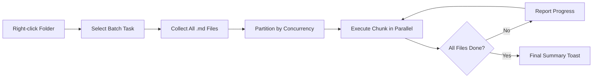

import TLDR from '@site/src/components/TLDR';

# Pemprosesan Secara Pukal

<TLDR>
**Notemd memproses folder keseluruhan dalam satu tindakan dengan kekonduksian yang boleh dikonfigurasi dan kawalan penggantian.** Klik kanan pada folder untuk menambah pautan wiki secara pukal, mengekstrak konsep, menjalankan penyelidikan, atau menterjemahkan semua nota di dalamnya. Had kekonduksian mengelakkan ralat had kelajuan API. Kemajuan dilaporkan untuk setiap fail. Tingkah laku penggantian boleh dikonfigurasi: abaikan yang sedia ada, tambah, atau gantikan. Fail yang gagal akan direkodkan tanpa menghentikan pemprosesan pukal.

Ini merupakan sebahagian daripada [Obsidian Panduan Pengurusan Pengetahuan AI](/docs/pillar-ai-knowledge).
</TLDR>

## Gambaran Keseluruhan

Pemprosesan secara pukal menukar folder nota menjadi satu operasi tunggal. Daripada membuka setiap nota dan menjalankan arahan secara berasingan, anda hanya perlu klik kanan pada folder dan pilih tugas yang diinginkan. Notemd akan melalui setiap fail `.md`, melaksanakan tindakan yang dipilih, dan melaporkan kemajuan dalam masa nyata.

Ciri ini sangat penting untuk pengekstrakan pengetahuan di seluruh vault. Selepas mengimport puluhan fail PDF, contohnya, dengan menambah pautan secara pukal diikuti oleh pengekstrakan konsep secara pukal, graf pengetahuan anda dapat dibina dalam masa beberapa minit sahaja, bukan jam.

## Cara Ia Berfungsi

### Model Pelaksanaan Secara Pukal

1. **Pengumpulan fail** -- Notemd akan menyemak folder sasaran secara rekursif (atau hanya pada tahap atasan, bergantung pada tetapan) dan mengumpulkan semua fail `.md`.
2. **Pembahagian kekonduksian** -- Fail-fail dibahagikan kepada kumpulan kecil berdasarkan tetapan `batchConcurrency`. Setiap kumpulan dijalankan secara selari; kumpulan lain pula dijalankan secara berurutan.
3. **Pelaksanaan** -- Setiap fail diproses menggunakan logik yang sama seperti arahan untuk fail tunggal. Tetapan penyedia dan model untuk setiap tugas akan dihormati.
4. **Laporan kemajuan** -- Pemberitahuan toast akan dikemaskini selepas setiap fail selesai, menunjukkan kadar kemajuan `N / Total`.
5. **Pengendalian ralat** -- Jika sesuatu fail gagal (ralat API, masa tamat sambungan rangkaian, dan sebagainya), ralat tersebut akan direkodkan dan pemprosesan pukal akan diteruskan. Ringkasan akhir akan menyenaraikan semua fail yang gagal.
6. **Penyelesaian** -- Pemberitahuan toast ringkasan akan melaporkan jumlah keseluruhan yang diproses, kejayaan, dan kegagalan.

### Kelakuan Menulis Semula

Apabila memproses fail yang sudah mengandungi pautan wiki, nota konsep, atau terjemahan, kelakuan Notemd bergantung pada tetapan penulisan semula:

| Mod | Kelakuan |
|------|----------|
| **Lompat** | Kandungan sedia ada tidak diubah. Hanya fail yang belum diubah sahaja diproses. |
| **Tambah** (lazim) | Kandungan baru ditambahkan. Pautan wiki, konsep, atau terjemahan sedia ada akan dipelihara. |
| **Gantikan** | Fail diproses sepenuhnya semula. Semua pengubahsuaian Notemd sebelum ini akan ditulis semula. |

Untuk pautan wiki khususnya: jika sebuah nota sudah mengandungi `[[wiki-links]]`, mod **Lompat** akan membiarkannya begitu sahaja, manakala mod **Gantikan** akan menghantar semula keseluruhan nota ke LLM untuk penyisipan pautan yang baru. Gunakan **Lompat** untuk pemprosesan berperingkat dan **Gantikan** untuk pemprosesan semula selepas kemas kini model.

### Kawalan Serentak

Tetapan `batchConcurrency` mengehadkan panggilan API secara serentak. Ini mengelakkan ralat had kelajuan (HTTP 429) semasa memproses folder besar pada penyedia dengan kuota yang ketat.

| Serentak | Disyorkan Untuk | Kesan Had Kelajuan Biasa |
|-------------|----------------|---------------------------|
| `1` | Tahap percuma, penyedia yang ketat | Tiada (siri) |
| `3` (lalai) | Kebanyakan penyedia awan | Rendah |
| `5` | Ollama (setempat), tahap yang murah hati | Tiada / Rendah |
| `10` | Model setempat dengan inferensi yang cepat | Tiada |

Jika anda menghadapi ralat 429 semasa pemprosesan berkumpulan, kurangkan kekonduksian kepada 1 atau 2.

## Konfigurasi

| Pengaturan | Lalai | Kesan |
|---------|---------|--------|
| `batchConcurrency` | `3` | Jumlah panggilan API selari maksimum semasa operasi folder |
| `batchOverwriteExisting` | `false` | Gantikan kandungan Notemd yang sedia ada. `false` bermaksud mod tambahan. |
| `batchSkipProcessed` | `false` | Langkau fail yang sudah mengandungi penanda Notemd (contohnya, pautan wiki) |
| `batchRecursive` | `true` | Sertakan subdirektori semasa memindai folder |
| `enableStableApiCall` | `false` | Aktifkan logik percubaan semula (sehingga 4 percubaan) untuk setiap fail dalam kumpulan |

### Model Mengikut Tugas dalam Kumpulan

Setiap operasi kumpulan menggunakan model yang sesuai mengikut tugas. batch-add-links menggunakan `addLinksProvider`, batch-research menggunakan `researchProvider`, dan sebagainya. Ini bermakna anda boleh gunakan model murah untuk operasi berskala besar dan simpan model mahal untuk tugas yang memerlukan kualiti tinggi.

## Contoh

Anda mempunyai sebuah folder `papers/` yang mengandungi 40 nota penyelidikan yang diimport. Anda ingin menambah pautan wiki dan mengekstrak konsep daripada kesemuanya:

1. Klik kanan pada folder `papers/`
2. Pilih **"Notemd: Process folder (add links)"**
3. Notemd akan menyemak folder tersebut, mencari 40 fail `.md`, dan memproses 3 fail setiap kali (konvergensi lalai)
4. Tetingkap kemajuan akan menunjukkan: `12/40 files processed...`
5. Selepas kira-kira 3 minit, tetingkap ringkasan akan melaporkan: `39 succeeded, 1 failed (API timeout on paper-37.md)`
6. Ulangi dengan **"Notemd: Process folder (extract concepts)"** untuk membuat nota konsep bagi kesemua 40 fail tersebut

Fail yang gagal akan direkodkan. Anda boleh menjalankannya semula hanya pada fail tersebut kemudian.

## Tips

- **Mulakan dengan konvergensi yang rendah** -- Jika anda tidak pasti tentang had kelajuan penyedia perkhidmatan, mulakan dengan `1` dan tingkatkan secara beransur-ansur.
- **Gunakan mod lompat untuk kemas kini berperingkat** -- Selepas kumpulan penuh pertama, tukar kepada `batchSkipProcessed: true` supaya hanya nota baru yang diproses pada jalan-jalan seterusnya.
- **Aktifkan panggilan API yang stabil** -- `enableStableApiCall: true` menambah logik percubaan semula yang memulihkan diri daripada ralat rangkaian sementara semasa kumpulan yang panjang.
- **Jalankan semula selepas kemas kini model** -- Jika anda beralih ke model yang lebih baik, tetapkan `batchOverwriteExisting: true` dan jalankan semula untuk mendapatkan pautan dan konsep yang lebih baik.

---

## Langkah Seterusnya

- [Workflows](/docs/features/workflows) -- Susun tugas kumpulan menjadi butang sidebar satu klik
- [Custom Prompts](/docs/advanced/custom-prompts) -- Sesuaikan promp untuk pengekstrakan kumpulan
- [Troubleshooting](/docs/advanced/troubleshooting) -- Perbaiki ralat had kelajuan dan kegagalan sambungan semasa jalan-jalan kumpulan
- [Pembekal LLM](/docs/providers/overview) -- Rujukan konfigurasi model mengikut tugas
