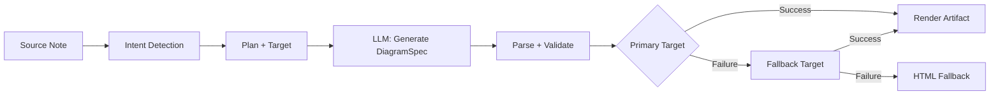
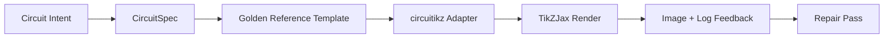

import TLDR from '@site/src/components/TLDR';

# Diagram

<TLDR>
**Notemd menjana diagram daripada nota anda melalui proses berdasarkan spesifikasi terlebih dahulu.** LLM menghasilkan fail JSON `DiagramSpec` yang tidak bergantung pada pengolah, kemudian penyesuai khusus menukarkannya kepada format Mermaid, JSON Canvas, Vega-Lite, HTML, HTML/SVG yang boleh diedit, Draw.io, Drawnix, atau output circuitikz terhad. Ia menyokong 9 jenis niat, rantaian penggantian automatik, pratonton masa nyata dengan eksport SVG/PNG/PDF, pengesahan semantik, serta penjanaan yang diperkukuh dengan pengetahuan tempatan.
</TLDR>

Ini merupakan sebahagian daripada [Obsidian Panduan Pengurusan Pengetahuan AI](/docs/pillar-ai-knowledge).

## Seni Bina: Saluran Kerja Berdasarkan Spesifikasi Terlebih Dahulu

Notemd tidak pernah meminta LLM untuk menghasilkan sintaks Mermaid/Vega/Canvas secara langsung. Sebaliknya:



**Mengapa berdasarkan spesifikasi terlebih dahulu?** LLM sering menghasilkan sintaks penghasilan yang tidak sah (terutamanya Mermaid). `DiagramSpec` yang terstruktur boleh disahkan sebelum diproses, dan spesifikasi yang sama boleh digunakan untuk beberapa penghasilan sebagai pilihan penggantian.

## Jenis Diagram yang Disokong

| Niat | Penghasil Utama | Pilihan Penggantian | Kes Penggunaan |
|--------|-----------------|-----------|----------|
| `mindmap` | Mermaid | HTML | Pembahagian topik hierarki |
| `flowchart` | Mermaid | HTML | Aliran proses, pokok keputusan |
| `sequence` | Mermaid | HTML | Interaksi klien-pelayan, protokol |
| `classDiagram` | Mermaid | HTML | Hubungan kelas OOP |
| `erDiagram` | Mermaid | HTML | Skema pangkalan data, hubungan entiti |
| `stateDiagram` | Mermaid | HTML | Mesin keadaan, model kitaran hayat |
| `canvasMap` | JSON Canvas | Mermaid → HTML | Peta konsep, graf pengetahuan |
| `dataChart` | Vega-Lite | Mermaid → HTML | Bar, garis, kawasan, serakan, pai, jadual |
| `circuit` | circuitikz | tiada | Diagram circuit terhad daripada beban data `CircuitSpec` yang telah disahkan |

## Pengesanan niat

Notemd menentukan jenis diagram terbaik berdasarkan kandungan nota anda menggunakan penilaian kata kunci:

| Niat | Pemicu | Keyakinan |
|--------|----------|------------|
| `dataChart` | Jadual, sel numerik, kata kunci metrik/trend, peratusan | 0.88 |
| `sequence` | Perbendaharaan istilah permintaan/respon (4+ padanan) atau penanda `->`/`=>` | 0.82 |
| `erDiagram` | Kunci utama, kunci asing, entiti, skema (2+ padanan) | 0.80 |
| `stateDiagram` | Keadaan, peralihan, menunggu, sedang berjalan, gagal (3+ padanan) | 0.76 |
| `flowchart` | Langkah bernombor (2+) atau perbendaharaan istilah if/then/else/workflow | 0.74 |
| `canvasMap` | Peta konsep, graf pengetahuan, ruang, kluster | 0.72 |
| `circuit` | circuitikz, TikZJax, circuit, schematic, CMOS, NMOS, PMOS, MOSFET, VDD/GND, `vin`/`vout` | 0.78 |
| `mindmap` | Pilihan lalai | 0.55 |

Gantikan dengan tetapan **Jenis diagram yang diutamakan**, pemilih di sidebar, atau pilihan palet arahan yang jelas.

## Pemilihan Sasaran Render

Pipelajn eksperimen berasaskan spesifikasi kini mempunyai dua kawalan bebas:

| Kawalan | Pengaturan | Kesan |
|---------|---------|--------|
| Jenis diagram yang diutamakan | `preferredDiagramIntent` | Membimbing bentuk semantik `DiagramSpec` yang dihasilkan |
| Sasaran render yang diutamakan | `preferredDiagramRenderTarget` | Memilih penghasil artefak untuk **Jana diagram** dan **Pratonton diagram** |

Aturkan **Sasaran render yang diutamakan** kepada **Auto** sebagai tetapan lalai bagi perancang, atau pilih secara eksplisit Mermaid, JSON Canvas, Vega-Lite, HTML, HTML/SVG yang boleh diedit, Draw.io, Drawnix, atau Circuitikz. Penggantian ini hanya berkuat kuasa untuk arahan artifak dan pratonton. Arahan standard **Ringkaskan sebagai diagram Mermaid** tetap ditetapkan kepada output yang serasi dengan Mermaid supaya aliran kerja Markdown sedia ada tidak menukar format secara senyap.

Pemisahan ini penting kerana niat `flowchart` kini boleh direnderkan sebagai Mermaid untuk nota Markdown, HTML sebagai penggantian yang mantap, HTML/SVG yang boleh diedit untuk penyuntingan seterusnya, atau artifak sumber Draw.io/Drawnix bersama fail semakan SVG. Niat `circuit` diarahkan ke Circuitikz dan memerlukan `CircuitSpec` yang telah disahkan; ia bukan permintaan untuk teks TikZ secara rawak.
## Penggunaan

### Jana Diagram

1. Buka sebuah nota
2. Laksanakan **"Notemd: Jana diagram"** daripada palet arahan
3. Notemd mengesan niat, menjana spesifikasi, merender, dan menyimpan artefak

**Fail keluaran mengikut sasaran:**

| Sasaran | Panjang | Corak Nama Fail |
|--------|-----------|------------------|
| Mermaid | `.md` | `{note}_summ.md` |
| JSON Canvas | `.canvas` | `{note}_diagram.canvas` |
| Vega-Lite | `.json` | `{note}_diagram.json` |
| HTML | `.html` | `{note}_diagram.html` |
| Boleh Diubah HTML/SVG | `.html` | `{note}_diagram.html` |
| Draw.io | `.drawio` + `.drawio.svg` + `.drawio.md` | `{note}_diagram.drawio` bersama fail semakan yang berkaitan |
| Drawnix | `.drawnix` + `.drawnix.svg` + `.drawnix.md` | `{note}_diagram.drawnix` bersama fail semakan yang berkaitan |
| Circuitikz | `.tex` + `.tex.svg` + `.tex.md` | `{note}_diagram.tex` bersama fail semakan yang berkaitan |

### Tunjuk Pratonton Diagram

1. Jalankan **"Notemd: Tunjuk Pratonton Diagram"**
2. Tetingkap modal terbuka dengan diagram yang telah diproses
3. Eksport sebagai SVG, PNG, atau PDF menggunakan butang pada toolbar

**Buka pratonton secara automatik** tersedia dalam tetapan — selepas dihasilkan, tetingkap modal pratonton akan dibuka secara automatik.

Eksport pratonton dalam format PNG dan PDF menggunakan resolusi PPI yang telah dikonfigurasikan. Nilai lalainya ialah 300 PPI dan nilai melebihi 600 PPI akan dipotong kepada 600. SVG kekal berukuran vektor. Artifak sumber seperti `.drawio`, `.drawnix`, dan `.tex` boleh menyediakan fail `previewSvg` sebagai tambahan supaya Obsidian dapat memaparkan dan mengeksport imej yang boleh disemak tanpa perlu memasukkan diagram.net, Drawnix, LaTeX, atau TikZJax ke dalam masa jalanan plugin.

Tetingkap pratonton ini juga mempunyai panel diagnostik untuk artifak. Alat pemprosesan dan ujian asas boleh menambahkan data `RenderArtifact.diagnostics`; tetingkap tersebut akan memaparkan ringkasan diagnostik yang menunjukkan jumlah ralat/amaran/maklumat, diikuti dengan tahap keterukan, jenis diagnostik, mesej, dan cadangan pembaikan di sebelah pratonton. Ringkasan yang sama turut dipaparkan dalam entri sejarah yang menyokong fungsi diagnostik, jadi percubaan ujian asas circuitikz yang berulang boleh dibandingkan tanpa perlu membuka setiap entri secara berasingan. Bagi artifak yang mempunyai kandungan sumber tetapi tidak dapat dipaparkan secara dalam talian atau melalui laluan iframe HTML, tetingkap pratonton kini akan beralih kepada paparan pratonton yang hanya menunjukkan sumber sahaja, dan bukannya memaksa penggunaan iframe kosong. Cara ini membolehkan ujian kompilasi/pemprosesan circuitikz, pemeriksaan teks token SVG, pemeriksaan tangkapan skrin kosong PNG, laporan pertindihan glif yang hanya berdasarkan laluan, serta laporan pertindihan pada masa hadapan mempunyai antaramuka pengguna yang kelihatan, tanpa perlu menjadikan TikZJax atau LaTeX sebagai kebergantungan masa jalankan plugin yang wajib, atau berpura-pura bahawa teks sumber itu merupakan hasil paparan visual yang telah disahkan.

### Mod Mermaid Lama

Apabila `enableExperimentalDiagramPipeline` dimatikan, Notemd menghantar arahan Mermaid secara langsung kepada LLM. Ini mengelakkan keseluruhan saluran kerja spesifikasi. Jika saluran kerja eksperimen gagal, ia akan beralih ke mod ini.

## Pemprosesan Di Belakang Tabir

### Mermaid

6 penyesuai (mindmap, aliran kerja, urutan, ER, kelas, keadaan) menukar `DiagramSpec` kepada sintaks Mermaid. Selepas dihasilkan, `mermaid.parse()` mengesahkan hasilnya. Jika pengesahan gagal:

1. **Cuba Semula LLM** — satu percubaan dengan mesej ralat Mermaid sebagai konteks
2. **Pilihan Gantian Minimum** — diagram Mermaid yang ringkas berdasarkan ID nod spesifikasi

**Legacy Mermaid Fixer** memperbaiki secara automatik ralat sintaks LLM yang biasa ditemui: penormalan arahan note, penyelamatan label pipe, penempatan semula tanda titik koma, petikan pintar, anak panah berganda tanda hubung, ketidaksesuaian bentuk, dan banyak lagi.

### JSON Canvas

Menghasilkan format Obsidian JSON Canvas dengan susunan ruang:
- Node diletakkan mengikut kedalaman (x = kedalaman × 420) dan indeks (y = indeks × 170)
- Lebar dianggarkan berdasarkan panjang label
- Garis dengan `fromSide: 'right'`, `toSide: 'left'`, `toEnd: 'arrow'`

### Vega-Lite

Membina spesifikasi Vega-Lite v5 JSON yang lengkap dengan pengkodan automatik:
- **Cartesian charts** (bar/line/area/point/scatter): saluran x + y ditambah warna untuk pelbagai siri
- **Pie**: theta = y (kuantitatif), warna = x (nominal)
- **Table**: baris = x, teks = y + lajur = siri

Patch tema gelap dan terang digabungkan sepenuhnya sebelum kompilasi.

### HTML

Penyelesaian alternatif universal. Dokumen HTML yang berdiri sendiri dengan:
- Meta header CSP
- Mod terang/gelap melalui `prefers-color-scheme`
- Label UI yang disesuaikan untuk 20 lokasi
- Bahagian: hero, struktur (pokok node), hubungan, penjelasan tambahan, jadual siri data

### Boleh diedit HTML/SVG

Sasaran angka yang jelas untuk aliran kerja eksport yang boleh diubah suai. Ia memproyeksikan `DiagramSpec` ke dalam `SemanticFigureModel` yang ditentukan secara pasti, kemudian menjana dokumen HTML yang berdiri sendiri dengan kumpulan SVG terbina dalam yang membawa anotasi gaya Draw.io:

- `data-drawio-type`, `data-drawio-id`, dan `data-drawio-role` pada nod semantik
- `data-drawio-source` dan `data-drawio-target` pada tepi semantik
- pengecam nod/tepi yang stabil selepas normalisasi ruang putih dan pengendalian pertembungan
- tiada skrip, tiada fon luaran, dan tiada aset jarak jauh

Sasaran ini sengaja bukan laluan perancang lalai buat masa ini. Ia tersedia sebagai sasaran render yang jelas sementara laluan produk membuktikan tingkah laku penyuntingan merentasi alat sebenar.

### Draw.io dan Drawnix Sempadan Eksport

Pelaksanaan semasa mengekalkan sokongan editor pihak ketiga di sempadan artefak, sambil tetap menyediakan sasaran rendering yang jelas:

| Sasaran | Kontrak | Ketergantungan Masa Jalankan |
|--------|----------|--------------------|
| Draw.io | XML `mxfile` yang tidak dikompres dan bersifat deterministik daripada `SemanticFigureModel`, ditambah dengan fail rujukan SVG/PNG/PDF | Tiada komponen dalam masa jalanan plugin atau proses CI |
| Drawnix | Subset JSON `.drawnix` yang minimum yang menggunakan unsur `geometry` dan `arrow-line`, ditambah dengan fail rujukan SVG/PNG/PDF | Tiada komponen dalam masa jalanan plugin atau proses CI |

Kompromi ini adalah disengajakan: Notemd boleh sahkan label yang kelihatan, ID yang stabil, dan liputan primitif yang disokong tanpa memasukkan diagram.net Desktop, Drawnix, Plait, atau keadaan editor khusus pelayar ke dalam plugin.

### circuitikz / TikZJax Arah

Diagram litar bukanlah masalah yang sama seperti aliran umum. Sintaks yang betul untuk litar elektrik biasanya ialah **circuitikz**, yang dipaparkan dalam Obsidian melalui plugin seperti TikZJax. TikZJax boleh memuatkan pakej seperti `circuitikz`, `pgfplots`, `tikz-cd`, dan `chemfig`, menjadikannya menarik untuk nota fizik, litar, kimia, dan matematik.

Risikonya ialah TikZ yang dihasilkan secara mentah oleh LLM adalah rapuh:

- topologi litar yang kompleks mungkin betul dari segi elektrik tetapi sukar dibaca secara visual;
- wayar dan label yang bertindih boleh menjadikan senarai rangkaian yang betul tidak boleh digunakan untuk nota pembelajaran;
- ketiadaan prambel pakej, titik jangkar yang salah, atau nama komponen yang tidak sah boleh menghalang proses paparan;
- maklum balas daripada alat paparan biasanya pada tahap imej, manakala LLM menghasilkan geometri pada tahap teks.

Arkitektur yang lebih baik ialah menganggap circuitikz sebagai sasaran diagram yang terhad, bukan sebagai arahan bentuk bebas:



Model kelas pertama sepatutnya menerangkan topologi litar dan susun atur secara berasingan:

| Lapisan | Tanggungjawab | Contoh |
|-------|----------------|---------|
| Topologi | nod elektrik dan sambungan komponen | `VDD -> RD -> drain(M1)`, `source(M1) -> GND` |
| Susun Atur | penempatan grid, orientasi, laluan penghantaran | `M1 at (3,2.2)`, masukan kiri, keluaran kanan |
| Gaya | pakej, konvensyen voltan, label, penyangkut | `\begin{circuitikz}[american voltages]` |
| Pengesahan | log kompilasi, penyangkut yang hilang, pemeriksaan pertindihan/skrin tangkapan | TikZJax/Diagnostik LaTeX ditambah semakan visual |

### Prototaip circuitikz Semasa

Notemd kini merangkumi prototaip repositori terhad pertama untuk arah ini. Ia sengaja berada dalam mod offline dan terikat dengan templat:

```bash
npm run diagram:export-circuitikz -- --input cmos-inverter.json --output cmos-inverter.tex
```

Prototaip ini menambahkan sempadan `CircuitSpec` yang terhad serta alat eksport yang bersifat deterministik untuk enam keluarga rujukan utama:

Dalam saluran paip diagram eksperimen ini, ia kini juga boleh diakses melalui `intent: "circuit"` dan sasaran rendering `circuitikz`. Fail `DiagramSpec` yang dijana hanya boleh memasukkan elemen `circuitSpec` untuk niat yang berkaitan dengan litar sahaja. `CircuitikzRenderer` akan menulis sumber `.tex` yang tetap dan menambahkan fail pratonton SVG yang dihasilkan daripada topologi litar yang telah disahkan, sekaligus membolehkan pratonton dalam Obsidian serta pengeksportan dalam format SVG/PNG/PDF. Fail pratonton tersebut bukanlah hasil kompilasi LaTeX/TikZJax; bukti sebenar daripada proses rendering masih terdapat pada arahan khusus untuk ujian yang disenaraikan di bawah.

Bagi templat emas yang disokong, `layoutHints.inputSide` dan `layoutHints.outputSide` kekal sebagai kawalan yang hanya digunakan untuk tujuan paparan sahaja. Ia boleh mengalihkan kedudukan port input/output yang tetap, tetapi ia tidak mengubah tandatangan topologi atau membenarkan proses pembaikan untuk menyambung semula litar tersebut.

| Jenis litar | Rujukan emas | Jaminan arus |
|--------------|------------------|-------------------|
| `common-source-amplifier` | `common-source-nmos-v1` | mengesahkan `VDD -> R_D -> M1.D`, `vin -> M1.G`, `M1.S -> GND`, dan `M1.D -> vout` sebelum menulis LaTeX |
| `cmos-inverter` | `cmos-inverter-v1` | mengesahkan topologi PMOS-over-NMOS, input pintu bersama, keluaran drain bersama, `VDD -> MP.S`, dan `MN.S -> GND` sebelum menulis LaTeX |
| `cmos-buffer` | `cmos-buffer-v1` | mengesahkan dua peringkat inverter bertindan, nod antara `vmid`, `vout` yang dipulihkan, serta landasan VDD/GND bersama sebelum menulis LaTeX |
| `cmos-transmission-gate` | `cmos-transmission-gate-v1` | mengesahkan peranti laluan PMOS/NMOS selari antara `vin` dan `vout` dengan kawalan `phib` / `phi` yang saling melengkapi sebelum menulis LaTeX |
| `cmos-nand2` | `cmos-nand2-v1` | Memeriksa daya tarik ke atas PMOS selari, daya tarik ke bawah NMOS bersiri, input berganda `va` / `vb`, dan `vout` sebelum menulis LaTeX |
| `cmos-nor2` | `cmos-nor2-v1` | Memeriksa daya tarik ke atas PMOS bersiri, daya tarik ke bawah NMOS selari, input berganda `va` / `vb`, dan `vout` sebelum menulis LaTeX |

Ini bukanlah penghasil TikZ umum. Ia tidak menerima kod TikZ secara rawak, tidak mengkompilasi LaTeX, tidak memanggil TikZJax, tidak memeriksa tangkapan skrin semasa masa jalanan plugin, dan juga tidak menjalankan proses pembaikan automatik berdasarkan maklum balas imej. Ciri-ciri tersebut masih merupakan langkah-langkah seterusnya yang perlu dilaksanakan.

Arahan Diagram Pratonton boleh membuka semula artifak sumber circuitikz yang disimpan secara langsung apabila lanjutan fail ialah `.tex` atau `.tikz` dan sumber mengandungi `\usepackage{circuitikz}` atau `\begin{circuitikz}`. Laluan ini ialah pratonton hanya sumber circuitikz: tetingkap modal menunjukkan sumber, diagnostik, kawalan salin/simpan, dan metadata sejarah, tetapi ia tidak mengkompilasi LaTeX atau memanggil TikZJax semasa masa jalanan plugin.

Sekarang sempadan pratonton hanya sumber yang sama meliputi artifak Draw.io dan Drawnix yang disimpan. Fail `.drawio` diterima apabila ia kelihatan seperti Draw.io XML (`mxfile` atau `mxGraphModel`), dan fail `.drawnix` diterima apabila ia ialah Drawnix JSON dengan `type: "drawnix"` dan satu array `elements`. Plugin masih tidak menyertakan diagrams.net atau hos papan putih Drawnix; pratonton ini memaparkan sumber, diagnostik, dan sejarah artifak tanpa menggunakan editor visual dalam plugin.

Untuk pembaikan yang mengekalkan topologi, hantar spesifikasi pra-pembaikan sebagai rujukan sebelum menerima calon yang telah dibaiki:

```bash
npm run diagram:export-circuitikz -- --input repaired-cmos-inverter.json --topology-reference cmos-inverter.json --output cmos-inverter.tex
```

Penjaga pembaikan menggunakan `createCircuitTopologySignature` dan `assertCircuitTopologyUnchanged` untuk membandingkan `circuitKind`, `goldenReferenceId`, rangkaian, ID/jenis/terminal komponen, dan hujung sambungan tak berarah sebelum menghasilkan keluaran. Label, teks tajuk, petunjuk susun atur, urutan sambungan, dan label sambungan sengaja diabaikan. Calon yang menambah terminal pendek atau menyambung semula terminal gagal dengan `Circuit topology drift detected` sebelum fail `.tex` ditulis.

Sekarang CLI boleh menganalisis log kompilasi LaTeX/TikZJax yang sedia ada tanpa menjalankan kompiler:

```bash
npm run diagram:export-circuitikz -- --input cmos-inverter.json --output cmos-inverter.tex --compile-log cmos-inverter.log --diagnostics-output cmos-inverter.diagnostics.json
```

Laluan diagnostik ini melaporkan pakej yang hilang seperti `circuitikz.sty`, kunci TikZ/circuitikz yang tidak diketahui, ralat sintaks laluan TikZ seperti kurangnya tanda titik koma, hujah berlebihan daripada kurungan yang tidak seimbang atau label yang tidak ditutup, urutan kawalan yang tidak ditakrifkan, ralat LaTeX umum, henti kecemasan, dan amaran penuh `\hbox`. Ia masih berbentuk log: pelaksanaan lokal LaTeX/TikZJax dan langkah kualiti tangkapan skrin masih merupakan kerja masa depan yang berasingan.

Untuk pemeriksaan asap penjaga, CLI yang sama boleh secara pilihan menjalankan pemproses yang dikonfigurasikan secara eksplisit tanpa analisis arahan shell:

```bash
npm run diagram:export-circuitikz -- --input cmos-inverter.json --output cmos-inverter.tex --compile-executable pdflatex --compile-arg -interaction=nonstopmode --compile-arg -halt-on-error --compile-arg -output-directory={outputDir} --compile-arg {tex} --expected-artifact {outputDir}/{jobName}.pdf
```

Pemangkin kompilasi menggunakan `shell: false`, mengembangkan placeholder `{tex}`, `{outputDir}`, dan `{jobName}` menjadi nilai array argumen, membaca `{jobName}.log` yang dihasilkan, dan mengembalikan `compileExecution` serta `compileDiagnostics` dalam output CLI JSON. `--compile-executable` hanyalah laluan binari pemproses atau pembungkus; flag pemproses terletak dalam nilai berulang `--compile-arg`. Fail eksekusi kosong gagal sebagai `compile-executable-invalid`, fail binari yang hilang gagal sebagai `compile-executable-not-found`, dan rentetan eksekusi berbentuk arahan shell menerima nasihat untuk memisahkan argumen supaya Windows, Linux, dan macOS mengikut kontrak pelaksanaan langsung yang sama. Dengan `--expected-artifact`, ia juga melaporkan `compileExecution.renderSmoke` dan gagal pada CLI jika pemproses tidak mencipta artifak yang bukan kosong. Ia masih tidak menyertakan LaTeX, menjadikan TikZJax sebagai kebergantungan masa jalanan plugin, atau melakukan pembaikan visual peringkat tangkapan skrin.

Jika artifak yang dijangka ialah `.svg`, pemeriksaan asap akan masuk lebih dalam satu lapisan:

```bash
npm run diagram:export-circuitikz -- --input cmos-inverter.json --output cmos-inverter.tex --compile-executable dvisvgm --compile-arg ... --expected-artifact {outputDir}/{jobName}.svg --expected-svg-text v_{in} --expected-svg-text v_{out}
```

Pemeriksaan asap SVG mengesahkan akar `<svg>`, dimensi positif atau `viewBox`, sekurang-kurangnya satu unsur lukisan yang kelihatan selepas pengecualian unsur tersembunyi/transparent, sebarang token teks yang diminta, unsur yang jelas di luar `viewBox`, label `<text>` / `<tspan>` yang bertindih dan jelas yang diletakkan, serta label teks yang jelas bertindih dengan unsur lukisan melalui `render-svg-label-overlap`. Teks yang dijangka dicari dalam teks yang kelihatan dan metadata aksesibiliti yang didekod seperti `aria-label`, `<title>`, dan `<desc>`, supaya pemproses yang mengekalkan label semantik di luar `<text>` yang kelihatan masih boleh memenuhi pemeriksaan token teks asap tanpa memerlukan OCR. Langkah geometri kini ialah geometri yang peka terhadap transformasi untuk atribut kumpulan dan unsur biasa `transform`, jadi kotak SVG yang diterjemahkan, berskala, diputar, dimiringkan, atau diubah suai melalui matriks diperiksa selepas komposisi transformasi. Ia meliputi sempadan lengkung tepat untuk ekstrem A/a, sempadan lengkung Bezier tepat untuk ekstrem C/S/Q/T, sempadan SVG yang peka terhadap ketebalan garisan dan pemeriksaan pertindihan label, geometri lukisan `polyline` / `polygon`, serta menyelesaikan penempatan glyph hanya laluan daripada rujukan `<use href="#...">` supaya label yang ditukar kepada laluan glyph yang boleh digunakan masih boleh gagal dalam pemeriksaan kanvas terbatas apabila geometri glyph yang diletakkan melampaui `viewBox`. Beberapa label `tspan` yang diletakkan di bawah satu ibu bapa `<text>` dibandingkan sebagai kotak label berasingan, yang dapat mengesan output gaya LaTeX SVG yang sebaliknya akan menggabungkan label yang berbeza menjadi satu nod teks. Kotak SVG `text` dan `tspan` yang diletakkan menghormati nilai `text-anchor` `start`, `middle`, dan `end`, jadi label yang terpusat dan sejajar ke kanan boleh mencetuskan diagnostik pertindihan teks/label dan label berbanding lukisan tanpa memerlukan susun atur teks tahap pelayar. Laluan glyph hanya definisi di dalam `<defs>` tidak dianggap sebagai unsur lukisan yang kelihatan, tetapi atribut `transform` yang bersifat lokal definisi mereka diterapkan sebelum penempatan `<use>` supaya definisi glyph yang berskala atau dipantulkan tidak dikira kurang. Pemeriksaan label berbanding lukisan menggunakan toleransi kotak lukisan yang kecil dan `stroke-width` yang dinyatakan, jadi wayar yang nipis, wayar yang tebal, dan garis luar komponen poligon semuanya boleh dianggap sebagai kegagalan kebolehbacaan label apabila garisan yang kelihatan mencapai label. Label glyph hanya laluan yang diselesaikan daripada `<use href="#...">` juga dibandingkan dengan kotak lukisan dan gagal dengan `render-svg-path-glyph-overlap` apabila geometri glyph yang boleh digunakan bertindih dengan wayar atau komponen. Jika pemproses menukar label kepada glyph laluan yang boleh digunakan bukannya `<text>` yang boleh dicari dan tidak mengekalkan metadata aksesibiliti, laporan asap merekodkan `pathOnlyGlyphUseCount` dan gagal token teks yang diminta melalui `render-svg-text-path-only` daripada berpura-pura label itu tidak wujud. Kegagalan lain dilaporkan melalui `render-svg-invalid`, `render-svg-dimension-missing`, `render-svg-no-visible-elements`, `render-svg-text-missing`, `render-svg-out-of-bounds`, `render-svg-text-overlap`, `render-svg-label-overlap`, atau `render-svg-path-glyph-overlap`. Pemeriksaan token teks dan pertindihan hanya harus dianggap sebagai asap struktur untuk pemproses yang mengekalkan label sebagai teks SVG yang boleh dicari atau metadata aksesibiliti; output hanya laluan SVG masih memerlukan langkah tangkapan skrin/OCR yang seterusnya untuk membuktikan kebolehbacaan visual label, dan pemeriksaan asap ini masih tidak mendakwa liputan laluan SVG yang lengkap.

Kumpulan dan unsur SVG yang tersembunyi sentiasa diabaikan semasa pengiraan unsur yang kelihatan dan pengumpulan geometri. Atribut atau gaya inline `display:none`, `visibility:hidden`, `visibility:collapse`, dan keseluruhan `opacity:0` tidak dapat membuat artifak render yang kosong lulus pemeriksaan output yang kelihatan.

Definisi glyph hanya laluan boleh jadi laluan langsung atau kontainer kumpulan/simbol di dalam `<defs>`. Pemeriksaan asap menyelesaikan geometri laluan anak daripada `<g id="...">` dan `<symbol id="...">` sebelum penempatan `<use>`, jadi output glyph yang dibalut masih memberi maklumat kepada `pathOnlyGlyphUseCount`, pemeriksaan kanvas terbatas, dan `render-svg-path-glyph-overlap`.

Pemproses laluan juga menjejak permulaan sublaluan dan menetapkan semula titik semasa pada `Z/z`, jadi arahan relatif selepas sublaluan yang tertutup diteruskan dari titik SVG yang betul dan bukannya mencipta diagnostik `render-svg-out-of-bounds` yang palsu.

Langkah geometri yang sama mengikut peraturan SVG untuk nombor perpuluhan dengan titik di hadapan dan tanda plus yang jelas, jadi koordinat dvisvgm yang padat seperti `.5`, `-.5`, atau `+.5` kekal dalam bentuk pecahan semasa pemeriksaan sempadan, bukannya menjadi geometri yang salah di luar sempadan atau diabaikan.

Jika pemproses grafik menghasilkan `.png`, laluan artefak yang dijangka akan menjadi tangkapan skrin pertama: Notemd mentafsir fail PNG berwarna indeks 1/2/4/8-bit yang bukan interlaced, fail PNG kelabu 1/2/4/8/16-bit, dan fail PNG kelabu-alpha/RGB/RGBA 8/16-bit. Imej berwarna indeks dan kelabu sub-byte menyokong sampel yang dipadatkan; imej berwarna indeks juga menyokong PLTE dan data tRNS pilihan; imej kelabu/RGB menyokong sampel telus tRNS. Sampel langsung 16-bit dinormalisasi ke ruang perbandingan RGBA 8-bit yang sama yang digunakan oleh pemeriksaan asap. Pemeriksaan asap memeriksa dimensi positif, merekodkan sempadan latar depan sebagai `foregroundBounds`, merekodkan ketumpatan latar depan di dalam kotak tersebut sebagai `foregroundDensity`, gagal dengan `render-png-blank` apabila setiap piksel yang kelihatan sepadan dengan warna latar belakang di sudut kiri atas, gagal dengan `render-png-content-clipped` apabila kandungan latar depan menyentuh sempadan imej, gagal dengan `render-png-foreground-too-small` apabila tangkapan skrin yang besar mempunyai kurang daripada empat piksel latar depan, dan gagal dengan `render-png-foreground-dense` apabila piksel latar depan sangat padat di dalam kotak sempadan yang kompleks. Format PNG yang tidak disokong gagal dengan `render-png-unsupported` serta panduan khusus untuk PNG interlaced Adam7 atau kedalaman bit berwarna indeks yang tidak disokong. Ini dapat mengesan tangkapan skrin kosong, pemotongan kanvas yang jelas, jejak latar depan yang kurang dikerjakan, kegagalan kesesakan pada tahap piksel pertama, dan tetapan eksport PNG pemproses grafik yang salah tanpa memerlukan kebergantungan shell khusus platform. Ia bukan pengenalan label pada tahap OCR, pengesanan pertindihan teks yang tepat, atau pembaikan imej yang mengekalkan topologi.

Apabila diagnosis menunjukkan kompilasi yang gagal atau pelaksanaan render-smoke yang gagal, CLI juga boleh menulis ringkasan pembaikan yang mengekalkan topologi:

```bash
npm run diagram:export-circuitikz -- --input cmos-inverter.json --topology-reference cmos-inverter.json --output cmos-inverter.tex --compile-log cmos-inverter.log --repair-brief-output cmos-inverter.repair-brief.json
```

Ringkasan pembaikan menggunakan skema `notemd.circuitikz.repair-brief.v1` dan membawa sumber `CircuitSpec`, tandatangan topologi, diagnosis kompilasi/render, edit yang dibenarkan, edit topologi yang dilarang, langkah pengesahan seterusnya, serta `repairPrompt` yang terstruktur. Peranan promptn ialah `topology-preserving-circuitikz-repair`; senarai `diagnosticFocus`nya diambil daripada diagnosis kompilasi/render, dan `acceptanceCriteria` memerlukan pengesahan calon serta ujian kompilasi dan render-smoke yang baru. Ia merupakan format pemindahan untuk kitaran pembaikan seterusnya, bukan tuntutan bahawa Notemd sudah menjalankan pembaikan visual secara autonomi.

Selepas calon pembaikan dihasilkan, CLI yang sama boleh mengesahkannya berbanding dengan ringkasan sebelum menulis output:

```bash
npm run diagram:export-circuitikz -- --input repaired-cmos-inverter.json --repair-brief cmos-inverter.repair-brief.json --output repaired-cmos-inverter.tex
```

`--repair-brief` memeriksa tandatangan topologi calon daripada ringkasan dan ia bersifat eksklusif dengan `--topology-reference`. Lulus ujian ini hanya membuktikan pengekalan topologi; calon masih memerlukan diagnosis kompilasi dan ujian render-smoke.

Hasil `--repair-brief` juga termasuk bukti `repairAcceptance` dengan skema `notemd.circuitikz.repair-acceptance.v1`. Ia melaporkan pintu gerbang `topology-signature`, `compile-diagnostics`, dan `render-smoke` sebagai `passed`, `failed`, atau `missing`; mendedahkan `remainingChecks`; dan mengekalkan `readyForVisualAcceptance` sebagai palsu sehingga pelaksanaan calon merangkumi semua bukti yang diperlukan.

Guna `--repair-acceptance-output` bersama `--repair-brief` apabila bukti CI atau pelepasan memerlukan fail JSON yang tahan lama:

```bash
npm run diagram:export-circuitikz -- --input repaired-cmos-inverter.json --repair-brief cmos-inverter.repair-brief.json --output repaired-cmos-inverter.tex --repair-acceptance-output repaired-cmos-inverter.repair-acceptance.json
```

Untuk bukti pelepasan atau penyelenggara, jalankan setiap keluarga emas yang disokong melalui pelaksana fixture agregat:

```bash
npm run diagram:smoke-circuitikz -- --output-dir docs/export/circuitikz-smoke --compile-executable pdflatex --compile-arg -interaction=nonstopmode --compile-arg -halt-on-error --compile-arg -output-directory={outputDir} --compile-arg {tex} --expected-artifact {outputDir}/{jobName}.pdf
```

Pelaksana tersebut menggunakan `docs/maintainer/fixtures/circuitikz/common-source-nmos-v1.json`, `docs/maintainer/fixtures/circuitikz/cmos-inverter-v1.json`, `docs/maintainer/fixtures/circuitikz/cmos-buffer-v1.json`, `docs/maintainer/fixtures/circuitikz/cmos-transmission-gate-v1.json`, `docs/maintainer/fixtures/circuitikz/cmos-nand2-v1.json`, dan `docs/maintainer/fixtures/circuitikz/cmos-nor2-v1.json`, memanggil laluan eksport tanpa shell yang sama untuk setiap fixture, dan mengembalikan laporan agregat JSON dengan `compileExecution` dan `compileDiagnostics` untuk setiap fixture. Ia masih merupakan arahan penyelenggara, bukan kebergantungan masa jalankan plugin.

Apabila mesin penyelenggara belum mempunyai pemproses grafik yang dikonfigurasi, jalankan arahan fixture yang sama tanpa `--compile-executable` dan simpan pintu gerbang persekitaran secara eksplisit:

```bash
npm run diagram:smoke-circuitikz -- --output-dir docs/export/circuitikz-smoke --report-output docs/export/circuitikz-smoke/renderer-availability.json
```

Laluan tersebut masih menulis artefak fixture yang ditentukan secara deterministik `.tex`, tetapi mengembalikan `ok: false` dengan `rendererAvailability.status` ditetapkan kepada `missing-configuration` dan diagnosis `compile-executable-invalid`. Anggap ia hanya sebagai bukti ketersediaan pemproses grafik; ia bukan kompilasi, render-smoke, atau penerimaan visual.

### Bentuk Promptn Rujukan Emas

Untuk penggunaan jangka pendek, sediakan rujukan emas yang boleh dirender sebelum meminta varian litar. Promptn yang terhad harus mengekalkan prakata, skala koordinat, gaya titik rujukan, dan konvensyen laluan:

```latex
\usepackage{circuitikz}
\begin{document}
\begin{circuitikz}[american voltages]
\draw
  (3,5) node[vcc]{$V_{DD}$}
  to [R, l=$R_D$] (3,3)
  to [short, *-o] (5,3) node[right]{$v_{out}$}
  (3,3) to [short] (3,2.2)
  node[nmos, anchor=D] (M1) {$M_1$}
  (M1.S) to [short] (3,0.5)
  node[ground]{}
  (M1.G) to [short, -o] (0.8,2.2)
  node[left]{$v_{in}$};
\draw
  (3,0.5) node[below right]{$S$};
\end{circuitikz}
\end{document}
```

Untuk inverter CMOS, promptn harus meminta topologi yang jelas serta kekangan susun atur, bukan sekadar “lukis inverter CMOS”:

- kekalkan `VDD` di bahagian atas, `GND` di bahagian bawah, input di sebelah kiri, output di sebelah kanan;
- Guna `pmos` di atas `nmos`, dengan pintu bersama dan saluran pembuangan bersama;
- Pertahankan nod keluaran di persimpangan saluran pembuangan dan tandakan ia dengan `*-o`;
- Gunakan penanda ber nama (`PM1.G`, `NM1.G`, `PM1.D`, `NM1.D`) daripada koordinat yang disimpulkan secara visual;
- Elakkan wayar bersudut atau bersilang kecuali diperlukan dari segi elektrik.

### Progres Semasa dan Fasa Seterusnya

| Kawasan | Status semasa | Langkah seterusnya |
|------|----------------|-----------|
| Diagram umum | Pipelajn berdasarkan spesifikasi telah dilaksanakan untuk Mermaid, JSON Canvas, Vega-Lite, HTML | Terus luaskan liputan pengesahan semantik |
| Rajah yang boleh diubah suai | Sempadan artifak `editable-html-svg`, Draw.io XML, dan Drawnix JSON telah dilaksanakan | Tambah primitif yang lebih kaya hanya selepas ujian membuktikan kebolehan pengubahsuaian |
| Sokongan CLI | `npm run diagram:export-artifact` mengeksport bukti semakan HTML/SVG yang boleh diubah suai, Draw.io, Drawnix, Circuitikz, serta SVG/PNG/PDF daripada satu `DiagramSpec` yang telah disahkan | Tambahkan alat ujian khas untuk sasaran tertentu apabila sasaran baru dikeluarkan |
| circuitikz | `DiagramSpec(intent: "circuit", circuitSpec) -> CircuitikzRenderer -> circuitikz` mengeksport templat emas untuk common-source, CMOS inverter, `cmos-buffer` / `cmos-buffer-v1`, `cmos-transmission-gate` / `cmos-transmission-gate-v1`, `cmos-nand2` / `cmos-nand2-v1`, dan `cmos-nor2` / `cmos-nor2-v1`, memaparkan pilihan niat UI/tujuan rendering, menulis fail TeX bersama-sama dengan fail pratonton SVG/PNG/PDF, menyahkan topologi sebelum menghasilkan output, menganalisis log kompilasi, boleh menjalankan renderer tempatan secara eksplisit bersama-sama dengan opsyen `--expected-artifact`, serta menyediakan pilihan sandaran yang hanya menggunakan sumber asal dan memaparkan diagnosis pratonton melalui `RenderArtifact.diagnostics` serta modul pratonton | Tambahkan pengenalan label pada tahap OCR untuk teks visual yang hanya terdiri daripada laluan, pemeriksaan pertindihan pada tahap piksel yang tepat, liputan laluan SVG yang lebih luas apabila diperlukan, pemasangan/penemuan renderer secara automatik hanya jika ia masih boleh dijadikan pilihan, serta pelaksanaan pembaikan automatik yang mengekalkan struktur topologi asal |
| Pengintegrasian TikZJax | Pemacu render calon untuk paparan sisi Obsidian | Biarkan ia sebagai pilihan; jangan jadikan TikZJax sebagai kebergantungan masa jalankan plugin yang wajib |

## Konfigurasi

| Pengaturan | Lalai | Kesan |
|---------|---------|--------|
| `enableExperimentalDiagramPipeline` | `false` | Tukar antara pendekatan berdasarkan spesifikasi dan Mermaid lama |
| `experimentalDiagramCompatibilityMode` | `'legacy-mermaid'` | `'legacy-mermaid'` = Mermaid sahaja; `'best-fit'` = sasaran asli + alternatif |
| `preferredDiagramIntent` | `undefined` (auto) | Atur semula pengesanan niat automatik |
| `preferredDiagramRenderTarget` | `undefined` (auto) | Gantikan penghasil artefak, termasuk Draw.io, Drawnix, dan Circuitikz |
| `summarizeToMermaidLanguage` | `'en'` | Bahasa sasaran untuk label diagram |
| `summarizeToMermaidProvider` / `Model` | DeepSeek | LLM setiap tugas untuk penjanaan diagram |
| `autoMermaidFixAfterGenerate` | (daripada pemalar) | Jalankan pembaiki lama secara automatik pada output Mermaid |
| `enableLocalKnowledgeForDiagramGeneration` | `false` | Lengkapi sumber dengan pengetahuan vault tempatan |

### Peningkatan Pengetahuan Tempatan

Apabila diaktifkan, Notemd akan mendapatkan petikan konteks yang relevan daripada pangkalan pengetahuan tempatan vault anda (berasaskan MiniSearch) dan menambahkannya di hadapan markdown sumber. Nota promosi pengayaan menyatakan: "hanya rujukan sokongan; kekalkan struktur utama setia kepada nota sumber."

### Mod Keserasian

- **`legacy-mermaid`**: Semua niat diarahkan ke Mermaid. Niat bukan-Mermaid (canvasMap, dataChart) dipaksa ke `flowchart` atau `mindmap`. Tiada rantaian sandaran.
- **`best-fit`**: Setiap niat diarahkan ke sasaran asalnya. Jika yang utama gagal, ia akan melalui rantaian sandaran (contohnya, Vega-Lite → Mermaid → HTML).

## Pratonton & Eksport

| Tindakan | Kaedah |
|--------|--------|
| Eksport SVG | Pembina `mermaid.render()` / `vega.View.toSVG()` / SVG untuk Canvas |
| Eksport ke PNG | SVG → Imej → Canvas / alat rasterisasi pratonton pada PPI yang ditetapkan → ArrayBuffer PNG |
| Eksport ke PDF | SVG → imej raster pada PPI yang ditetapkan → PDF satu halaman |
| Simpan Sumber | Kandungan artifak mentah disimpan dengan lanjutan khusus sasaran |
| Pratonton Hanya Sumber | Artifak bukan inline dengan kandungan sumber dipaparkan sebagai kod bersama diagnosis, tanpa rendering iframe |
| Audit semantik | Mermaid, JSON Canvas, Vega-Lite, HTML/SVG yang boleh diubah suai, Draw.io, Drawnix, dan circuitikz yang terhad diperiksa oleh `scripts/diagram-semantic-verification.js` bersama-sama dengan ujian penghasil dan CLI |

**Caching**: RenderCache menggunakan kunci JSON yang tetap daripada `{spec, target, theme}`. Penghapusan duplikasi semasa proses mengelakkan paparan berulang.

## Tips

- **Mulakan dengan mod `best-fit`** — ia menghasilkan output visual terbaik untuk setiap jenis niat
- **Gunakan model yang berkuasa untuk diagram yang kompleks** — carta alir dan diagram ER mendapat manfaat daripada GPT-4o atau Claude
- **Aktifkan pengetahuan tempatan** untuk diagram khusus domain — konteks vault yang relevan meningkatkan ketepatan
- **Seterakan `autoMermaidFixAfterGenerate`** — ralat sintaks Mermaid sering berlaku tanpanya
- **Alat pembaiki warisan adalah menyeluruh** — jika pratonton Mermaid gagal, menjalankan arahan pembaiki secara manual biasanya dapat menyelesaikannya

---

## Langkah Seterusnya

- 🔗 [Wiki-Links](./wiki-links) — Cara konsep dikaitkan secara dalam talian
- 📝 [Concept Notes](./concept-notes) — Ekstrak konsep untuk bahan sumber diagram
- 🔍 [Research](./research) — Tambah data daripada web ke dalam diagram
