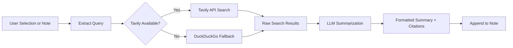

import TLDR from '@site/src/components/TLDR';

# Penyelidikan & Pencarian Web

<TLDR>
**Notemd akan mencari di web dan menyuntik hasil yang diringkaskan LLM terus ke dalam nota anda.** Tavily API merupakan backend pencarian utama; DuckDuckGo berfungsi sebagai alternatif tanpa tetapan. Hasilnya diringkaskan dengan rujukan sumber dan ditambah di bawah tajuk `## Research`. Ia menyokong penyelidikan nota tunggal, penyelidikan folder secara berkumpulan, serta pemilihan model untuk langkah ringkasan mengikut tugas.

Ini merupakan sebahagian daripada [Obsidian Panduan Pengurusan Pengetahuan AI](/docs/pillar-ai-knowledge).
</TLDR>

## Gambaran Keseluruhan

Penyelidikan merupakan salah satu integrasi paling berkuasa Notemd: ia menghubungkan proses membaca, mencari, dan menulis. Daripada beralih ke pelayar untuk mencari istilah yang tidak dikenali, anda hanya perlu menandakan istilah tersebut dan biarkan Notemd mencari, meringkaskan, serta menambah hasilnya — semuanya dalam vault anda.

Proses ini boleh dikonfigurasikan sepenuhnya. Anda boleh memilih penyedia pencarian, LLM yang akan menulis ringkasan, serta sama ada hasilnya ditambah ke nota aktif atau ditulis ke fail berasingan. Mod berkumpulan membolehkan anda menyelidik setiap nota dalam sebuah folder dengan satu klik.

## Cara Ia Berfungsi

### Pipelai Cari-Kemudian-Ringkaskan



1. **Pengambilan pertanyaan** -- Notemd mengambil istilah carian daripada pilihan anda atau tajuk nota.
2. **Pencarian web** -- Tavily dicuba terlebih dahulu. Jika kunci API tidak dikonfigurasikan, DuckDuckGo akan digunakan secara automatik (tiada kunci diperlukan).
3. **Ringkasan LLM** -- Hasil carian mentah dihantar ke LLM yang telah dikonfigurasikan, yang kemudian menghasilkan ringkasan ringkas dengan rujukan sumber secara terus.
4. **Menambah** -- Ringkasan yang telah diformat akan ditambah di bawah tajuk `## Research` dalam nota aktif.

### Tavily berbanding DuckDuckGo

| Aspek | Tavily | DuckDuckGo |
|--------|--------|------------|
| Kunci API | Diperlukan (tahap percuma tersedia) | Tidak diperlukan |
| Kualiti hasil | Lebih tinggi (direka khusus untuk AI) | Cukup untuk pertanyaan umum |
| Had kelajuan | Tahap percuma yang banyak | Tergantung pada pengurangan kelajuan |
| Konfigurasi | `tavilyApiKey` dalam tetapan | Tiada konfigurasi -- beralih automatik |

### Penyelidikan Folder Berkumpulan

Klik kanan pada folder dan pilih **"Notemd: Folder penyelidikan"**. Setiap fail `.md` dalam folder diproses secara berurutan (atau secara selari mengikut kekonduksian yang ditetapkan). Setiap nota menerima ringkasan penyelidikan tersendiri.

## Konfigurasi

| Pengaturan | Lalai | Kesan |
|---------|---------|--------|
| `tavilyApiKey` | `''` | Kunci Tavily API. Apabila kosong, DuckDuckGo digunakan sepenuhnya. |
| `researchProvider` / `researchModel` | DeepSeek | LLM setiap tugas untuk meringkaskan hasil carian |
| `maxResearchContentTokens` | `4000` | Bajet token untuk kandungan yang dihantar ke LLM. Yang berlebihan akan dipotong. |
| `researchAppendToNote` | `true` | Tambahkan ringkasan pada nota asal. Jika palsu, buat fail berasingan. |
| `researchLanguage` | `'en'` | Bahasa keluaran untuk penyelidikan yang diringkaskan |

### Saranan model setiap tugas

Penyelidikan mendapat manfaat daripada model yang mampu mengendalikan kandungan pelbagai bahasa dan menghasilkan teks yang terstruktur dengan baik. Pertimbangkan:

- **DeepSeek** -- lalai, berpatutan, kualiti tinggi
- **GPT-4o** -- ringkasan berkualiti lebih tinggi, kos lebih mahal
- **Gemini Flash** -- cepat dan murah, sesuai untuk pertanyaan biasa

## Contoh

Anda sedang membaca kertas kerja mengenai *mekanisme perhatian transformer* dan menemui istilah yang tidak dikenali: *relative positional encoding*. Daripada membiarkan Obsidian:

1. Sila highlight **"relative positional encoding"**
2. Klik kanan --> **"Notemd: Penyelidikan dan ringkasan"**
3. Notemd akan mencari di web, meringkaskan hasil teratas, dan menambahkan:

```markdown
## Research

### Relative Positional Encoding

Relative positional encoding is a method used in transformer models
where positional information is expressed as relative distances between
tokens rather than absolute positions. Introduced by Shaw et al. (2018),
it improves generalization to unseen sequence lengths compared to
absolute encodings (Vaswani et al., 2017).

Sources:
- [Shaw et al., Self-Attention with Relative Position Representations (2018)](https://arxiv.org/abs/1803.02155)
- [Transformer Positional Encoding Overview](https://example.com/transformer-pos-enc)
```

Ringkasan tersebut kini menjadi sebahagian daripada fail anda, boleh dicari, boleh dipautkan, dan boleh diakses tanpa sambungan internet.

## Tips

- **Tetapkan kunci Tavily untuk hasil terbaik** -- walaupun versi percuma juga memberikan ke relevanan yang lebih baik berbanding DuckDuckGo secara langsung.
- **Gunakan model ringkasan yang berkebolehan** -- model murah mungkin merendahkan kandungan teknikal yang halus.
- **Lakukan penyelidikan secara berkumpulan** selepas membaca sekali untuk mengisi kekosongan dalam banyak nota pada masa yang sama.
- **Semak ringkasan yang ditambahkan** -- LLM boleh menghasilkan butiran sumber yang salah. Sahkan dakwaan utama.

---

## Langkah Seterusnya

- [Concept Notes](./concept-notes) -- Ekstrak dan simpan istilah penting daripada hasil penyelidikan
- [Wiki-Links](./wiki-links) -- Pautkan konsep yang diperoleh daripada penyelidikan di seluruh fail anda
- [Translation](./translation) -- Terjemahkan ringkasan penyelidikan ke dalam bahasa lain
- [Pembekal LLM](/docs/providers/overview) -- Konfigurasikan model yang digunakan untuk ringkasan
