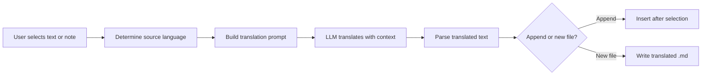

import TLDR from '@site/src/components/TLDR';

# Terjemahan

<TLDR>
**Notemd menterjemah teks antara 21+ bahasa menggunakan terjemahan yang dikuasakan oleh LLM.** Ia menyokong terjemahan pilihan tunggal, terjemahan nota sepenuhnya, dan terjemahan folder secara berkumpulan. Setiap tugas terjemahan boleh menggunakan penyedia dan model khusus melalui tetapan setiap tugas. Bahasa keluaran boleh dikonfigurasikan secara berasingan daripada bahasa UI. Hasilnya akan ditambahkan atau ditulis ke dalam fail baru mengikut pilihan anda.

Ini merupakan sebahagian daripada [Obsidian Panduan Pengurusan Pengetahuan AI](/docs/pillar-ai-knowledge).
</TLDR>

## Gambaran Keseluruhan

Terjemahan dalam Notemd bukanlah carian kamus -- ia merupakan terjemahan yang dikuasakan oleh LLM dan memahami konteks. Model tersebut melihat keseluruhan perenggan atau nota, sekaligus mengekalkan nada, istilah khusus bidang, dan struktur ayat. Ini menghasilkan hasil yang lebih berkualiti berbanding perkhidmatan terjemahan frasa demi frasa, terutamanya untuk penulisan teknikal, akademik, dan kreatif.

Ciri ini menyokong tiga skop: pilihan, nota aktif, dan folder keseluruhan. Dengan gabungan pemilihan model setiap tugas, anda boleh menggunakan model yang pantas (Gemini Flash) untuk terjemahan biasa dan model yang berkuasa (Claude Sonnet) untuk kandungan yang memerlukan nuansa -- tanpa perlu mengubah penyedia global anda.

## Cara Ia Berfungsi

### Arahan Terjemahkan



1. **Pengesanan sumber** -- LLM menentukan bahasa sumber daripada kandungan. Anda tidak perlu menentukannya secara manual.
2. **Pembinaan promp** -- Notemd membina promp yang merangkumi bahasa sasaran, petunjuk bidang pilihan, dan kandungan yang perlu diterjemahkan.
3. **Terjemahan LLM** -- `translateProvider` / `translateModel` yang telah dikonfigurasikan memproses permintaan. Model tersebut mengekalkan format markdown, pautan wiki, dan blok kod.
4. **Keluaran** -- Teks yang telah diterjemahkan akan ditambahkan di bawah teks asal atau ditulis ke dalam fail baru dalam vault.

### Pasangan Bahasa

Notemd menyokong mana-mana pasangan bahasa yang disokong oleh LLM di sebaliknya. Pasangan yang biasa termasuk:

| Sumber | Sasaran | Kualiti Biasa |
|--------|--------|----------------|
| Bahasa Inggeris | Bahasa Cina (Ringkas) | Cemerlang |
| Cina | Inggeris | Cemerlang |
| Inggeris | Jepun | Sangat baik |
| Inggeris | Jerman / Perancis / Sepanyol | Sangat baik |
| Mana-mana yang disokong | Mana-mana yang disokong | Tergantung pada model |

Pengaturan `translateLanguage` mengawal **bahasa keluaran**. Bahasa sumber dikenal pasti secara automatik.

### Pemilihan Model Mengikut Tugas

Kualiti terjemahan berbeza dengan ketara mengikut model. Notemd membolehkan anda menetapkan model khusus untuk tujuan terjemahan sahaja:

| Model | Kelajuan | Kualiti | Kos | Paling Sesuai Untuk |
|-------|-------|--------|------|----------|
| `gemini-2.0-flash-exp` | Cepat | Baik | Rendah | Gunaan harian, jumlah besar |
| `gpt-4o-mini` | Cepat | Baik | Rendah | Pencarian pantas |
| `deepseek-chat` | Sederhana | Baik | Sangat rendah | Bajet pelbagai bahasa |
| `claude-3-5-sonnet` | Sederhana | Cemerlang | Sederhana | Teknikal / akademik |
| `gpt-4o` | Sederhana | Cemerlang | Sederhana | Prosa yang sensitif terhadap nuansa |

### Terjemahan Folder Berkumpulan

Klik kanan pada folder dan pilih **"Notemd: Terjemahkan folder"** untuk menterjemahkan setiap nota dalam folder tersebut. Setiap fail diproses secara berasingan. Tetapan serentak mengawal berapa banyak fail yang diterjemahkan secara serentak.

## Konfigurasi

| Pengaturan | Lalai | Kesan |
|---------|---------|--------|
| `translateProvider` / `translateModel` | DeepSeek | Penyedia khusus untuk tugas terjemahan |
| `translateLanguage` | `'en'` | Bahasa output sasaran |
| `translationAppendToNote` | `true` | Tambahkan teks yang telah diterjemahkan di bawah teks asal. Jika bernilai palsu, fail baru akan dibuat. |
| `batchConcurrency` | `3` | Bilangan fail yang diproses secara serentak semasa terjemahan berkumpulan |

## Contoh

Anda sedang membaca nota penyelidikan dalam bahasa Cina dan ingin versi dalam bahasa Inggeris:

1. Buka nota tersebut
2. Klik kanan --> **"Notemd: Terjemahkan fail semasa"**
3. Notemd mengesan bahasa Cina, menterjemahkannya ke bahasa sasaran yang telah dikonfigurasikan (Bahasa Inggeris), dan menambahkan teks terjemahan di bawahnya:

```markdown
## Translation (English)

The experimental results show that the proposed method achieves
a 12% improvement in F1 score compared to the baseline, primarily
due to the enhanced feature extraction module described in Section 3.
```

Teks Cina asal kekal tidak berubah di atas teks terjemahan. Tajuk `## Translation` memastikan kedua-dua versi berada dalam fail yang sama untuk rujukan yang mudah.

## Tips

- **Gunakan Gemini Flash untuk jumlah yang banyak** -- ia merupakan pilihan paling cepat dan murah untuk terjemahan berkumpulan folder yang besar.
- **Pelihara pautan wiki** -- arahan Notemd menyuruh LLM untuk mengekalkan `[[wiki-links]]` tanpa diubah dalam terjemahan. Semak semula selepas terjemahan, kerana sesetengah model kadangkala membuka pautan tersebut.
- **Tetapkan bahasa keluaran secara eksplisit** -- pengesanan automatik berfungsi untuk sumber, tetapi sentiasa konfigurasikan `translateLanguage` untuk mengelakkan kekeliruan mengenai sasaran.
- **Terjemah nota konsep secara berkumpulan** -- jika folder konsep anda dalam satu bahasa dan anda memerlukannya dalam bahasa lain, terjemahan pada peringkat folder akan melakukannya dalam satu langkah.

---

## Langkah Seterusnya

- [Penyelidikan](./research) -- Cari dan ringkaskan dalam mana-mana bahasa, kemudian terjemahkan hasilnya
- [Aliran kerja](./workflows) -- Gabungkan terjemahan dengan pautan wiki atau pengekstrakan konsep
- [Pemprosesan berkumpulan](/docs/advanced/batch-processing) -- Tingkah laku serentak dan menulis semula untuk operasi folder
- [Penyedia LLM](/docs/providers/overview) -- Pilih model terbaik untuk pasangan bahasa anda
