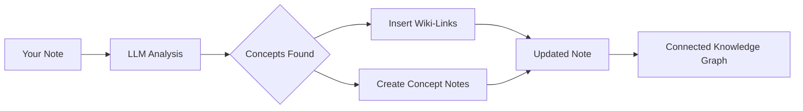

import TLDR from '@site/src/components/TLDR';

# Wiki-Links

<TLDR>
**Notemd akan menambah `[[wiki-links]]` secara automatik ke dalam konsep utama dalam nota anda.** LLM akan membaca kandungan anda, mengenal pasti istilah penting dalam konteks, dan memasukkan pautan wiki gaya Obsidian pada setiap kemunculan. Secara pilihan, ia boleh membuat fail nota konsep dengan pautan balik. Ia menyokong penindasan sinonim, integriti pautan apabila nama ditukar atau dipadam, dan mod pengeluaran tulen (tanpa pengubahsuaian fail). Berbeza dengan Auto Link yang hanya memadankan tajuk nota sedia ada, Notemd menggunakan AI untuk mengenal pasti konsep baru dan membuat nota yang bersesuaian. Ini merupakan sebahagian daripada [Obsidian Panduan Pengurusan Pengetahuan AI](/docs/pillar-ai-knowledge).
</TLDR>

## Gambaran Keseluruhan

Penggabungan pautan wiki merupakan ciri utama Notemd. Ia menukar teks biasa kepada graf pengetahuan yang bersambung dengan cara berikut:

1. **Menganalisis nota anda** menggunakan LLM
2. **Mengenal pasti konsep utama** (istilah, orang, kaedah, teori)
3. **Memasukkan `[[wiki-links]]`** pada setiap kemunculan
4. **Membuat nota konsep** (pilihan) dengan pautan balik

## Cara Ia Berfungsi

### Proses



### Contoh

**Sebelum:**
```markdown
Machine learning models use neural networks to learn patterns from data.
The transformer architecture revolutionized natural language processing.
```

**Selepas:**
```markdown
[[Machine learning]] models use [[neural networks]] to learn patterns from data.
The [[transformer architecture]] revolutionized [[natural language processing]].
```

## Penggunaan

### Asas: Tambah Pautan ke Nota Semasa

1. Buka sebuah nota
2. Klik kanan dalam editor → **"Proses fail (tambah pautan)"**
3. Tunggu beberapa saat
4. Konsep kini telah dipautkan!

### Bilangan Kumpulan: Proses Beberapa Nota

1. Klik kanan pada folder dalam File Explorer
2. Pilih **"Notemd: Process folder (add links)"**
3. Konfigurasi:
   - Kerjasama Serentak (bilangan fail secara serentak)
   - Gantikan Pautan Sedia Ada (ya/tidak)
4. Klik **Proses**

### Pemilihan: Pautkan Teks Spesifik

1. Sorot teks yang akan diproses
2. Klik kanan → **"Proses Pemilihan (Tambah Pautan)"**
3. Hanya bahagian yang disorot sahaja dianalisis

## Notemd berbanding Auto Link

Obsidian mempunyai dua kaedah untuk pautan wiki automatik:

| | **Auto Link** | **Notemd** |
|--|---------------|-------------|
| Sumber pautan | Tajuk nota sedia ada dalam vault | Konsep yang dikenal pasti oleh LLM dalam kandungan |
| Boleh sambung konsep baru | Tidak — tajuk mesti sudah wujud | Ya — AI mengenal pasti konsep dan mencipta nota |
| Pengendalian sinonim | Tidak | Ya — penindasan sinonim |
| Penciptaan nota konsep | Tidak | Ya — dengan pautan balik dan penghapusan duplikasi |
| Pemprosesan secara berkumpulan | Tidak (fail tunggal) | Ya (tahap folder) |
| Laluan model mengikut tugas | Tidak | Ya |

**Auto Link** adalah padanan tajuk: jika terdapat nota bernama "Machine Learning", ia akan membungkus kejadian dalam `[[Machine Learning]]`. Jika nota itu tidak wujud, tiada apa yang berlaku.

**Notemd** dikendalikan oleh AI: LLM membaca kandungan anda, memahami konteks, mengenal pasti konsep yang *sepatutnya* disambungkan — walaupun tiada nota yang wujud lagi — dan mencipta pautan serta nota konsep.

## Ciri-ciri

### Penindasan Sinonim

**Masalah:** "transformer", "transformers", "Transformer architecture" → 3 konsep berasingan

**Penyelesaian:** Notemd mengesan duplikasi hampir sama dan menggunakan bentuk kanonik.

**Konfigurasi:**
```
Settings → Advanced → Synonym Suppression
Threshold: 0.8 (0 = off, 1 = aggressive)
```

### Integriti Pautan

**Apabila anda menukar nama nota konsep:**
- Semua pautan wiki akan dikemaskini secara automatik (Obsidian ciri utama)
- Pautan balik kekal utuh

**Apabila anda memadam nota konsep:**
- Pautan tetap ada tetapi dipaparkan sebagai "sebutan yang tidak terpaut"
- Anda boleh menciptanya semula daripada sebarang rujukan

### Mod Ekstraksi Murni

**Ekstrak konsep tanpa mengubah yang asal:**

1. Klik kanan → **"Ekstrak konsep (tanpa pautan)"**
2. Nota konsep akan dihasilkan
3. Fail asal tidak terjejas

Kes penggunaan: Memproses kandungan baca sahaja atau draf akhir.

## Penghasilan Nota Konsep

### Penciptaan automatik

**Apabila diaktifkan (lazim), Notemd akan mencipta:**

```markdown
---
tags: [concept, auto-generated]
created: 2026-06-13
source: [[Original Note Name]]
---

# Machine Learning

A branch of artificial intelligence that enables computers
to learn from data without explicit programming.

## Occurrences in Your Vault

- [[Original Note Name#Section]]
- [[Another Note#Header]]

## Related Concepts

- [[Neural Networks]]
- [[Deep Learning]]
- [[Supervised Learning]]
```

### Konfigurasi

**Folder keluaran:**
```
Settings → Output → Concept Folder
Default: concepts/
```

**Struktur hierarki:**
```
Settings → Output → Use Hierarchical Folders
If enabled:
  papers/my-paper.md → papers/concepts/Concept.md
If disabled:
  → concepts/Concept.md
```

**Templat:**
```
Settings → Output → Concept Template
Customize with variables:
  {{concept}} — Concept name
  {{description}} — LLM-generated description
  {{backlinks}} — List of source notes
  {{date}} — Creation date
```

## Pilihan Lanjutan

### Tetingkap Konteks

**Berapa banyak teks sekeliling yang perlu dihantar:**

```
Settings → Linking → Context Window
Options: Sentence | Paragraph | Full Note
Default: Paragraph
```

Lebih besar = ketepatan yang lebih baik, kos yang lebih tinggi.

### Kekerapan Minimum

**Hanya sambungkan konsep yang muncul berkali-kali:**

```
Settings → Linking → Min Occurrences
Default: 1 (link all)
```

Aturkan kepada 2 atau 3 untuk memberi tumpuan pada tema yang berulang.

### Pola yang Dikecualikan

**Lompatkan perkataan tertentu:**

```
Settings → Linking → Exclude List
Example: note, idea, example, thing
```

Mengelakkan pautan berlebihan pada istilah umum.

### Prompt Khas

**Tukar arahan LLM lalai:**

```
Settings → Advanced → Custom Linking Prompt
Default:
  "Identify key concepts, theories, methods, and technical
   terms in the following text. Return as a list..."
```

Ubah mengikut keperluan khusus domain (contohnya, "Fokus pada terminologi perubatan").

## Tips & Amalan Terbaik

### ✅ LAKUKAN

- **Proses nota dengan lebih daripada 100 perkataan** — Nota yang pendek menghasilkan sedikit konsep
- **Gunakan model yang berkuasa** untuk pengenalpastian konsep yang lebih baik (GPT-4o, Claude)
- **Semak sebelum menerima** — Pastikan pautan yang dicadangkan masuk akal
- **Bina secara berulang** — Proses 5-10 nota, semak graf, laraskan tetapan

### ❌ JANGAN

- **Terlalu banyak pautan** — Bukan setiap kata nama memerlukan pautan
- **Proses draf berulang kali** — Konsep mungkin berubah, tunggu sehingga stabil
- **Abaikan sinonim** — Aktifkan penindasan untuk elakkan "ML" berbanding "Machine Learning"

## Prestasi

### Kelajuan

| Saiz Nota | GPT-4o-mini | Claude Sonnet | Ollama (lokal) |
|-----------|-------------|---------------|----------------|
| 500 perkataan | 2-3 saat | 3-5 saat | 5-10 saat |
| 2000 perkataan | 5-8 saat | 10-15 saat | 20-40 saat |
| 5000+ perkataan | Dibahagikan kepada bahagian (panggilan berbilang kali) | Dibahagikan kepada bahagian-bahagian | Dibahagikan kepada bahagian-bahagian |

### Anggaran Kos

**Contoh: Nota 1000 perkataan menggunakan GPT-4o-mini**
- Masukan: ~1500 token
- Keluaran: ~200 token
- Kos: ~

**Pemprosesan pukal 100 nota:** ~

## Pemecahan masalah

### Tiada pautan ditambah.

**Semak:**
1. LLM panggilan berjaya (Settings → Diagnostics)
2. Nota tersebut mempunyai kandungan yang mencukupi (>50 perkataan)
3. Konsep adalah teknikal/khusus (bukan sekadar kata ganti nama)

**Cuba:**
- Gunakan model yang lebih berkuasa
- Tingkatkan tetingkap konteks
- Periksa kesahan kunci API

### Terlalu Banyak Pautan

**Penyelesaian:**
1. Tingkatkan kejadian minimum (2 atau 3)
2. Tambahkan perkataan biasa ke dalam senarai pengecualian
3. Gunakan model yang kurang agresif

### Konsep yang Salah Disambungkan

**Pembaikan:**
1. Guna prompt khas untuk kekhususan domain
2. Aktifkan penindasan sinonim
3. Semak secara manual dan buka ikatan

### Pautan rosak selepas menukar nama

**Ini merupakan tingkah laku normal Obsidian.**

Untuk mengemaskini semua pautan:
1. Tukar nama nota konsep
2. Obsidian akan mengemaskini `[[old]]` secara automatik menjadi `[[new]]`

---

## Langkah Seterusnya

- 📖 [Nota Konsep](./concept-notes) — Kajian mendalam tentang penghasilan nota konsep
- 🔍 [Penggabungan Penyelidikan](./research) — Gabungkan pautan dengan penyelidikan web
- 🎨 [Diagram](./diagrams) — Visualisasikan graf pengetahuan anda
