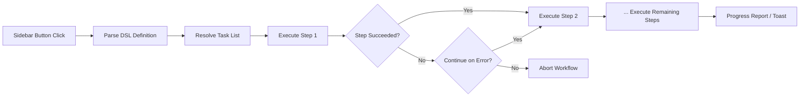

import TLDR from '@site/src/components/TLDR';

# Aliran Kerja

<TLDR>
**Notemd aliran kerja merantaikan beberapa tugas menjadi satu tindakan satu klik.** Tentukan urutan seperti `add-links > extract-concepts > research > diagram` menggunakan DSL yang mudah. Aliran kerja muncul sebagai butang di sidebar yang menjalankan keseluruhan rantai pada nota atau folder semasa. Ia disertakan dengan aliran kerja yang telah ditetapkan terlebih dahulu; cipta aliran kerja tersendiri dalam tetapan. Setiap langkah menggunakan konfigurasi model khusus tugas masing‑masing.

Ini merupakan sebahagian daripada [Obsidian Panduan Pengurusan Pengetahuan AI](/docs/pillar-ai-knowledge).
</TLDR>

## Gambaran Keseluruhan

Aliran kerja menghapuskan kesukaran menjalankan tugas satu demi satu. Daripada perlu klik kanan sebanyak empat kali untuk menambah pautan, mengekstrak konsep, menyelidik istilah yang tidak dikenali, dan menjana diagram, anda hanya perlu tekan satu butang di sidebar dan keseluruhan rantai akan dijalankan. Notemd menguruskan urutan, penyebaran ralat, dan laporan kemajuan.

Aliran kerja ditakrifkan dalam DSL ringan (bahasa khusus domain). Ia berada dalam tetapan, muncul sebagai butang yang boleh diklik di sidebar Obsidian, dan boleh digunakan pada nota semasa atau keseluruhan folder.

## Cara Ia Berfungsi

### Pipali Pelaksanaan Aliran Kerja



1. **Parse** -- Rentetan DSL dipisahkan pada `>` (atau `>`) menjadi senarai berurutan pengenal pasti tugas.
2. **Resolve** -- Setiap pengenal pasti dipetakan kepada arahan dalaman (add-links, extract-concepts, research, translate, diagram, dll.).
3. **Execute** -- Langkah‑langkah dijalankan secara berurutan. Setiap langkah menggunakan penyedia dan model khusus tugas yang telah dikonfigurasikan.
4. **Error handling** -- Jika sesuatu langkah gagal, aliran kerja akan berhenti atau meneruskan ke langkah seterusnya, bergantung pada dasar ralat anda.
5. **Done** -- Pemberitahuan toast melaporkan kejayaan atau menyenaraikan langkah yang gagal.

### Format DSL

Aliran kerja ditakrifkan sebagai urutan pengenal pasti tugas yang dipisahkan oleh `>`:

```
process-current-add-links>extract-concepts-current>research-and-summarize
```

**Pengenal pasti tugas yang tersedia:**

| Pengenal pasti | Tindakan |
|------------|--------|
| `process-current-add-links` | Tambah pautan wiki ke nota aktif |
| `extract-concepts-current` | Keluarkan konsep daripada nota aktif |
| `research-and-summarize` | Menyelidik teks yang dipilih atau tajuk nota |
| `process-current-translate` | Menterjemah nota aktif |
| `summarize-to-mermaid` | Jana diagram daripada nota aktif |
| `generate-from-title` | Jana kandungan daripada tajuk nota |
| `extract-original-text` | Keluarkan teks asal (untuk OCR/kandungan yang discan) |

**Variasi peringkat folder** gantikan `current` dengan `folder` dalam nama pengecam.

### Aliran kerja pratetap berbanding Aliran kerja khusus

Notemd disertakan dengan aliran kerja siap sedia untuk corak biasa:

| Aliran kerja | Rantaian | Kes Penggunaan |
|----------|-------|----------|
| **Keluarkan Dengan Satu Klik** | tambah-pautan > keluarkan-konsep > menyelidik | Proses kertas penyelidikan dalam satu langkah |
| **Pipelin Penuh** | tambah-pautan > ekstrak-consep > kajian > diagram | Ekstraksi pengetahuan sepenuhnya dengan visualisasi |
| **Terjemah + Pautan** | terjemah > tambah-pautan | Terjemah kemudian pautkan konsep dalam bahasa sasaran |

**Aliran kerja khusus** dibuat dalam tetapan:

1. Buka **Tetapan** --> **Notemd** --> **Aliran Kerja**
2. Klik **"Tambah Aliran Kerja"**
3. Masukkan rantaian DSL (contohnya, `process-current-add-links>extract-concepts-current`)
4. Berikan nama paparan (contohnya, "Pautan Cepat + Ekstrak")
5. Butang baru akan muncul dalam sidebar dengan segera

## Konfigurasi

| Pengaturan | Lalai | Kesan |
|---------|---------|--------|
| `workflows` | Set prapentukan | Senarai definisi aliran kerja (nama + DSL) |
| `workflowContinueOnError` | `true` | Teruskan ke langkah seterusnya jika langkah semasa gagal |
| `workflowShowProgress` | `true` | Tunjukkan notifikasi kemajuan selepas setiap langkah selesai |

### Model Setiap Tugas dalam Aliran Kerja

Setiap langkah dalam aliran kerja menggunakan konfigurasi model khusus untuk setiap tugas. Anda tidak perlu menentukan model dalam DSL itu sendiri. Urutan penyelesaian adalah:

1. Pembekal/model khusus tugas sekiranya `useMultiModelSettings` ada di sana
2. `activeProvider` global jika sebaliknya

Ini bermakna `add-links` boleh berjalan pada DeepSeek sementara `research` berjalan pada GPT-4o -- semuanya dalam satu klik aliran kerja yang sama.

## Contoh

Anda baru sahaja mengimport PDF daripada sebuah kertas penyelidikan pembelajaran mesin ke dalam peti simpanan anda dan ingin pemungutan pengetahuan sepenuhnya:

1. Buka nota yang diimport
2. Klik butang sidebar **"Full Pipeline"**
3. Notemd akan menjalankan:
   - **Langkah 1**: Tambah pautan wiki -- `[[attention mechanism]]`, `[[transformer]]`, dan sebagainya.
   - **Langkah 2**: Keluarkan konsep -- cipta nota konsep dalam folder konsep anda
   - **Langkah 3**: Penyelidikan -- ringkaskan sumber web untuk istilah utama
   - **Langkah 4**: Diagram -- hasilkan mindmap Mermaid bagi struktur kertas tersebut
4. Selepas kira-kira 30 saat, nota anda akan mempunyai pautan, nota konsep wujud, hasil penyelidikan ditambah, dan fail diagram disimpan

Semuanya dengan satu klik sahaja.

## Tips

- **Mulakan dengan aliran kerja yang telah ditetapkan terlebih dahulu** -- ia meliputi corak yang paling biasa. Sesuaikan hanya apabila anda memerlukan urutan yang berbeza.
- **Aktifkan `workflowContinueOnError`** -- langkah diagram yang gagal tidak sepatutnya menghentikan keseluruhan saluran paip.
- **Guna aliran kerja folder** untuk pemprosesan pukal -- klik kanan pada folder, pilih aliran kerja, dan setiap nota akan diproses.
- **Berikan nama aliran kerja yang jelas** -- ruang di sidebar adalah terhad. Gunakan nama yang pendek dan berorientasikan tindakan seperti "Quick Extract" atau "Translate + Link".

---

## Langkah Seterusnya

- [Research](./research) -- Fahami apa yang dilakukan oleh langkah penyelidikan sebelum menambahkannya ke dalam aliran kerja
- [Wiki-Links](./wiki-links) -- Ciri pautan asas yang digunakan dalam kebanyakan aliran kerja
- [Concept Notes](./concept-notes) -- Pengeluaran konsep sebagai langkah dalam aliran kerja
- [Batch Processing](/docs/advanced/batch-processing) -- Kerjasama serentak dan laporan kemajuan untuk aliran kerja folder
