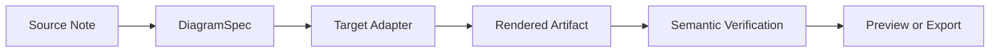
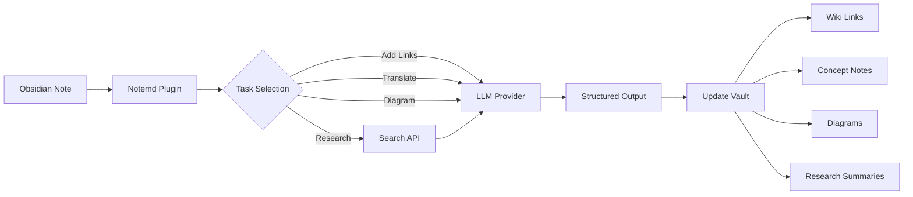

import TLDR from '@site/src/components/TLDR';

# Pengenalan kepada Notemd

<TLDR>
**Notemd** (Nota + EMD — Dokumen Markdown Diperbaiki) ialah plugin sumber terbuka untuk Obsidian yang menukar bacaan yang dikuasakan oleh LLM menjadi pengetahuan yang kekal. Berbeza dengan AI berasaskan sembang di mana pandangan hilang selepas sesi, Notemd menulis hasil **terus ke dalam vault anda** sebagai pautan wiki, nota konsep, ringkasan penyelidikan, terjemahan, aliran kerja, dan diagram. Ia dibina untuk penyelidik, pelajar, dan pekerja pengetahuan yang ingin bacaan, penyelidikan, dan penjelasan visual dikumpulkan menjadi graf pengetahuan yang terstruktur dan berkembang.
</TLDR>

## Apa itu Notemd?

Notemd menggabungkan **lebih daripada 30 Model Bahasa Besar** (OpenAI, Anthropic, Google, DeepSeek, Qwen, Ollama, dan lain-lain) ke dalam aliran kerja Obsidian anda untuk mengautomasikan pengeluaran pengetahuan, pengorganisasian, terjemahan, penyelidikan, dan pembuatan diagram.

### Perbezaan utama: Pengetahuan sementara berbanding pengetahuan kekal

| Aspek | AI berasaskan sembang (ChatGPT, dll.) | Notemd |
|--------|-------------------------------|--------|
| **Ke mana hasil pergi** | Sejarah sembang (hilang) | Vault Obsidian anda (kekal) |
| **Format** | Jawapan teks biasa | Fail terstruktur: `[[wiki-links]]`, nota konsep, diagram |
| **Nilai jangka panjang** | Perlu tanya semula setiap kali | Terkumpul menjadi graf pengetahuan |
| **Akses luar talian** | Memerlukan internet | Bekerja sepenuhnya tanpa internet dengan Ollama |

## Keupayaan utama

### 1. **Penghubungan Wiki automatik**
- LLM mengenal pasti konsep utama dalam nota anda
- Menyisipkan `[[wiki-links]]` pada setiap kejadian
- Secara pilihan, mencipta nota konsep yang berhubung
- Penindasan sinonim untuk elakkan duplikasi

### 2. **Penghasilan nota konsep**
- Mengeluarkan konsep utama daripada kertas kerja, artikel, nota
- Menghasilkan fail konsep khusus dengan pautan balik
- Laluan keluaran dan templat yang boleh disesuaikan

### 3. **Penggabungan penyelidikan web**
- Menyemak Tavily atau DuckDuckGo daripada dalam Obsidian
- LLM merumuskan hasil dengan rujukan sumber
- Menambah hasil kajian ke nota semasa

### 4. **Terjemahan Pelbagai Bahasa**
- Menterjemah bahagian tertentu atau keseluruhan nota
- menyokong lebih daripada 21+ UI bahasa
- Konfigurasi bahasa keluaran secara berasingan
- Sokongan terjemahan berkumpulan

### 5. **Penghasilan Diagram**
- **Mermaid**: Aliran, urutan, kelas, keadaan, ER, Gantt
- **JSON Canvas**: Susun atur asli Obsidian
- **Vega-Lite**: Carta data, siri masa, plot serakan
- **HTML / HTML yang boleh diubah suai/SVG**: Artefak rajah berdikari dengan anotasi semantik
- **Draw.io / sempadan artefak Drawnix**: Laluan eksport untuk pentadbir daripada model rajah semantik yang sama
- **Rancangan jalan cerita diagram litar**: Sokongan circuitikz/TikZJax sedang direka berdasarkan rujukan emas, arahan terhad, maklum balas rendering, dan pengesahan topologi/susun atur berbanding TikZ LLM yang tidak terhad secara mentah
- **Diagnostik pratonton**: Artefak rendering boleh menunjukkan diagnosis kompilasi/rendering, dan sumber bukan inline boleh diperiksa tanpa memerlukan persekitaran LaTeX di pihak plugin
- Pembaikan sintaks automatik untuk ralat Mermaid

### 6. **Aliran Kerja Satu Klik**
- Gabungkan beberapa tindakan ke dalam butang sidebar
- Definisi aliran kerja berasaskan DSL
- Contoh: `add-links > extract-concepts > research > diagram`

## Siapa yang patut gunakan Notemd?

✅ **Penyelidik** yang membaca kertas kerja dan membina ulasan literatur
✅ **Pelajar** yang mengatur nota belajar dan mencipta peta konsep
✅ **Pekerja pengetahuan** yang mahu pandangan bacaan disimpan secara kekal
✅ **Profesional dwibahasa** yang memerlukan terjemahan + pautan wiki
✅ **Pengguna yang mementingkan privasi** yang mahu sokongan LLM tempatan (Ollama)
✅ **Pengguna berkuasa** yang menyesuaikan promp dan aliran kerja

## Mengapa Notemd + Obsidian?

**Obsidian** ialah pangkalan pengetahuan berasaskan markdown yang mengutamakan penggunaan tempatan. **Notemd** menambah keupayaan AI yang luar biasa:
- Data anda kekal di dalam peti simpanan anda (bukan perkhidmatan awan)
- Bekerja tanpa sambungan internet dengan model tempatan
- Bebas dan sumber terbuka (lesen MIT)
- Berpasangan dengan plugin Obsidian yang sedia ada
- Boleh diperluas hingga puluhan ribu nota

## Pengenalan

1. **Pasang**: Tetapan → Plugin Komuniti → Cari → "Notemd"
2. **Konfigurasikan**: Tambah penyedia LLM dan kunci API anda (atau gunakan Ollama tempatan)
3. **Cubalah**: Buka sebuah nota → Klik kanan → "Proses fail (tambah pautan)"
4. **Terokai**: Semak bar sisi untuk aliran kerja satu klik

👉 [Panduan Pasang](./getting-started/installation) | [Tutorial Permulaan Cepat](./getting-started/quick-start)

## Arah Keupayaan Diagram

Kerja diagram Notemd kini beralih daripada "meminta model menulis satu rentetan sintaks" kepada paip berlapis:

Pelaksanaan semasa sudah menyokong Mermaid, JSON Canvas, Vega-Lite, fallback HTML, HTML/SVG yang boleh diubah suai, artifak Draw.io XML, subset minimum Drawnix JSON, diagnosis pratonton/fallback hanya sumber, serta prototaip offline `CircuitSpec -> circuitikz` untuk templat emas sumber biasa dan inverter CMOS. Diagram litar merupakan kelas yang lebih sukar: circuitikz boleh nyatakan topologi elektrik yang tepat, tetapi output LLM tanpa sekatan sering menghasilkan laluan yang tidak dapat dibaca atau LaTeX yang tidak dapat dipaparkan. Arah seterusnya ialah mengekalkan circuitikz terhad dengan templat rujukan emas, peraturan susunan grid nod, diagnosis paparan, dan kitaran maklum balas tangkapan skrin.

Baca butiran lanjut di [Diagram](./features/diagrams).

## Arkitektur

## Notemd berbanding Plugin AI Obsidian yang Lain

Kebanyakan plugin AI Obsidian adalah berbentuk perbualan terlebih dahulu (anda tanya, AI jawab, pandangan kekal dalam sembang). Notemd pula ialah **penulisan terlebih dahulu**: AI memproses nota anda dan menulis hasil berstruktur terus ke dalam peti simpanan anda.

| Keupayaan | Notemd | Copilot | Smart Connections | Text Generator |
|-----------|--------|---------|-------------------|-----------------|
| Pengisian pautan wiki automatik | Ya | Tidak | Tidak | Tidak |
| Penghasilan nota konsep | Ya (dengan pautan balik + penghapusan duplikat) | Tidak | Tidak | Tidak |
| Penghasilan diagram | Ya (Mermaid, Canvas, Vega-Lite, HTML, artifak boleh diubah) | Tidak | Tidak | Tidak |
| Penyepaduan penyelidikan web | Ya (Tavily + DuckDuckGo) | Tidak | Tidak | Tidak |
| Pemprosesan folder secara berkumpulan | Ya | Terhad | Tidak | Terhad |
| Laluan model mengikut tugas | Ya (7 tugas, model bebas) | Tidak | Tidak | Tidak |
| Rantaian kerja satu klik | Ya (DSL) | Tidak | Tidak | Tidak |
| Terjemahan (secara berkumpulan) | Ya | Tidak | Tidak | Tidak |
| Berbual dengan vault | Tidak | Ya | Tidak | Tidak |
| Pencarian persamaan semantik | Tidak | Tidak | Ya | Tidak |
| Penghasilan berasaskan templat | Tidak | Tidak | Tidak | Ya |
| Penyedia LLM | 36 (awan + pintu gerbang + tempatan) | 3-5 | 2-3 | 3-5 |
| Sepenuhnya luar talian | Ya (Ollama) | Sebahagian | Sebahagian | Sebahagian |

**Bila memilih Notemd**: Anda mahu AI membina graf pengetahuan yang kekal — bukan sekadar berbual tentang nota anda.

**Bila memilih Copilot**: Anda mahu pembantu AI berbual di dalam Obsidian.

**Bila memilih Smart Connections**: Anda mahu menemui hubungan sedia ada antara nota melalui carian semantik.

## Falsafah

**Notemd percaya bahawa AI sepatutnya melengkapi kerja pengetahuan manusia, bukan menggantikannya.** Plugin ini:
- Menjaga kawalan anda (semak sebelum melaksanakan perubahan)
- Menjaga konteks (semua hasil merujuk kembali ke sumber)
- Menghormati privasi (sokongan LLM tempatan, tiada telemetri)
- Keupayaan untuk diperluas (antaramuka terbuka APIs, aliran kerja tersuai)

## Sumber Terbuka

- **Lesen**: MIT
- **Sumber**: [github.com/Jacobinwwey/obsidian-NotEMD](https://github.com/Jacobinwwey/obsidian-NotEMD)
- **Komuniti**: [Discord](https://discord.gg/qnGgsQ9W) | [GitHub Discussions](https://github.com/Jacobinwwey/obsidian-NotEMD/discussions)
- **Menyumbang**: Permohonan PR dialu-alukan, rujuk [CONTRIBUTING.md](https://github.com/Jacobinwwey/obsidian-NotEMD/blob/main/CONTRIBUTING.md)

---

**Seterusnya**: [Pemasangan →](./getting-started/installation)
