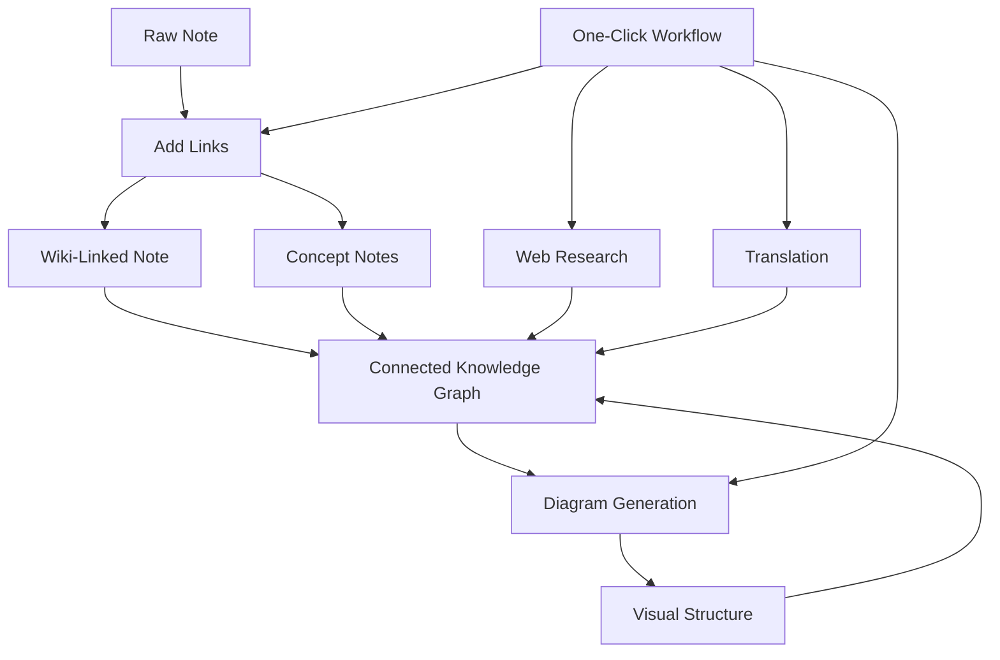

import TLDR from '@site/src/components/TLDR';

# Panduan Pengurusan Pengetahuan AI Obsidian

<TLDR>
**Notemd menukar pembacaan yang dikuasakan oleh LLM menjadi pengetahuan yang kekal: pautan wiki menghubungkan konsep, nota konsep mencipta graf yang boleh dicari, penyelidikan membawa kandungan web ke dalam peti simpanan anda, terjemahan memecahkan halangan bahasa, diagram menjadikan struktur kelihatan, dan aliran kerja menggabungkan semuanya dengan satu klik.** Panduan ini meliputi keseluruhan proses — daripada nota mentah hingga pangkalan pengetahuan yang bersambung, visual, dan berbilang bahasa.
</TLDR>

## Mengapa Pengurusan Pengetahuan AI?

Penulisan nota tradisional menghasilkan fail rata. Walaupun dengan pautan wiki secara manual, kebanyakan nota tetap tidak bersambung. Notemd menggunakan LLM untuk mengautomatikan lapisan penghubung:

- **LLM membaca kandungan anda** dan mengenal pasti apa yang penting — istilah, kaedah, orang, teori
- **Pautan dimasukkan secara automatik** pada setiap kemunculan konsep, bukan tersembunyi dalam “lihat juga”
- **Nota konsep dijana** sebagai fail yang boleh dicari secara berasingan
- **Penyelidikan memperkaya nota** dengan konteks daripada sumber web
- **Diagram menjadikan struktur kelihatan** — peta minda, aliran kerja, carta data daripada kandungan yang sama

Hasilnya: graf pengetahuan yang berkembang setiap kali anda memproses nota, bukan hanya apabila anda ingat untuk menambah pautan.

## Proses Keseluruhan



Setiap langkah adalah bebas. Gunakan satu atau semua. Urutan yang paling berkesan: **Tambah Pautan → Nota Konsep → Diagram**.

---

## 1. Pautan Wiki: Membuat Penghubungan Jelas

Pautan wiki merupakan tulang belakang graf pengetahuan. Notemd menggunakan LLM untuk:

1. Baca kandungan nota anda (pisahkan kepada bahagian kecil untuk dokumen yang panjang)
2. Kenal pasti konsep utama — utamakan istilah teknikal tertentu berbanding kata nama umum
3. Masukkan `[[wiki-links]]` pada setiap kemunculan
4. Hapuskan sinonim supaya "ML" dan "Machine Learning" tidak menghasilkan nod berasingan

### Bila Perlu Digunakan

- **Setiap nota >100 perkataan** — nota yang lebih pendek menghasilkan sedikit konsep
- **Kertas penyelidikan, dokumen teknikal, nota mesyuarat** — kaya dengan istilah khusus bidang
- **Selepas kandungan menjadi stabil** — jangan proses draf berulang kali

### Tetapan Utama

| Pengaturan | Disyorkan | Sebab |
|---------|-----------|-----|
| `addLinksProvider` | DeepSeek atau GPT-4o-mini | Ketepatan yang baik pada kos rendah |
| Penghapusan sinonim | Dihidupkan | Mencegah nod berulang |
| Tetingkap konteks | Perenggan | Keseimbangan antara ketepatan dan kos |

→ [Wiki-Links deep dive](/docs/features/wiki-links)

---

## 2. Nota Konsep: Node Pengetahuan yang Boleh Dicapai

Pautan wiki menghubungkan idea secara dalam baris, tetapi nota konsep membolehkan setiap idea dicapai secara berasingan. Setiap konsep mempunyai fail `.md`nya sendiri:

```markdown
# Machine Learning

## Linked From
- [[My Research Notes]]
- [[Neural Networks Explained]]
```

### Proses Pengekstrakan

Prompt LLM adalah sangat terstruktur:
- Normalisasi kepada bentuk tunggal
- Utamakan konsep berbilang perkataan berbanding perkataan tunggal (“Dielectric Relaxation” bukan “Relaxation”)
- Langkau bahagian rujukan/bibliografi
- Keluarkan sebagai baris `CONCEPT:` untuk pemprosesan yang pasti

Konsep dikurangkan pengulangan merentas segmen melalui `Set<string>`. Ralat LLM pada segmen individu tidak akan menghentikan operasi.

### Pautan Balik

Apabila diaktifkan, setiap nota konsep mencatat nota sumber yang menyebutnya. Panel pautan balik terbina dalam Obsidian juga menunjukkan sambungan balik.

### Penghapusan duplikasi

Enjin pengurangan pengulangan 4 langkah Notemd dapat mengesan:
1. **Padanan tepat** — perbandingan nama fail tanpa mengira huruf besar dan kecil
2. **Bentuk jamak** — "Models.md" berbanding "Model.md"
3. **Pemnormalan simbol** — "A-B.md" berbanding "A B.md"
4. **Pengandungan perkataan tunggal** — "ML.md" ditandakan apabila "Machine Learning.md" wujud

### Tetapan Utama

| Pengaturan | Disyorkan | Sebab |
|---------|-----------|-----|
| `conceptNoteFolder` | `concepts/` atau `🧠 concepts/` | Menjaga peti besi tetap teratur |
| `extractConceptsAddBacklink` | Dinyalakan | Mengaktifkan carian terbalik |
| `extractConceptsMinimalTemplate` | Tutup | Templat penuh dengan Linked From |
| Model mengikut tugas | DeepSeek | Pengeluaran konsep tidak memerlukan model yang mahal. |
| Penghapusan sinonim | Dinyalakan | Pengaturan yang sama mempengaruhi proses pautan dan pengeluaran. |

→ [Notis Konsep: Penyelidikan Mendalam](/docs/features/concept-notes)

---

## 3. Penyelidikan: Memasukkan Web

Notemd menggabungkan carian web ke dalam aliran kerja penulisan nota anda:

1. **Pembinaan pertanyaan** — tajuk nota atau pilihan anda menjadi pertanyaan carian
2. **Carian web** — Tavily (disyorkan, kunci API diperlukan) atau DuckDuckGo (percuma, tiada kunci)
3. ****LLM** ringkasan** — hasil carian diringkaskan menjadi ringkasan yang relevan
4. **Menambah ke nota** — ringkasan ditambah di kedudukan kursor atau sebagai bahagian baru

### Bila Perlu Digunakan

- Sebelum memproses topik baru — dapatkan konteks web terlebih dahulu
- Apabila notis konsep memerlukan penambahan maklumat — lakukan penyelidikan kemudian tambah pautan
- Untuk ulasan literatur — lakukan penyelidikan secara berkumpulan ke atas folder nota

### Tetapan Utama

| Pengaturan | Disyorkan | Sebab |
|---------|-----------|-----|
| `researchProvider` | GPT-4o atau Claude | Penyelidikan memerlukan ringkasan yang lebih berkualiti |
| Perkhidmatan carian | Tavily | Relevansi yang lebih baik, kedalaman yang boleh dikonfigurasi |
| `maxResearchContentTokens` | 4000 | Keseimbangan antara kedalaman dan kos |

→ [Penyelidikan mendalam](/docs/features/research)

---

## 4. Terjemahan: Memecahkan halangan bahasa

Notemd menterjemah nota menggunakan LLM yang telah dikonfigurasi oleh anda — bukan alat terjemahan khusus API. Ini bermakna:

- **Terjemahan berdasarkan konteks** — LLM memahami keseluruhan dokumen, bukan ayat demi ayat
- **Pengendalian istilah teknikal** — “gradient descent” kekal sebagai “梯度下降” dan bukan “坡度向下
- **Sokongan kumpulan** — terjemahkan seluruh folder nota dalam satu operasi
- **Model mengikut tugas** — gunakan Gemini Flash untuk terjemahan (cepat, murah, pelbagai bahasa)

### Sokongan Bahasa

Notemd sendiri menyokong 21 bahasa UI. Bahasa sasaran terjemahan boleh dikonfigurasi mengikut setiap tugas. Pasangan biasa: EN↔ZH, EN↔JA, EN↔KO, EN↔DE, EN↔FR, EN↔ES.

→ [Penyelidikan mendalam tentang terjemahan](/docs/features/translation)

---

## 5. Diagram: Menjadikan struktur kelihatan

Pipelain diagram Notemd bermula dengan spesifikasi: LLM menghasilkan `DiagramSpec` JSON yang berstruktur, kemudian penyesuai menukarnya ke format sasaran. Ini menghasilkan output yang lebih boleh dipercayai berbanding meminta LLM untuk sintaks Mermaid mentah.

### Pengesanan niat

Notemd menentukan jenis diagram yang terbaik berdasarkan kandungan:

- **Jadual dengan nombor** → carta data (Vega-Lite)
- **Kosakata klien/pelayan** → diagram urutan (Mermaid)
- **Entiti/kunci utama** → diagram ER (Mermaid)
- **Langkah/aliran proses** → carta alir (Mermaid)
- **Kata kunci peta konsep** → JSON Canvas (Obsidian asli)
- **Lazim** → peta minda (Mermaid)

### Rantaian Penjanaan

Sasaran utama → alternatif → alternatif → HTML. Jika sintaks Mermaid gagal, ia akan mencuba sekali lagi dengan konteks ralat ke LLM, kemudian beralih ke diagram minimum.

### Tetapan Utama

| Pengaturan | Disyorkan | Sebab |
|---------|-----------|-----|
| `enableExperimentalDiagramPipeline` | Dinyalakan | Kualiti yang lebih baik melalui spesifikasi terlebih dahulu |
| `experimentalDiagramCompatibilityMode` | `best-fit` | Sasaran asli mengikut niat |
| `summarizeToMermaidProvider` | GPT-4o atau Claude | Spesifikasi diagram memerlukan penaakulan ruang |
| `autoMermaidFixAfterGenerate` | Dinyalakan | Menangkap ralat sintaks LLM secara automatik |
| Peningkatan pengetahuan tempatan | Dihidupkan untuk khusus domain | Meningkatkan ketepatan dengan konteks vault |

→ [Analisis mendalam diagram](/docs/features/diagrams)

---

## 6. Aliran kerja: Automasi satu klik

Aliran kerja menggabungkan beberapa tugas ke dalam satu butang sidebar. Format DSL ialah:

```
task1 | task2 | task3
```

Contoh: `addLinks | extractConcepts | generateDiagram` — memproses nota daripada teks mentah kepada nod pengetahuan visual yang sepenuhnya bersambung dengan satu klik.

### Aliran kerja yang disyorkan

| Aliran kerja | Rantaian | Kes Penggunaan |
|----------|-------|----------|
| Proses penuh | `addLinks \| extractConcepts \| generateDiagram` | Nota baru |
| Kajian terlebih dahulu | `research \| addLinks` | Topik yang tidak dikenali |
| Polyglot | `translate \| addLinks` | Nota berbilang bahasa |
| Hanya Diagram | `generateDiagram` | Visualisasi Cepat |

→ [Penerokaan Terperinci Aliran Kerja](/docs/features/workflows)

---

## 7. LLM Penyedia: 36 Pilihan Dari Cloud ke Lokal

Notemd menyokong 36 penyedia merentasi 4 jenis pengangkutan. Kumpulan utama:

- **Cloud Antarabangsa**: OpenAI, Anthropic, Google, Mistral, xAI
- **Cloud China**: DeepSeek, Qwen, Doubao, Moonshot, GLM, Baidu, SiliconFlow
- **Pintu Gerbang**: OpenRouter, GitHub Models, Hugging Face, Vercel
- **Lokal**: Ollama, LMStudio, OVMS — tiada kunci API, tiada data yang keluar dari mesin anda

### Strategi Model Mengikut Tugas

Pengaturan paling menjimatkan kos menggunakan model murah untuk tugas mudah dan model berkuasa untuk tugas yang kompleks:

```
extractConcepts  → DeepSeek (fast, cheap, accurate enough)
addLinks          → DeepSeek or GPT-4o-mini
research          → GPT-4o or Claude (needs quality)
generateDiagram   → GPT-4o or Claude (needs spatial reasoning)
translate         → Gemini Flash (fast, multilingual)
```

→ [Gambaran Keseluruhan LLM Penyedia](/docs/providers/overview)

---

## Senarai Semak Permulaan

1. **Pasang Notemd** — [Plugin Komuniti](/docs/getting-started/installation) (disyorkan) atau secara manual
2. **Konfigurasikan penyedia** — DeepSeek (paling mudah), OpenAI, atau Ollama (percuma)
3. **Proses nota pertama anda** — klik kanan → “Proses fail (tambah pautan)”
4. **Tetapkan folder konsep** — Tetapan → Notemd → Keluaran → Folder Konsep
5. **Ekstrak konsep** — jalankan “Ekstrak konsep” pada nota yang sama
6. **Jana diagram** — jalankan “Jana diagram” untuk visualisasikan sambungan
7. **Buat aliran kerja** — gabungkan langkah di atas menjadi butang satu klik

## Konfigurasi yang disyorkan

### Pelajar (Anggaran)

```
Provider: DeepSeek (free tier available)
Concept extraction: DeepSeek
Research: DuckDuckGo (free) + DeepSeek
Diagrams: Off (or legacy Mermaid)
Workflows: addLinks | extractConcepts
```

### Penyelidik (Kualiti)

```
Provider: GPT-4o (primary)
Concept extraction: DeepSeek (cost savings)
Research: GPT-4o + Tavily
Diagrams: best-fit mode, GPT-4o
Workflows: research | addLinks | extractConcepts | generateDiagram
```

### Privasi Terutama (Hanya Lokal)

```
Provider: Ollama (llama3 or qwen2.5:7b)
All tasks: Ollama
Research: DuckDuckGo (free, no API key)
Diagrams: legacy Mermaid mode
```

### Dua Bahasa (ZH + EN)

```
Primary: DeepSeek (Chinese queries)
Translation: Google Gemini Flash
Research: Tavily + DeepSeek (Chinese search context)
Language output: per-task (extractConceptsLanguage: zh-CN)
```

---

## Corak Biasa

### Corak: Proses kertas penyelidikan

1. Import kandungan PDF (atau tampal)
2. **Menyelidik** — dapatkan konteks web mengenai topik
3. **Tambah Pautan** — kenal pasti dan sambungkan konsep utama
4. **Ekstrak Konsep** — cipta nota berdiri sendiri
5. **Jana Diagram** — visualisasikan struktur kertas kerja

### Corak: Pemperkayaan nota harian

1. Menulis nota harian
2. **Tambah Pautan** — menghubungkan idea hari ini dengan konsep sedia ada
3. Nota konsep dikemaskini secara automatik dengan pautan balik

### Pola: Kajian Literatur

1. Buat folder untuk kertas kerja/nota
2. **Tambah Pautan Secara Pukal** — memproses seluruh folder
3. **Padamkan Konsep Yang Serupa** — membersihkan nota yang hampir serupa
4. **Jana Diagram** — peta minda bagi keseluruhan literatur

---

*Notemd ialah sumber terbuka (MIT) dan berfungsi dengan Obsidian 0.15.0+ pada semua platform. [Pasang sekarang](/docs/getting-started/installation) atau [lihat di GitHub](https://github.com/Jacobinwwey/obsidian-NotEMD).*
