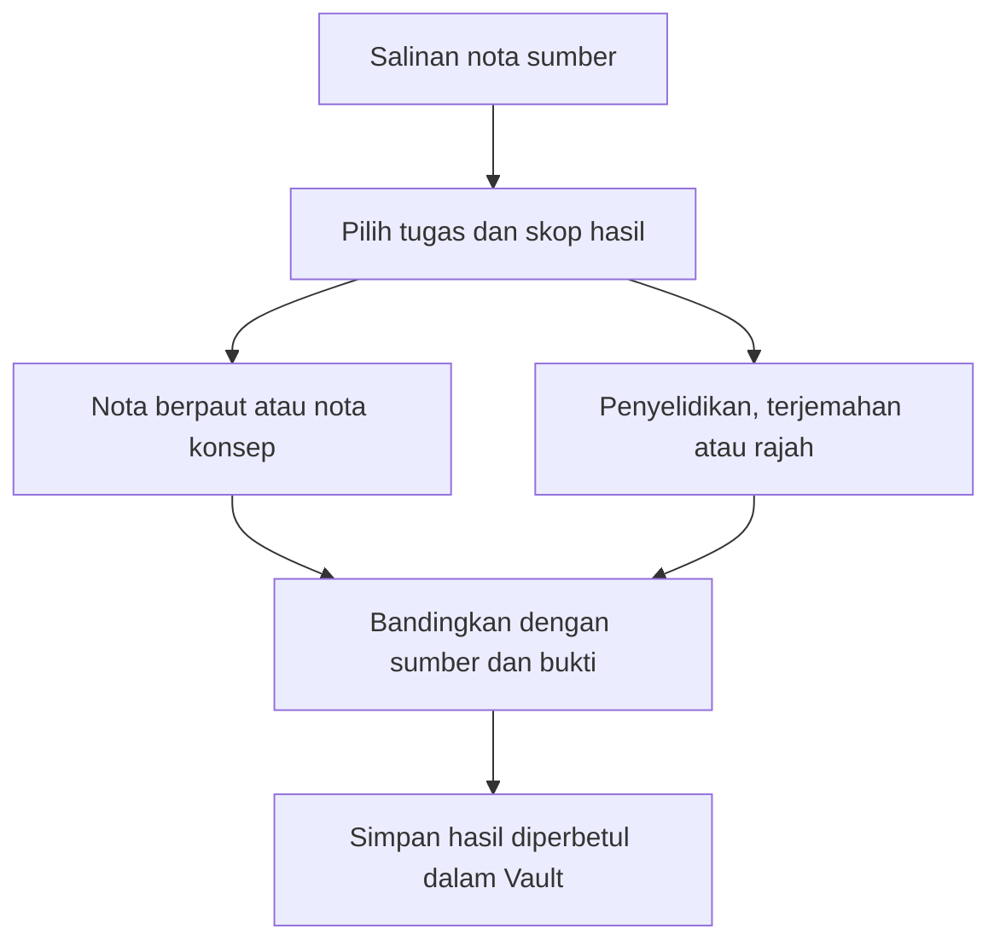

import TLDR from '@site/src/components/TLDR';

# Panduan pengurusan pengetahuan AI Obsidian

<TLDR>Aliran pengetahuan berguna membezakan sumber, hasil model dan pembetulan anda. Notemd menyediakan tugas pautan, ekstraksi, penyelidikan, terjemahan serta rajah yang menulis fail boleh disemak. Mulakan dengan satu sumber, sahkan hasil, kemudian automasikan folder berskop.</TLDR>

## Tentukan hasil

Pilih artifak diperlukan: nota bacaan berpaut, set konsep, ringkasan bersumber, terjemahan atau rajah. Lebih banyak fail/pautan tidak terus meningkatkan kefahaman atau dapatan. Tentukan cara menyemak ketepatan dan mencari bahan kemudian.

## Aliran lengkap


```mermaid
flowchart TD
    A[Salinan nota sumber] --> B[Pilih tugas dan skop hasil]
    B --> C[Nota berpaut atau nota konsep]
    B --> D[Penyelidikan, terjemahan atau rajah]
    C --> E[Bandingkan dengan sumber dan bukti]
    D --> E
    E --> F[Simpan hasil diperbetul dalam Vault]
```

Ini tugas tersedia, bukan dakwaan satu butang lalai melakukan semua langkah. Kekalkan sumber dan periksa destinasi setiap tugas sebelum menyusun aliran.

## 1. Pautan wiki: jelaskan hubungan

Jalankan **Process file (add links)** pada nota ujian. Periksa `_processed.md` di sebelahnya mengikut lalai. Semak sama ada istilah dicadangkan berguna sebagai sasaran navigasi dan petikan, kod serta persamaan kekal setia.

Arahan pembelajaran tertumpu dan penindasan sinonim boleh membimbing model. Ia tidak menguatkuasakan kesetaraan tepat atau ambang keserupaan bernombor. Gunakan padanan tajuk deterministik jika hasil boleh ulang terhadap nama sedia ada paling utama.

[Panduan pautan wiki](./features/wiki-links)

## 2. Nota konsep: asingkan istilah dan huraian

Pilih folder sebelum ekstraksi. Ekstraksi kendiri mencipta tajuk sahaja secara lalai dan mengekalkan sumber. Aktifkan pautan balik serta matikan templat minimum untuk `Linked From` dalam nota kendiri baharu.

Ekstraksi dan penjanaan huraian ialah operasi berasingan. **Batch generate from titles** boleh mengisi nota layak yang sudah ada serta nota baharu dalam folder konsep pilihan. Gunakan folder khusus semasa ujian dan semak pemindahan ke folder complete dilaporkan.

Semakan pendua menggunakan heuristik nama fail. Sahkan calon sebelum membuang; nama serupa boleh mewakili konsep teknikal berbeza.

[Panduan nota konsep](./features/concept-notes)

## 3. Penyelidikan: kekalkan jejak bukti

Pilih topik atau gunakan tajuk nota aktif, pilih Tavily/DuckDuckGo dalam tetapan dan jalankan **Research & summarize**. Kunci Tavily tiada tidak memilih DuckDuckGo automatik. Buka URL dan sahkan dakwaan utama ringkasan yang ditambah.

Dapatan setempat pilihan boleh membekalkan petikan berskop. Indeks semasa leksikal dan petikan dihantar kepada LLM tugas. Indeks setempat tidak bermakna seluruh laluan penyelidikan luar talian atau terhad kepada peranti.

[Panduan penyelidikan](./features/research)

## 4. Terjemahan: semak makna dan struktur

Pilih bahasa dan jalankan terjemahan fail. Nama lalai berakhir `_<language>.md`; destinasi sedia ada boleh ditulis ganti. Untuk satu petikan, salin ke nota sementara dahulu.

Bandingkan istilah, nombor, kod, pautan dan notasi matematik dengan sumber. Nota panjang dipecah, maka konteks antara cebisan boleh hilang. 21 bahasa UI dan 34 laluan laman tidak membuktikan mutu mana-mana pasangan terjemahan.

[Panduan terjemahan](./features/translation)

## 5. Rajah: pilih artifak boleh sunting

Pilih jenis dan format sumber serasi. Semak pratonton, simpan sumber serta SVG, PNG atau PDF disokong yang diperlukan. Imej terpapar bukan bukti editor lain mengekalkan setiap hubungan semantik.

Gunakan katalog pemilih disokong. CircuitikZ terhad dan kompilasi natif mempunyai semakan persekitaran sendiri. Anak panah rentas cabang statik Drawnix tidak menjamin keterikatan selepas susun semula. Pembaikan jadual PowerPoint meningkatkan hasil natif, sementara Mermaid/SVG masih boleh menggunakan imej gantian.

[Panduan rajah](./features/diagrams)

## 6. Aliran kerja: automasikan urutan disahkan

Aliran menggunakan nama, `::` dan ID dipisahkan `>`. Lalainya:

```text
One-Click Extract::process-current-add-links>batch-generate-from-titles>batch-mermaid-fix
```

Ia menambah pautan, menjana tajuk folder dan membaiki Mermaid. Tiada langkah umum penyelidikan atau penjanaan rajah ditambah. Setiap tindakan mengekalkan prasyarat/hasil; ini bukan paip teks sewenang-wenangnya.

Dasar ralat lalai berhenti pada kegagalan dilaporkan. Teruskan hanya jika langkah kemudian boleh menggunakan input tinggal. Pembatalan mengekalkan hasil selesai dan bukan pengunduran.

[Panduan aliran kerja](./features/workflows)

## 7. Penyedia LLM: padankan protokol dan beban kerja

36 pratetap merangkumi lima keluarga protokol. Pilih mengikut titik akhir, akses model, dasar data dan hasil terukur. Uji sumber/prompt sama sebelum membandingkan kelajuan atau kos.

Penghalaan penyedia/model khusus tugas dimatikan secara lalai. Aktifkan apabila memang mahukan profil berbeza antara tugas, dan semak setiap tugas aktif sebelum menganggap aliran setempat.

[Gambaran penyedia](./providers/overview)

## Senarai semak permulaan

1. Pasang Notemd dan sandarkan sumber.
2. Sediakan serta uji penyedia/model tepat.
3. Pilih folder konsep dan destinasi berbeza.
4. Jalankan satu tugas pada salinan nota.
5. Bandingkan dengan sumber dan simpan pembetulan.
6. Luaskan ke folder kecil serta semak hasil separa sebelum aliran lebih panjang.

## Corak lazim

### Memproses kertas penyelidikan

Tukar kertas ke Markdown boleh baca dengan alat luaran sesuai, kemudian semak ralat formula, rajah dan jadual dahulu. Ekstrak konsep atau petikan, selidik soalan pilihan dan hasilkan rajah hanya apabila menjelaskan hubungan boleh sah. Kekalkan pautan kertas asal dan pembetulan.

### Menjaga koleksi konsep

Gunakan folder khusus, semak istilah selepas ekstraksi dan jana huraian bagi subset yang dipilih dengan sengaja. Sandarkan sebelum pembersihan pendua. Banyak konsep tidak menggantikan definisi tepat serta navigasi berguna.

### Mengendalikan bahan peribadi

Gunakan pelayan setempat dengan model/kebergantungan sudah dipasang, semak penghalaan khusus tugas dan elakkan penyelidikan rangkaian apabila luar talian diperlukan. Periksa diagnostik sebelum berkongsi. Alamat gelung balik lalai tidak menghalang profil ditetapkan ke pelayan jauh.

### Memulihkan kelompok terganggu

Tunggu pembatalan/kegagalan stabil. Baca laporan, periksa hasil selesai dan pemulihan, bandingkan konflik, lalu ulang hanya kerja dimaksudkan. Status batal tidak bererti tiada hasil; jangan padam pendamping tanpa menyemak rujukan.

## Seterusnya

- [Mula pantas](./getting-started/quick-start): selesaikan tugas pertama.
- [Pemprosesan kelompok](./advanced/batch-processing): pemilihan dan pemilikan hasil.
- [Panduan pembangun](./developers/overview): perluas dan sahkan pelaksanaan.
- [Panduan Agent](./agents/overview): temui kontrak awam sebenar.
