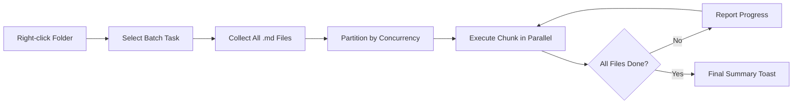

import TLDR from '@site/src/components/TLDR';

# Batchverwerking

<TLDR>
**Notemd verwerkt hele mappen in één actie met instelbare paralleliteit en controle over overschrijven.** Klik met de rechtermuisknop op een map om wiki-links in bulk toe te voegen, concepten te extraheren, onderzoek uit te voeren of alle notities binnenin te vertalen. Paralleliteitsbeperkingen voorkomen API fouten door snelheidsbeperkingen. Er wordt verslag gedaan van de voortgang per bestand. Het gedrag bij overschrijven is instelbaar: bestaande bestanden negeren, toevoegen of vervangen. Foutieve bestanden worden geregistreerd zonder dat de batch wordt afgebroken.

Dit maakt deel uit van de [Obsidian AI Knowledge Management Guide](/docs/pillar-ai-knowledge).
</TLDR>

## Overzicht

Batchverwerking zet een map met notities om in één enkele actie. In plaats van elke notitie apart te openen en commando’s uit te voeren, klikt u met de rechtermuisknop op de map en kiest u de taak. Notemd loopt door elk `.md` bestand, past de gekozen actie toe en rapporteert de voortgang in real time.

Deze functie is essentieel voor het extraheren van kennis in een hele vault. Na het importeren van tientallen PDFs, bijvoorbeeld door eerst links in bulk toe te voegen en daarna concepten in bulk te extraheren, wordt uw kennisgrafiek binnen minuten opgebouwd in plaats van uren.

## Hoe het werkt

### Batchuitvoermodel

1. **Bestandverzameling** -- Notemd scannt de doelmap recursief (of alleen op topniveau, afhankelijk van de instellingen) en verzamelt alle `.md` bestanden.
2. **Paralleliteitsindeling** -- Bestanden worden in groepen verdeeld op basis van de `batchConcurrency` instelling. Elke groep wordt parallel uitgevoerd; groepen worden sequentieel uitgevoerd.
3. **Uitvoering** -- Elk bestand wordt verwerkt met dezelfde logica als het commando voor één bestand. De instellingen van de provider en het model per taak worden gerespecteerd.
4. **Voortgangsrapportage** -- Na elke voltooide bestand wordt een toastnotificatie bijgewerkt die de `N / Total` voortgang weergeeft.
5. **Foutbeheer** -- Als een bestand faalt (API fout, netwerkvertraging, etc.), wordt de fout geregistreerd en gaat de batch door. De eindsamenvatting geeft een lijst van alle gefaalde bestanden.
6. **Afsluiting** -- Een samenvattende toastnotificatie rapporteert het totale aantal verwerkte bestanden, successen en fouten.

### Overgietgedrag

Bij het verwerken van een bestand dat al wiki-links, conceptnotities of vertalingen bevat, hangt het gedrag van Notemd af van de overgietinstelling:

| Modus | Gedrag |
|------|----------|
| **Sla over** | De bestaande inhoud blijft onveranderd. Alleen ongewijzigde bestanden worden verwerkt. |
| **Voeg toe** (standaard) | Nieuwe inhoud wordt toegevoegd. Bestaande wiki-links, concepten of vertalingen blijven behouden. |
| **Vervang** | Het bestand wordt volledig opnieuw verwerkt. Alle eerdere Notemd wijzigingen worden overgeschreven. |

Voor wiki-linking in het bijzonder: als een notitie al `[[wiki-links]]` bevat, laat de **sla over**-modus deze ongemoeid, terwijl **vervang** de hele notitie naar LLM stuurt voor een nieuwe linkinvoeging. Gebruik **sla over** voor incrementele verwerking en **vervang** voor opnieuw verwerken na een modelupdate.

### Concurrentiekontrol

De `batchConcurrency` instelling beperkt de parallelle API oproepen. Dit voorkomt rate-limit fouten (HTTP 429) bij het verwerken van grote mappen bij providers met strenge quotumgrenzen.

| Concurrentie | Aanbevolen voor | Typische impact op rate-limiting |
|-------------|----------------|---------------------------|
| `1` | Gratis niveaus, strenge aanbieders | Geen (serieel) |
| `3` (standaard) | De meeste cloudaanbieders | Laag |
| `5` | Ollama (lokaal), ruime niveaus | Geen / Laag |
| `10` | Lokale modellen met snelle inferentie | Geen |

Als u tijdens batchverwerking 429-fouten tegenkomt, verlaag de paralleliteit tot 1 of 2.

## Configuratie

| Instelling | Standaard | Effect |
|---------|---------|--------|
| `batchConcurrency` | `3` | Maximaal parallelle API oproepen tijdens mapoperaties |
| `batchOverwriteExisting` | `false` | Bestaande Notemd inhoud overschrijven. `false` = toevoegingsmodus. |
| `batchSkipProcessed` | `false` | Bestanden negeren die al Notemd markers bevatten (bijv. wiki-links) |
| `batchRecursive` | `true` | Ondermappen meenemen bij het scannen van de map |
| `enableStableApiCall` | `false` | Herprobeerlogica inschakelen (tot 4 pogingen) per bestand tijdens batchverwerking |

### Per-Task Modellen in Batch

Elke batchoperatie maakt gebruik van het overeenkomstige per-task model. Batch-add-links gebruikt `addLinksProvider`, batch-research gebruikt `researchProvider`, enzovoort. Dit betekent dat u goedkope modellen kunt toewijzen voor grote volumes en dure modellen kunt reserveren voor taakken waar kwaliteit belangrijk is.

## Voorbeeld

U heeft een map `papers/` met 40 geïmporteerde onderzoeksnotities. U wilt wiki-links toevoegen en concepten uit al deze notities extraheren:

1. Rechtsklik op de `papers/` map
2. Kies **"Notemd: Map verwerken (links toevoegen)"**
3. Notemd scannen de map, vindt 40 `.md` bestanden en verwerkt er 3 tegelijk (standaard paralleliteit)
4. Een voortgangstoast toont: `12/40 files processed...`
5. Na ongeveer 3 minuten rapporteert een samenvattende toast: `39 succeeded, 1 failed (API timeout on paper-37.md)`
6. Herhaal dit met **"Notemd: Map verwerken (concepten extraheren)"** om conceptnotities voor alle 40 te maken

Het enige mislukte bestand wordt geregistreerd. U kunt later op dat ene bestand alleen opnieuw uitvoeren.

## Tips

- **Begin met lage paralleliteit** -- Als u niet zeker bent van de snelheidsbeperkingen van uw provider, begin dan met `1` en verhoog deze geleidelijk.
- **Gebruik skip-modus voor incrementele updates** -- Na de eerste volledige batch schakel u over op `batchSkipProcessed: true` zodat alleen nieuwe notities bij volgende uitvoeringen worden verwerkt.
- **Activeer stabiele API oproepen** -- `enableStableApiCall: true` voegt herhalingslogica toe die herstelt van tijdelijke netwerkfouten tijdens lange batches.
- **Uitvoer opnieuw na modelupdates** -- Als u overstapt op een beter model, stel `batchOverwriteExisting: true` in en uitvoer opnieuw om verbeterde links en concepten te verkrijgen.

---

## Volgende stappen

- [Workflows](/docs/features/workflows) -- Combineer batchtaken tot één-klikknoppen in de zijbalk
- [Custom Prompts](/docs/advanced/custom-prompts) -- Pas prompts aan voor batchextractie
- [Troubleshooting](/docs/advanced/troubleshooting) -- Verhelp snelheidsbeperkingsfouten en verbindingproblemen tijdens batchuitvoeringen
- [LLM Providers](/docs/providers/overview) -- Referentie voor configuratie van het per-taakmodel
