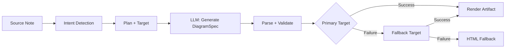
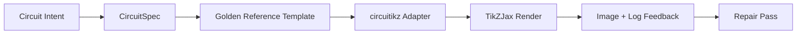

import TLDR from '@site/src/components/TLDR';

# Diagrammen

<TLDR>
**Notemd genereert diagrammen uit je notities via een spec-first pipeline.** De LLM levert een renderer-agnostisch `DiagramSpec` JSON op, waarna gespecialiseerde adapters dit omzetten in Mermaid, JSON Canvas, Vega-Lite, HTML of bewerkbare HTML/SVG uitvoer. Er wordt ondersteuning geboden voor 8 intentietypen, automatische fallbackketens, live preview met SVG/PNG export, semantische verificatie en generatie aangevuld met lokale kennis.
</TLDR>

Dit maakt deel uit van de [Obsidian AI Knowledge Management Guide](/docs/pillar-ai-knowledge).

## Architectuur: Spec-First Pipeline

Notemd vraagt nooit aan de LLM om rechtstreeks Mermaid/Vega/Canvas syntaxis te genereren. In plaats daarvan:



**Waarom spec-first?** LLM’s genereren vaak ongeldige renderer-syntaxis (Mermaid in het bijzonder). Een gestructureerd `DiagramSpec` kan vóór renderen worden gevalideerd, en dezelfde spec kan als fallback dienen voor meerdere renderers.

## Ondersteunde diagramtypen

| Intent | Primair renderer | Fallbacks | Gebruiksgeval |
|--------|-----------------|-----------|----------|
| `mindmap` | Mermaid | HTML | Hiërarchische onderverdeling van onderwerpen |
| `flowchart` | Mermaid | HTML | Process flows, besluitbomen |
| `sequence` | Mermaid | HTML | Client-server interacties, protocollen |
| `classDiagram` | Mermaid | HTML | OOP klassenrelaties |
| `erDiagram` | Mermaid | HTML | Database-schema's, entiteitsrelaties |
| `stateDiagram` | Mermaid | HTML | Toestandsmachines, levenscyclusmodellen |
| `canvasMap` | JSON Canvas | Mermaid → HTML | Conceptkaarten, kennisgraphen |
| `dataChart` | Vega-Lite | Mermaid → HTML | Staven, lijnen, gebieden, verspreide punten, piecharts, tabellen |

## Intent Detectie

Notemd bepaalt op basis van woordscoren de beste diagramtype uit de inhoud van je notitie:

| Intent | Triggers | Confidence |
|--------|----------|------------|
| `dataChart` | Tabellen, numerieke cellen, sleutelwoorden voor metrieken/trends, percentages | 0.88 |
| `sequence` | Vraag/antwoordvocabulaire (4+ overeenkomsten) of `->`/`=>` markers | 0.82 |
| `erDiagram` | Primair sleutel, externe sleutel, entiteit, schema (2+ overeenkomsten) | 0.80 |
| `stateDiagram` | Toestand, overgang, in afwachting, actief, mislukt (3+ overeenkomsten) | 0.76 |
| `flowchart` | Genummerde stappen (2+) of if/then/else/workflow vocabulaire | 0.74 |
| `canvasMap` | Conceptkaart, kennisgraaf, ruimtelijk, cluster | 0.72 |
| `mindmap` | Default fallback | 0.55 |

Overtuig met de **Preferred diagram type**-instelling, de selector in de zijbalk of een expliciete optie in het commandopalette.

## Selectie van renderdoel

De experimentele spec-first pipeline heeft nu twee onafhankelijke controles:

| Control | Instelling | Effect |
|---------|---------|--------|
| Preferred diagram type | `preferredDiagramIntent` | Stuurt de semantische vorm van de gegenereerde `DiagramSpec` aan |
| Preferred render target | `preferredDiagramRenderTarget` | Kiest de renderer voor **Generate diagram** en **Preview diagram** |

Stel **Preferred render target** in op **Auto** voor de standaard planner, of kies expliciet Mermaid, JSON Canvas, Vega-Lite, HTML of Editable HTML/SVG. De override is alleen van toepassing op artifact- en preview-commando's. Het standaardcommando **Summarise as Mermaid diagram** blijft gekoppeld aan Mermaid-compatibele uitvoer zodat bestaande Markdown-workflows niet stilletjes van formaat wisselen.

Deze scheiding is belangrijk omdat een `flowchart`-intent nu kan worden weergegeven als Mermaid voor Markdown-notities, HTML voor een betrouwbare fallback, of Editable HTML/SVG voor verdere bewerking. Draw.io en Drawnix blijven CLI-artikelformaatexporteurs in plaats van renderdoelstellingen binnen de plugin.

## Gebruik

### Een diagram genereren

1. Een notitie openen
2. Voer **"Notemd: Generate diagram"** uit uit het commandopalette
3. Notemd detecteert de intentie, genereert de specificatie, rendert en slaat het artifact op

**Uitvoerbestanden per doel:**

| Doelwit | Extensie | Patroon bestandsnaam |
|--------|-----------|------------------|
| Mermaid | `.md` | `{note}_summ.md` |
| JSON Canvas | `.canvas` | `{note}_diagram.canvas` |
| Vega-Lite | `.json` | `{note}_diagram.json` |
| HTML | `.html` | `{note}_diagram.html` |
| Editabel HTML/SVG | `.html` | `{note}_diagram.html` |

### Voorbeeld van een diagram bekijken

1. Uitvoeren **"Notemd: Voorbeeld diagram bekijken"**
2. Een modaal venster wordt geopend met het weergegeven diagram
3. Exporteer als SVG of PNG met behulp van de knoppen op het werkbalk

**Automatisch voorbeeld openen** is beschikbaar in de instellingen — na generatie wordt het voorbeeldmodaal venster automatisch geopend.

Het voorbeeldmodaal venster heeft ook een paneel voor diagnostiek van artefacten. Renderers en smoke checks kunnen `RenderArtifact.diagnostics` toevoegen; het venster toont een samenvatting van de diagnostiek met tellers voor fouten/waarschuwingen/informatie, gevolgd door ernst, type diagnostiek, bericht en reparatieadvies naast het voorbeeld. Dezelfde samenvatting wordt weergegeven in de historische voorbeeldingen, zodat herhaalde circuitikz smoke-pogingen vergeleken kunnen worden zonder elke ingang te openen. Voor artefacten die broninhoud hebben maar niet inline of via de HTML iframe-path kunnen worden gerenderd, valt het venster nu terug op een voorbeeld alleen van de bron in plaats van een lege iframe af te dwingen. Dit biedt circuitikz compile/render smoke, SVG tekst-token checks, PNG-blank-schermopnames checks en toekomstige overlaprapporten een zichtbare UI oppervlakte zonder TikZJax of LaTeX als harde plugin-runtimeafhankelijkheid te maken of te doen alsof brontekst een geverifieerde visuele weergave is.

### Legendarische Mermaid Modus

Wanneer `enableExperimentalDiagramPipeline` uitstaat, stuurt Notemd een directe Mermaid opdracht naar de LLM. Dit omzeilt volledig de spec-pijplijn. Als de experimentele pijplijn faalt, valt het terug op deze modus.

## Rendering-backend

### Mermaid

6 adapters (mindmap, flowchart, sequence, ER, class, state) vertalen `DiagramSpec` naar Mermaid syntaxis. Na generatie valideert `mermaid.parse()` de uitvoer. Als de validatie mislukt:

1. **LLM opnieuw proberen** — één poging met het Mermaid foutbericht als context
2. **Minimalistische fallback** — een eenvoudig Mermaid diagram gebaseerd op spec-node IDs

**Legacy Mermaid Fixer** repareert automatisch veelvoorkomende LLM syntaxisfouten: normalisatie van note-directieven, ontsnapping van pipe-labels, herpositionering van semicolons, smart quotes, dubbele streepjespijlen, vormmismatches en nog veel meer.

### JSON Canvas

Genereert een Obsidian JSON Canvas formaat met ruimtelijke indeling:
- Knopen worden geplaatst op basis van diepte (x = diepte × 420) en index (y = index × 170)
- De breedte wordt geschat op basis van de lengte van de label.
- Randen bevatten `fromSide: 'right'`, `toSide: 'left'`, `toEnd: 'arrow'`

### Vega-Lite

Maakt complete Vega-Lite v5 JSON specificaties aan met automatische encoding:
- **Cartesiaanse grafieken** (staaf/lijn/vlak/punt/scatter): x + y kanalen + kleur voor meerdere series
- **Pie**: theta = y (kwantitatief), kleur = x (nominaal)
- **Tabel**: rij = x, tekst = y + kolom = serie

Donkere en lichte thema’s worden diep gecombineerd voordat ze worden gecompileerd.

### HTML

Universele fallback. Zelfstandig HTML document met:
- CSP meta‑headers
- Licht/donker mode via `prefers-color-scheme`
- Gelokaliseerde UI labels voor 20 talen
- Secties: hero, structuur (node‑boom), relaties, callouts, tabellen met gegevensseries

### Editeerbaar HTML/SVG

Duidelijke doelwaarde voor bewerkbare exportwerkflows. Het projecteert `DiagramSpec` naar een deterministisch `SemanticFigureModel` en genereert vervolgens een zelfstandig HTML document met inline SVG groepen die Draw.io-stijl annotaties bevatten:

- `data-drawio-type`, `data-drawio-id` en `data-drawio-role` op semantische knopen
- `data-drawio-source` en `data-drawio-target` op semantische randen
- stabiele knoop/randidentificatoren na normalisatie van witruimte en afhandeling van conflicten
- geen scripts, geen externe schriften en geen externe assets

Deze doelwaarde is nog niet opzettelijk de standaardplannerroute. Het is beschikbaar als een expliciete renderdoelwaarde zolang het productpad het bewerkingsgedrag in echte tools bewijst.

### Draw.io en Drawnix Exportgrenzen

De huidige implementatie houdt de ondersteuning van derdeneditoren bij de artifactgrens:

| Doelwit | Contract | Runtijdafhankelijkheid |
|--------|----------|--------------------|
| Draw.io | deterministisch ongecomprimeerd `mxfile` XML afkomstig van `SemanticFigureModel` | niets in de plugin-runtijd of CI |
| Drawnix | minimalistisch `.drawnix` JSON subset met `geometry` en `arrow-line` elementen | niets in de plugin-runtijd of CI |

De afweging is bewust: Notemd kan zichtbare labels, stabiele IDs en ondersteunde primitieve dekking controleren zonder diagram.net Desktop, Drawnix, Plait of alleen-browser editorstatus in de plugin op te nemen.

### circuitikz / TikZJax Richting

Schematische circuits vormen niet hetzelfde probleem als algemene flowcharts. De juiste syntaxisdoelstelling voor elektrische circuits is meestal **circuitikz**, weergegeven in Obsidian via plugins zoals TikZJax. TikZJax kan pakketten zoals `circuitikz`, `pgfplots`, `tikz-cd` en `chemfig` laden, waardoor het aantrekkelijk is voor notities over natuurkunde, circuits, scheikunde en wiskunde.

Het risico is dat ruwe TikZ-bestanden die door LLM worden gegenereerd broos zijn:

- Een complexe circuittopologie kan elektrisch correct zijn, maar visueel onleesbaar zijn;
- Overlappende draden en labels kunnen ervoor zorgen dat een correct netlist niet bruikbaar is voor studienotities;
- Ontbrekende pakketpreambules, verkeerde ankers of ongeldige componentennamen kunnen de weergave belemmeren;
- Feedback van de renderer is meestal op afbeeldingsniveau, terwijl LLM tekstgerichte geometrie genereert.

Een betere architectuur is om circuitikz te behandelen als een beperkt diagramdoel, en niet als een vrije prompt:



Het eerste-klasse model moet de circuittopologie en het lay-out apart beschrijven:

| Laag | Verantwoordelijkheid | Voorbeeld |
|-------|----------------|---------|
| Topologie | elektrische knopen en componentverbindingen | `VDD -> RD -> drain(M1)`, `source(M1) -> GND` |
| Lay-out | positie op een raster, oriëntatie, routingbanen | `M1 at (3,2.2)`, invoer links, uitvoer rechts |
| Stijl | pakket, spanningconventie, labels, ankers | `\begin{circuitikz}[american voltages]` |
| Validatie | compilatielog, ontbrekende ankers, overlap/screencastcontroles | TikZJax/LaTeX-diagnoses plus visuele beoordeling |

### Huidige circuitikz prototype

Notemd bevat nu het eerste beperkte repository-prototype voor deze richting. Het is opzettelijk offline en gebonden aan een sjabloon:

```bash
npm run diagram:export-circuitikz -- --input cmos-inverter.json --output cmos-inverter.tex
```

Het prototype voegt een apart `CircuitSpec`-grensgebied en een deterministische exporter toe voor zes gouden referentiefamilies:

| Circuittype | Gouden referentie | Stroomgarantie |
|--------------|------------------|-------------------|
| `common-source-amplifier` | `common-source-nmos-v1` | valideert `VDD -> R_D -> M1.D`, `vin -> M1.G`, `M1.S -> GND` en `M1.D -> vout` voordat LaTeX wordt geschreven |
| `cmos-inverter` | `cmos-inverter-v1` | valideert PMOS-over-NMOS-topologie, gedeelde poortinvoer, gedeelde drainuitvoer, `VDD -> MP.S` en `MN.S -> GND` voordat LaTeX wordt geschreven |
| `cmos-buffer` | `cmos-buffer-v1` | valideert twee gekaskadeerde inverterstappen, tussennode `vmid`, herstelde `vout` en gedeelde VDD/GND-leidingen voordat LaTeX wordt geschreven |
| `cmos-transmission-gate` | `cmos-transmission-gate-v1` | valideert parallelle PMOS/NMOS-passapparaten tussen `vin` en `vout` met complementaire `phib` / `phi`-controles voordat LaTeX wordt geschreven |
| `cmos-nand2` | `cmos-nand2-v1` | Controleert de parallelle PMOS pull-up, seriële NMOS pull-down, dubbele invoeren `va` / `vb` en `vout` voordat LaTeX wordt geschreven |
| `cmos-nor2` | `cmos-nor2-v1` | Controleert de seriële PMOS pull-up, parallele NMOS pull-down, dubbele invoeren `va` / `vb` en `vout` voordat LaTeX wordt geschreven |

Dit is nog geen algemene TikZ generator. Het compileert geen LaTeX, roept TikZJax niet op, inspecteert geen screenshots of voert geen geautomatiseerde afbeeldingsherstelacties uit. Die functies komen later.

De Preview diagram commando kan direct opgeslagen circuitikz bronbestanden openen wanneer de bestandsextensie `.tex` of `.tikz` is en de bron `\usepackage{circuitikz}` of `\begin{circuitikz}` bevat. Die route is een circuitikz bron-gebaseerde preview: het venster toont de bron, diagnostiek, kopieer/sla op controls en historische metadata, maar compileert geen LaTeX of roept TikZJax niet op tijdens de plugin‑uitvoering.

Dezelfde bron-gebaseerde preview omvat nu ook opgeslagen Draw.io en Drawnix bestanden. `.drawio` bestanden worden geaccepteerd wanneer ze op Draw.io XML (`mxfile` of `mxGraphModel`) lijken, en `.drawnix` bestanden wanneer ze Drawnix JSON zijn met `type: "drawnix"` en een `elements` array. De plugin embedt nog steeds geen diagrams.net of de Drawnix whiteboard host; deze previews tonen bron, diagnostiek en artifact‑geschiedenis zonder een in‑plugin visuele editor.

Voor herstel dat de topologie behoudt, moet de spec voor het herstel als referentie worden doorgegeven voordat een gerepareerd kandidaat wordt geaccepteerd:

```bash
npm run diagram:export-circuitikz -- --input repaired-cmos-inverter.json --topology-reference cmos-inverter.json --output cmos-inverter.tex
```

De herstelguard gebruikt `createCircuitTopologySignature` en `assertCircuitTopologyUnchanged` om `circuitKind`, `goldenReferenceId`, netwerken, component‑ids/typen/terminals en ongerichte verbindingseinden te vergelijken voordat er output wordt gegeven. Etiketten, titeltekst, layouthints, verbindingsschema en verbindingsetiketten worden opzettelijk genegeerd. Een kandidaat die een terminal toevoegt of opnieuw verbindt faalt met `Circuit topology drift detected` voordat het `.tex` bestand wordt geschreven.

De CLI kan nu een bestaand LaTeX/TikZJax compile‑log analyseren zonder een compiler uit te voeren:

```bash
npm run diagram:export-circuitikz -- --input cmos-inverter.json --output cmos-inverter.tex --compile-log cmos-inverter.log --diagnostics-output cmos-inverter.diagnostics.json
```

Deze diagnostische route rapporteert ontbrekende pakketten zoals `circuitikz.sty`, onbekende TikZ/circuitikz sleutels, TikZ‑sintaxisfouten zoals ontbrekende komma’s, onbalansseerde haakjes of onafgesloten etiketten, ongedefinieerde controlevolgorden, algemene LaTeX‑fouten, noodstoppen en adviesmeldingen over een overvolle `\hbox`. Het blijft log‑gebaseerd: lokale LaTeX/TikZJax uitvoering en screenshot‑kwaliteitscontroles zijn nog aparte toekomstige taken.

Voor onderhouds‑smoke checks kan dezelfde CLI optioneel een expliciet gedefinieerde renderer uitvoeren zonder shell‑commandoparsing:

```bash
npm run diagram:export-circuitikz -- --input cmos-inverter.json --output cmos-inverter.tex --compile-executable pdflatex --compile-arg -interaction=nonstopmode --compile-arg -halt-on-error --compile-arg -output-directory={outputDir} --compile-arg {tex} --expected-artifact {outputDir}/{jobName}.pdf
```

De compile‑runner gebruikt `shell: false`, vervangt `{tex}`, `{outputDir}` en `{jobName}` placeholders door argument‑array‑waarden, leest het gegenereerde `{jobName}.log` en geeft `compileExecution` plus `compileDiagnostics` terug in de CLI JSON output. `--compile-executable` is alleen het renderer‑binary of wrapper‑pad; renderer‑flags horen bij herhaalde `--compile-arg` waarden. Lege uitvoerbaar bestanden falen als `compile-executable-invalid`, ontbrekende binaries falen als `compile-executable-not-found`, en uitvoerbaar strings in shell‑commandovorm krijgen advies om argumenten op te splitsen zodat Windows, Linux en macOS dezelfde directe‑uitvoercontract naleven. Met `--expected-artifact` wordt ook `compileExecution.renderSmoke` gerapporteerd en faalt de CLI wanneer de renderer geen niet‑lege artifact maakt. De plugin embedt nog steeds geen LaTeX, maakt TikZJax geen plugin‑runtime‑afhankelijkheid of voert geen screenshot‑niveau visueel herstel uit.

Als het verwachte artifact `.svg` is, gaat de smoke check een stap dieper:

```bash
npm run diagram:export-circuitikz -- --input cmos-inverter.json --output cmos-inverter.tex --compile-executable dvisvgm --compile-arg ... --expected-artifact {outputDir}/{jobName}.svg --expected-svg-text v_{in} --expected-svg-text v_{out}
```

SVG smoke controleert de `<svg>` wortel, positieve dimensies of `viewBox`, ten minste één zichtbaar teken na uitsluiting van verborgen/transparante elementen, eventuele gevraagde teksttokens, duidelijke elementen buiten de `viewBox`, duidelijk overlappende gepositioneerde `<text>` / `<tspan>` etiketten en duidelijke tekstetiketten die overlappen met tekeningen via `render-svg-label-overlap`. Verwachte tekst wordt gezocht in zichtbare tekst en gedecodeerde toegankelijkheidsmetadata zoals `aria-label`, `<title>` en `<desc>`, zodat renderers die semantische etiketten buiten het zichtbare `<text>` behouden nog steeds teksttoken‑smoke kunnen voldoen zonder OCR. De geometrie‑check is nu transform‑bewust voor algemene groep- en element‑`transform` attributen, zodat vertaalde, geschaalde, geroteerde, vervormde of matrix‑getransformeerde SVG boxes na transformatiecompositie worden gecontroleerd. Het omvat exacte bogenbundels voor A/a‑boogextrema, exacte Bezier‑curvebundels voor C/S/Q/T‑curveextrema, stroke‑width‑bewuste SVG bundels en etiketten‑overlapchecks, `polyline` / `polygon` tekeningen‑geometrie, en lost ook path‑only glyph‑plaatsing op uit `<use href="#...">` referenties zodat etiketten die naar herbruikbare glyph‑paths worden omgezet nog steeds kunnen falen bij bounded‑canvas‑checks wanneer de geplaatste glyph‑geometrie de `viewBox` overschrijdt. Meerdere gepositioneerde `tspan` etiketten onder één `<text>` ouder worden vergeleken als aparte etiketten‑boxes, waardoor LaTeX‑stijl SVG output dat anders verschillende etiketten zou samenvoegen in één tekstnode wordt opgepakt. Gepositioneerde SVG `text` en `tspan` boxes respecteren `text-anchor` waarden `start`, `middle` en `end`, zodat gecentreerde en rechts uitgelijnde etiketten tekst/text‑en etiketten‑vs‑tekening overlap‑diagnostiek kunnen triggeren zonder browser‑grade tekstlayout te vereisen. Definitie‑only glyph‑paths binnen `<defs>` worden niet als zichtbare tekeningen gerekend, maar hun eigen definitie‑lokaal `transform` attributen worden toegepast voordat `<use>` plaatsing plaatsvindt, zodat geschaalde of gereflecteerde glyph‑definities niet ondergeteld worden. De etiketten‑vs‑tekening check gebruikt een kleine tolerantie voor tekenings‑boxes en de gedeclareerde `stroke-width`, zodat dunne draden, dikke draden en polygonale component‑contouren allemaal als potentiële etiketten‑leesbaarheidsfouten kunnen worden beschouwd wanneer hun zichtbare stroke een etiket bereikt. Path‑only glyph‑etiketten die uit `<use href="#...">` worden opgelost, worden ook vergeleken met tekenings‑boxes en falen met `render-svg-path-glyph-overlap` wanneer herbruikbare glyph‑geometrie draden of componenten overlapt. Als een renderer etiketten omzet in herbruikbare path‑glyphs in plaats van zoekbare `<text>` en geen toegankelijkheidsmetadata behoudt, noteert het smoke‑rapport `pathOnlyGlyphUseCount` en faalt het gevraagde teksttoken via `render-svg-text-path-only` in plaats van te doen alsof het etiket simpelweg afwezig is. Andere fouten worden gerapporteerd via `render-svg-invalid`, `render-svg-dimension-missing`, `render-svg-no-visible-elements`, `render-svg-text-missing`, `render-svg-out-of-bounds`, `render-svg-text-overlap`, `render-svg-label-overlap` of `render-svg-path-glyph-overlap`. Teksttoken‑ en overlapchecks moeten alleen als structurele smoke worden beschouwd voor renderers die etiketten als zoekbare SVG tekst of toegankelijkheidsmetadata behouden; path‑only SVG output heeft nog steeds de latere screenshot/OCR‑gate nodig om visuele etiketten‑leesbaarheid te bewijzen, en deze smoke‑pass claimt nog steeds geen volledige SVG pad‑dekking.

Verborgen SVG groepen en elementen worden consequent weggelaten tijdens het tellen van zichtbare elementen en het verzamelen van geometrie. Attribute of inline‑style `display:none`, `visibility:hidden`, `visibility:collapse` en het algemene `opacity:0` kunnen een anders lege render‑artifact niet zodanig maken dat deze de visible‑output smoke doorstaat.

Path‑only glyph‑definities kunnen directe paden zijn of gegroepeerde/symboolcontainers binnen `<defs>`. De smoke‑pass lost kinderpad‑geometrie op uit `<g id="...">` en `<symbol id="...">` voordat `<use>` plaatsing plaatsvindt, zodat gewikkelde glyph‑output nog steeds in `pathOnlyGlyphUseCount`, bounded‑canvas‑checks en `render-svg-path-glyph-overlap` terechtkomt.

De path‑parser houdt ook rekening met subpath‑starts en reset de huidige punt op `Z/z`, zodat relatieve commando’s na een gesloten subpath vanaf het juiste SVG punt doorgaan in plaats van valse `render-svg-out-of-bounds` diagnostiek te genereren.

Dezelfde geometriepass volgt de SVG nummerregel voor decimaalgetallen met voorgaand punt en expliciete plustekens, zodat compacte dvisvgm-coördinaten zoals `.5`, `-.5` of `+.5` tijdens grenscontroles nog steeds fractioneel blijven in plaats van als ongeldige geometrie buiten de grenzen te worden beschouwd of overgeslagen.

Als de renderer `.png` uitzendt, wordt dezelfde verwachte artefactpad een eerste screenshot smoke: Notemd decodeert niet-interleaved 1/2/4/8-bit gecodeerde kleur PNG-bestanden, 1/2/4/8/16-bit grijszwaartekracht PNG-bestanden en 8/16-bit grijszwaartekracht-alpha/RGB/RGBA PNG-bestanden. Gecodeerde kleur- en sub-byte grijszwaartekrachtafbeeldingen ondersteunen gepakte monsters; gecodeerde kleurafbeeldingen ondersteunen ook PLTE en optionele tRNS-gegevens; grijszwaartekracht/RGB-afbeeldingen ondersteunen tRNS-transparante monsters. 16-bit directe monsters worden genormaliseerd naar dezelfde 8-bit RGBA-vergelijkingsruimte die wordt gebruikt door de smoke-checks. De smoke-check controleert positieve dimensies, registreert de voorgrondgrenzen als `foregroundBounds`, registreert de dichtheid van de voorgrond binnen die box als `foregroundDensity`, faalt met `render-png-blank` wanneer elk zichtbaar pixel overeenkomt met de bovenlinker achtergrondkleur, faalt met `render-png-content-clipped` wanneer de voorgrondinhoud de afbeeldingsgrenzen raakt, faalt met `render-png-foreground-too-small` wanneer een grote screenshot minder dan vier voorgrondpixels heeft, en faalt met `render-png-foreground-dense` wanneer voorgrondpixels ongewoon dicht zijn binnen een niet-triviale begrenzende box. Ongesteste PNG-formaten falen met `render-png-unsupported` en er is specifieke richtlijn voor Adam7-interleaved PNG’s of ongesteste gecodeerde kleurbitdiepten. Dit vangt lege screenshots, duidelijke canvas-cropping, onderrenderde voorgrondafdrukken, eerste pixelniveau-overbevolkingsschendingen en verkeerde renderer-PNG-exportinstellingen op zonder een platformspecifieke shellafhankelijkheid toe te voegen. Het is nog geen OCR-niveau labelherkenning, precieze tekstoverlappingsdetectie of topologiebehoudende afbeeldingsreparatie.

Wanneer de diagnostiek een mislukte compilatie of render-smoke-run aantoont, kan de CLI ook een topologiebehoudend reparatieverslag opstellen:

```bash
npm run diagram:export-circuitikz -- --input cmos-inverter.json --topology-reference cmos-inverter.json --output cmos-inverter.tex --compile-log cmos-inverter.log --repair-brief-output cmos-inverter.repair-brief.json
```

Het reparatieverslag gebruikt schema `notemd.circuitikz.repair-brief.v1` en bevat de bron `CircuitSpec`, topologische handtekening, compilatie/render-diagnostiek, toegestane wijzigingen, verboden topologische wijzigingen, volgende verificatiestappen en een gestructureerd `repairPrompt`. De promptrol is `topology-preserving-circuitikz-repair`; zijn `diagnosticFocus`-lijst wordt afgeleid uit de compilatie/render-diagnostiek, en zijn `acceptanceCriteria` vereisen kandidaatvalidatie plus nieuwe compilatie- en render-smoke-checks. Het is het overdrachtsformaat voor een latere reparatielus, niet de bewering dat Notemd al autonome visuele reparatie uitvoert.

Na het genereren van een reparatiekandidaat kan dezelfde CLI deze nog controleren tegen het verslag voordat er output wordt geschreven:

```bash
npm run diagram:export-circuitikz -- --input repaired-cmos-inverter.json --repair-brief cmos-inverter.repair-brief.json --output repaired-cmos-inverter.tex
```

`--repair-brief` controleert de kandidaattopologische handtekening uit het verslag en is exclusief met `--topology-reference`. Het passeren van deze controle bewijst alleen topologiebehoud; de kandidaat heeft nog steeds compilatie-diagnostiek en render-smoke-checks nodig.

Het `--repair-brief`-resultaat bevat ook `repairAcceptance` bewijs met schema `notemd.circuitikz.repair-acceptance.v1`. Het rapporteert `topology-signature`, `compile-diagnostics` en `render-smoke` controles als `passed`, `failed` of `missing`; onthult `remainingChecks`; en houdt `readyForVisualAcceptance` op onwaar te zijn totdat de kandidaatrun alle vereiste bewijzen bevat.

Gebruik `--repair-acceptance-output` samen met `--repair-brief` wanneer CI of releasebewijs een duurzaam JSON bestand nodig heeft:

```bash
npm run diagram:export-circuitikz -- --input repaired-cmos-inverter.json --repair-brief cmos-inverter.repair-brief.json --output repaired-cmos-inverter.tex --repair-acceptance-output repaired-cmos-inverter.repair-acceptance.json
```

Voor release- of onderhoudsbewijs, voer elke ondersteunde gouden familie door de aggregate fixture runner uit:

```bash
npm run diagram:smoke-circuitikz -- --output-dir docs/export/circuitikz-smoke --compile-executable pdflatex --compile-arg -interaction=nonstopmode --compile-arg -halt-on-error --compile-arg -output-directory={outputDir} --compile-arg {tex} --expected-artifact {outputDir}/{jobName}.pdf
```

De runner gebruikt `docs/maintainer/fixtures/circuitikz/common-source-nmos-v1.json`, `docs/maintainer/fixtures/circuitikz/cmos-inverter-v1.json`, `docs/maintainer/fixtures/circuitikz/cmos-buffer-v1.json`, `docs/maintainer/fixtures/circuitikz/cmos-transmission-gate-v1.json`, `docs/maintainer/fixtures/circuitikz/cmos-nand2-v1.json` en `docs/maintainer/fixtures/circuitikz/cmos-nor2-v1.json`, roept voor elk fixture dezelfde shellvrije exporter-pas aan en geeft een aggregate JSON rapport terug met per-fixture `compileExecution` en `compileDiagnostics`. Het blijft een onderhoudscommando, geen plugin-runtimeafhankelijkheid.

Wanneer er op een onderhoudsmachine nog geen renderer is geconfigureerd, voer dezelfde fixture-commando uit zonder `--compile-executable` en bewaar de omgevingscontrole expliciet:

```bash
npm run diagram:smoke-circuitikz -- --output-dir docs/export/circuitikz-smoke --report-output docs/export/circuitikz-smoke/renderer-availability.json
```

Die weg schrijft nog steeds de deterministische fixture `.tex` artefacten, maar geeft `ok: false` terug met `rendererAvailability.status` ingesteld op `missing-configuration` en een `compile-executable-invalid` diagnostiek. Beschouw dit alleen als bewijs van rendererbeschikbaarheid; het is geen compilatie, render-smoke of visuele acceptatie.

### Gouden Referentie Prompt Vorm

Voor korte termijn gebruik, lever eerst een renderbare gouden referentie op voordat je om een circuitvariant vraagt. Een beperkte prompt moet de inleiding, coördinatenscala, ankerstijl en routingsconventies behouden:

```latex
\usepackage{circuitikz}
\begin{document}
\begin{circuitikz}[american voltages]
\draw
  (3,5) node[vcc]{$V_{DD}$}
  to [R, l=$R_D$] (3,3)
  to [short, *-o] (5,3) node[right]{$v_{out}$}
  (3,3) to [short] (3,2.2)
  node[nmos, anchor=D] (M1) {$M_1$}
  (M1.S) to [short] (3,0.5)
  node[ground]{}
  (M1.G) to [short, -o] (0.8,2.2)
  node[left]{$v_{in}$};
\draw
  (3,0.5) node[below right]{$S$};
\end{circuitikz}
\end{document}
```

Voor een CMOS-inverter moet de prompt expliciete topologie plus layoutbeperkingen vragen, niet alleen "teken een CMOS-inverter":

- houd `VDD` bovenaan, `GND` onderaan, invoer links, uitvoer rechts;
- Gebruik `pmos` boven `nmos`, met gedeelde poorten en gedeelde afvoeren;
- Houd de uitgangsnode bij de afvoerverbinding en markeer deze met `*-o`;
- Gebruik genoemde ankers (`PM1.G`, `NM1.G`, `PM1.D`, `NM1.D`) in plaats van visueel afgeleide coördinaten;
- Vermeid diagonale of kruisende draden tenzij dit elektrisch vereist is.

### Huidige voortgang en volgende fasen

| Area | Huidige status | Volgende stap |
|------|----------------|-----------|
| Algemene diagrammen | Spec-first pipeline geïmplementeerd voor Mermaid, JSON Canvas, Vega-Lite, HTML | Bouw de semantische verificatieverwerking verder uit |
| Editabele figuren | `editable-html-svg`, Draw.io XML en Drawnix JSON artefactgrenzen geïmplementeerd | Voeg rijkere primitieven alleen toe nadat tests de editabiliteit hebben bewezen |
| CLI ondersteuning | `npm run diagram:export-artifact` exporteert editabele HTML/SVG, Draw.io en Drawnix vanuit één `DiagramSpec` | Voeg rookinstallaties toe die specifiek zijn voor een doel wanneer nieuwe doelen worden geleverd |
| circuitikz | `CircuitSpec -> circuitikz` prototype exporteert gemeenschappelijke bronnen, CMOS omvormer, `cmos-buffer` / `cmos-buffer-v1`, `cmos-transmission-gate` / `cmos-transmission-gate-v1`, `cmos-nand2` / `cmos-nand2-v1`, en `cmos-nor2` / `cmos-nor2-v1` gouden templates, projecten `layoutHints.inputSide` en `layoutHints.outputSide` naar een deterministische invoer/uitvoerpoortindeling zonder de topologie te veranderen, wijst topologische afwijkingen af via `--topology-reference`, genereert topologiebehoudende reparatieverslagen via `--repair-brief-output` en schema `notemd.circuitikz.repair-brief.v1`, bevat gestructureerd `repairPrompt` overdrachtsinhoud met `diagnosticFocus`, `acceptanceCriteria`, en rol `topology-preserving-circuitikz-repair`, valideert reparatiekandidaten via `--repair-brief`, geeft `repairAcceptance` poortbewijs terug via schema `notemd.circuitikz.repair-acceptance.v1` met `readyForVisualAcceptance` en `remainingChecks`, bewaart dat bewijs via `--repair-acceptance-output`, parseert compilatielogs, kan expliciete lokale renderers uitvoeren plus `--expected-artifact`, SVG `--expected-svg-text`, controle van toegankelijkheidsmetadata via `aria-label`, `<title>`, en `<desc>`, uitsluiting van verborgen/transparante SVG elementen, `render-svg-text-path-only` / `pathOnlyGlyphUseCount` classificatie voor alleen-padlabels, controle van plaatsing van alleen-padglyphs voor `<use href="#...">`, diagnose van overlap van alleen-padglyphs via `render-svg-path-glyph-overlap`, afhandeling van huidig punt bij gesloten paden voor `Z/z`, exacte randen voor A/a boogextrema, exacte randen voor Bezier-krommeextrema voor C/S/Q/T, SVG grenzen rekening houdend met stiftbreedte en controle op labeloverlap, `polyline` / `polygon` controle van tekeningen geometrie, gepositioneerde `tspan` labelgeometrie, tekstgeometrie die `text-anchor` rekening houdt, geometrie die SVG rekening houdt met beperkte canvas/textoverlap en label versus tekening rooktests, inclusief PNG niet-leeg / afgesneden / dichte voorgrond screenshot rooktests, inclusief indexcolormap alpha, grijs/wit/RGB tRNS transparante monsters, en format-specifieke `render-png-unsupported` richtlijnen voor Adam7 gestapelde PNG’s en fouten bij gecodeerde bitdiepte, via `foregroundBounds`, `foregroundDensity`, `render-png-content-clipped`, en `render-png-foreground-dense` zonder shell parsing, bevat samengestelde onderhoudsrookinstallaties via `npm run diagram:smoke-circuitikz`, registreert ontbrekende rendererconfiguratie via `rendererAvailability.status: "missing-configuration"` en `compile-executable-invalid`, en heeft algemene voorbeelddiagnosen, tellingen van diagnostische samenvattingen, historieën die rekening houden met diagnoses, en fallback alleen op bronmateriaal via `RenderArtifact.diagnostics` en het voorbeeldvenster | Voeg OCR-niveau labelherkenning toe voor alleen-pad visuele tekst, nauwkeurige pixelniveau overlapcontroles, bredere SVG paddekking waar nodig, automatische installeren/ontdekken van renderer alleen als dit optioneel kan blijven, en geautomatiseerde topologiebehoudende reparatieuitvoering |
| TikZJax integratie | Kandidaat renderhost voor Obsidian-kant weergave | Houd het optioneel; maak TikZJax geen harde plugin-runtimeafhankelijkheid |

## Configuratie

| Instelling | Standaard | Effect |
|---------|---------|--------|
| `enableExperimentalDiagramPipeline` | `false` | Schakel tussen spec-first en legacy Mermaid over |
| `experimentalDiagramCompatibilityMode` | `'legacy-mermaid'` | `'legacy-mermaid'` = Mermaid alleen; `'best-fit'` = native doelen + fallbacks |
| `preferredDiagramIntent` | `undefined` (auto) | Overtikkel automatische intentiedetectie |
| `summarizeToMermaidLanguage` | `'en'` | Doeltaal voor diagramlabels |
| `summarizeToMermaidProvider` / `Model` | DeepSeek | Per taak LLM voor diagramgeneratie |
| `autoMermaidFixAfterGenerate` | (uit constanten) | Auto uitvoeren van legacy fixer op Mermaid output |
| `enableLocalKnowledgeForDiagramGeneration` | `false` | Verrijk de bron met lokale vault kennis |

### Lokale kennisverrijking

Wanneer geactiveerd haalt Notemd relevante contextfragmenten op uit de lokale kennisbank van uw vault (gebaseerd op MiniSearch) en voegt deze toe aan het bronmarkdown. De augmentatieprompt vermeldt: "Alleen ter ondersteuning; houd de primaire structuur trouw aan de bronnotitie."

### Compatibiliteitsmodi

- **`legacy-mermaid`**: Alle intenties worden doorgestuurd naar Mermaid. Niet-Mermaid intenties (canvasMap, dataChart) worden gedwongen naar `flowchart` of `mindmap`. Er is geen fallbackketen.
- **`best-fit`**: Elke intentie wordt doorgestuurd naar zijn eigen doel. Als dit mislukt, wordt de fallbackketen gevolgd (bijv. Vega-Lite → Mermaid → HTML).

## Voorbeeldweergave en export

| Actie | Methode |
|--------|--------|
| SVG export | `mermaid.render()` / `vega.View.toSVG()` / SVG builder voor Canvas |
| PNG export | SVG → Afbeelding → Canvas (device pixel ratio 1x-3x) → PNG ArrayBuffer |
| Opslaan van bron | De ruwe artefactinhoud wordt opgeslagen met een extensie die specifiek is voor het doel. |
| Alleen voorbeeldweergave van de bron | Niet-inline artefacten met broninhoud worden weergegeven als code samen met diagnostische informatie, zonder iframe-rendering. |
| Semantische audit | Mermaid, JSON Canvas, Vega-Lite en bewerkbare HTML/SVG gecontroleerd door `scripts/diagram-semantic-verification.js` |

**Caching**: RenderCache gebruikt een deterministische JSON sleutel van `{spec, target, theme}`. In-flight deduplicatie voorkomt dubbele renders.

## Tips

- **Begin met `best-fit` modus** — dit levert de beste visuele weergave op voor elk intentietype
- **Gebruik krachtige modellen voor complexe diagrammen** — stroomdiagrammen en ER-diagrammen profiteren van GPT-4o of Claude
- **Activeer lokale kennis** voor domeinspecifieke diagrammen — relevante vault-context verbetert de nauwkeurigheid
- **Stel `autoMermaidFixAfterGenerate` in** — Mermaid syntaxisfouten komen vaak voor zonder dit
- **De legacy fixer is uitgebreid** — als de Mermaid preview faalt, lost het handmatig uitvoeren van de fixer-commando het vaak op

---

## Volgende stappen

- 🔗 [Wiki-Links](./wiki-links) — Hoe concepten inline worden gelinkt
- 📝 [Concept Notes](./concept-notes) — Haal concepten op voor diagrambronmateriaal
- 🔍 [Research](./research) — Verrijk diagrammen met webgerelateerde gegevens
