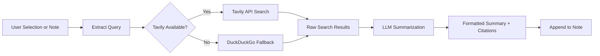

import TLDR from '@site/src/components/TLDR';

# Onderzoek & Webzoeken

<TLDR>
**Notemd doorzoekt het web en voegt LLM-samengevatte resultaten rechtstreeks toe aan je notities.** Tavily API is de primaire zoekbackend; DuckDuckGo dient als een zero-config fallback. De resultaten worden samengevat met bronverwijzingen en toegevoegd onder een `## Research` kop. Het ondersteunt onderzoek in één notitie, batchonderzoek in mappen en modelkeuze per taak voor de samenvattingsstap.

Dit maakt deel uit van de [Obsidian AI Knowledge Management Guide](/docs/pillar-ai-knowledge).
</TLDR>

## Overzicht

Onderzoek is een van de krachtigste integraties van Notemd: het sluit de kringloop tussen lezen, zoeken en schrijven. In plaats van over te stappen naar een browser om een onbekend term te zoeken, markeer je hem en laat Notemd zoeken, samenvatten en de bevindingen toevoegen – alles binnen je vault.

Het proces is volledig configureerbaar. Je kiest de zoekprovider, het LLM dat de samenvatting schrijft, en of de resultaten worden toegevoegd aan de actieve notitie of in aparte bestanden worden opgeslagen. In batchmodus kun je met één klik onderzoek doen naar alle notities in een map.

## Hoe het werkt

### Pipeline Zoeken‑dan‑Samenvatten



1. **Vraagextractie** -- Notemd haalt zoektermen op uit je selectie of de notitietitel.
2. **Webzoeken** -- Eerst wordt Tavily geprobeerd. Als er geen API sleutel is gedefinieerd, wordt DuckDuckGo automatisch gebruikt (geen sleutel vereist).
3. **LLM samenvatting** -- De ruwe zoekresultaten worden naar de gedefinieerde LLM gestuurd, die een beknopte samenvatting met inline bronverwijzingen genereert.
4. **Toevoegen** -- De geformateerde samenvatting wordt toegevoegd onder een `## Research` kop in de actieve notitie.

### Tavily versus DuckDuckGo

| Aspect | Tavily | DuckDuckGo |
|--------|--------|------------|
| API sleutel | Verplicht (gratis tier beschikbaar) | Niet verplicht |
| Kwaliteit van het resultaat | Hoog (speciaal ontworpen voor AI) | Voldoende voor algemene vragen |
| Snelheidsbeperkingen | Ruime gratis versie | Onderhevig aan throttling |
| Configuratie | `tavilyApiKey` in de instellingen | Geen configuratie -- automatische fallback |

### Batch Folder Research

Klik met rechtermuisknop op een map en selecteer **"Notemd: Research folder"**. Elke `.md` bestand in de map wordt sequentieel verwerkt (of parallel tot de gedefinieerde paralleliteit). Elke notitie krijgt zijn eigen onderzoeks samenvatting.

## Configuratie

| Instelling | Standaard | Effect |
|---------|---------|--------|
| `tavilyApiKey` | `''` | Tavily API sleutel. Wanneer leeg, wordt uitsluitend DuckDuckGo gebruikt. |
| `researchProvider` / `researchModel` | DeepSeek | Per-opdracht LLM voor het samenvatten van zoekresultaten |
| `maxResearchContentTokens` | `4000` | Tokenbudget voor inhoud die naar de LLM wordt gestuurd. Overbodige delen worden afgesneden. |
| `researchAppendToNote` | `true` | Voeg de samenvatting toe aan de oorspronkelijke notitie. Als false, wordt er een apart bestand gemaakt. |
| `researchLanguage` | `'en'` | Uitvoerstaal voor het samengevatte onderzoek |

### Modelaanbeveling per opdracht

Onderzoek profiteert van een model dat omgaat met meertalig inhoud en goed gestructureerde teksten genereert. Overweeg het volgende:

- **DeepSeek** -- standaard, betaalbaar, goede kwaliteit
- **GPT-4o** -- hogere kwaliteit samenvattingen, hogere kosten
- **Gemini Flash** -- snel en goedkoop, geschikt voor eenvoudige vragen

## Voorbeeld

U leest een artikel over *transformer attention mechanisms* en stuit op een onbekend begrip: *relative positional encoding*. In plaats van Obsidian te laten staan.

1. Highlighteer **"relative positional encoding"**
2. Rechtermuisknop --> **"Notemd: Onderzoek en samenvatten"**
3. Notemd zoekt op het internet, samenvat de beste resultaten en voegt toe:

```markdown
## Research

### Relative Positional Encoding

Relative positional encoding is a method used in transformer models
where positional information is expressed as relative distances between
tokens rather than absolute positions. Introduced by Shaw et al. (2018),
it improves generalization to unseen sequence lengths compared to
absolute encodings (Vaswani et al., 2017).

Sources:
- [Shaw et al., Self-Attention with Relative Position Representations (2018)](https://arxiv.org/abs/1803.02155)
- [Transformer Positional Encoding Overview](https://example.com/transformer-pos-enc)
```

De samenvatting maakt nu deel uit van uw vault, is zoekbaar, linkbaar en offline toegankelijk.

## Tips

- **Stel een Tavily sleutel in voor de beste resultaten** -- zelfs de gratis versie levert betere relevantie op dan puur DuckDuckGo.
- **Gebruik een krachtig samenvattingemodel** -- goedkope modellen kunnen gedetailleerde technische inhoud vereenvoudigen.
- **Voer batchonderzoek uit** na een eerste doorlezing om gaten in meerdere notities tegelijk op te vullen.
- **Controleer de toegevoegde samenvattingen** -- LLMs kunnen valse broninformatie genereren. Controleer belangrijke beweringen.

---

## Volgende stappen

- [Concept Notes](./concept-notes) -- Haal en bewaar belangrijke termen uit onderzoeksresultaten
- [Wiki-Links](./wiki-links) -- Maak verbindingen tussen onderzoeksonderbouwde concepten in uw vault
- [Translation](./translation) -- Vertaal onderzoeks samenvattingen naar een andere taal
- [LLM Providers](/docs/providers/overview) -- Configureer het model dat wordt gebruikt voor samenvatting
