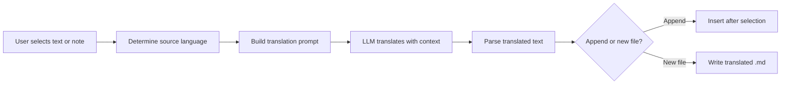

import TLDR from '@site/src/components/TLDR';

# Vertaling

<TLDR>
**Notemd vertaalt tekst tussen 21+ talen met behulp van LLM-gebaseerde vertaling.** Het ondersteunt vertaling van één selectie, volledige notities en batchvertaling van mappen. Elke vertaalopdracht kan een eigen provider en model gebruiken via instellingen per opdracht. De uitvoerstaal kan apart worden ingesteld van de UI taal. De resultaten worden toegevoegd of opgeslagen in een nieuwe bestand, afhankelijk van uw voorkeur.

Dit maakt deel uit van de [Obsidian AI Knowledge Management Guide](/docs/pillar-ai-knowledge).
</TLDR>

## Overzicht

Vertaling in Notemd is geen woordenboekzoekopdracht – het is LLM-gebaseerde, contextbewuste vertaling. Het model ziet het volledige paragraaf of de notitie, waardoor toon, domeinterminologie en zinsstructuur behouden blijven. Dit levert kwaliteitsvolle resultaten op vergeleken met diensten die alleen zins voor zin vertalen, vooral voor technische, academische en creatieve teksten.

De functie ondersteunt drie scopes: selectie, actieve notitie en hele map. In combinatie met modelkeuze per opdracht kunt u een snelle model (Gemini Flash) gebruiken voor informele vertalingen en een krachtig model (Claude Sonnet) voor inhoud waar nuances belangrijk zijn – zonder uw algemene provider te wijzigen.

## Hoe het werkt

### De Translate Commando



1. **Bronherkenning** -- LLM leidt de bronstaal af uit de inhoud. U hoeft deze niet handmatig op te geven.
2. **Promptopbouw** -- Notemd maakt een prompt die de doeltaal, optionele domeinindicaties en de inhoud die vertaald moet worden bevat.
3. **LLM vertaling** -- De gedefinieerde `translateProvider` / `translateModel` verwerkt de opdracht. Het model behoudt markdown-formaatting, wiki-links en codeblokken.
4. **Uitvoer** -- De vertaalde tekst wordt ofwel onder de oorspronkelijke tekst geplaatst of opgeslagen in een nieuw bestand in de kluis.

### Taalparen

Notemd ondersteunt elk taalpaar dat door het onderliggende LLM wordt ondersteund. Veel voorkomende paren zijn:

| Bronstaal | Doelwit | Typische kwaliteit |
|--------|--------|----------------|
| Engels | Chinees (vereenvoudigd) | Uitstekend |
| Chinees | Engels | Uitstekend |
| Engels | Japans | Zeer goed |
| Engels | Duits / Frans / Spaans | Zeer goed |
| Elke ondersteunde taal | Elke ondersteunde taal | Modelafhankelijk |

De `translateLanguage` instelling bepaalt de **uitvoertaal**. De brontaal wordt automatisch gedetecteerd.

### Modelselectie per taak

De vertaalkwaliteit verschilt aanzienlijk per model. Notemd maakt het mogelijk om een speciaal model alleen voor vertaling toe te wijzen:

| Model | Snelheid | Kwaliteit | Kosten | Ideaal voor |
|-------|-------|--------|------|----------|
| `gemini-2.0-flash-exp` | Snel | Goed | Laag | Casueel, hoge volumes |
| `gpt-4o-mini` | Snel | Goed | Laag | Snelle zoekopdrachten |
| `deepseek-chat` | Middel | Goed | Zeer laag | Budgetvriendelijk meertalig |
| `claude-3-5-sonnet` | Middel | Uitstekend | Middel | Technisch / academisch |
| `gpt-4o` | Middelmatig | Uitstekend | Middelmatig | Proza dat gevoelig is voor nuances |

### Vertaling van map in batches

Klik met de rechtermuisknop op een map en selecteer **"Notemd: Map vertalen"** om alle notities in die map te vertalen. Elke bestand wordt afzonderlijk verwerkt. De instelling voor gelijktijdigheid bepaalt hoeveel bestanden tegelijk worden vertaald.

## Configuratie

| Instelling | Standaard | Effect |
|---------|---------|--------|
| `translateProvider` / `translateModel` | DeepSeek | Gespecialiseerde provider voor vertaalwerkzaamheden |
| `translateLanguage` | `'en'` | Doeltaal voor de uitvoer |
| `translationAppendToNote` | `true` | Voeg de vertaalde tekst onder de oorspronkelijke toe. Als dit op false staat, wordt er een nieuw bestand gemaakt. |
| `batchConcurrency` | `3` | Aantal bestanden dat gelijktijdig wordt verwerkt tijdens batchvertaling |

## Voorbeeld

U leest een Chinese onderzoeksnotitie en wilt een Engelse versie ervan:

1. Open de notitie
2. Klik met de rechtermuisknop --> **"Notemd: Huidig bestand vertalen"**
3. Notemd herkent Chinees, vertaalt het naar de door u geselecteerde doeltaal (Engels) en voegt toe:

```markdown
## Translation (English)

The experimental results show that the proposed method achieves
a 12% improvement in F1 score compared to the baseline, primarily
due to the enhanced feature extraction module described in Section 3.
```

De oorspronkelijke Chinese tekst blijft ongewijzigd boven de vertaling. De `## Translation`-kop houdt beide versies in hetzelfde bestand zodat ze gemakkelijk kunnen worden geraadpleegd.

## Tips

- **Gebruik Gemini Flash voor grote hoeveelheden** -- dit is de snelste en goedkoopste optie voor batchvertaling van grote mappen.
- **Wiki-links behouden** -- De opdracht van Notemd instrueert de LLM om `[[wiki-links]]` onveranderd te laten in de vertaling. Controleer na de vertaling, want sommige modellen ontpakken ze af en toe.
- **Uitvoerstaal expliciet instellen** -- Automatische detectie werkt voor de bron, maar configureer altijd `translateLanguage` om onduidelijkheid over het doel te voorkomen.
- **Conceptnotities in batch vertalen** -- Als je conceptmap in één taal ligt en je die in een andere nodig hebt, regelt de vertaling op mapniveau dit in één stap.

---

## Volgende stappen

- [Onderzoek](./research) -- Zoek en vat samen in elke taal, en vertaal vervolgens de resultaten
- [Workflows](./workflows) -- Combineer vertaling met wiki-linking of conceptextractie
- [Batchverwerking](/docs/advanced/batch-processing) -- Gelijktijdige verwerking en overschrijvingsgedrag voor mapoperaties
- [LLM Providers](/docs/providers/overview) -- Kies het beste model voor je taalpaar
