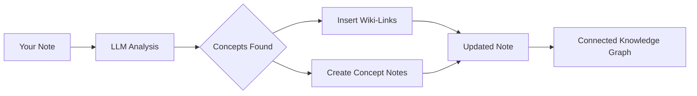

import TLDR from '@site/src/components/TLDR';

# Wiki-links

<TLDR>
**Notemd voegt automatisch `[[wiki-links]]` toe aan belangrijke concepten in uw notities.** De LLM leest uw inhoud, identificeert belangrijke termen in de context en plaatst Obsidian-stijl wiki-links bij elke voorkomst. Optioneel worden conceptnotities met backlinks gemaakt. Het ondersteunt het onderdrukken van synoniemen, linkintegriteit bij hernoemen/verwijderen en pure extractiemodus (geen bestandswijzigingen). In tegenstelling tot Auto Link, dat alleen bestaande notietitels matcht, gebruikt Notemd AI om nieuwe concepten te identificeren en overeenkomstige notities te maken. Dit maakt deel uit van de [Obsidian AI Knowledge Management Guide](/docs/pillar-ai-knowledge).
</TLDR>

## Overzicht

Wiki-linking is het kernfunctie van Notemd. Het transformeert gewone tekst in een verbonden kennisgraaf door:

1. **Uw notitie te analyseren** met een LLM
2. **Belangrijke concepten te identificeren** (termen, personen, methoden, theorieën)
3. **`[[wiki-links]]` toe te voegen** bij elke voorkomst
4. **Conceptnotities te maken** (optioneel) met backlinks

## Hoe het werkt

### Proces



### Voorbeeld

**Voorheen:**
```markdown
Machine learning models use neural networks to learn patterns from data.
The transformer architecture revolutionized natural language processing.
```

**Na:**
```markdown
[[Machine learning]] models use [[neural networks]] to learn patterns from data.
The [[transformer architecture]] revolutionized [[natural language processing]].
```

## Gebruik

### Basis: Links toevoegen aan huidige notitie

1. Een notitie openen
2. Rechtermuisknop in editor → **"Process file (add links)"**
3. Wacht enkele seconden
4. Concepten zijn nu met elkaar verbonden!

### Batch: Meerdere notities verwerken

1. Rechtsklik op een map in File Explorer
2. Kies **"Notemd: Map verwerken (links toevoegen)"**
3. Configureren:
   - Paralleliteit (hoeveel bestanden tegelijk)
   - Bestaande links overschrijven (ja/nee)
4. Klik op **Verwerken**

### Selectief: Specifieke tekst linken

1. Tekst markeren die verwerkt moet worden
2. Rechtsklik → **"Verwerking van geselecteerde tekst (links toevoegen)"**
3. Alleen het gemarkeerde deel wordt geanalyseerd

## Notemd versus Auto Link

Obsidian biedt twee manieren voor automatische wiki-linking:

| | **Auto Link** | **Notemd** |
|--|---------------|-------------|
| Bron van de link | Bestaande notitietitels in de kluis | Concepten die door LLM zijn geïdentificeerd in de inhoud |
| Nieuwe concepten kunnen worden gelinkt | Nee — de titel moet al bestaan | Ja — AI identificeert concepten en maakt notities |
| Omgaan met synoniemen | Nee | Ja — onderdrukking van synoniemen |
| Creatie van conceptnotities | Nee | Ja — met backlinks en duplicaatverwijdering |
| Batchverwerking | Nee (één bestand) | Ja (op mapniveau) |
| Modelrouting per taak | Nee | Ja |

**Auto Link** doet een titelvergelijking: als er een notitie genaamd "Machine Learning" bestaat, wordt de tekst in `[[Machine Learning]]` gewikkeld. Als de notitie niet bestaat, gebeurt er niets.

**Notemd** wordt door AI aangestuurd: de LLM leest je inhoud, begrijpt de context, identificeert concepten die *gelinkt* moeten worden — zelfs als er nog geen notitie bestaat — en maakt zowel de link als de conceptnotitie.

## Kenmerken

### Onderdrukking van synoniemen

**Probleem:** "transformer", "transformers", "Transformer architecture" → 3 aparte concepten

**Oplossing:** Notemd detecteert bijna-duplicaten en gebruikt de canonieke vorm.

**Configuratie:**
```
Settings → Advanced → Synonym Suppression
Threshold: 0.8 (0 = off, 1 = aggressive)
```

### Linkintegriteit

**Wanneer je een conceptnotitie hernoemt:**
- Alle wiki-links worden automatisch bijgewerkt (Obsidian kernfunctie)
- Backlinks blijven intact

**Wanneer je een conceptnotitie verwijdert:**
- Links blijven bestaan maar worden weergegeven als "onverwezen meldingen"
- Je kunt ze opnieuw maken vanuit elke voorkomst

### Pure Extractiemodus

**Extracteer concepten zonder de oorspronkelijke te wijzigen:**

1. Rechtermuisknop → **"Concepten extraheren (geen linken)"**
2. Conceptnotities worden gemaakt
3. Oorspronkelijke bestand blijft onveranderd

Gebruiksgeval: Verwerking van alleen-lezen inhoud of definitieve versies.

## Conceptnotitiegeneratie

### Automatische creatie

**Wanneer geactiveerd (standaard), Notemd maakt:**

```markdown
---
tags: [concept, auto-generated]
created: 2026-06-13
source: [[Original Note Name]]
---

# Machine Learning

A branch of artificial intelligence that enables computers
to learn from data without explicit programming.

## Occurrences in Your Vault

- [[Original Note Name#Section]]
- [[Another Note#Header]]

## Related Concepts

- [[Neural Networks]]
- [[Deep Learning]]
- [[Supervised Learning]]
```

### Configuratie

**Uitvoermap:**
```
Settings → Output → Concept Folder
Default: concepts/
```

**Hiërarchische structuur:**
```
Settings → Output → Use Hierarchical Folders
If enabled:
  papers/my-paper.md → papers/concepts/Concept.md
If disabled:
  → concepts/Concept.md
```

**Template:**
```
Settings → Output → Concept Template
Customize with variables:
  {{concept}} — Concept name
  {{description}} — LLM-generated description
  {{backlinks}} — List of source notes
  {{date}} — Creation date
```

## Geavanceerde opties

### Contextvenster

**Hoeveel omringend tekst te sturen:**

```
Settings → Linking → Context Window
Options: Sentence | Paragraph | Full Note
Default: Paragraph
```

Groter = betere nauwkeurigheid, hogere kosten.

### Minimum voorkomsten

**Alleen concepten linken die meerdere keren voorkomen:**

```
Settings → Linking → Min Occurrences
Default: 1 (link all)
```

Stel in op 2 of 3 om te focussen op herhalende thema’s.

### Uitsluiten van patronen

**Bepaalde woorden overslaan:**

```
Settings → Linking → Exclude List
Example: note, idea, example, thing
```

Voorkomt het te veel linken van algemene termen.

### Aanpasbare prompts

**Standaard LLM instructies overschrijven:**

```
Settings → Advanced → Custom Linking Prompt
Default:
  "Identify key concepts, theories, methods, and technical
   terms in the following text. Return as a list..."
```

Pas aan voor domeinspecifieke behoeften (bijv. "Focus op medische terminologie").

## Tips en beste praktijken

### ✅ DO

- **Verwerk notities met meer dan 100 woorden** — Korte notities leveren weinig concepten op
- **Gebruik krachtige modellen** voor een betere conceptidentificatie (GPT-4o, Claude)
- **Controleer voordat je accepteert** — Zorg dat de voorgestelde links logisch zijn
- **Bouw iteratief** — Verwerk 5-10 notities, bekijk de grafiek en pas de instellingen aan

### ❌ NIET DOEN

- **Te veel links** — Niet elke zelfstandig naamwoord heeft een link nodig
- **Verwerk conceptversies herhaaldelijk** — Concepten kunnen veranderen, wacht tot ze stabiel zijn
- **Negeer synoniemen** — Schakel onderdrukking in om "ML" en "Machine Learning" te vermijden

## Prestaties

### Snelheid

| Grootte van notitie | GPT-4o-mini | Claude Sonnet | Ollama (lokaal) |
|-----------|-------------|---------------|----------------|
| 500 woorden | 2-3 seconden | 3-5 seconden | 5-10 seconden |
| 2000 woorden | 5-8 seconden | 10-15 seconden | 20-40 sec |
| 5000+ woorden | In delen (meerdere oproepen) | In delen | In delen |

### Kosteninschatting

**Voorbeeld: 1000-talige notitie met GPT-4o-mini**
- Invoer: ~1500 tokens
- Uitvoer: ~200 tokens
- Kosten: ~

**Batchverwerking van 100 notities:** ~

## Probleemoplossing

### Geen links toegevoegd

**Controleer:**
1. LLM oproep is geslaagd (Instellingen → Diagnostiek)
2. Het notitieblok bevat voldoende inhoud (>50 woorden).
3. Concepten zijn technisch/specifiek (niet alleen voornaamwoorden)

**Probeer:**
- Gebruik een krachtiger model
- Contextvenster vergroten
- Controleer de geldigheid van de API-sleutel

### Te veel links

**Oplossingen:**
1. Verhoog het minimale aantal voorkomsten (2 of 3)
2. Voeg veelvoorkomende woorden toe aan de uitsluitingslijst
3. Gebruik een minder agressieve model

### Verkeerde concepten gekoppeld

**Oplossingen:**
1. Gebruik een aangepaste prompt voor domeinspecifieke inhoud
2. Activeer het onderdrukken van synoniemen
3. Controleer handmatig en maak de link los

### Links breken na hernaamgeving

**Dit is normaal Obsidian gedrag.**

Om alle links bij te werken:
1. Hernameer de conceptnota
2. Obsidian actualiseert automatisch `[[old]]` → `[[new]]`

---

## Volgende stappen

- 📖 [Conceptnotities](./concept-notes) — Diepgaande informatie over het genereren van conceptnotities
- 🔍 [Onderzoek integratie](./research) — Combineer linken met webonderzoek
- 🎨 [Diagrammen](./diagrams) — Visualiseer je kennisgraaf
