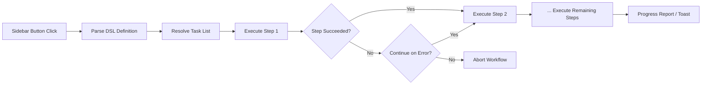

import TLDR from '@site/src/components/TLDR';

# Werkstromen

<TLDR>
**Notemd Werkstromen keten meerdere taken samen tot één enkele één-klikactie.** Definieer sequenties zoals `add-links > extract-concepts > research > diagram` met een eenvoudige DSL. Werkstromen verschijnen als knoppen in de zijbalk die de volledige keten uitvoeren op de huidige notitie of map. Er zitten vooraf gedefinieerde werkstromen bij; maak er zelf ook in de instellingen. Elke stap gebruikt zijn eigen configuratie voor het per-taakmodel.

Dit maakt deel uit van de [Obsidian AI Knowledge Management Guide](/docs/pillar-ai-knowledge).
</TLDR>

## Overzicht

Een workflow vermindert de moeite om taken één voor één uit te voeren. In plaats van vier keer met de rechtermuisknop te klikken om links toe te voegen, concepten te extraheren, onbekende termen op te zoeken en een diagram te genereren, drukt u op één knop in de zijbalk en wordt de hele keten uitgevoerd. Notemd zorgt voor het sequencieren, het doorgeven van fouten en het rapporteren van voortgang.

Werkstromen worden gedefinieerd in een lichte DSL (domain-specific language). Ze bevinden zich in de instellingen, verschijnen als klikbare knoppen in de Obsidian-zijbalk en kunnen worden toegepast op zowel de huidige notitie als een hele map.

## Hoe het werkt

### Pipeline voor uitvoering van werkstromen



1. **Parse** -- De DSL-string wordt op `>` (of `>`) opgesplitst in een geordende lijst van taakidentificatoren.
2. **Resolve** -- Elke identificator wordt gekoppeld aan een interne opdracht (add-links, extract-concepts, research, translate, diagram, enzovoort.).
3. **Execute** -- De stappen worden sequentieel uitgevoerd. Elke stap maakt gebruik van het gedefinieerde per-taakprovider en model.
4. **Error handling** -- Als een stap faalt, stopt de workflow of gaat hij door naar de volgende stap, afhankelijk van uw foutbeheerbeleid.
5. **Done** -- Een toastnotificatie rapporteert succes of geeft alle gefaalde stappen weer.

### DSL-formaat

Werkstromen worden gedefinieerd als een `>`-gescheiden reeks taakidentificatoren:

```
process-current-add-links>extract-concepts-current>research-and-summarize
```

**Beschikbare taakidentificatoren:**

| Identificator | Actie |
|------------|--------|
| `process-current-add-links` | Wiki-links toevoegen aan het actieve notitieblok |
| `extract-concepts-current` | Concepten extraheren uit het actieve notitieblok |
| `research-and-summarize` | Onderzoek doen naar de geselecteerde tekst of notitietitel |
| `process-current-translate` | Het actieve notitieblok vertalen |
| `summarize-to-mermaid` | Een diagram genereren op basis van het actieve notitieblok |
| `generate-from-title` | Inhoud genereren op basis van de notitietitel |
| `extract-original-text` | Oorspronkelijke tekst extraheren (voor OCR / gescande inhoud) |

**Varianten op mapniveau** vervangen `current` door `folder` in de identificatienaam.

### Vooraf gedefinieerde versus aangepaste workflows

Notemd bevat kant-en-klare workflows voor veelvoorkomende patronen:

| Workflow | Chain | Gebruiksgeval |
|----------|-------|----------|
| **Eén-klik extraheren** | add-links > extract-concepts > research | Een onderzoeksartikel in één stap verwerken |
| **Volledige pipeline** | add-links > extract-concepten > onderzoek > diagram | Volledige kennisextractie met visualisatie |
| **Vertaal + Link** | translate > add-links | Vertaal en link concepten in de doeltaal |

**Aanpasbare workflows** worden gemaakt in de instellingen:

1. Open **Instellingen** --> **Notemd** --> **Workflows**
2. Klik op **"Add Workflow"**
3. Voer de DSL-keten in (bijv. `process-current-add-links>extract-concepts-current`)
4. Geef het een weergave-naam (bijv. "Quick Link + Extract")
5. De nieuwe knop verschijnt onmiddellijk in de sidebar

## Configuratie

| Instelling | Standaard | Effect |
|---------|---------|--------|
| `workflows` | Vooraf gedefinieerde set | Array van workflow-definities (naam + DSL) |
| `workflowContinueOnError` | `true` | Ga door naar de volgende stap als de huidige stap faalt |
| `workflowShowProgress` | `true` | Toon een progressietoast na elke voltooide stap |

### Per-opdrachtmodellen in workflows

Elk stap in een workflow maakt gebruik van zijn **eigen** configuratie voor het per-taakmodel. U hoeft de modellen niet zelf in de DSL op te geven. De volgorde van resolutie is:

1. Het provider/model per taak als `useMultiModelSettings` beschikbaar is
2. Globaal `activeProvider` anders

Dit betekent dat `add-links` kan draaien op DeepSeek terwijl `research` draait op GPT-4o -- alles binnen dezelfde workflow klik.

## Voorbeeld

U heeft zojuist een PDF van een machine learning artikel geïmporteerd in uw vault en wilt volledige kennisextractie:

1. Open het geïmporteerde notitieblok
2. Klik op de **"Full Pipeline"**-knop in de zijbalk
3. Notemd voert uit:
   - **Stap 1**: Voeg wiki-links toe -- `[[attention mechanism]]`, `[[transformer]]`, enzovoort.
   - **Stap 2**: Extract concepten -- maakt conceptnotities in uw conceptmap
   - **Stap 3**: Onderzoek -- vat webbronnen samen voor sleuteltermen
   - **Stap 4**: Diagram -- genereert een Mermaid-mindmap van de structuur van het artikel
4. Na ongeveer 30 seconden heeft uw notitie links, bestaan er conceptnotities, is het onderzoek toegevoegd en is er een diagrambestand opgeslagen

Alles in één klik.

## Tips

- **Begin met vooraf gedefinieerde workflows** -- deze dekken de meest voorkomende patronen. Pas ze alleen aan wanneer u een andere volgorde nodig heeft.
- **Activeer `workflowContinueOnError`** -- een mislukte diagramstap moet de hele pipeline niet stoppen.
- **Gebruik mapwerkflows** voor bulkverwerking -- klik met de rechtermuisknop op een map, kies een workflow en elke notitie wordt verwerkt.
- **Geef workflows duidelijke namen** -- de ruimte in de zijbalk is beperkt. Gebruik korte, actiegerichte namen zoals "Snelle Extractie" of "Vertalen + Linken".

---

## Volgende stappen

- [Onderzoek](./research) -- Begrijp wat de onderzoeksstap doet voordat je deze toevoegt aan workflows
- [Wiki-Links](./wiki-links) -- De kernfunctie voor het maken van links die in de meeste workflows wordt gebruikt
- [Concept Notities](./concept-notes) -- Conceptextractie als workflowstap
- [Batchverwerking](/docs/advanced/batch-processing) -- Gelijktijdige verwerking en rapportage over voortgang voor mapwerkflows
