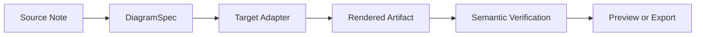
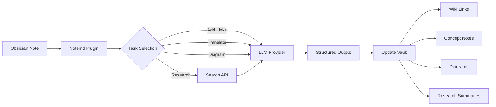

import TLDR from '@site/src/components/TLDR';

# Inleiding tot Notemd

<TLDR>
**Notemd** (Note + EMD — Enhanced Markdown Documents) is een open-source Obsidian plugin die lezen met LLM omzet in permanente kennis. In tegenstelling tot chatgebaseerde AI, waarin inzichten na de sessie verdwijnen, schrijft Notemd de resultaten **direct in uw vault** als wiki-links, conceptnotities, onderzoeks samenvattingen, vertalingen, workflows en diagrammen. Het is ontworpen voor onderzoekers, studenten en kenniswerkers die willen dat lezen, onderzoek en visuele uitleg worden opgebouwd tot een gestructureerde, evoluerende kennisgraaf.
</TLDR>

## Wat is Notemd?

Notemd integreert **30+ grote taalmodellen** (OpenAI, Anthropic, Google, DeepSeek, Qwen, Ollama en nog veel meer) in uw Obsidian workflow om kennisextractie, organisatie, vertaling, onderzoek en diagramgeneratie te automatiseren.

### Belangrijk verschil: tijdelijke versus permanente kennis

| Aspect | Chatgebaseerde AI (ChatGPT, etc.) | Notemd |
|--------|-------------------------------|--------|
| **Waar gaan de resultaten naartoe** | Chatgeschiedenis (verdwijnt) | Uw Obsidian vault (blijft bestaan) |
| **Formaat** | Platte tekstantwoorden | Gestructureerde bestanden: `[[wiki-links]]`, conceptnotities, diagrammen |
| **Langdurige waarde** | Moet elke keer opnieuw gevraagd worden | Wordt opgebouwd tot een kennisgraaf |
| **Offline toegang** | Internet vereist | Werkt volledig offline met Ollama |

## Corele capaciteiten

### 1. **Automatische Wiki-verwijzingen**
- LLM identificeert belangrijke concepten in uw notities
- Voegt `[[wiki-links]]` toe bij elke voorkomst
- Maakt optioneel gerelateerde conceptnotities aan
- Synoniemsuppressie om duplicaten te voorkomen

### 2. **Generatie van conceptnotities**
- Haalt kernconcepten uit artikelen, papers en notities
- Genereert speciale conceptbestanden met backlinks
- Aanpasbare uitvoerpaden en templates

### 3. **Integratie van webonderzoek**
- Voer Tavily of DuckDuckGo in vanuit Obsidian
- LLM vat de resultaten samen met bronverwijzingen
- Voegt onderzoekresultaten toe aan het huidige notitieblok

### 4. **Meertalige vertaling**
- Vertaal geselecteerde delen of hele notities
- Ondersteunt meer dan 21 UI talen
- Onafhankelijke instelling van de uitvoerstaal
- Batchvertaalsupport

### 5. **Diagramgeneratie**
- **Mermaid**: Stroomdiagrammen, sequentiële diagrammen, klassendiagrammen, toestandsdiagrammen, ER-diagrammen, Gantt-diagrammen
- **JSON Canvas**: Obsidian-specifieke lay-outs
- **Vega-Lite**: Gegevensgrafieken, tijdsreeksen, scatterplots
- **HTML / Editable HTML/SVG**: Zelfstandige afbeeldingen met semantische annotaties
- **Draw.io / Drawnix-grenzen van artefacten**: Exportroutes voor beheerders gebaseerd op hetzelfde semantische figuurmodel
- **Roadmap voor schakeldiagrammen**: circuitikz/TikZJax-ondersteuning wordt ontworpen rondom gouden referenties, beperkte prompts, renderfeedback en validatie van topologie/layout in plaats van onbeperkt LLM TikZ
- **Previewdiagnostiek**: Renderde artefacten kunnen compileer-/renderfouten weergeven, en niet-in-line bronnen kunnen worden geïnspecteerd zonder een LaTeX-runtime aan de kant van plugins
- Automatische correctie van Mermaid-fouten

### 6. **Eén-klikwerkflows**
- Meerdere acties in knoppen aan de zijkant combineren
- Definitie van workflows op basis van DSL
- Voorbeeld: `add-links > extract-concepts > research > diagram`

## Wie moet Notemd gebruiken?

✅ **Onderzoekers** die artikelen lezen en literatuuroverzichten maken
✅ **Studenten** die studienotities ordenen en conceptkaarten creëren
✅ **Kenniswerkers** die willen dat inzichten uit lezingen behouden blijven
✅ **Taligen** die vertaling + wiki-linking nodig hebben
✅ **Gebruikers die privacy belangrijk vinden** die lokale LLM ondersteuning willen (Ollama)
✅ **Geavanceerde gebruikers** die prompts en workflows aanpassen

## Waarom Notemd + Obsidian?

**Obsidian** is een lokale, op markdown gebaseerde kennisbase. **Notemd** voegt AI-krachten toe:
- Uw gegevens blijven in uw eigen opslag (niet bij een clouddienst)
- Werkt offline met lokale modellen
- Gratis en open source (MIT licentie)
- Integreert met bestaande Obsidian plugins
- Schalbaar tot tientallen duizenden notities

## Beginnen

1. **Installeer**: Instellingen → Community Plugins → Zoeken → "Notemd"
2. **Configureer**: Voeg uw LLM provider API sleutel toe (of gebruik lokale Ollama)
3. **Probeer het uit**: Open een notitie → Rechtermuisknop → "Bestand verwerken (links toevoegen)"
4. **Ontdek meer**: Kijk in de zijbalk voor workflow’s met één klik

👉 [Installatiegids](./getting-started/installation) | [Snelle starthandleiding](./getting-started/quick-start)

## Richting van de diagramfunctie

Het diagramwerk van Notemd verschuift van "vraag het model om één syntaxisstring te schrijven" naar een gestapelde pipeline:

De huidige implementatie ondersteunt al Mermaid, JSON Canvas, Vega-Lite, HTML fallback, bewerkbare HTML/SVG, Draw.io XML artefacten, een minimale Drawnix JSON subset, voorafbeeldingsdiagnoseën/slechts bronfallback, en een offline `CircuitSpec -> circuitikz` prototype voor veelgebruikte bron- en CMOS inverter gouden templates. Circuitdiagrammen vallen onder een moeilijkere categorie: circuitikz kan een nauwkeurige elektrische topologie weergeven, maar onbeperkte LLM uitvoer leidt vaak tot onleesbare routings of niet renderende LaTeX. De volgende richting is om circuitikz te beperken met gouden-Referentietemplates, regels voor knooppuntraster布局, renderdiagnoseën en feedbacklopen via screenshot.

Lees de details in [Diagrams](./features/diagrams).

## Architectuur

## Notemd versus andere Obsidian AI-plugins

De meeste Obsidian AI-plugins zijn gespreksondersteund (u stelt een vraag, de AI antwoordt, inzichten blijven in het chatvenster). Notemd is **schrijfgericht**: de AI verwerkt uw notities en schrijft gestructureerde resultaten rechtstreeks in uw vault.

| Functionaliteit | Notemd | Copilot | Smart Connections | Text Generator |
|-----------|--------|---------|-------------------|-----------------|
| Automatische invoeging van wiki-links | Ja | Nee | Nee | Nee |
| Generatie van conceptnotities | Ja (met backlinks + duplicaatverwijdering) | Nee | Nee | Nee |
| Generatie van diagrammen | Ja (Mermaid, Canvas, Vega-Lite, HTML, bewerkbare artefacten) | Nee | Nee | Nee |
| Integratie van webonderzoek | Ja (Tavily + DuckDuckGo) | Nee | Nee | Nee |
| Verwerking van batchmappen | Ja | Beperkt | Nee | Beperkt |
| Modelrouting per taak | Ja (7 taken, onafhankelijke modellen) | Nee | Nee | Nee |
| Eén-klik workflowketens | Ja (DSL) | Nee | Nee | Nee |
| Vertaling (batch) | Ja | Nee | Nee | Nee |
| Chatten met vault | Nee | Ja | Nee | Nee |
| Zoekopdracht op semantische gelijkenis | Nee | Nee | Ja | Nee |
| Generatie op basis van templates | Nee | Nee | Nee | Ja |
| LLM aanbieders | 36 (cloud + gateway + lokale) | 3-5 | 2-3 | 3-5 |
| Volledig offline | Ja (Ollama) | Gedeeltelijk | Gedeeltelijk | Gedeeltelijk |

**Wanneer Notemd kiezen**: U wilt dat de AI een permanente kennisgraaf bouwt — en niet alleen over uw notities praat.

**Wanneer je Copilot moet kiezen**: Je wilt een gespreksgerichte AI-assistent in Obsidian.

**Wanneer Smart Connections kiezen**: U wilt bestaande relaties tussen notities ontdekken via semantische zoekopdrachten.

## Filosofie

**Notemd is van mening dat AI menselijk kenniswerk moet versterken, in plaats van het te vervangen.** De plugin:
- Houdt u onder controle (beoordeel voordat u wijzigingen toepast).
- Context behouden (alle resultaten leiden terug naar de bron)
- Beschermt de privacy (lokale LLM ondersteuning, geen telemetry)
- Blijft uitbreidbaar (open APIs, aangepaste workflows)

## Open Source

- **Licentie**: MIT
- **Bron**: [github.com/Jacobinwwey/obsidian-NotEMD](https://github.com/Jacobinwwey/obsidian-NotEMD)
- **Gemeenschap**: [Discord](https://discord.gg/qnGgsQ9W) | [GitHub Discussions](https://github.com/Jacobinwwey/obsidian-NotEMD/discussions)
- **Bijdragen**: PR’s welkom, zie [CONTRIBUTING.md](https://github.com/Jacobinwwey/obsidian-NotEMD/blob/main/CONTRIBUTING.md)

---

**Volgende stap**: [Installation →](./getting-started/installation)
